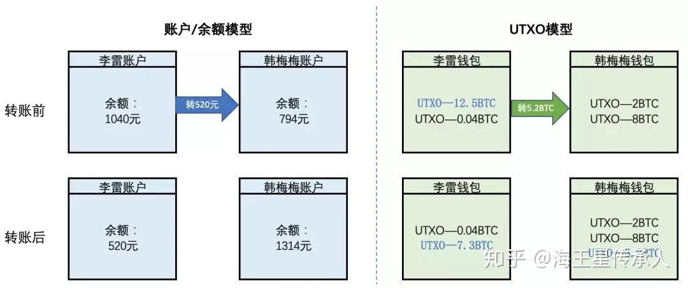

 注：本教程为技术教程，不谈论且不涉及炒作任何数字货币 

本次组队学习重点在于以太坊基础知识、以太坊客户端以及以太坊solidity编程，因此本节教程重点在于以太坊核心知识点的掌握，区块链部分的基础知识可以作为补充，请学习者量力而行。另外若学习者觉得本节内容难度太高，可以先对基本知识点有一个概览，在第二节以及第三节实战内容学习完成之后再深入学习本节内容。

# 一、区块链简介 #

## 1.1、区块链与区块链技术 ##

在阅读本教程之前，[大家对比特币原理不太了解同学可以先阅读下此博客~](http://blog.codinglabs.org/articles/bitcoin-mechanism-make-easy.html),大家对比特币有简单了解后对于区块链会有更好的认识。

**区块链**是将记录（区块）通过密码学串联并加密的链式数据结构。而**区块链技术**，是通过P2P网络和区块链来实现数据存储的**去中心化**、**不可逆**和**不可篡改**。比特币正是构建在区块链技术上的典型应用。通过区块链技术，我们可以将信息（数据、程序）保存在区块上并接入到区块链中，这样就实现了信息的去中心化存储、不可逆和不可篡改。**区块链应用**是指利用区块链技术开发的应用。

## 1.2、区块链历史 ##

2008年，一个网名叫中本聪（Satoshi Nakamoto）的人发表了一篇名为《比特币：一种点对点电子货币系统》的论文，论文中首次提到了“区块链”这一概念。2009年，中本聪创立了以区块链为底层技术的比特币网络，开发出了第一个区块，被称为“创世区块”。该阶段被称为“区块链1.0”。

由于比特币是一个电子货币系统，所以主要功能就是记账。但随后人们发现，区块链技术作为比特币的底层技术，功能可以远远不止于记账，许多关于“未知的信任”的问题，都可以通过区块链来解决，例如电子存证、信息记录等。于是在比特币的基础上，诞生了带有智能合约的区块链系统，即允许开发者通过编写智能合约来实现特定的逻辑，这一阶段被称为“区块链2.0”。这一阶段的主要代表是以太坊。

随后，人们想要提升区块链应用的性能，于是出现了EOS、ArcBlock等系统，其特点是高性能、大吞吐量，但由于引入了超级节点、云节点等特性，弱化了“去中心化”这一特点，因此受到较大的争议。这一阶段被称为“区块链3.0”。

由于比特币是一款电子货币，可扩展性较低，而所谓的“区块链3.0”目前受到较大争议，且部分项目的底层算法完全不同于典型的区块链，因此学习区块链2.0中的以太坊是目前学习区块链的最佳方式。

## 1.3、区块链基础技术与算法 ##

区块链技术不是单独的一项技术，而是一系列技术组成的技术栈，其具有以下的特点：

* 数据分布式存储
* 存储的数据不可逆、不可篡改、可回溯
* 数据的创建和维护由所有参与方共同参与

为了实现这些特点、维护区块链应用的稳定运行，区块链技术中包含了分布式存储技术、密码学技术、共识机制以及区块链2.0提出的智能合约。

### 1.3.1、区块

区块链由一个个区块（block）组成。区块很像数据库的记录，每次写入数据，就是创建一个区块。

    

中心化存储

每个区块包含两个部分。

> - 区块头（Head）：记录当前区块的特征值
> - 区块体（Body）：实际数据

区块头包含了当前区块的多项特征值。

> - 生成时间
> - 实际数据（即区块体）的哈希
> - 上一个区块的哈希
> - ...

### 1.3.2、分布式存储技术 ###

与传统的数据存储技术不同，在区块链技术中，数据并不是集中存放在某个数据中心上，也不是由某个权威机构或是大多数节点来存储，而是分散存储在区块链网络中的每一个节点上。

    

中心化存储

    

分布式存储

**节点和区块的关系是什么？**

可以用共享文档来简单描述：所有可以访问共享文档的账号就叫做节点，当然全节点需要同步共享文档，也就是拥有全部的区块数据区块就是共享文档。每个人更新了，所有人都可以查看最新的文档

### 1.3.3、密码学技术 ###

为了实现数据的不可逆、不可篡改和可回溯，区块链技术采用了一系列密码学算法和技术，包括哈希算法、Merkle 树、非对称加密算法。

##### 哈希算法 #####

哈希算法是一个单向函数，可以将任意长度的输入数据转化为固定长度的输出数据（哈希值），哈希值就是这段输入数据唯一的数值表现。由于在计算上不可能找到哈希值相同而输入值不同的字符串，因此两段数据的哈希值相同，就可以认为这两段数据也是相同的，所以哈希算法常被用于对数据进行验证。

在区块链中，数据存储在区块里。每个区块都有一个区块头，区块头中存储了一个将该区块所有数据经过哈希算法得到的哈希值，同时，每个区块中还存储了前一个区块的哈希值，这样就形成了区块链。如果想要篡改某一个区块A中的数据，就会导致A的哈希值发生变化，后一个区块B就无法通过哈希值正确地指向A，这样篡改者又必须篡改B中的数据......也就是说，篡改者需要篡改被篡改的区块以及后面的所有区块，才能让所有的节点都接受篡改。

##### Merkle树 #####

Merkle树是一种树形结构，在区块链中，Merkle树的叶子节点是区块中数据的哈希值，非叶子节点是其子结点组合后的哈希值，这样由叶子节点开始逐层往上计算，最终形成一个Merkle根，记录在区块的头部，这样就可以保证每一笔交易都无法篡改。

    

Merkle 树

##### 非对称加密技术 #####

非对称加密技术使用两个非对称密钥：公钥和私钥。公钥和私钥具有两个特点：

1. 通过其中一个密钥加密信息后，使用另一个密钥才能解开
2. 公钥一般可以公开，私钥则保密

在区块链中，非对称加密技术主要用于信息加密、数字签名和登录认证。在信息加密场景中，信息发送者A使用接收者B提供的公钥对信息进行加密，B收到加密的信息后再通过自己的私钥进行解密。再数字签名场景中，发送者A通过自己的私钥对信息进行加密，其他人通过A提供的公钥来对信息进行验证，证明信息确实是由A发出。在登录认证场景中，客户端使用私钥加密登录信息后进行发送，其他人通过客户端公钥来认证登录信息。

- RSA 算法

  ​		RSA加密算法是最常用的非对称加密算法，CFCA在证书服务中离不了它。但是有不少新来的同事对它不太了解，恰好看到一本书中作者用实例对它进行了简化而生动的描述，使得高深的数学理论能够被容易地理解。
  ​       RSA是第一个比较完善的公开密钥算法，它既能用于加密，也能用于数字签名。RSA以它的三个发明者Ron Rivest, Adi Shamir, Leonard Adleman的名字首字母命名，这个算法经受住了多年深入的密码分析，虽然密码分析者既不能证明也不能否定RSA的安全性，但这恰恰说明该算法有一定的可信性，目前它已经成为最流行的公开密钥算法。
  　　RSA的安全基于大数分解的难度。其公钥和私钥是一对大素数（100到200位十进制数或更大）的函数。从一个公钥和密文恢复出明文的难度，等价于分解两个大素数之积（这是公认的数学难题）。 

- ECC 椭圆曲线算法

  具体可以参见此文章：[ECC椭圆曲线加密算法：介绍](https://zhuanlan.zhihu.com/p/36326221)

### 1.3.4、共识机制 ###

区块链系统是一个分布式系统，分布式系统要解决都首要问题就是一致性问题，也就是如何使多个孤立的节点达成共识。在中心化系统中，由于有一个中心服务器这样的“领导”来统一各个节点，因此达成一致性几乎没有问题。但在去中心化场景下，由于各个节点是相互独立的，就可能会出现许多不一致的问题，例如由于网络状况等因素部分节点可能会有延迟、故障甚至宕机，造成节点之间通信的不可靠，因此一致性问题是分布式系统中一个很令人头疼的问题。

由 Eirc Brewer 提出，Lynch 等人证明的 CAP 定理为解决分布式系统中的一致性问题提供了思路。CAP 定理的描述如下：在分布式系统中，**一致性**、**可用性**和**分区容错性**三者不可兼得。这三个术语的解释如下：

* 一致性（**C**onsistency）：所有节点在同一时刻拥有同样的值（等同于所有节点访问同一份最新的数据副本
* 可用性（**A**vailability）：每个请求都可以在有限时间内收到确定其是否成功的响应
* 分区容错性（**P**artition tolerance）：分区是指部分节点因为网络原因无法与其他节点达成一致。分区容错性是指由网络原因导致的系统分区不影响系统的正常运行。例如，由于网络原因系统被分为 A, B, C, D 四个区，A, B 中的节点无法正常工作，但 C, D 组成的分区仍能提供正常服务。

在某些场景下，对一致性、可用性和分区容错性中的某一个特性要求不高时，就可以考虑弱化该特性，来保证整个系统的容错能力。区块链中常见的共识机制的基本思路正是来自 CAP 定理，部分区块链应用中用到的共识机制如下表：

| 共识机制 | 应用                               |
| -------- | ---------------------------------- |
| PoW      | 比特币、莱特币、以太坊的前三个阶段 |
| PoS      | PeerCoin、NXT、以太坊的第四个阶段  |
| PBFT     | Hyperledger Fabric                 |

##### PoW（Proof of Work，工作量证明） #####

PoW 机制的大致流程如下：

1. 向所有节点广播新交易和一个数学问题
2. 最先解决了数学问题的节点将交易打包成区块，对全网广播
3. 其他节点验证广播区块的节点是否解决了数学问题（完成了一定的工作量），验证通过则接受该区块，并将该区块的哈希值放入下一个区块中，表示承认该区块

由于在 PoW 机制中，区块的产生需要解决一个数学问题，也就是所谓的**挖矿**，这往往要消耗较大的算力和电力，因此节点们倾向于在**最长的链**的基础上添加区块，因为如果节点想在自己的链上添加新的区块，那么就需要重新计算 1 个或 $n$ 个这样的数学问题（每添加一个区块就需要计算一个）。因此在比特币中最长的链被认为是合法的链，这样节点间就形成了一套“共识”。

PoW 机制的优点是完全去中心化，缺点是需要依赖数学运算，资源的消耗会比其他的共识机制高，可监管性弱，同时每次达成共识需要全网共同参与运算，性能较低。

##### PoS（Proof of Stack，股权证明） #####

PoS 针对 PoW 的缺点做出了改进。PoS 要求参与者预先放置一些货币在区块链上用于换取“股权”，从而成为**验证者（Validator）**，验证者具有产生区块的权利。PoS 机制会按照存放货币的量和时间给验证者分配相应的利息，同时还引入了奖惩机制，打包错误区块的验证者将失去他的股权——即投入的货币以及产生区块的权利。PoS 机制的大致流程如下：

1. 加入 PoS 机制的都是持币人，称为验证者
2. PoS 算法根据验证者持币的多少在验证者中挑选出一个给予产生区块的权利
3. 如果一定时间内没有产生区块，PoS 就挑选下一个验证者，给予产生区块的权利
4. 如果某个验证者打包了一份欺诈性交易，PoS 将剥夺他的股权

PoS 的优点在于：

1. 引入了利息，使得像比特币这样发币总数有限的通货紧缩系统在一定时间后不会“无币可发”
2. 引入了奖惩机制使节点的运行更加可控，同时更好地防止攻击
3. 与 PoW 相比，不需要为了生成新区块而消耗大量电力和算力
4. 与 PoW 相比，缩短了达成共识所需的时间

由于 PoS 机制需要用户已经持有一定数量的货币，没有提供在区块链应用创立初始阶段处理数字货币的方法，因此使用 PoS 机制的区块链应用会在发布时预先出售货币，或在初期采用 PoW，让矿工获得货币后再转换成 PoS，例如以太坊现阶段采用的是 PoW 机制，在第四阶段“宁静”（Serenity）中将过渡到 PoS。

##### 拜占庭将军问题（Byzantine Generals Problem） #####

拜占庭将军问题是分布式网络中的通信容错问题，可以描述为：

> 一组拜占庭将军各领一支队伍共同围困一座城市。各支军队的行动策略限定为进攻或撤离两种。因为部分军队进攻而部分军队撤离可能会造成灾难性的后果，因此各将军决定通过投标来达成一致策略，即“共进退”。因为各将军位于城市不同方向，他们只能通过信使互相联系。在投票过程中每位将军都将自己的选择（进攻或撤退）通过信使分别通知其他所有将军，这样一来每位将军根据自己的投票和其他所有将军送来的信息就可以知道共同投票的结果，进而做出行动。

    

拜占庭将军的问题在于，将军中可能出现叛徒。假设3名将军中有1名叛徒，2名忠诚将军一人投进攻票，一人投撤退票，这时叛徒可能会故意给投进攻的将军投进攻票，而给投撤退的将军投撤退票。这就导致一名将军带队发起进攻，而另外一名将军带队撤退。

另外，由于将军之间通过信使进行通讯，即使所有将军都忠诚，也不能排除信使被敌人截杀，甚至信使叛变等情况。

假设存在叛变将军或信使出问题等情况，如果忠诚将军仍然能够通过投票来决定他们的战略，便称系统达到了**拜占庭容错（Byzantine Fault Tolerance）**。

拜占庭问题对应到区块链中，将军就是节点，信使就是网络等通信系统，要解决的是存在恶意节点、网络错误等情况下系统的一致性问题。

**PBFT（Practical Byzantine Fault Tolerance）** 是第一个得到广泛应用且比较高效的拜占庭容错算法，能够在节点数量不小于 $n=3f+1$ 的情况下容忍 $f$ 个拜占庭节点（恶意节点）。

# 二、以太坊介绍 #

首先我们要知道我们为什么要学习以太坊，主要有以下四个原因：

* 以太坊是区块链2.0的代表，学习以太坊能了解到区块链技术的所有知识
* 引入了智能合约，拓宽了区块链的应用场景
* 对开发者友好、对用户友好，容易编写出简单的区块链应用，学习趣味性高
* Solidity 语法与 Javascript、Go 等语言接近，易上手

## 2.1、以太坊简介 ##

区块链技术常常被认为是自互联网诞生以来最具颠覆性的技术，然而，自比特币诞生后一直没有很好的区块链应用开发平台。想要在比特币基础上开发区块链应用是非常复杂繁琐的，因为比特币仅仅是一个加密数字货币系统，无法用来实现更广阔的业务需求。以太坊是目前使用最广泛的支持完备应用开发的共有区块链系统。

和比特币不同，比特币只适合加密数字货币场景，不具备图灵完备性，也缺乏保存实时状态的账户概念，以及存在 PoW 机制带来的效率和资源浪费的问题，而以太坊作为区块链2.0的代表，目标是扩展智能合约和建立一个去中心化应用平台，具有图灵完备的特性、更高效的共识机制、支持智能合约等多种应用场景，使得开发者能够很方便地在以太坊上开发出基于区块链的应用。

### 2.1.1、以太坊的发展 ###

2014年， Vitalik Buterin 发表了文章《以太坊：一个下一代智能合约和去中心化应用平台》。同年，Buterin 在迈阿密比特币会议中宣布启动以太坊项目，并提出了多项创新性的区块链技术。2015年，以太坊CCO Stephan Tual 在官方博客上宣布以太坊系统诞生，主网上线。

以太坊发展至今经历了“前沿”（Frontier）、“家园”（Homestead）以及现在所处的“大都会”（Metropolis）三个阶段。第四阶段“宁静”（Serenity）将作为以太坊的最后一个阶段，目前尚未有计划发布日期。

### 2.1.2、以太坊的特点 ###

以太坊团队和外界对以太坊的描述都是“世界计算机”，这代表它是一个开源的、全球的去中心化计算架构。它执行称为智能合约的程序，并使用区块链来同步和存储系统状态，以及使用名为以太币的加密数字货币来计量和约束执行操作的资源成本。同时，以太坊提供了一系列的接口，使得开发者能够通过以太坊来开发去中心化 Web 应用DApps。

### 2.1.3、智能合约 ###

相比比特币，以太坊最大的特点就是引入了**智能合约**。智能合约本质上就是一段编写好的程序，可以在特定的条件下被触发并执行特定的操作。由于区块链具有不可逆和不可篡改的特点，因此智能合约与区块链结合后，就成了一份“强制执行”的合约。

以太坊能够作为一个去中心化应用平台和”世界计算机”，其核心就是智能合约。智能合约的引入，使得开发者能够实现许多（理论上是任何）业务逻辑。如果说比特币是通过区块链技术开发的特定计算器，那么引入了智能合约的以太坊就是基于区块链技术的通用计算机。可以简单的理解成：比特币的交易系统就是一份写死的智能合约，而以太坊则将智能合约的开发权限交给开发者。

以太坊提供了对智能合约的全面支持，包括编写智能合约编程语言 **Solidity** 和运行智能合约的**以太坊虚拟机（Ethereum Virtual Machine，EVM）**。

### 2.1.4、幽灵协议 ###

幽灵合约的英文是“Greedy Heaviest Observed Subtree" (GHOST) protocol，在介绍幽灵协议之前，先介绍以太坊中的叔区块、叔块奖励和叔块引用奖励这三个概念。

    

假设目前以太坊区块链中的区块高度（区块链上的区块个数）为6，现在产生了一笔新的交易，矿工A先将该笔交易打包成了区块 Block 7，在矿工A将 Block 7 广播到其他节点的这段时间里，矿工B和矿工C又分别产生了 Block 8 和 Block 9。Block 7、Block 8、Block 9 都指向 Block 6，即 Block 6 是他们的父区块。由于 Block 7 是最先产生的，因此 Block 7 被认为是有效区块，Block 8 和 Block 9 就是**叔区块**（作废区块）。

    

现在链上的区块高度为7，在这基础上又产生了新的交易，并被打包成了 Block 10。在以太坊中，Block 10 除了可以引用它的父区块 Block 7 外，还可以引用叔区块 Block 8 和 Block 9。并且，Block 8 和 Block 9 的矿工会因此获得一笔奖励，称为**叔块奖励**，Block 10 的矿工除了基础奖励之外，由于引用了叔区块，还会获得一笔额外的**叔块引用奖励**。

**幽灵协议**是以太坊的一大创新。由于在比特币中的出块时间被设计为10分钟，而以太坊为了提高出块速度，将出块时间设计为12秒（实际14~15秒左右），这样的高速出块意味着高速确认，高速确认会带来区块的**高作废率**和**低安全性**。因为区块需要花一定的时间才能广播至全网，如果矿工 A 挖出了一个区块，而矿工 B 碰巧在 A 的区块扩散至 B 之前挖出了另一个区块，矿工 B 的区块就会作废并且没有对区块链的网络安全做出贡献。此外，这样的高速确认还会带来**中心化**的问题：如果 A 拥有全网 30% 的算力而 B 拥有 10% 的算力，那么 A 将会在 70% 的时间内都在产生作废区块，而 B 在 90% 的时间内都在产生作废区块，这样，B 永远追不上 A，后果是 A 通过其算力份额拥有对挖矿过程实际上的控制权，出现了算力垄断，弱化了去中心化。

幽灵协议正是为了解决上述问题而引入的，协议的主要内容如下：

- 计算最长链时，不仅包括当前区块的父区块和祖区块，还包括祖先块的作废的后代区块（叔区块），将它们综合考虑来计算哪一个区块拥有支持其的最大工作量证明。这解决了网络安全性的问题
- 以太坊付给以“叔区块”身份为新块确认作出贡献的废区块87.5%的奖励（叔块奖励），把它们纳入计算的“侄子区块”将获得奖励的12.5%（叔块引用奖励）。这就使得即使产生作废区块的矿工也能够参与区块链网络贡献并获得奖励，解决了中心化倾向的问题
- 叔区块最深可以被其父母的第二代至第七代后辈区块引用。这样做是为了：
  - 降低引用叔区块的计算复杂性
  - 过多的叔块引用奖励会剥夺矿工在主链上挖矿的激励，使得矿工有转向公开攻击者链上挖矿的倾向（即公开攻击者可能会恶意产生大量作废区块，无限引用将会诱使矿工转移到攻击者的链上，从而抛弃合法的主链）
  - 计算表明带有激励的五层幽灵协议即使在出块时间为15s的情况下也实现了了95%以上的效率，而拥有25%算力的矿工从中心化得到的益处小于3%

### 2.1.5、以太坊的组成部分 ###

在以太坊中，包括了 P2P 网络、共识机制、交易、状态机、客户端这几个组成部分。

* P2P 网络：在以太坊主网上运行，可通过TCP端口30303访问，并运行称为 ÐΞVp2p 的协议。
* 共识机制：以太坊目前使用名为 Ethash 的 POW 算法，计划在将来会过渡到称为 Casper 的 POS 算法。
* 交易：以太坊中的交易本质上是网络消息，包括发送者、接收者、值和数据载荷（payload）。
* 状态机：以太坊的状态转移由以太坊虚拟机（Ethereum Virtual Machine，EVM）处理，EVM 能够将智能合约编译成机器码并执行。
* 客户端：用于用户和以太坊进行交互操作的软件实现，最突出的是 Go-Ethereum(Geth) 和 Parity。

### 2.1.6、以太坊中的概念 ###

* 账户：以太坊中的账户类似于银行账户、应用账户，每个账户有一个20字节的地址。账户又分为**普通账户**（又叫外部账户，External Owned Account, EOA）和**合约账户**（Contract）。普通账户是由以太坊使用者创建的账户，包含地址、余额和随机数；合约账户是创建智能合约时建立的账户，包含存储空间和合约代码
* 状态：状态是由账户和两个账户之间价值的转移以及信息的状态转换构成的
* 地址：地址是一个账户 ECDSA 公钥的 Keccak 散列最右边的160位，通过地址可以在以太坊上接收或发送交易。在 Etherscan 上，可以通过地址来查询一个账户的信息
* 交易：以太坊中的交易不仅包括发送和接收以太币，还包括向合约账户发送交易来调用合约代码、向空用户发送交易来生成以交易信息为代码块的合约账户
* Gas：Gas 是以太坊中的一种机制，用于执行智能合约或交易操作的虚拟燃料。由于以太坊是图灵完备的，为了避免开发者无意或恶意编写出死循环等浪费资源或滥用资源的情况，以太坊中的每一笔交易都需支付一定的 Gas （燃料费），即需支付一定的以太币作为 Gas。Gas 的金额通常是由交易的发起者指定并支付的
* 挖矿：和比特币类似，以太坊同样通过挖矿来产生区块。在以太坊目前的 PoW 机制下，每当一笔交易发出并广播，就会吸引矿工来将该交易打包成区块。每产生一个区块都会有一笔**固定奖励**给矿工，目前的固定奖励是3个以太。同时，区块中所有操作所需的 Gas 也会作为奖励给矿工。与比特币不同的是，以太坊中产生叔块的矿工可能会获得叔块奖励，引用叔块的矿工会获得叔块引用奖励
* DApp（去中心化应用）：通过智能合约，开发者能够设计想要的逻辑，相当于是网站的后端。而 DApp 则相当于是一个完整的网站（前端+后端），因此 DApp = 智能合约 + Web 前端。以太坊提供了一个名为 web3.js 的 Javascript 库，通过 web3.js 可以实现 Web 与以太坊区块链的交互和与智能合约的交互，方便开发者创建 DApp

## 2.2、以太坊基础 ##

### 2.2.1、以太坊中的货币 ###

以太坊中的货币称为 **以太币**，单位为**以太（Ether）**，也称 ETH 或符号 Ξ。以太可以被分割为更小的单位，最小的单位是 wei，1 以太 =  $10^18$  wei。以太币各单位的名称及之间的关系如下表：

    

### 2.2.2、以太坊钱包 ###

以太坊钱包是用于创建和广播交易的应用程序，常用的钱包有

* MetaMask，一款基于浏览器扩展的钱包，可以很方便地添加到 Chrome, FireFox 等支持扩展的浏览器中
* Jaxx，一款跨平台、多币种的钱包
* MyEtherWallet(MEW)，一款基于 Web 的钱包，可以在任何浏览器中运行
* Emerald Wallet，一款被设计来用于以太坊经典区块链的钱包，但也与其他以太坊区块链兼容

#### MetaMask 基础 ####

以 Chrome 为例，访问 [Google 网上应用商店](https://chrome.google.com/webstore/category/extensions)，搜索 MetaMask 并添加至 Chrome

    

添加完成后 Chrome 会自动打开初始化页面

    

初次使用创建钱包

    

为钱包设置密码

    

创建密码后，MetaMask 会生成一串密语，密语是12个随机的英文单词，用于防止密码忘记。密语可以直接当成密码使用，因此需要妥善保管

    

注册完毕后就可以在 Chrome 地址栏右边的扩展程序栏点击 🦊 图标使用 MetaMask 了

    

    

#### 获取测试以太 ####

除了以太坊主网以外，以太坊还提供了 Ropsten, Kovan, Rinkeby, Goerli 这几个公共测试网络，另外还支持局域网测试网络和自建测试网络。在这里我们切换到 Ropsten 测试网络

    

随后点击 **Buy** 按钮，点击**测试水管**下方的获取以太

    

在打开的页面中点击 request 1 ether from faucet 就可以得到1个测试以太，当然，可以多次点击。

    

    

测试以太仅供测试使用，除此之外没有任何价值，测试完毕后剩下的以太可以发送到水龙头账户捐赠给水龙头，以供他人测试使用。

## 2.3、以太坊交易的数据结构

在以太坊网络中，交易执行属于一个事务。具有原子性、一致性、隔离性、持久性特点。

- 原子性： 是不可分割的最小执行单位，要么做，要么不做。
- 一致性： 同一笔交易执行，必然是将以太坊账本从一个一致性状态变到另一个一致性状态。
- 隔离性： 交易执行途中不会受其他交易干扰。
- 持久性： 一旦交易提交，则对以太坊账本的改变是永久性的。后续的操作不会对其有任何影响。

以太坊交易的本质是由外部拥有的账户发起的签名消息，由以太坊网络传输，并被序列化后记录在以太坊区块链上，**交易是唯一可以触发状态更改或导致合约在EVM中执行的事物**

### 2.3.1、交易的数据结构

以太坊的数据结构主要可以分为四部分：`nonce`、`gas`、交易目标和消息（主要部分）、交易签名

    

开头是一个 uint64 类型的数字，称之为随机数。用于撤销交易、防止双花和修改以太坊账户的 Nonce 值。

第二部分是关于交易执行限制的设置，gas 为愿意供以太坊虚拟机运行的燃料上限。 `gasPrice` 是愿意支付的燃料单价。`gasPrcie * gas` 则为愿意为这笔交易支付的最高手续费。

第三部分是交易发送者输入以太坊虚拟机执行此交易的初始信息： 虚拟机操作对象（接收方 To）、从交易发送方转移到操作对象的资产（Value），以及虚拟机运行时入参(input)。其中 To 为空时，意味着虚拟机无可操作对象，**此时虚拟机将利用 input 内容部署一个新合约**。

第四部分是交易发送方对交易的签名结果，可以利用交易内容和签名结果反向推导出签名者，即交易发送方地址。以上总结如下：

* `nonce`：由发起人EOA发出的序列号，用于防止交易消息重播。
* `gas price`：交易发起人愿意支付的gas单价（wei）。
* `start gas`：交易发起人愿意支付的最大gas量。
* `to`：目的以太坊地址。
* `value`：要发送到目的地的以太数量。
* `data`：可变长度二进制数据负载（payload）。
* `v,r,s`：发起人EOA的ECDSA签名的三个组成部分。
* 交易消息的结构使用递归长度前缀（RLP）编码方案进行序列化，该方案专为在以太坊中准确和字节完美的数据序列化而创建。

### 2.3.2、交易中的`nonce`

按以太坊黄皮书的定义， `nonce`是一个标量值，它等于从这个地址发送的交易数，或者对于关联code的帐户来说，是这个帐户创建合约的数量。因此`nonce`便有以下特征：

* `nonce`不会明确存储为区块链中帐户状态的一部分。相反，它是通过计算发送地址的已确认交易的数量来动态计算的。
* `nonce`值还用于防止错误计算账户余额。`nonce`强制来自任何地址的交易按顺序处理，没有间隔，无论节点接收它们的顺序如何。
* 使用`nonce`确保所有节点计算相同的余额和正确的序列交易，等同于用于防止比特币“双重支付”（“重放攻击”）的机制。但是，由于以太坊跟踪账户余额并且不单独跟踪 `UTXO` ，因此只有在错误地计算账户余额时才会发生“双重支付”。`nonce`机制可以防止这种情况发生。

### 2.3.3、并发和`nonce`

以太坊是一个允许操作（节点，客户端，DApps）并发的系统，但强制执行单例状态。例如，出块的时候只有一个系统状态。假如我们有多个独立的钱包应用或客户端，比如 MetaMask 和 Geth，它们可以使用相同的地址生成交易。如果我们希望它们都够同时发送交易，该怎么设置交易的`nonce`呢？一般有以下两种做法：

* 用一台服务器为各个应用分配`nonce`，先来先服务——可能出现单点故障，并且失败的交易会将后续交易阻塞。
* 生成交易后不分配`nonce`，也不签名，而是把它放入一个队列等待。另起一个节点跟踪`nonce`并签名交易。同样会有单点故障的可能，而且跟踪`nonce`和签名的节点是无法实现真正并发的。

### 2.3.4、交易中的`gas`

Gas 中译是：瓦斯、汽油，代表一种可燃气体。 这形象地比喻以太坊的交易手续费计算模式，不同于比特币中**直接**支付比特币作为转账手续费， 以太坊视为一个去中心化的计算网络，当你发送Token、执行合约、转移以太币或者在此区块上干其他的时候，计算机在处理这笔交易时需要进行计算消耗网络资源，这样你必须支付燃油费购买燃料才能让计算机为你工作。最终燃料费作为手续费支付给矿工。

> 注：可以在Etherscan上查询gas price与confirmation time的关系，如下图

    

因为手续费等于`gasPrice * gasUsed`，用户在转账，特别是执行智能合约时 gasUsed 无法提前预知。 这样存在一个风险，当用户的交易涉及一个恶意的智能合约，该合约执行将消耗无限的燃料， 这样会导致交易方的余额全部消耗（恶意的智能合约有可能是程序Bug，如合约执行陷入一个死循环）。

为了避免合约中的错误引起不可预计的燃料消耗，用户需要在发送交易时设定允许消耗的燃料上限，即 gasLimit。 这样不管合约是否良好，最坏情况也只是消耗 gasLimit 量的燃料。

然而，一笔交易所必须支付的燃料已经在区块中通过该交易已执行的计算量记录。 如果你不想支出太多燃料，而故意设置过低的 gasLimit 是没太多帮助的。 你必须支付足够燃料来支付本交易所必要的计算资源。如果交易尚未执行完成，而燃料已用完， 将出现一个 `Out of Gas` 的错误。特别注意的是，即使交易失败，你也必须为已占用的计算资源所支付手续费。 比如，你通过合约给 TFBOYS 投票，设置 gasPrice=2 gwei，gasLimit=40000（实现投票需要40001的燃料开销）， 最终你投票失败且仍然需要支付 40000*2 gwei= 80000 gwei= 0.00008 ETH。

另外，如果最终 gasUsed 低于 gasLimit，即燃料未用完。则剩余燃料(gasLimit - gasUsed )将在交易后退还给你。 比如你发送 1 Ether 到另一个账户B，设置 gas limit 为 400000，将有 400000 - 21000 返回给你。

> 注意：21000 是标准转账交易的gasUsed。因此一笔标准的转账交易你可以设置 gasLimit 为21000

## 2.4、以太坊账户

对比比特币的UTXO余额模型，以太坊使用“账户”余额模型。 以太坊丰富了账户内容，除余额外还能自定义存放任意多数据。 并利用账户数据的可维护性，构建智能合约账户。下面我们首先将比特币的UTXO余额模型与以太坊账户进行比较，说明其各自的优缺点以及适用性。

### 2.4.1、比特币UTXO和以太坊账户结构比较

在当前的区块链项目中，主要有两种记录保存方式，**一种是账户/余额模型，一种是UTXO模型**。比特币采用就是UTXO模型，以太坊、EOS等则采用的是账户/余额模型。

### 2.4.2、比特币UTXO

UTXO是 Unspent Transaction Output的缩写，意思是**未花费的输出，**可以简单理解为还没有用掉的收款。比如韩梅梅收到一笔比特币，她没有用掉，这笔比特币对她来说就是一个UTXO。关于UTXO的具体介绍大家可以查看[这篇文章](https://zhuanlan.zhihu.com/p/74050135)。

**UTXO 核心设计思路是：它记录交易事件，而不记录最终状态。**要计算某个用户有多少比特币，就要对其钱包里所有的UTXO求和，得到结果就是他的持币数量。UTXO模型在转账交易时，是以UTXO为单位的，也就是说在支付时，调用的是整数倍UTXO，比如1个UTXO，3个UTXO，没有0.5个UTXO的说法。

* 比特币在基于UTXO的结构中存储有关用户余额的数据，系统的整个状态就是一组UTXO的集合，每个UTXO都有一个所有者和一个面值（就像不同的硬币），而交易会花费若干个输入的UTXO，并根据规则创建若干个新的UTXO
* 每个引用的输入必须有效并且尚未花费，对于一个交易，必须包含有每个输入的所有者匹配的签名，总输入必须大于等于总输出值。所以系统中用户的余额是用户具有私钥的UTXO的总值

### 2.4.3、以太坊账户

为什么以太坊不用UTXO呢？显然是因为麻烦，以太坊的做法更符合直觉，以太坊中的状态就是系统中所有账户的列表，每个账户都包含了一个余额和以太坊**特殊定义的数据**（代码和内部存储）。如果发送账户有足够多的余额来进行支付，则交易有效，在这种情况下发送账户先扣款，而收款账户将记入这笔收入。**如果接受账户有相关代码，则代码会自动运行，并且它的内部存储也可能被更改，或者代码还可能向其他账户发送额外的消息，这就会导致进一步的借贷资金关系。**

### 2.4.4、优缺点比较

**比特币UTXO的优点**：

* 更高程度的隐私：如果用户为他们收到的每笔交易使用新地址，那么通常很难将账户互相链接。这很大程度上适用于货币，但不太适用于任何dapps，因为dapps通常涉及跟踪和用户绑定的复杂状态，可能不存在像货币那样简单的用户状态划分方案
* 潜在的可扩展性：UTXO在理论上更符合可扩展性要求，因为我们只需要依赖拥有UTXO的那些人去维护基于Merkle树的所有权证明就够了，即使包括所有者在内的每个人都决定忘记该数据，那么也只有所有者受到对应的UTXO的损失，不影响接下来的交易。而在账户模式中，如果每个人都丢失了与账户相对应的Merkle树的部分，那将会使得和该账户有关的消息完全无法处理，包括发币给它。

**以太坊账户模式的优点**：

* 可以节省大量空间：不将UTXOs分开存储，而是合成一个账户；每个交易只需要一个输入、一个签名并产生一个输出
* 更好的可替代性：货币本质上都是同质化、可替代的；UTXO的设计使得货币从来源分成了“可花费”和“不可花费”两类，这在实际应用中很难有对应模型
* 更加简单：更容易编码和理解，特别是设计复杂脚本的时候，UTXO的脚本逻辑复杂时更令人费解
* 便于维护持久轻节点：只要沿着特定方向扫描状态树，轻节点 可以很容易地随时访问账户相关的所有数据。而UTXO地每个交易都会使得状态引用发生改变，这对应节点来说长时间运行Dapp会有很大压力

### 2.4.5、总结

|              | BitCoin          | Ethereum         |
| ------------ | ---------------- | ---------------- |
| **设计定位** | 现金系统         | 去中心化应用平台 |
| **数据组成** | 交易列表（账本） | 交易和账户状态   |
| **交易对象** | UTXO             | Accounts         |
| **代码控制** | 脚本             | 智能合约         |

## 2.5、以太坊账户类型

以太坊作为智能合约操作平台，将账户划分为两类：外部账户（EOAs）和合约账户（contract account），下面分别做简要介绍：

    

### 2.5.1、外部账户（EOA）

外部账户是由人来控制的，也就是常规理解的普通账户，外部账户包含以太币余额，主要作用就是发送交易（是广义的交易，包括转币和触发合约代码），是由用户私钥控制的，没有关联代码，所有在以太坊上交易的发起者都是外部账户。

外部账户特点总结：

1. 拥有以太余额。
2. 能发送交易，包括转账和执行合约代码。
3. 被私钥控制。
4. 没有相关的可执行代码。

### 2.5.2、合约账户（CA）

合约账户有时也叫内部账户，有对应的以太币余额和关联代码，它是由代码控制的，可以通过交易或来自其他合约的调用消息来触发代码执行，执行代码时可以操作自己的存储空间，也可以调用其他合约

合约账户特点总结：

1. 拥有以太余额。
2. 有相关的可执行代码（合约代码）。
3. 合约代码能够被交易或者其他合约消息调用。
4. 合约代码被执行时可再调用其他合约代码。
5. 合约代码被执行时可执行复杂运算，可永久地改变合约内部的数据存储。

如果大家对概念还理解不深可以先尝试学习后面部分，本教程内容有限，推荐大家有精力阅读以下读物：
- [区块链学习的书籍](https://www.zhihu.com/question/61156867)
- [区块链入门教程](https://www.ruanyifeng.com/blog/2017/12/blockchain-tutorial.html)
- [IBM教程](https://developer.ibm.com/zh/technologies/blockchain/tutorials/)

**参考自：**
1. [比特币白皮书]https://www.8btc.com/wiki/bitcoin-a-peer-to-peer-electronic-cash-system)
2. [以太坊白皮书](https://ethfans.org/posts/ethereum-whitepaper)
3. [超级账本白皮书](https://www.chainnode.com/doc/399)
4. [闪电网络白皮书](https://www.chainnode.com/doc/399)