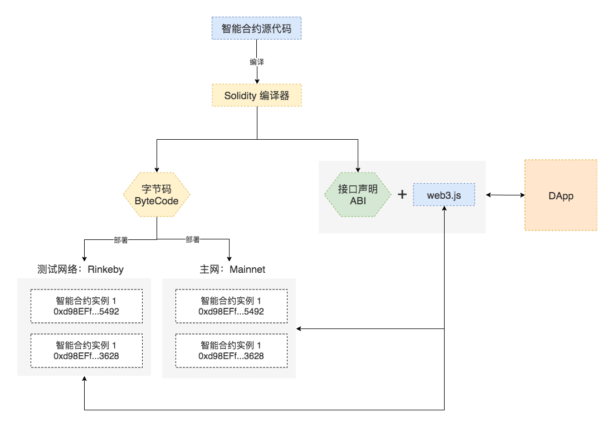
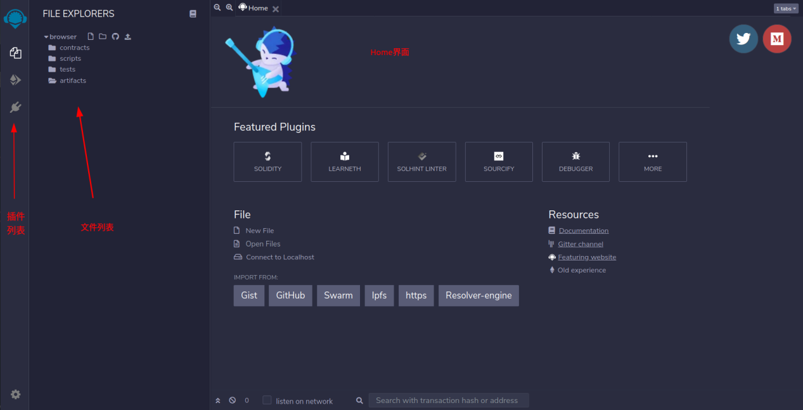
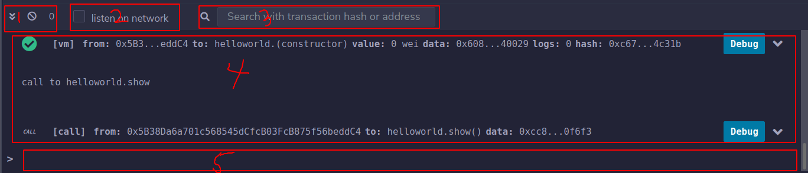
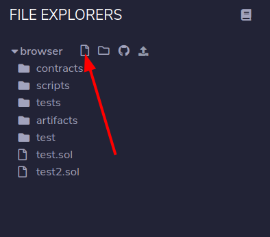
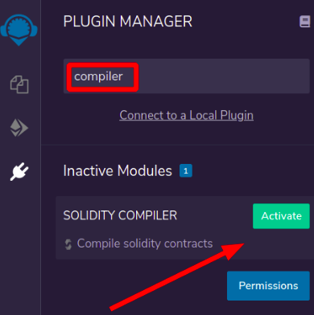
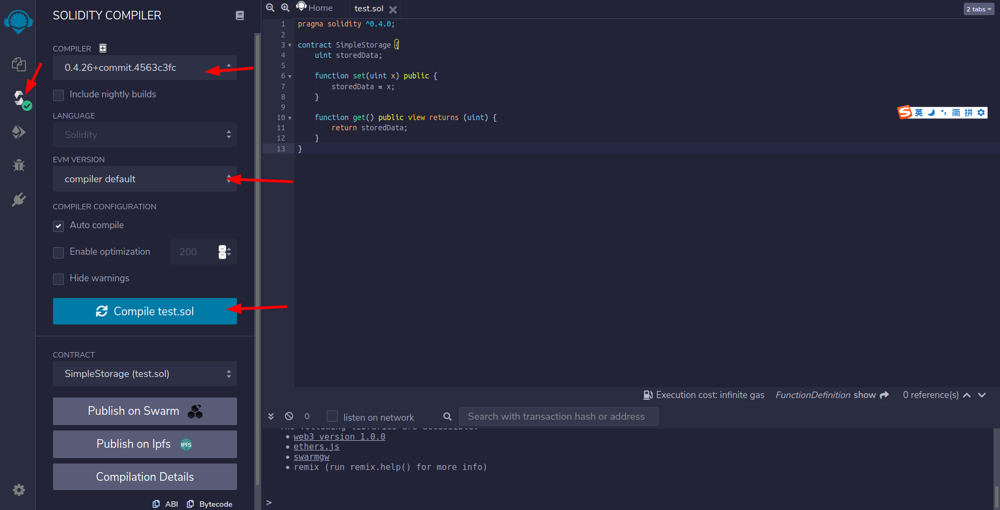
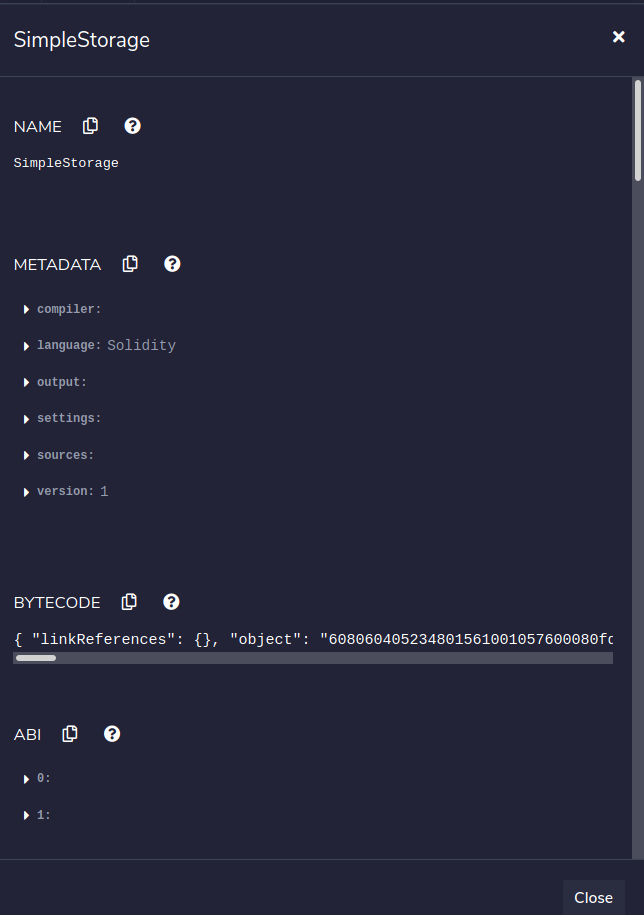
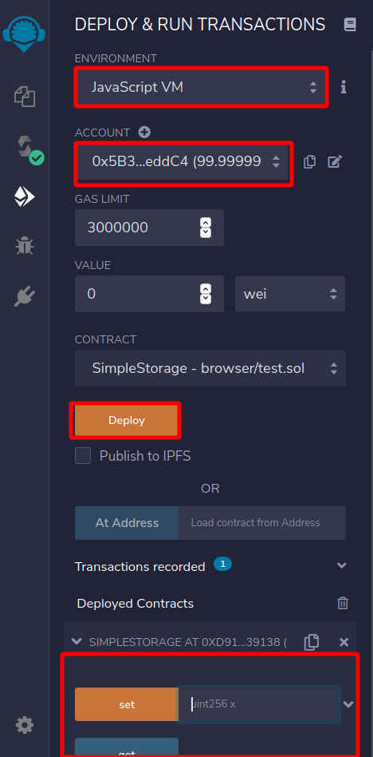
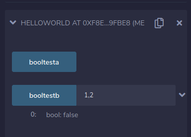
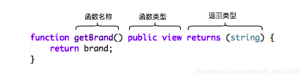

<font color='red'> 注：本教程为技术教程，不谈论且不涉及炒作任何数字货币 </font>

# Solidity 入门教学

## 1、 简介

### 1.1 Solidity是什么
- Solidity 是一门面向合约的、为实现智能合约而创建的高级编程语言。这门语言受到了 C++，Python 和 Javascript 语言的影响，设计的目的是能在以太坊虚拟机（EVM）上运行。
- Solidity 是静态类型语言，支持继承、库和复杂的用户定义类型等特性。
- 内含的类型除了常见编程语言中的标准类型，还包括 `address`等以太坊独有的类型，Solidity 源码文件通常以 .sol 作为扩展名
- 目前尝试 Solidity 编程的推荐方式是使用 Remix。Remix是一个基于 Web 浏览器的 IDE，它可以让你编写 Solidity 智能合约，然后部署并运行该智能合约。

### 1.2 Solidity语言特性

Solidity的语法接近于JavaScript，是一种面向对象的语言。但作为一种真正意义上运行在网络上的去中心合约，它又有很多的不同：
- 以太坊底层基于帐户，而不是 [UTXO](https://cloud.tencent.com/developer/article/1367743)，所以增加了一个特殊的address 的数据类型用于定位用户和合约账户。
- 语言内嵌框架支持支付。提供了 `payable` 等关键字，可以在语言层面直接支持支付。
- 使用区块链进行数据存储。数据的每一个状态都可以永久存储，所以在使用时需要确定变量使用内存，还是区块链存储。
- 运行环境是在去中心化的网络上，所以需要强调合约或函数执行的调用的方式。
- 不同的异常机制。一旦出现异常，所有的执行都将会被回撤，这主要是为了保证合约执行的原子性，以避免中间状态出现的数据不一致。

### 1.3 Solidity源码和智能合约

Solidity 源代码要成为可以运行在以太坊上的智能合约需要经历如下的

**步骤：**
1. 用 Solidity 编写的智能合约源代码需要先使用编译器编译为字节码（Bytecode），编译过程中会同时产生智能合约的二进制接口规范（Application Binary Interface，简称为ABI）；
2. 通过交易（Transaction）的方式将字节码部署到以太坊网络，每次成功部署都会产生一个新的智能合约账户；
3. 使用 Javascript 编写的 DApp 通常通过 web3.js + ABI去调用智能合约中的函数来实现数据的读取和修改。

### 1.4 合约结构

- 状态变量（State Variables）作为合约状态的一部分，值会永久保存在存储空间内。
- 函数（Functions）合约中可执行的代码块。
- 函数修饰器（Function Modifiers）在函数声明中，用来补充修饰函数的语义。
- 事件（Events）非常方便的 EVM 日志工具接口。


## 2、 Solidity编译器安装以及简单使用

Remix 是一个开源的 IDE,是一个浏览器在线编辑器。作为 Solidity 智能合约开发环境，Solidity IDE  Remix(在线浏览器编辑器)提供基本的编译、部署至本地或测试网络、执行合约等功能。

### 2.1 remix安装以及使用

1. **浏览器端配置**

在浏览器端有俩个选择，分别为英文版与中文版（有些许差别）

- Remix中文版地址：[http://remix.hubwiz.com](http://remix.hubwiz.com)

- Remix英文版地址（**推荐**）：[https://remix.ethereum.org/](https://remix.ethereum.org/)

**PS.可能需要科学上网**

<center>
    
    <br>
    <div style="color:orange; border-bottom: 1px solid #d9d9d9;
    display: inline-block;
    color: #999;
    padding: 2px;">图 1</div>
</center>

下面都以`英文版`为例子介绍

1、**浏览器输入 [https://remix.ethereum.org/](https://remix.ethereum.org/)**

如果出现加载慢，加载不完全的情况，刷新几次即可

2、左侧可以看到我们所有的文件，下面是我们的remix控制台

<center>
    
    <br>
    <div style="color:orange; border-bottom: 1px solid #d9d9d9;
    display: inline-block;
    color: #999;
    padding: 2px;">图 2</div>
</center>

上图小图标从左到右依次为：
- 创建新文件
- 创建新文件夹
- Github代码片段分享
- 表示打开一个本地文件

控制台图片如下：

<center>
    
    <br>
    <div style="color:orange; border-bottom: 1px solid #d9d9d9;
    display: inline-block;
    color: #999;
    padding: 2px;">图 3</div>
</center>

- 1 从左至右表示隐藏控制台、清除控制台输出、pending的交易数量
- 2 表示监听所有交易
- 3 表示搜索框
- 4 表示输出区域
- 5 表示使用JavaScript与以太坊交互的区域，可以使用Web3对象


3、点击文件样式图标输入我们的文件名即可(以.sol为后缀)

<center>
    
    <br>
    <div style="color:orange; border-bottom: 1px solid #d9d9d9;
    display: inline-block;
    color: #999;
    padding: 2px;">图 4</div>
</center>
<br>

4、安装必要的插件

点击插件管理器，页面中为这个图标

<center>
    
    <br>
    <div style="color:orange; border-bottom: 1px solid #d9d9d9;
    display: inline-block;
    color: #999;
    padding: 2px;">图 5</div>
</center>

<br>


- 安装compiler

    搜索关键字compiler
<center>
    
    <br>
    <div style="color:orange; border-bottom: 1px solid #d9d9d9;
    display: inline-block;
    color: #999;
    padding: 2px;">图 6</div>
</center>

5、写一个简单的样例

```javascript
pragma solidity ^0.4.0;

contract SimpleStorage {
    uint storedData;

    function set(uint x) public {
        storedData = x;
    }

    function get() public view returns (uint) {
        return storedData;
    }
}
```

第一行就是告诉大家源代码使用Solidity版本0.4.0写的，并且使用0.4.0以上版本运行也没问题（最高到0.5.0，但是不包含0.5.0）。这是为了确保合约不会在新的编译器版本中突然行为异常。关键字 `pragma` 的含义是，一般来说，pragmas（编译指令）是告知编译器如何处理源代码的指令的。

Solidity中合约的含义就是一组代码（它的 函数 )和数据（它的 状态 ），它们位于以太坊区块链的一个特定地址上。 代码行 `uint storedData`; 声明一个类型为 `uint` (256位无符号整数）的状态变量，叫做 `storedData` 。 你可以认为它是数据库里的一个位置，可以通过调用管理数据库代码的函数进行查询和变更。对于以太坊来说，上述的合约就是拥有合约（owning contract）。在这种情况下，函数 `set` 和 `get` 可以用来变更或取出变量的值。

要访问一个状态变量，并不需要像 `this.` 这样的前缀，虽然这是其他语言常见的做法。

该合约能完成的事情并不多（由于以太坊构建的基础架构的原因）：它能允许任何人在合约中存储一个单独的数字，并且这个数字可以被世界上任何人访问，且没有可行的办法阻止你发布这个数字。当然，任何人都可以再次调用 `set` ，传入不同的值，覆盖你的数字，但是这个数字仍会被存储在区块链的历史记录中。

<center>
    
    <br>
    <div style="color:orange; border-bottom: 1px solid #d9d9d9;
    display: inline-block;
    color: #999;
    padding: 2px;">图 7</div>
</center>

点击`compile test.sol`，可以看到编译按钮，建议将`Auto compile`打钩（自动编译）,之后会在编译图标上看到一个以绿色为背景的对勾。

编译组件说明：
- `Compiler`可以选择Solidity的编译器版本
- `Language`可以选择编程语言
- `EVM Version`可以选择EVM虚拟机版本
- `Auto compile`可以设置自动编译，修改完代码后自动执行编译操作
- `Enable optimization`可以设置对编译进行优化
- `Hide warnings`可以设置隐藏警告信息。
- `Contract`选择需要编译的合约
- `Publish on Swarm`和`Publish on Ipfs`分别将合约上传到Swarm和Ipfs这两个分布式文件系统上去
- `Compilation Details`很重要，可以查看编译的信息，包括ABI、字节码、函数Hash等
- `ABI`和`Bytecode`分别复制ABI和字节码。
- 再下面的部分空白用来显示编译的Warnings和Errors。

我们点击`Compilation Details`就能看到编译之后的一些信息，如下图所示（部分）

<center>
    
    <br>
    <div style="color:orange; border-bottom: 1px solid #d9d9d9;
    display: inline-block;
    color: #999;
    padding: 2px;">图 8</div>
</center>
- `NAME`：合约名
- `METADATA`：一些编译相关的信息，比如版本、所用的语言、设置等
- `BYTECODE`：写入区块的字节码
- `ABI`：此智能合约对应的 ABI ，也就是我们合约里面定义的一些接口
- `WEB3DEPLOY`：智能合约编译之后的发布命令，这个就是比较重要的，之后的web3就是调用这段命令来部署合约的
- `METADATAHASH`：数据的一个哈希值
- `SWARMLOCATION`：Swarm网络的一个地址
- `FUNCTIONHASHES`：合约定义的方法的hash，其实我们执行合约的时候就是通过这个hash去找到对应的方法进行执行的
- `GASESTIMATES`：关于矿工费的一个预算，在ETH上进行合约的部署，执行等都是需要矿工费的。一般合约代码越多矿工费越高。


点击下面的run图标，可以看到部署，以及账户信息，环境等等

<center>
    
    <br>
    <div style="color:orange; border-bottom: 1px solid #d9d9d9;
    display: inline-block;
    color: #999;
    padding: 2px;">图 9</div>
</center>

点击deploy之后天可以看到自己的合约已经部署完成，打开之后可以看见我们写的函数`set`,`get`了，给`set`函数输入一个值，点击`get`会得到相应的值

<center>
    
    <br>
    <div style="color:orange; border-bottom: 1px solid #d9d9d9;
    display: inline-block;
    color: #999;
    padding: 2px;">图 10</div>
</center>

-  `Environment` 表示合约部署的环境。`Javascript VM`是虚拟了一个节点，而`Injected Web3`和`Web3 Provider`则真正连接一个节点。
- `Account`代表不同的虚拟账户，每个虚拟账户每个有 100 ETH
- `Deploy`表示合约部署按钮
- `Deployed Contracts`表示已经部署的合约


中文版界面与英文版界面有些许不一致，但都大同小异，想了解同学可以查看本博客(界面与中文版大致相同）：
[Solidity语言编辑器REMIX指导大全](https://cloud.tencent.com/developer/article/1182404)

2. **本地配置：**
    - [win下](https://cloud.tencent.com/developer/article/1374376)
    - [ubuntu下](https://blog.csdn.net/qq_41944960/article/details/100134020)


3. **Docker**

我们为编译器提供了最新的docker构建。 stable 仓库里的是已发布的版本，nightly 仓库则是在开发分支中的带有不稳定变更的版本。

```script
docker run ethereum/solc:stable solc --version
```

目前，docker 镜像只含有 solc 的可执行程序，因此你需要额外的工作去把源代码和输出目录连接起来。

## 3、Solidity基础操作

**由于篇幅有限，以下只会讲解一些较基础、重要的概念(足够后面使用)，有些可能会一带而过或者“忽略”，如果大家途中有没太明白地方建议先百度、Google，或者查看此教程[Solifity中文文档](https://solidity-cn.readthedocs.io/zh/develop/index.html)、[Solidity英文文档](https://remix-ide.readthedocs.io/en/latest/index.html)**

### 3.1 Solidity源文件布局

**源文件可以被版本杂注pragma所注解，表明要求的编译器版本**
-  例如：
```javascript
pragma solidity ^0.4.0;
```
这样，源文件将既不允许低于 0.4.0 版本的编译器编译， 也不允许高于（包含） 0.5.0 版本的编译器编译（第二个条件因使用 ^ 被添加）。 这种做法的考虑是，编译器在 0.5.0 版本之前不会有重大变更，所以可确保源代码始终按预期被编译。 上面例子中不固定编译器的具体版本号，因此编译器的补丁版也可以使用。

**import（导入其它源文件）**
- Solidity 所支持的导入语句import，语法同 JavaScript（从ES6 起）非常类似

```javascript
import "filename";
```
从“filename”中导入所有的全局符号到当前全局作用域中
```javascript
import * as symbolName from "filename";
```
创建一个新的全局符号 symbolName，其成员均来自 “filename”中全局符号
```javascript
import {symbol1 as alias, symbol2} from "filename";
```
创建新的全局符号 alias 和 symbol2，分别从 "filename" 引用 symbol1 和 symbol2
```javascript
import "filename" as symbolName;
```
这条语句等同于 import * as symbolName from "filename";

**注释**

可以使用单行注释（//）和多行注释（/*...*/）

```javascript
// 这是一个单行注释。

/*
这是一个
多行注释。
*/
```

### 3.2 数据类型与运算符

### 3.2.1 Solidity值类型介绍

- **布尔（bool）**：
  

可能的取值为字符常量值 true 或 false

例子：
```javascript
pragma solidity ^0.4.0;

contract helloworld {
    bool boola=true; //声明一个布尔类型的值，只用一个等号
    function booltesta() public view returns(bool){
        return boola;
    }
    
    function booltestb(int a,int b) public pure returns(bool){
        return a==b;
    }
}
```
<center>
    
    <br>
    <div style="color:orange; border-bottom: 1px solid #d9d9d9;
    display: inline-block;
    color: #999;
    padding: 2px;">图 11</div>
</center>

-  **整型（int/uint）**：

`int` / `uint` ：分别表示有符号和无符号的不同位数的整型变量。 支持关键字 `uint8` 到 `uint256` （无符号，从 8 位到 256 位）以及 `int8` 到 `int256`，以 8 位为步长递增。 `uint` 和 `int` 分别是 `uint256` 和 `int256` 的别名。

- **定长浮点型（fixed / ufixed）**： 

`fixed `/ `ufixed`：表示各种大小的有符号和无符号的定长浮点型。 在关键字 `ufixedMxN` 和 `fixedMxN` 中，`M` 表示该类型占用的位数，`N` 表示可用的小数位数。 `M `必须能整除 8，即 8 到 256 位。 `N `则可以是从 0 到 80 之间的任意数。 `ufixed` 和 `fixed` 分别是 `ufixed128x19` 和 `fixed128x19` 的别名。

- **地址（address 重点，后面细讲）**：

地址类型存储一个 20 字节的值（以太坊地址的大小）。 地址类型也有成员变量，并作为所有合约的基础。

 **地址类型成员变量**:`balance` 和 `transfer`

 可以使用 balance 属性来查询一个地址的余额， 也可以使用 transfer 函数向一个地址发送 以太币 （以 wei 为单位）：

 ```javascript
address x = 0x123;
address myAddress = this;
if (x.balance < 10 && myAddress.balance >= 10) x.transfer(10);
 ```

注：如果 `x` 是一个合约地址，它的代码（更具体来说是它的 fallback 函数，如果有的话）会跟 `transfer` 函数调用一起执行（这是 EVM 的一个特性，无法阻止）。 如果在执行过程中用光了 gas 或者因为任何原因执行失败，以太币 交易会被打回，当前的合约也会在终止的同时抛出异常。

- **定长字节数组**：

关键字有 bytes1， bytes2， bytes3， ...， bytes32
`.length` 表示这个字节数组的长度（只读）.

注：可以将 `byte[]` 当作字节数组使用，但这种方式非常浪费存储空间，准确来说，是在传入调用时，每个元素会浪费 31 字节。 更好地做法是使用 `bytes`。


- **变长字节数组**

`bytes`:变长字节数组。它并不是值类型。

`string`:变长 UTF-8 编码字符串类型。并不是值类型。 


- **地址字面常数（Address Literals）**

比如像 `0xdCad3a6d3569DF655070DEd06cb7A1b2Ccd1D3AF` 这样的通过了地址校验和测试的十六进制字面常数属于 `address` 类型。 长度在 39 到 41 个数字的，没有通过校验和测试而产生了一个警告的十六进制字面常数视为正常的有理数字面常数。


- **有理数和整数字面常数**

整数字面常数由范围在 0-9 的一串数字组成，表现成十进制。 例如，69 表示数字 69。 Solidity 中是没有八进制的，因此前置 0 是无效的。

十进制小数字面常数带有一个 .，至少在其一边会有一个数字。 比如：`1.，.1`，和 `1.3`。

科学符号也是支持的，尽管指数必须是整数，但底数可以是小数。 比如：`2e10， -2e10， 2e-10， 2.5e1`。

数值字面常数表达式本身支持任意精度，除非它们被转换成了非字面常数类型（也就是说，当它们出现在非字面常数表达式中时就会发生转换）。 这意味着在数值常量表达式中, 计算不会溢出而除法也不会截断。

例如， `(2**800 + 1) - 2**800` 的结果是字面常数 1 （属于 `uint8` 类型），尽管计算的中间结果已经超过了 以太坊虚拟机 的机器字长度。 此外， `.5 * 8` 的结果是整型 4 （尽管有非整型参与了计算）

- **字符串字面常数**

字符串字面常数是指由双引号或单引号引起来的字符串（`"foo" `或者 `'bar'`）。 不像在 C 语言中那样带有结束符；`"foo"` 相当于 3 个字节而不是 4 个。 和整数字面常数一样，字符串字面常数的类型也可以发生改变，但它们可以隐式地转换成 `bytes1，……，bytes32`，如果合适的话，还可以转换成 `bytes` 以及 `string`。

- **十六进制字面常数**

十六进制字面常数以关键字 `hex` 打头，后面紧跟着用单引号或双引号引起来的字符串（例如，`hex"001122FF"`）。 字符串的内容必须是一个十六进制的字符串，它们的值将使用二进制表示。

- **枚举（enum）**：

一种用户可以定义类型的方法，与C语言类似，默认从0开始递增，一般用来模拟合约的状态

```javascript
pragma solidity ^0.4.16;

contract test {
    enum ActionChoices { GoLeft, GoRight, GoStraight, SitStill }；
    ActionChoices choice;
    ActionChoices constant defaultChoice = ActionChoices.GoStraight;

    function setGoStraight() public {
        choice = ActionChoices.GoStraight;
    }

    // 由于枚举类型不属于 |ABI| 的一部分，因此对于所有来自 Solidity 外部的调用，
    // "getChoice" 的签名会自动被改成 "getChoice() returns (uint8)"。
    // 整数类型的大小已经足够存储所有枚举类型的值，随着值的个数增加，
    // 可以逐渐使用 `uint16` 或更大的整数类型。
    function getChoice() public view returns (ActionChoices) {
        return choice;
    }

    function getDefaultChoice() public pure returns (uint) {
        return uint(defaultChoice);
    }
}
```

- **函数（function）**：

函数类型是一种表示函数的类型。可以将一个函数赋值给另一个函数类型的变量，也可以将一个函数作为参数进行传递，还能在函数调用中返回函数类型变量。 函数类型有两类：- 内部（`internal`） 函数和 外部（`external`） 函数：

内部函数只能在当前合约内被调用（更具体来说，在当前代码块内，包括内部库函数和继承的函数中），因为它们不能在当前合约上下文的外部被执行。 调用一个内部函数是通过跳转到它的入口标签来实现的，就像在当前合约的内部调用一个函数。

外部函数由一个地址和一个函数签名组成，可以通过外部函数调用传递或者返回。

函数类型表示成如下的形式

<center>
    
    <br>
    <div style="color:orange; border-bottom: 1px solid #d9d9d9;
    display: inline-block;
    color: #999;
    padding: 2px;">图 12</div>
</center>

```javascript
function (<parameter types>) {internal|external} [pure|constant|view|payable] [returns (<return types>)]
```

与参数类型相反，返回类型不能为空 —— 如果函数类型不需要返回，则需要删除整个 `returns (<return types>)` 部分。

函数类型默认是内部函数，因此不需要声明 `internal` 关键字。 与此相反的是，合约中的函数本身默认是 `public `的，只有当它被当做类型名称时，默认才是内部函数。

有两种方法可以访问当前合约中的函数：一种是直接使用它的名字，`f` ，另一种是使用 `this.f` 。 前者适用于内部函数，后者适用于外部函数。

如果当函数类型的变量还没有初始化时就调用它的话会引发一个异常。 如果在一个函数被 `delete` 之后调用它也会发生相同的情况。

如果外部函数类型在 Solidity 的上下文环境以外的地方使用，它们会被视为 `function` 类型。 该类型将函数地址紧跟其函数标识一起编码为一个 `bytes24` 类型。

请注意，当前合约的 public 函数既可以被当作内部函数也可以被当作外部函数使用。 如果想将一个函数当作内部函数使用，就用 `f` 调用，如果想将其当作外部函数，使用 `this.f` 。

**Solidity函数可见性**

函数的可见性可以指定为 external，public ，internal 或者 private；对于状态变量，不能设置为 external ，默认是 internal。

- external ：外部函数作为合约接口的一部分，意味着我们可以从其他合约和交易中调用。 一个外部函数 f不能从内部调用（即 f 不起作用，但 this.f() 可以）。 当收到大量数据的时候，外部函数有时候会更有效率。
- public ：public 函数是合约接口的一部分，可以在内部或通过消息调用。对于 public 状态变量， 会自动生成一个 getter 函数。
- internal ：这些函数和状态变量只能是内部访问（即从当前合约内部或从它派生的合约访问），不使用 this 调用。
- private ：private 函数和状态变量仅在当前定义它们的合约中使用，并且不能被派生合约使用。

**Solidity函数状态可变性**

- pure：纯函数，不允许修改或访问状态
- view：不允许修改状态
- payable：允许从消息调用中接收以太币Ether 。
- constant：与view相同，一般只修饰状态变量，不允许赋值（除初始化以外）

**内部函数调用**

当前合约中的函数可以直接（“从内部”）调用，也可以递归调用，就像下边这个荒谬的例子一样
```javascript
pragma solidity ^0.4.16;

contract C {
    function g(uint a) public pure returns (uint ret) { return f(); }
    function f() internal pure returns (uint ret) { return g(7) + f(); }
}
```
这些函数调用在 EVM 中被解释为简单的跳转。这样做的效果就是当前内存不会被清除，也就是说，通过内部调用在函数之间传递内存引用是非常有效的。

**外部函数调用**

表达式 `this.g(8)`; 和 `c.g(2)`; （其中 c 是合约实例）也是有效的函数调用，但是这种情况下，函数将会通过一个消息调用来被“外部调用”，而不是直接的跳转。 请注意，不可以在构造函数中通过 this 来调用函数，因为此时真实的合约实例还没有被创建。

如果想要调用其他合约的函数，需要外部调用。对于一个外部调用，所有的函数参数都需要被复制到内存。

当调用其他合约的函数时，随函数调用发送的 Wei 和 gas 的数量可以分别由特定选项 `.value()` 和 `.gas()` 指定:

```javascript
pragma solidity ^0.4.0;

contract InfoFeed {
    function info() public payable returns (uint ret) { return 42; }
}

contract Consumer {
    InfoFeed feed;
    function setFeed(address addr) public { feed = InfoFeed(addr); }
    function callFeed() public { feed.info.value(10).gas(800)(); }
}
```
`payable` 修饰符要用于修饰 `info`，否则，.`value()` 选项将不可用。

注意，表达式 `InfoFeed(addr)` 进行了一个的显式类型转换，说明”我们知道给定地址的合约类型是 `InfoFeed` “并且这不会执行构造函数。 显式类型转换需要谨慎处理。绝对不要在一个你不清楚类型的合约上执行函数调用。

我们也可以直接使用 `function setFeed(InfoFeed _feed) { feed = _feed; }` 。 注意一个事实，`feed.info.value(10).gas(800)` 只（局部地）设置了与函数调用一起发送的 Wei 值和 gas 的数量，只有最后的圆括号执行了真正的调用。

如果被调函数所在合约不存在（也就是账户中不包含代码）或者被调用合约本身抛出异常或者 gas 用完等，函数调用会抛出异常。


### 3.2.2 引用类型介绍

比起之前讨论过的值类型，在处理复杂的类型（即占用的空间超过 256 位的类型）时，我们需要更加谨慎。 由于拷贝这些类型变量的开销相当大，我们不得不考虑它的存储位置，是将它们保存在 **内存** （并不是永久存储）中， 还是 **存储** （保存状态变量的地方）中。

- **数据位置**

所有的复杂类型，即 **数组** 和 **结构** 类型，都有一个额外属性，“数据位置”，说明数据是保存在 **内存** 中还是 **存储** 中。 根据上下文不同，大多数时候数据有默认的位置，但也可以通过在类型名后增加关键字 `storage` 或 `memory` 进行修改。 函数参数（包括返回的参数）的数据位置默认是 `memory`， 局部变量的数据位置默认是 `storage`，状态变量的数据位置强制是 `storage`。

也存在第三种数据位置， `calldata` ，这是一块只读的，且不会永久存储的位置，用来存储函数参数。 外部函数的参数（非返回参数）的数据位置被强制指定为 `calldata `，效果跟 `memory` 差不多。

例子：
```javascript
pragma solidity ^0.4.0;

contract C {
    uint[] x; // x 的数据存储位置是 storage

    // memoryArray 的数据存储位置是 memory
    function f(uint[] memoryArray) public {
        x = memoryArray; // 将整个数组拷贝到 storage 中，可行
        var y = x;  // 分配一个指针（其中 y 的数据存储位置是 storage），可行
        y[7]; // 返回第 8 个元素，可行
        y.length = 2; // 通过 y 修改 x，可行
        delete x; // 清除数组，同时修改 y，可行
        // 下面的就不可行了；需要在 storage 中创建新的未命名的临时数组， /
        // 但 storage 是“静态”分配的：
        // y = memoryArray;
        // 下面这一行也不可行，因为这会“重置”指针，
        // 但并没有可以让它指向的合适的存储位置。
        // delete y;

        g(x); // 调用 g 函数，同时移交对 x 的引用
        h(x); // 调用 h 函数，同时在 memory 中创建一个独立的临时拷贝
    }

    function g(uint[] storage storageArray) internal {}
    function h(uint[] memoryArray) public {}
}
```
归纳：

强制指定的数据位置：
 1. 外部函数的参数（不包括返回参数）： calldata
 2. 状态变量： storage

默认数据位置：
1. 函数参数（包括返回参数）： memory
2. 所有其它局部变量： storage


- **数组**

数组可以在声明时指定长度，也可以动态调整大小。 对于 **存储** 的数组来说，元素类型可以是任意的（即元素也可以是数组类型，映射类型或者结构体）。 对于 **内存** 的数组来说，元素类型不能是映射类型，如果作为 `public` 函数的参数，它只能是 `ABI` 类型。

一个元素类型为 `T`，固定长度为 `k` 的数组可以声明为 `T[k]`，而动态数组声明为 `T[]`。 

举个例子，一个长度为 5，元素类型为 `uint` 的动态数组的数组，应声明为 `uint[][5]` （注意这里跟其它语言比，数组长度的声明位置是反的）。 要访问第三个动态数组的第二个元素，你应该使用 `x[2][1]`（数组下标是从 0 开始的，且访问数组时的下标顺序与声明时相反，也就是说，`x[2]` 是从右边减少了一级）。。

`bytes` 和 `string` 类型的变量是特殊的数组。 `bytes` 类似于 `byte[]`，但它在 `calldata` 中会被“紧打包”（译者注：将元素连续地存在一起，不会按每 32 字节一单元的方式来存放）。 `string` 与 `bytes` 相同，但（暂时）不允许用长度或索引来访问。

注：
如果想要访问以字节表示的字符串 s，请使用 `bytes(s)`.`length / bytes(s)[7] = 'x'`;。 注意这时你访问的是 `UTF-8` 形式的低级` bytes` 类型，而不是单个的字符。

**成员**

`length`:

数组有 length 成员变量表示当前数组的长度。 动态数组可以在 **存储** （而不是 **内存** ）中通过改变成员变量 .length 改变数组大小。 并不能通过访问超出当前数组长度的方式实现自动扩展数组的长度。 一经创建，**内存** 数组的大小就是固定的（但却是动态的，也就是说，它依赖于运行时的参数）。
`push`:
    变长的 **存储** 数组以及 bytes 类型（而不是 string 类型）都有一个叫做 push 的成员函数，它用来附加新的元素到数组末尾。 这个函数将返回新的数组长度。 

例子：
```javascript
pragma solidity ^0.4.16;

contract ArrayContract {
    uint[2**20] m_aLotOfIntegers;
    // 注意下面的代码并不是一对动态数组，
    // 而是一个数组元素为一对变量的动态数组（也就是数组元素为长度为 2 的定长数组的动态数组）。
    bool[2][] m_pairsOfFlags;
    // newPairs 存储在 memory 中 —— 函数参数默认的存储位置

    function setAllFlagPairs(bool[2][] newPairs) public {
        // 向一个 storage 的数组赋值会替代整个数组
        m_pairsOfFlags = newPairs;
    }

    function setFlagPair(uint index, bool flagA, bool flagB) public {
        // 访问一个不存在的数组下标会引发一个异常
        m_pairsOfFlags[index][0] = flagA;
        m_pairsOfFlags[index][1] = flagB;
    }

    function changeFlagArraySize(uint newSize) public {
        // 如果 newSize 更小，那么超出的元素会被清除
        m_pairsOfFlags.length = newSize;
    }

    function clear() public {
        // 这些代码会将数组全部清空
        delete m_pairsOfFlags;
        delete m_aLotOfIntegers;
        // 这里也是实现同样的功能
        m_pairsOfFlags.length = 0;
    }

    bytes m_byteData;

    function byteArrays(bytes data) public {
        // 字节的数组（语言意义中的 byte 的复数 ``bytes``）不一样，因为它们不是填充式存储的，
        // 但可以当作和 "uint8[]" 一样对待
        m_byteData = data;
        m_byteData.length += 7;
        m_byteData[3] = byte(8);
        delete m_byteData[2];
    }

    function addFlag(bool[2] flag) public returns (uint) {
        return m_pairsOfFlags.push(flag);
    }

    function createMemoryArray(uint size) public pure returns (bytes) {
        // 使用 `new` 创建动态 memory 数组：
        uint[2][] memory arrayOfPairs = new uint[2][](size);
        // 创建一个动态字节数组：
        bytes memory b = new bytes(200);
        for (uint i = 0; i < b.length; i++)
            b[i] = byte(i);
        return b;
    }
}
```

- **结构体**

Solidity 支持通过构造结构体的形式定义新的类型，以下是一个结构体的示例：
```c++
struct Funder {
    address addr;
    uint amount;
}

struct Campaign {
    address beneficiary;
    uint fundingGoal;
    uint numFunders;
    uint amount;
    mapping (uint => Funder) funders;
}
```
- **映射**
映射类型在声明时的形式为 `mapping(_KeyType => _ValueType)`。 其中 `_KeyType` 可以是除了映射、变长数组、合约、枚举以及结构体以外的几乎所有类型。 `_ValueType` 可以是包括映射类型在内的任何类型。

映射可以视作 哈希表 <https://en.wikipedia.org/wiki/Hash_table>，它们在实际的初始化过程中创建每个可能的 key， 并将其映射到字节形式全是零的值：一个类型的 默认值。然而下面是映射与哈希表不同的地方： 在映射中，实际上并不存储 key，而是存储它的 `keccak256` 哈希值，从而便于查询实际的值。

正因为如此，映射是没有长度的，也没有 `key` 的集合或 `value` 的集合的概念。

只有状态变量（或者在 internal 函数中的对于存储变量的引用）可以使用映射类型。。

可以将映射声明为 `public`，然后来让 Solidity 创建一个 getter。` _KeyType` 将成为 getter 的必须参数，并且 getter 会返回 `_ValueType`。

`_ValueType` 也可以是一个映射。这时在使用 getter 时将将需要递归地传入每个 `_KeyType `参数。

```javascript
pragma solidity ^0.4.0;

contract MappingExample {
    mapping(address => uint) public balances;

    function update(uint newBalance) public {
        balances[msg.sender] = newBalance;
    }
}

contract MappingUser {
    function f() public returns (uint) {
        MappingExample m = new MappingExample();
        m.update(100);
        return m.balances(this);
    }
}
```
#### 3.2.3 涉及 LValues 的运算符
- **删除**

`delete a` 的结果是将 `a` 的类型在初始化时的值赋值给 `a`。即对于整型变量来说，相当于 `a = 0`， 但 delete 也适用于数组，对于动态数组来说，是将数组的长度设为 0，而对于静态数组来说，是将数组中的所有元素重置。 如果对象是结构体，则将结构体中的所有属性重置。

delete 对整个映射是无效的（因为映射的键可以是任意的，通常也是未知的）。 因此在你删除一个结构体时，结果将重置所有的非映射属性，这个过程是递归进行的，除非它们是映射。 然而，单个的键及其映射的值是可以被删除的。

理解 `delete a `的效果就像是给 `a` 赋值很重要，换句话说，这相当于在 `a `中存储了一个新的对象。

```javascript
pragma solidity ^0.4.0;

contract DeleteExample {
    uint data;
    uint[] dataArray;

    function f() public {
        uint x = data;
        delete x; // 将 x 设为 0，并不影响数据
        delete data; // 将 data 设为 0，并不影响 x，因为它仍然有个副本
        uint[] storage y = dataArray;
        delete dataArray;
        // 将 dataArray.length 设为 0，但由于 uint[] 是一个复杂的对象，y 也将受到影响，
        // 因为它是一个存储位置是 storage 的对象的别名。
        // 另一方面："delete y" 是非法的，引用了 storage 对象的局部变量只能由已有的 storage 对象赋值。
    }
}
```

### 3.3 单位和全局变量


### 3.3.1 以太币单位

以太币 单位之间的换算就是在数字后边加上 `wei`、 `finney`、 `szabo` 或 `ether` 来实现的，如果后面没有单位，缺省为 `Wei`。例如 `2 ether == 2000 finney` 的逻辑判断值为 `true`。


### 3.3.2 时间单位

秒是缺省时间单位，在时间单位之间，数字后面带有 `seconds`、 `minutes`、 `hours`、 `days`、 `weeks` 和 `years` 的可以进行换算，基本换算关系与现实生活相符。

### 3.3.3 特殊变量和函数

在全局命名空间中已经存在了（预设了）一些特殊的变量和函数，他们主要用来提供关于区块链的信息或一些通用的工具函数。

**区块和交易属性**

- `block.blockhash(uint blockNumber) returns (bytes32)`：指定区块的区块哈希——仅可用于最新的 256 个区块且不包括当前区块；而 blocks 从 0.4.22 版本开始已经不推荐使用，由 `blockhash(uint blockNumber)` 代替
- `block.coinbase (address)`: 挖出当前区块的矿工地
- `block.difficulty (uint)`: 当前区块难度
- `block.gaslimit (uint)`: 当前区块 `gas` 限额
- `block.number (uint`): 当前区块号
- `block.timestamp (uint)`: 自 `unix epoch` 起始当前区块以秒计的时间戳
- `gasleft() returns (uint256)`：剩余的 `gas`
- `msg.data (bytes)`: 完整的 `calldata`
- `msg.gas (uint)`: 剩余 `gas` - 自 0.4.21 版本开始已经不推荐使用，由 gesleft() 代替
- **`msg.sender (address)`:** 消息发送者（当前调用）
- `msg.sig (bytes4)`: calldata 的前 4 字节（也就是函数标识符）
- `msg.value (uint)`: 随消息发送的 wei 的数量
- `now (uint)`: 目前区块时间戳（`block.timestamp`）
- `tx.gasprice (uint)`: 交易的` gas` 价格
- `tx.origin (address)`: 交易发起者（完全的调用链）

**[ABI 编码函数](https://solidity-cn.readthedocs.io/zh/develop/abi-spec.html#abi)**


- `abi.encode(...) returns (bytes)`： ABI - 对给定参数进行编码
- `abi.encodePacked(...) returns (bytes)`：对给定参数执行 紧打包编码
- `abi.encodeWithSelector(bytes4 selector, ...) returns (bytes)：` ABI - 对给定参数进行编码，并以给定的函数选择器作为起始的 4 字节数据一起返回
- `abi.encodeWithSignature(string signature, ...) returns (bytes)`：等价于 `abi.encodeWithSelector(bytes4(keccak256(signature), ...)`

**错误处理**

- `assert(bool condition)`:
    如果条件不满足，则使当前交易没有效果 — 用于检查内部错误。
- `require(bool condition)`:
    如果条件不满足则撤销状态更改 - 用于检查由输入或者外部组件引起的错误。
- `require(bool condition, string message)`:
    如果条件不满足则撤销状态更改 - 用于检查由输入或者外部组件引起的错误，可以同时提供一个错误消息。
- `revert()`:
    终止运行并撤销状态更改。
- `revert(string reason)`:
    终止运行并撤销状态更改，可以同时提供一个解释性的字符串。

**地址相关**


- `<address>.balance (uint256)`:
    以 Wei 为单位的 地址类型 的余额。
- `<address>.transfer(uint256 amount)`:
    向 地址类型 发送数量为 amount 的 Wei，失败时抛出异常，发送 2300 gas 的矿工费，不可调节。
- `<address>.send(uint256 amount) returns (bool)`:
    向 地址类型 发送数量为 amount 的 Wei，失败时返回 false，发送 2300 gas 的矿工费用，不可调节。
- `<address>.call(...) returns (bool)`:
    发出低级函数 CALL，失败时返回 false，发送所有可用 gas，可调节。
- `<address>.callcode(...) returns (bool)`：
    发出低级函数 CALLCODE，失败时返回 false，发送所有可用 gas，可调节。
- `<address>.delegatecall(...) returns (bool):`
    发出低级函数 DELEGATECALL，失败时返回 false，发送所有可用 gas，可调节。 

### 3.4 表达式和控制结构(*)

### 3.4.1 控制结构


avaScript 中的大部分控制结构在 Solidity 中都是可用的，除了 `switch` 和 `goto`。 因此 Solidity 中有 `if，else，while，do，for，break，continue，return，? : `这些与在 C 或者 JavaScript 中表达相同语义的关键词。

用于表示条件的括号 **不可以** 被省略，单语句体两边的花括号可以被省略。

注意，与 C 和 JavaScript 不同， Solidity 中非布尔类型数值不能转换为布尔类型，因此 `if (1) { ... }` 的写法在 Solidity 中 无效 。

当一个函数有多个输出参数时， `return (v0, v1, ...,vn)` 写法可以返回多个值。不过元素的个数必须与输出参数的个数相同

### 3.4.2 通过 new 创建合约
使用关键字 `new` 可以创建一个新合约。待创建合约的完整代码必须事先知道，因此递归的创建依赖是不可能的。

```javascript
pragma solidity ^0.4.0;

contract D {
    uint x;
    function D(uint a) public payable {
        x = a;
    }
}

contract C {
    D d = new D(4); // 将作为合约 C 构造函数的一部分执行

    function createD(uint arg) public {
        D newD = new D(arg);
    }

    function createAndEndowD(uint arg, uint amount) public payable {
        //随合约的创建发送 ether
        D newD = (new D).value(amount)(arg);
    }
}
```
如示例中所示，使用 `.value（）` 选项创建 `D` 的实例时可以转发 `Ether`，但是不可能限制 `gas` 的数量。如果创建失败（可能因为栈溢出，或没有足够的余额或其他问题），会引发异常。

### 3.4.3 错误处理：Assert, Require, Revert and Exceptions

`Solidity` 使用状态恢复异常来处理错误。这种异常将撤消对当前调用（及其所有子调用）中的状态所做的所有更改，并且还向调用者标记错误。 便利函数 `assert` 和 `require` 可用于检查条件并在条件不满足时抛出异常。`assert` 函数只能用于测试内部错误，并检查非变量。

 `require` 函数用于确认条件有效性，例如输入变量，或合约状态变量是否满足条件，或验证外部合约调用返回的值。 如果使用得当，分析工具可以评估你的合约，并标示出那些会使 `assert` 失败的条件和函数调用。 正常工作的代码不会导致一个 `assert `语句的失败；如果这发生了，那就说明出现了一个需要你修复的 bug。

还有另外两种触发异常的方法：`revert` 函数可以用来标记错误并恢复当前的调用。 `revert` 调用中包含有关错误的详细信息是可能的，这个消息会被返回给调用者。已经不推荐的关键字 `throw` 也可以用来替代 `revert()` （但无法返回错误消息）。

在下例中，你可以看到如何轻松使用``require``检查输入条件以及如何使用``assert``检查内部错误，注意，你可以给 require 提供一个消息字符串，而 assert 不行。

```javascript
pragma solidity ^0.4.22;

contract Sharer {
    function sendHalf(address addr) public payable returns (uint balance) {
        require(msg.value % 2 == 0, "Even value required.");
        uint balanceBeforeTransfer = this.balance;
        addr.transfer(msg.value / 2);
                    //由于转移函数在失败时抛出异常并且不能在这里回调，因此我们应该没有办法仍然有一半的钱。
        assert(this.balance == balanceBeforeTransfer - msg.value / 2);
        return this.balance;
    }
}
```
### 3.5 合约

Solidity 合约类似于面向对象语言中的类。合约中有用于数据持久化的状态变量，和可以修改状态变量的函数。 调用另一个合约实例的函数时，会执行一个 EVM 函数调用，这个操作会切换执行时的上下文，这样，前一个合约的状态变量就不能访问了。

### 3.5.1 创建合约

可以通过以太坊交易“从外部”或从 Solidity 合约内部创建合约。
创建合约时，会执行一次构造函数（与合约同名的函数）。构造函数是可选的。只允许有一个构造函数，这意味着不支持重载。

在内部，构造函数参数在合约代码之后通过 `ABI` 编码 传递，但是如果你使用 `web3.js` 则不必关心这个问题。

如果一个合约想要创建另一个合约，那么创建者必须知晓被创建合约的源代码(和二进制代码)。 这意味着不可能循环创建依赖项。

### 3.5.2 getter 函数

编译器自动为所有 `public` 状态变量创建 `getter` 函数。对于下面给出的合约，编译器会生成一个名为 `data` 的函数， 该函数不会接收任何参数并返回一个 `uint` ，即状态变量 `data` 的值。可以在声明时完成状态变量的初始化

```javascript
pragma solidity ^0.4.0;

contract C {
    uint public data = 42;
}

contract Caller {
    C c = new C();
    function f() public {
        uint local = c.data();
    }
}
```
getter 函数具有外部可见性。如果在内部访问 getter（即没有 this. ），它被认为一个状态变量。 如果它是外部访问的（即用 this. ），它被认为为一个函数。

### 3.5.3 View 函数

可以将函数声明为 view 类型，这种情况下要保证不修改状态。

下面的语句被认为是修改状态：

1. 修改状态变量。
2. 产生事件。
3. 创建其它合约。
4. 使用 selfdestruct。
5. 通过调用发送以太币。
6. 调用任何没有标记为 view 或者 pure 的函数。
7. 使用低级调用。
8. 使用包含特定操作码的内联汇编。

```javascript
pragma solidity ^0.4.16;

contract C {
    function f(uint a, uint b) public view returns (uint) {
        return a * (b + 42) + now;
    }
}
```
### 3.5.4 Pure 函数

函数可以声明为 pure ，在这种情况下，承诺不读取或修改状态。

除了上面解释的状态修改语句列表之外，以下被认为是从状态中读取：

1. 读取状态变量。
2. 访问 this.balance 或者 <address>.balance。
3. 访问 block，tx， msg 中任意成员 （除 msg.sig 和 msg.data 之外）。
4. 调用任何未标记为 pure 的函数。
5. 使用包含某些操作码的内联汇编。

```javascript
pragma solidity ^0.4.16;

contract C {
    function f(uint a, uint b) public pure returns (uint) {
        return a * (b + 42);
    }
}
```


## 四、练习题

### 4.1 将固定长度字节数组转化为`string`类型

```javascript
pragma solidity ^0.4.0;

contract bytes32tostring{
    
    bytes10 testword=0x68656c6c6f776f726c64; //为helloworld
    function bytes32tostringF() public view returns(string){
    
    }
}
```

### 4.2 实现一个带有简单逻辑判断及多种数学运算的Solidity程序


**参考自：**

1. 黄皮书：https://github.com/yuange1024/ethereum_yellowpaper/blob/master/ethereum_yellow_paper_cn.pdf

2. 白皮书：https://github.com/ethereum/wiki/wiki/White-Paper
    [INlinKC](https://blog.csdn.net/weixin_45067603)
    https://ethfans.org/wikis/Home
3. 以太坊solidity学习记录: [https://blog.csdn.net/weixin_45067603/article/details/105726491](https://blog.csdn.net/weixin_45067603/article/details/105726491)
4. [尚硅谷区块链全套Go语言→GoWeb→以太坊→项目实战](https://www.bilibili.com/video/BV1sJ411D72u)
