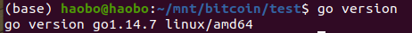
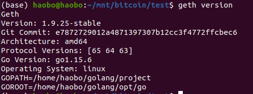
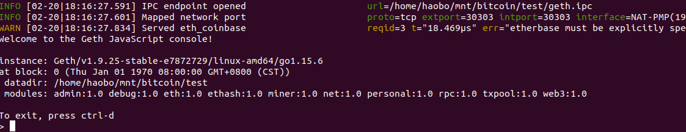
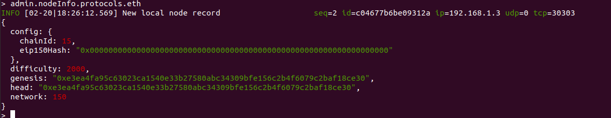
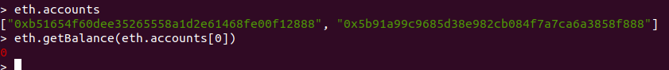
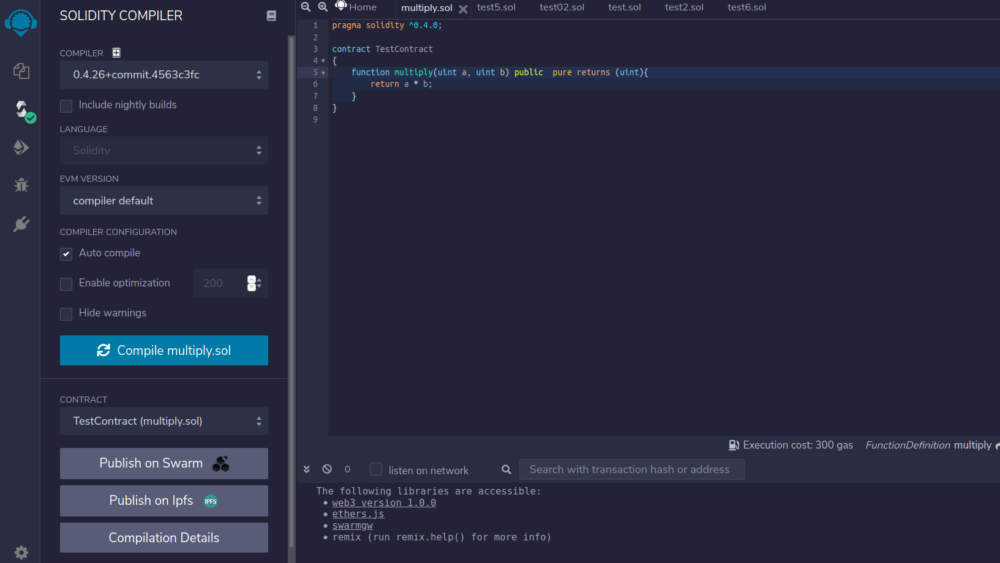
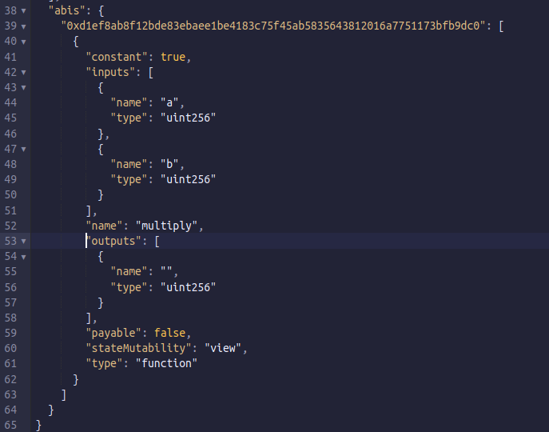
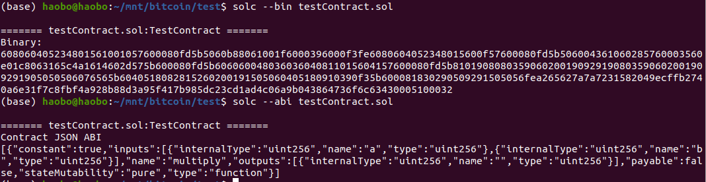
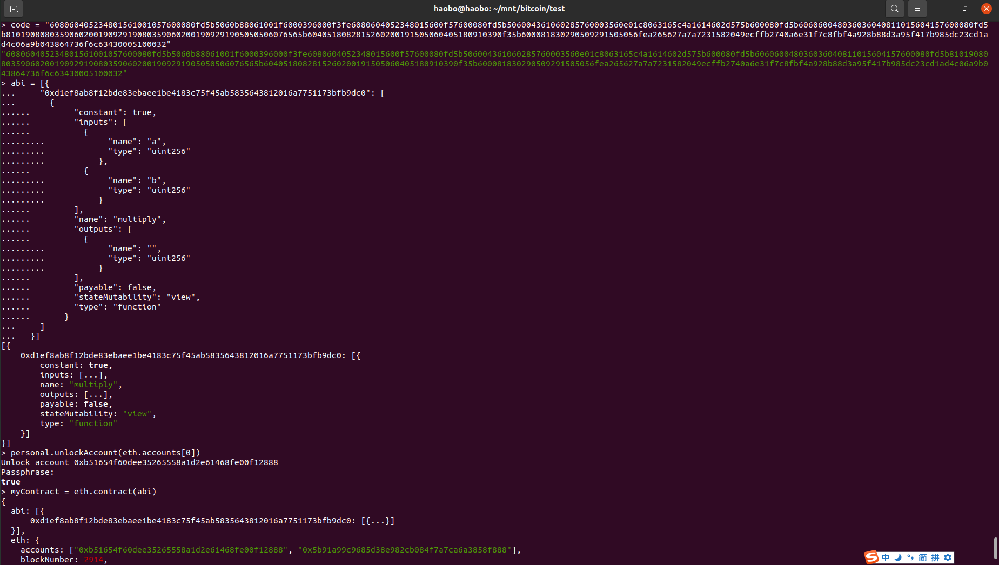
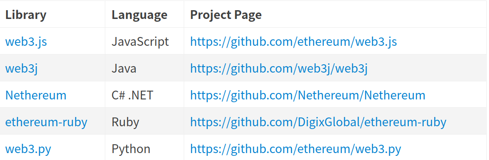

<font color='red'>注：本教程为技术教程，不谈论且不涉及炒作任何数字货币 </font>

## 一、以太坊客户端

### 1.1、什么是以太坊客户端

- 以太坊客户端是一个软件应用程序，它实现以太坊规范并通过p2p网络与其他以太坊客户端进行通信。如果不同的以太坊客户端符合参考规范和标准化通信协议，则可以进行相互操作。
- 以太坊是一个开源项目，由“黄皮书”正式规范定义。除了各种以太坊改进提案之外，此正式规范还定义了以太坊客户端的标准行为。
- 因为以太坊有明确的正式规范，以太网客户端有了许多独立开发的软件实现，它们之间又可以彼此交互。


### 1.2、基于以太坊规范的网络

- 存在各种基于以太坊规范的网络，这些网络基本符合以太坊“黄皮书”中定义的形式规范，但它们之间可能相互也可能不相互操作。
- 这些基于以太坊的网络中有：以太坊，以太坊经典，Ella，Expanse，Ubiq，Musicoin等等。
- 虽然大多数在协议级别兼容，但这些网络通常具有特殊要求，以太坊客户端软件的维护人员、需要进行微小更改、以支持每个网络的功能或属性


### 1.3、以太坊的多种客户端

- [go-ethereum ( Go )](https://github.com/ethereum/go-ethereum)
 官方推荐，开发使用最多
- parity ( Rust )
 最轻便客户端，在历次以太坊网络攻击中表现卓越
- cpp-ethereum (C++)

- pyethapp (python)

- ethereumjs-lib ( javascript )

- EthereumJ / Harmony ( Java )

### 1.4、以太坊全节点

- 全节点是整个主链的一个副本，存储并维护链上的所有数据，并随时验证新区块的合法性。
- 区块链的健康和扩展弹性，取决于具有许多独立操作和地理上分散的全节点。每个全节点都可以帮助其他新节点获取区块数据，并提供所有交易和合约的独立验证。
- 运行全节点将耗费巨大的成本，包括硬件资源和带宽。
- 以太坊开发不需要在实时网络（主网）上运行的全节点。我们可以使用测试网络的节点来代替，也可以用本地私链，或者使用服务商提供的基于云的以太坊客户端；这些几乎都可以执行所有操作。

### 1.5、远程客户端和轻节点

- 远程客户端

  不存储区块链的本地副本或验证块和交易。这些客户端一般只提供钱包的功能，可以创建和广播交易。远程客户端可用于连接到现有网络，MetaMask 就是一个这样的客户端。

- 轻节点

    不保存链上的区块历史数据，只保存区块链当前的状态。轻节点可以对块和交易进行验证。

* 全节点的优缺点
  * 优点
    * 为以太坊网络的灵活性和抗审查性提供有力支持
    * 权威地验证所有交易
    * 可以直接与公众区块链上的任何合约交互
    * 可以离线查询区块链状态（账户、合约等）
    * 可以直接把自己的合约部署到公共区块链中
  * 缺点
    * 需要巨大的硬件和带宽资源，而且会不断增长
    * 第一次下载往往需要几天才能完全同步
    * 必须及时维护、升级并保持在线状态以同步区块

  ##### 公共测试网络节点的优缺点

  * 优点
    * 一个testnet节点需要同步和存储更少的数据，大约10GB，具体取决于不同的网络
    * 一个testnet节点一般可以在几个小时内完成同步
    * 部署合约或进行交易只需要发送测试以太，可以从”水龙头“免费获得
    * 测试网络是公共区块链，有许多其他用户和合约运行（区别于私链）
  * 缺点
    * 测试网络上使用测试以太没有价值。因此无法测试交易对手的安全性，因为没有任何利害关系
    * 测试网络上的测试无法涵盖所有真实主网特性。例如：交易费用虽然是发送交易所必需的，但由于gas免费，因此 testnet上往往不会考虑。而且一般来说，测试网络不会像主网一样经常拥堵

  ##### 本地私链的优缺点

  * 优点
    * 磁盘上几乎没有数据，也不同步别的数据，是一个完全干净的环境
    * 无需获取测试以太，可以分配任意以太，也可以随时自己挖矿获得
    * 没有其他用户与合约，无外部干扰
  * 缺点
    * 没有其他用户意味与公链的行为不同，发送的交易并不存在空间或交易顺序的竞争
    * 除自己之外没有矿工意味着挖矿更容易预测，因此无法测试公链上发生的某些情况
    * 没有其他合约意味着必须部署要测试的所有内容，包括所有的依赖项和合约库

我们的教程主要基于本地私链的搭建，以后的交易等也主要基于我们的私链，因此以太坊客户端及私链的搭建在我们本次学习中至关重要。

**JSON-RPC**

- 以太坊客户端提供了API 和一组远程调用（RPC）命令，这些命令被编码为 JSON。这被称为 JSON-RPC API。本质上，JSON-RPCAPI 就是一个接口，允许我们编写的程序使用以太坊客户端作为网关，访问以太坊网络和链上数据。
- 通常，RPC 接口作为一个 HTTP 服务，端口设定为 8545。出于安全原因，默认情况下，它仅限于接受来自localhost 的连接。
- 要访问JSON-RPC API，我们可以使用编程语言编写的专用库，例如JavaScript的 web3.js。
- 或者也可以手动构建HTTP请求并发送/接收JSON编码的请求，如：

```javascript
curl -X POST -H "Content-Type:application/json" --data '{"jsonrpc":"2.0","method":"web3_clientVersion","params":[],"id":1}' http://127.0.0.1:8545
```


## 二、用 Geth 搭建以太坊私链

### 2.1安装 go

大家首先输入`go version`查看自己是否配置成功go环境，若不成功参考下面博客：

[go ： GoLand安装及环境配置](https://blog.csdn.net/qq_44702847/article/details/108597386)

若成功则如下图所示
<center>
    
    <br>
    <div style="color:orange; border-bottom: 1px solid #d9d9d9;
    display: inline-block;
    color: #999;
    padding: 2px;">图 1</div>
</center>

### 2.2 安装 Geth

安装 Geth 有很多种方式，这里主要就 Linux 环境给出两种方法：系统包管理器（apt-get）安装和源码安装。更加推荐大家用源码安装，在整个过程中可以看到 Geth 各组件的构建步骤。

其他OS安装方法见[本教程](https://geth.ethereum.org/docs/install-and-build/installing-geth)

**方法一、apt-get**

```javascript
sudo apt-get install software-properties-common
sudo add-apt-repository -y ppa:ethereum/ethereum
sudo apt-get update
sudo apt-get install ethereum
```


**方法二、源码安装**

1. 克隆 github 仓库我们的第一步是克隆 git 仓库，以获取源代码的副本。


```javascript
git clone https://github.com/ethereum/go-ethereum.git
```

2. 从源码构建 Geth要构建 Geth，切换到下载源代码的目录并使用 make 命令：


```javascript
cd go-ethereum
make geth
```

如果一切顺利，我们将看到 Go 编译器构建每个组件，直到它生成 geth 可执行文件：

```javascript
build/env.sh go run build/ci.go install ./cmd/geth
>>> /usr/local/go/bin/go install -ldflags -X
main.gitCommit=58a1e13e6dd7f52a1d5e67bee47d23fd6cfdee5c -v ./cmd/geth
github.com/ethereum/go-ethereum/common/hexutil
github.com/ethereum/go-ethereum/common/math
github.com/ethereum/go-ethereum/crypto/sha3 github.com/ethereum/go-ethereum/rlp
github.com/ethereum/go-ethereum/crypto/secp256k1
github.com/ethereum/go-ethereum/common [...]
github.com/ethereum/go-ethereum/cmd/utils
github.com/ethereum/go-ethereum/cmd/geth Done building. Run "build/bin/geth" to
launch geth.
```

 查看 geth version，确保在真正运行之前安装正常：

<center>
    
    <br>
    <div style="color:orange; border-bottom: 1px solid #d9d9d9;
    display: inline-block;
    color: #999;
    padding: 2px;">图 2</div>
</center>

### 启动节点同步

安装好了 Geth，现在我们可以尝试运行一下它。执行下面的命令，geth 就会开始同步区块，并存储在当前目录下。

这里的 --syncmode fast 参数表示我们会以“快速”模式同步区块。在这种模式下，我们只会下载每个区块头和区块体，但不会执行验证所有的交易，直到所有区块同步完毕再去获取一个系统当前的状态。这样就节省了很多交易验证的时间。

 ```javascript
geth –datadir . --syncmode fast
 ```
--datadir：后面的参数是区块数据及秘钥存放目录

通常，在同步以太坊区块链时，客户端会一开始就下载并验证每个块和每个交易，也就是说从创世区块开始。 毫无疑问，如果我们不加 --syncmode fast 参数，同步将花费很长时间并且具有很高的资源要求（它将需要更多的 RAM，如果你没有快速存储，则需要很长时间）。有些文章会把这个参数写成 --fast，这是以前快速同步模式的参数写法，现在已经被 –syncmode fast取代。如果我们想同步测试网络的区块，可以用下面的命令：

 ```javascript
geth --testnet --datadir . --syncmode fast
 ```

--testnet 这个参数会告诉 geth 启动并连接到最新的测试网络，也就是 Ropsten。测试网络的区块和交易数量会明显少于主网，所以会更快一点。但即使是用快速模式同步测试网络，也会需要几个小时的时间

### 2.3 搭建自己的私有链

因为公共网络的区块数量太多，同步耗时太长，我们为了方便快速了解 Geth，可以试着用它来搭一个只属于自己的私链。首先，我们需要创建网络的“创世”（genesis）状态，这写在一个小小的 JSON 文件里（例如，我们将其命名为 genesis.json，保存到当前目录下）：

 ```javascript
{
"config": {
    "chainId": 15
    },
"difficulty": "2000",
"gasLimit": "2100000",
"alloc": {
    "7df9a875a174b3bc565e6424a0050ebc1b2d1d82": {   "balance": "300000" },
    "f41c74c9ae680c1aa78f42e5647a62f353b7bdde": { "balance": "400000" }
    }
}
 ```
genesis.json介绍
<center>
    
    <br>
    <div style="color:orange; border-bottom: 1px solid #d9d9d9;
    display: inline-block;
    color: #999;
    padding: 2px;">图 3</div>
</center>
要创建一条以它作为创世块的区块链，我们可以使用下面的命令：
 ```javascript
geth --datadir . init genesis.json
 ```
初始化完成后目录下多了geth和keystore两个文件夹：

- geth：保存该链上的区块数据
- keystore：保存该链上的账户信息

**可能遇到问题**：
- Fatal: invalid genesis file: missing 0x prefix for hex data：这个错误信息意思很明白，就是你的json文件中，对于16进制数据，需要加上0x前缀

- Fatal: invalid genesis file: hex string has odd length: 从Geth 1.6版本开始，设置的十六进制数值，不能是奇数位， 比如不能是0x0，而应该是0x00。

- Fatal: failed to write genesis block: genesis has no chain configuration ：这个错误信息，就是说，你的配置文件中，缺少config部分。

- Error: invalid sender: 这个错误虽然不会导致私有链初始化时出现失败的情况，但是会在以后的转账（web3.eth.sendTransaction），或者部署智能合约的时候产生。解决方法就是chainId 不能设置为0。 如果你完全按照Geth官方文档上给出的配置文件进行配置，就会产生这个错误。

在当前目录下运行 geth，就会启动这条私链，注意要将 networked 设置为与创世块配置里的chainId 一致。

 ```javascript
// 简单开启
(base) haobo@haobo:~/home/mnt/bitcoin/test$ geth --datadir . --networkid 150 --nodiscover console

// 更一般的形式
(base) haobo@haobo:~/home/mnt/bitcoin/test$ geth --networkid 150 --datadir "." --identity "kexin" --rpc --rpcport "8545" --rpcaddr "localhost" --port "30303" --nodiscover --allow-insecure-unlock --rpcapi "eth,net,web3,personal,admin,shh,txpool,debug,miner" console
 ```
参数含义：
<center>
    
    <br>
    <div style="color:orange; border-bottom: 1px solid #d9d9d9;
    display: inline-block;
    color: #999;
    padding: 2px;">图 4</div>
</center>
我们可以看到节点正常启动：
<center>
    
    <br>
    <div style="color:orange; border-bottom: 1px solid #d9d9d9;
    display: inline-block;
    color: #999;
    padding: 2px;">图 5</div>
</center>
启动完之后，就可以通过`admin.nodeInfo.protocols.eth`来获取到刚启动的节点的一些信息（如下），比较上文初始化的配置，相关内容是一致的。
<center>
    
    <br>
    <div style="color:orange; border-bottom: 1px solid #d9d9d9;
    display: inline-block;
    color: #999;
    padding: 2px;">图 6</div>
</center>
恭喜！我们已经成功启动了一条自己的私链。

## 3、Geth 控制台命令

`Geth Console` 是一个交互式的 JavaScript 执行环境，其中 > 是命令提示符,里面内置了一些用来操作以太坊的 JavaScript对象，我们可以直接调用这些对象来获取区块链上的相关信息。

**这些对象主要包括：**

- eth：主要包含对区块链进行访问和交互相关的方法；
- net：主要包含查看 p2p 网络状态的方法；
- admin：主要包含与管理节点相关的方法；
- miner：主要包含挖矿相关的一些方法；
- personal：包含账户管理的方法；
- txpool：包含查看交易内存池的方法；
- web3：包含以上所有对象，还包含一些通用方法。


**常用命令有：**


- personal.newAccount()：创建账户；
- personal.unlockAccount()：解锁账户；
- eth.accounts：枚举系统中的账户；
- eth.getBalance()：查看账户余额，返回值的单位是 Wei（Wei 是以太坊中最小货币面额单位，类似比特币中的聪，1 ether = 10^18 Wei）；
- eth.blockNumber：列出区块总数；
- eth.getTransaction()：获取交易；
- eth.getBlock()：获取区块；
- miner.start()：开始挖矿；
- miner.stop()：停止挖矿；
- web3.fromWei()：Wei 换算成以太币；
- web3.toWei()：以太币换算成 Wei；
- txpool.status：交易池中的状态；
- admin.addPeer()：连接到其他节点

### 3.1 操作测试

**3.1.1 创建账户**

进入控制台后，可以通过使用命令来与私有链进行交互。创建一个新的账户：

```javascript
> personal.newAccount()
Passphrase:
Repeat passphrase:
"0xc8248c7ecbfd7c4104923275b99fafb308bbff92"
```

输入两遍密码后，生成账户地址。以同样的方式，可创建多个账户，查看账户：

```javascript
> eth.accounts
```
查看账户余额

```javascript
> eth.getBalance(eth.accounts[0])
0
```
<center>
    
    <br>
    <div style="color:orange; border-bottom: 1px solid #d9d9d9;
    display: inline-block;
    color: #999;
    padding: 2px;">图 7</div>
</center>
<br>

**3.1.2 挖矿**

启动挖矿：

```javascript
> miner.start(1)
```

其中 `start` 的参数表示挖矿使用的线程数。第一次启动挖矿会先生成挖矿所需的 `DAG `文件，这个过程有点慢，等进度达到 100% 后，就会开始挖矿，此时屏幕会被挖矿信息刷屏。

停止挖矿，在 控制台 中输入：

```javascript
> miner.stop()
```

挖到一个区块会奖励以太币，挖矿所得的奖励会进入矿工的账户，这个账户叫做 coinbase，默认情况下 coinbase 是本地账户中的第一个账户，可以通过 miner.setEtherbase() 将其他账户设置成 coinbase。

可以使用以下命令，当新区块挖出后，挖矿即可结束。

```javascript
> miner.start(1);admin.sleepBlocks(1);miner.stop();
```

**3.1.3 交易**

目前，账户 0 已经挖到了 3 个块的奖励，账户 1 的余额还是0：
```javascript
> eth.getBalance(eth.accounts[0])
15000000000000000000
> eth.getBalance(eth.accounts[1])
0
```

我们要从账户 0 向账户 1 转账，先解锁账户 0，才能发起交易：

```javascript
> personal.unlockAccount(eth.accounts[0])
Unlock account 0x3443ffb2a5ce3f4b80080791e0fde16a3fac2802
Passphrase: 
true
```
发送交易，账户 0 -> 账户 1：

```javascript
> amount = web3.toWei(5,'ether')
"5000000000000000000"
> eth.sendTransaction({from:eth.accounts[0],to:eth.accounts[1],value:amount})
INFO [09-12|07:38:12] Submitted transaction                    fullhash=0x9f5e61f3d686f793e2df6378d1633d7a9d1df8ec8c597441e1355112d102a6ce recipient=0x02bee2a1582bbf58c42bbdfe7b8db4685d4d4c62
"0x9f5e61f3d686f793e2df6378d1633d7a9d1df8ec8c597441e1355112d102a6ce"
```

此时如果没有挖矿，用 `txpool.status` 命令可以看到本地交易池中有一个待确认的交易，可以使用 `eth.getBlock("pending", true).transactions`查看当前待确认交易。使用下面命令开始挖矿。

```javascript
>miner.start(1);admin.sleepBlocks(1);miner.stop();
```

新区块挖出后，挖矿结束，查看账户 1 的余额，已经收到了账户 0 的以太币：
```javascript
> web3.fromWei(eth.getBalance(eth.accounts[1]),'ether')
5
```

**3.1.3 查看交易和区块**

查看当前区块总数：
```javascript
> eth.blockNumber
4
```

通过区块号查看区块：
```javascript
> eth.getBlock(4)
```

通过交易 Hash 查看交易（Hash 值包含在上面交易返回值中）：


```javascript
>  eth.getTransaction("0x9f5e61f3d686f793e2df6378d1633d7a9d1df8ec8c597441e1355112d102a6ce")
```

**3.1.3 其他节点加入**

此时，私有链已经通过该节点创建好了，如果其他节点想加入，需要通过以太坊客户端连接到该私有区块网络，并连接该网络的节点来同步区块信息。在其他主机上安装以太坊客户端Geth，通过Geth命令进入该私有区块链，注意要指定相同的网络号。

假设有两个节点：节点一和节点二，NetWorkID 都是 6666，通过下面的步骤就可以从节点一连接到节点二。

首先要知道节点二的 enode 信息，在节点二的 Geth Console 中执行下面的命令查看 enode 信息：

```javascript
> admin.nodeInfo.enode
"enode://d465bcbd5c34da7f4b8e00cbf9dd18e7e2c38fbd6642b7435f340c7d5168947ff2b822146e1dc1b07e02f7c15d5ca09249a92f1d0caa34587c9b2743172259ee@[::]:30303"
```
然后在节点一的 Geth Console 中执行 `admin.addPeer()`，就可以连接到节点二：

```javascript
> admin.addPeer("enode://d465bcbd5c34da7f4b8e00cbf9dd18e7e2c38fbd6642b7435f340c7d5168947ff2b822146e1dc1b07e02f7c15d5ca09249a92f1d0caa34587c9b2743172259ee@[::]:30303")
```
`addPeer()` 的参数就是节点二的 enode 信息，注意要把 enode 中的 `[::]` 替换成节点二的 IP 地址。连接成功后，节点二就会开始同步节点一的区块，同步完成后，任意一个节点开始挖矿，另一个节点会自动同步区块，向任意一个节点发送交易，另一个节点也会收到该笔交易。

通过 `admin.peers`可以查看连接到的其他节点信息，通过 `net.peerCount`可以查看已连接到的节点数量。

除了上面的方法，也可以在启动节点的时候指定`--bootnodes`选项连接到其他节点。

> 如果只是自己测试开发使用，建议使用dev环境，在需要在启动时增加`–dev`参数即可，在dev模式下会监听交易，一旦有交易发送就会打包然后挖矿确认，且默认的`account[0]`开发者账户初始有一大堆以太币。

## 3、智能合约操作

### 3.1、创建和编译智能合约

经过part2的学习大家已经基本上掌握了Solidity，接下来我们编写一个智能合约：

该合约包含一个方法 multiply()，将输入的两个数相乘后输出：
```javascript
pragma solidity ^0.4.0;
contract TestContract
{
    function multiply(uint a, uint b) returns (uint)
    {
        return a * b;
    }
}
```
将上面的代码复制到Remix编辑器里，程序将自动完成编译。
<center>
    
    <br>
    <div style="color:orange; border-bottom: 1px solid #d9d9d9;
    display: inline-block;
    color: #999;
    padding: 2px;">图 8</div>
</center>
点击 run 在Environment中设选择JavaScript VM, Value可设置为1，点击Deploy，则可创建该部署智能合约的交易。

因为我们要将该智能合约部署到私有链上，需要得到智能合约编译后的EVM二进制码和JSON ABI（Application Binary Interface）。将生成的交易保存到scenario.json文件，点击箭头所指按钮

<center>
    
    <br>
    <div style="color:orange; border-bottom: 1px solid #d9d9d9;
    display: inline-block;
    color: #999;
    padding: 2px;">图 9</div>
</center>
其中38-65行为该智能合约的ABI（注意前面还有一个[符号），ABI指定了合约接口，包括可调用的合约方法、变量、事件等。

<center>
    
    <br>
    <div style="color:orange; border-bottom: 1px solid #d9d9d9;
    display: inline-block;
    color: #999;
    padding: 2px;">图 10</div>
</center>
`input`字段为合约EVM二进制码，可点击直接复制。

在Linux下可以直接使用安装好的编译器进行编译，把合约代码保存到文件名为testContract.sol 里,通过下面两个命令分别得到EVM二进制码和JSON ABI。

如果没有安装solc先执行

```javascript
sudo snap install solc
```
接下来执行
```javascript
$solc --bin testContract.sol
$solc --abi testContract.sol
```
<center>
    
    <br>
    <div style="color:orange; border-bottom: 1px solid #d9d9d9;
    display: inline-block;
    color: #999;
    padding: 2px;">图 11</div>
</center>
### 3.2、部署智能合约

回到 Geth 的控制台，用变量 code 和 abi 记录上面两个值：

```javascript
> code = "608060405234801561001057600080fd5b5060b88061001f6000396000f3fe6080604052348015600f57600080fd5b506004361060285760003560e01c8063165c4a1614602d575b600080fd5b606060048036036040811015604157600080fd5b8101908080359060200190929190803590602001909291905050506076565b6040518082815260200191505060405180910390f35b600081830290509291505056fea265627a7a7231582049ecffb2740a6e31f7c8fbf4a928b88d3a95f417b985dc23cd1ad4c06a9b043864736f6c63430005100032"
> abi = [{
    "0xd1ef8ab8f12bde83ebaee1be4183c75f45ab5835643812016a7751173bfb9dc0": [
      {
        "constant": true,
        "inputs": [
          {
            "name": "a",
            "type": "uint256"
          },
          {
            "name": "b",
            "type": "uint256"
          }
        ],
        "name": "multiply",
        "outputs": [
          {
            "name": "",
            "type": "uint256"
          }
        ],
        "payable": false,
        "stateMutability": "view",
        "type": "function"
      }
    ]
  }]
```
使用账户 0 来部署合约，首先解锁账户：

```javascript
> personal.unlockAccount(eth.accounts[0])
Unlock account 0xb51654f60dee35265558a1d2e61468fe00f12888
Passphrase:
true
```
创建合约实例，发送部署合约的交易：

```javascript
> myContract = eth.contract(abi)   
...
> contract = myContract.new({from:eth.accounts[0],data:code,gas:1000000})             

```

<center>
    
    <br>
    <div style="color:orange; border-bottom: 1px solid #d9d9d9;
    display: inline-block;
    color: #999;
    padding: 2px;">图 12</div>
</center>
<br>
此时如果没有挖矿，用 `txpool.status` 命令可以看到本地交易池中有一个待确认的交易。使用 `miner.start()` 命令开始挖矿，一段时间后交易会被确认。通过查询该交易可得到合约地址，使用命令：


```javascript
>eth.getTransactionReceipt("0x085b66b2591ee31c3ad58a66ca485bd19bea6c1fc8ca7550a896853ab52855a6")
contractAddress: "0xd92845cc4bffc1d6a4b6a389933b88880d5ded24"
```

### 3.3、调用智能合约

使用以下命令通过发送交易来调用合约，sendTransaction 方法的前几个参数应该与合约中 multiply 方法的输入参数对应。这种情况下，交易会通过挖矿记录到区块链中：

```javascript
>contract.multiply.sendTransaction(2, 4, {from:eth.accounts[0]})
```
在本地运行该方法可直接查看返回结果，不会记录到区块链中，命令如下：

```javascript
>contract.multiply.call(2，4)
8
```

如果其他节点要调用这个已经部署好的合约，需要知道该合约的地址以及ABI。可以通过发送交易调用，也可以本地调用。我们以本地调用为例。
创建合约实例：

```javascript
>abi = [{
    "0xd1ef8ab8f12bde83ebaee1be4183c75f45ab5835643812016a7751173bfb9dc0": [
      {
        "constant": true,
        "inputs": [
          {
            "name": "a",
            "type": "uint256"
          },
          {
            "name": "b",
            "type": "uint256"
          }
        ],
        "name": "multiply",
        "outputs": [
          {
            "name": "",
            "type": "uint256"
          }
        ],
        "payable": false,
        "stateMutability": "view",
        "type": "function"
      }
    ]
  }]
>sample=eth.contract(abi)
>samplecontract=sample.at("0xd92845cc4bffc1d6a4b6a389933b88880d5ded24")
```
调用合约

```javascript
>samplecontract.multiply.call(2，4)
8
```

## 4、web3.js 简介

我们除了通过Geth的JavaScript Console进行交互以外，还有许多第三方库可以使用，方便开发基于以太坊区块链的应用：

<center>
    
    <br>
    <div style="color:orange; border-bottom: 1px solid #d9d9d9;
    display: inline-block;
    color: #999;
    padding: 2px;">图 13</div>
</center>
本文使用web3.js与Geth客户端交互，首先搭建开发环境。


### 4.1 环境搭建


**4.1.1 node.js安装**

更新源
```javascript
sudo apt-get update
sudo apt-get install -y python-software-properties software-properties-common
sudo add-apt-repository ppa:chris-lea/node.js
sudo apt-get update
```

node.js、npm安装
```javascript
sudo apt-get install nodejs
sudo apt install nodejs-legacy
sudo apt install npm
```
安装完后，可以通过 `node --version npm --version` 查看是否安装成功及版本号。npm 包管理工具随 node 一起安装，如果版本太低，建议升到新版本。


**4.1.2 web3.js模块安装**
使用npm可完成本地安装、全局安装模块。
```javascript
    npm install -global <package name> //全局安装
    npm install <package name> //本地安装
```


我这里选择使用本地安装模块，这样方便开发的应用移植、上线等。创建一个工程文件夹etherjs。在该文件夹下初始化一个新的 package.json 文件，使用下面命令自动生成。
```javascript
npm init -y
```

本地安装并添加模块名到 package.json
```javascript
npm install <package name> --save
或者npm install <package name> --save-dev
```

区别在于--save-dev 是你开发时候依赖的东西，--save 是你发布之后还依赖的东西。一般使用--save。
```javascript
npm install web3 --save
```


如果这样安装不成功，使用下面命令安装指定版本：
```javascript
npm install web3@^0.20.1 --save
```

**4.1.3 solc.js模块安装**
solc是用来编译智能合约的模块
```javascript
npm install solc --save
```

**4.1.4 编译器——Visual Studio Code**

这里选择Visual Studio Code，适合node.js开发，集成的终端可以很方便运行程序。

安装Ubuntu Make
```javascript
sudo add-apt-repository ppa:ubuntu-desktop/ubuntu-make
sudo apt-get update
sudo apt-get install ubuntu-make
```
安装visual-studio-code
```javascript
umake web visual-studio-code
```
安装完成后，直接搜索Visual Studio Code应用，把图标拖拽到Unity启动器上，就可以方便使用了。


### 4.2 web3.js 介绍  

web3js 的全称是Web3 JavaScript app API，它是一个JavaScript API库。要使DApper在以太坊上运行，我们可以使用web3.js库提供的web3对象。web3.js通过RPC调用与本地节点通信，它可以用于任何暴露了RPC层的以太坊节点，web3包含了eth对象 - web3.eth（专门与以太坊区块链交互）和 shh对象 - web3.shh（用于与 Whisper交互）[Whisper是以太坊生态系统的一部分，主要用来做消息传递]

如果我们想要在以太坊上开发合约，目前来说最方便的方法就是调用Web3.js库，它会给我们一个Web3对象。我们进入geth控制台，直接键入web3就可以看到所有的方法。下面主要介绍如何通过web3js创建合约并调用


**4.2.1异步回调（callback）**

- web3js API 设计的最初目的，主要是为了和本地 RPC 节点共同使用，所以默认情况下发送的是同步 HTTP 请求
- 如果要发送异步请求，可以在函数的最后一个参数位置上，传入一个回调函数。回调函数是可选（optioanl）的
- 我们一般采用的回调风格是所谓的“错误优先”，例如：

 ```javascript
web3.eth.getBlock(48, function(error, result){
if(!error)
　　console.log(JSON.stringify(result));
else
　　console.error(error);
});
 ```

**4.2.2 回调 Promise 事件（v1.0.0）**

- 为了帮助 web3 集成到不同标准的所有类型项目中，1.0.0 版本提供了多种方式来处理异步函数。大多数的 web3 对象允许将一个回调函数作为最后一个函数参数传入，同时会返回一个promise 用于链式函数调用。
- 以太坊作为一个区块链系统，一次请求具有不同的结束阶段。为了满足这样的要求，1.0.0 版本将这类函数调用的返回值包成一个“承诺事件”（promiEvent），这是一个 promise 和EventEmitter 的结合体。
- PromiEvent 的用法就像 promise 一样，另外还加入了.on，.once 和.off方法


 ```javascript
web3.eth.sendTransaction({from: '0x123...', data: '0x432...'})
.once('transactionHash', function(hash){ ... })
.once('receipt', function(receipt){ ... })
.on('confirmation', function(confNumber, receipt){ ... })
.on('error', function(error){ ... })
.then(function(receipt){ // will be fired once the receipt is mined });
 ```

**4.2.3 应用二进制接口（ABI）**

- web3.js 通过以太坊智能合约的 json 接口（Application Binary Interface，ABI）创建一个 JavaScript 对象，用来在 js代码中描述\
- 函数（functions）
- type：函数类型，默认“function”，也可能是“constructor”
- constant, payable, stateMutability：函数的状态可变性
- inputs, outputs: 函数输入、输出参数描述列表
- 事件（events）
- type：类型，总是“event”
- inputs：输入对象列表，包括 name、type、indexed

**4.2.4 批处理请求（batch requests）**

- 批处理请求允许我们将请求排序，然后一起处理它们。
- 注意：批量请求不会更快。实际上，在某些情况下，一次性地发出许多请求会更快，因为请求是异步处理的。
- 批处理请求主要用于确保请求的顺序，并串行处理。


 ```javascript
var batch = web3.createBatch();
batch.add(web3.eth.getBalance.request('0x0000000000000000
000000000000000000000000', 'latest', callback));
batch.add(web3.eth.contract(abi).at(address).balance.request(a
ddress, callback2));
batch.execute();
 ```

**4.2.5 大数处理（big numbers）**

- JavaScript 中默认的数字精度较小，所以web3.js 会自动添加一个依赖库 BigNumber，专门用于大数处理
- 对于数值，我们应该习惯把它转换成 BigNumber 对象来处理

 ```javascript
var balance = new
BigNumber('131242344353464564564574574567456');
// or var balance = web3.eth.getBalance(someAddress);
balance.plus(21).toString(10);
//"131242344353464564564574574567477"
 ```

- BigNumber.toString(10) 对小数只保留20位浮点精度。所以推荐的做法是，我们内部总是用 wei 来表示余额（大整数），只有在需要显示给用户看的时候才转换为ether或其它单位


### 4.3 常用 API —— 基本信息查询

**4.3.1 查看 web3 版本**

- v0.2x.x：web3.version.api
- v1.0.0：web3.version

查看 web3 连接到的节点版本（ clientVersion ）
- 同步：web3.version.node
- 异步：web3.version.getNode((error,result)=>{console.log(result)})
- v1.0.0：web3.eth.getNodeInfo().then(console.log)

**4.3.2 基本信息查询**

获取 network id
- 同步：web3.version.network
- 异步：web3.version.getNetwork((err, res)=>{console.log(res)})
- v1.0.0：web3.eth.net.getId().then(console.log)

获取节点的以太坊协议版本
- 同步：web3.version.ethereum
- 异步：web3.version.getEthereum((err, res)=>{console.log(res)}
- v1.0.0：web3.eth.getProtocolVersion().then(console.log)


**4.3.3 网络状态查询**

是否有节点连接 / 监听，返回 true/false
- 同步：web3.isConnect() 或者 web3.net.listening
- 异步：web3.net.getListening((err,res)=>console.log(res))
- v1.0.0：web3.eth.net.isListening().then(console.log)
  

查看当前连接的 peer 节点
- 同步：web3.net.peerCount
- 异步：web3.net.getPeerCount((err,res)=>console.log(res))
- v1.0.0：web3.eth.net.getPeerCount().then(console.log)

**4.3.4 Provider**

查看当前设置的 web3 provider
- web3.currentProvider

查看浏览器环境设置的 web3 provider （ v1.0.0 ）
- web3.givenProvider

设置 provider
- web3.setProvider(provider)
- web3.setProvider(new web3.providers.HttpProvider('http://localhost:8545'))


### 4.4 web3 通用工具方法

以太单位转换
- web3.fromWei web3.toWei数据类型转换
- web3.toString web3.toDecimal web3.toBigNumber字符编码转换
- web3.toHex web3.toAscii web3.toUtf8 web3.fromUtf8地址相关
- web3.isAddress web3.toChecksumAddress

### 4.5 web3.eth 

**4.5.1 账户相关**

coinbase 查询

- 同步：web3.eth.coinbase
- 异步：web3.eth.getCoinbase( (err, res)=>console.log(res) )
- v1.0.0：web3.eth.getCoinbase().then(console.log)

账户查询

- 同步：web3.eth.accounts
- 异步：web3.eth.getAccounts( (err, res)=>console.log(res) )
- v1.0.0：web3.eth.getAccounts().then(console.log)

**4.5.2 区块相关**

区块高度查询
- 同步：web3.eth. blockNumber
- 异步：web3.eth.getBlockNumber( callback )

gasPrice 查询
- 同步：web3.eth.gasPrice
- 异步：web3.eth.getGasPrice( callback )

区块查询
- 同步：web3.eth.getBlockNumber( hashStringOrBlockNumber[ ,returnTransactionObjects] )
- 异步：web3.eth.getBlockNumber( hashStringOrBlockNumber, callback )

块中交易数量查询
- 同步：web3.eth.getBlockTransactionCount( hashStringOrBlockNumber )
- 异步：web3.eth.getBlockTransactionCount( hashStringOrBlockNumber, callback )

**4.5.3 交易相关**

余额查询
- 同步：web3.eth.getBalance(addressHexString [, defaultBlock])
- 异步：web3.eth.getBalance(addressHexString \[, defaultBlock\]\[, callback\])

交易查询
- 同步：web3.eth.getTransaction(transactionHash)
- 异步：web3.eth.getTransaction(transactionHash [, callback])

交易执行相关
- 交易收据查询（已进块）
- 同步：web3.eth.getTransactionReceipt(hashString)
- 异步：web3.eth.getTransactionReceipt(hashString [,callback])
- 估计 gas 消耗量
- 同步：web3.eth.estimateGas(callObject)
- 异步：web3.eth.estimateGas(callObject [, callback])

**4.5.4 发送交易**

- web3.eth.sendTransaction(transactionObject [, callback])
- 交易对象：
- from：发送地址
- to：接收地址，如果是创建合约交易，可不填
- value：交易金额，以wei为单位，可选
- gas：交易消耗 gas 上限，可选
- gasPrice：交易 gas 单价，可选
-  data：交易携带的字串数据，可选
-  nonce：整数 nonce 值，可选

**4.5.5 消息调用**

- web3.eth.call(callObject [, defaultBlock] [, callback])
- 参数：
    - 调用对象：与交易对象相同，只是from也是可选的
    - 默认区块：默认“latest”，可以传入指定的区块高度
    - 回调函数，如果没有则为同步调用

```javascript
var result = web3.eth.call({ to:"0xc4abd0339eb8d57087278718986382264244252f",
data:"0xc6888fa1000000000000000000000000000000000000000000000000000 0000000000003" });
console.log(result);
```

**4.5.6 日志过滤（事件监听）**
```javascript
web3.eth.filter( filterOptions [ , callback ] )
// filterString 可以是 'latest' or 'pending'
var filter = web3.eth.filter(filterString);
// 或者可以填入一个日志过滤 options
var filter = web3.eth.filter(options);
// 监听日志变化
filter.watch(function(error, result){ if (!error) console.log(result); });
// 还可以用传入回调函数的方法，立刻开始监听日志
web3.eth.filter(options, function(error, result){
if (!error) console.log(result);
});
```

**4.5.7 合约相关 —— 创建合约**

web3.eth.contract

```javascript
var MyContract = web3.eth.contract(abiArray);
// 通过地址初始化合约实例
var contractInstance = MyContract.at(address);
// 或者部署一个新合约
var contractInstance = MyContract.new([constructorParam1][, constructorParam2], {data: '0x12345...', from:myAccount, gas: 1000000});
```

**4.5.8 调用合约函数**

可以通过已创建的合约实例，直接调用合约函数

```javascript
// 直接调用，自动按函数类型决定用 sendTransaction 还是 call
myContractInstance.myMethod(param1 [, param2, ...] [,transactionObject] [, defaultBlock] [, callback]);
// 显式以消息调用形式 call 该函数
myContractInstance.myMethod.call(param1 [, param2, ...] [,transactionObject] [, defaultBlock] [, callback]);
// 显式以发送交易形式调用该函数
myContractInstance.myMethod.sendTransaction(param1 [,param2, ...] [, transactionObject] [, callback]);
```

**4.5.9 监听合约事件**

合约的 event 类似于 filter，可以设置过滤选项来监听

```javascript
var event = myContractInstance.MyEvent({valueA: 23}[, additionalFilterObject])
// 监听事件
event.watch(function(error, result){ 
if (!error) 
　　console.log(result); 
});
// 还可以用传入回调函数的方法，立刻开始监听事件
var event = myContractInstance.MyEvent([{valueA: 23}][, additionalFilterObject] , function(error, result){
　　if (!error) console.log(result);
}
);
```

## 5、交互实现——部署智能合约

通过编写一个depoly.js程序实现自动化的部署智能合约。首先要保持Geth客户端正常运行，并开启rpc。

```javascript
geth --identity "TestNode" --rpc --rpcport "8545" --datadir data0 --port "30303" --nodiscover --networkid 6666 --rpcapi admin,eth,miner,personal,txpool,eth,web3,net console
```
合约应该在智能合约编译器（如remix）调试好，然后将其写到test.sol文件里。
```javascript
pragma solidity ^0.4.0;
contract TestContract
{
    function multiply(uint a, uint b) returns (uint)
    {
        return a * b;
    }
}
```
使用solc模块生成合约的code和abi，我将该过程自定义为一个模块test.js，方便depoly.js调用。
```javascript
var fs = require('fs');
var solc = require('solc');
//compile smart contract to get bytecode and abi

var source = fs.readFileSync("./test.sol",'utf8');  //读取代码
    //console.log("compiling contract...");
var compiledcontract = solc.compile(source); //编译
    //console.log('done');
for (var contractName in compiledcontract.contracts){
    var bytecode = compiledcontract.contracts[contractName].bytecode;
    var abi = JSON.parse(compiledcontract.contracts[contractName].interface);
}
//console.log(JSON.stringify(abi, undefined, 2));
//console.log(bytecode);
//console.log(abi);

function bytecode(){
    console.log(bytecode);
}
function abi(){
    console.log(abi);
}
module.exports = {bytecode:bytecode,abi:abi}; 

```
depoly.js通过与Geth交互部署智能合约。当合约被区块链确认后，会直接返回合约地址。
```javascript
var Web3 = require('web3');
var contract = require('./test');
var web;

//connect to node
var ethereumUri = 'http://localhost:8545';
if (typeof web3 !== 'undefined') {
    web3 = new Web3(web3.currentProvider);
} else {
    // set the provider you want from Web3.providers
    web3 = new Web3(new Web3.providers.HttpProvider(ethereumUri));
}
//查询区块链中基本的账户信息
if(!web3.isConnected()){
    throw new Error('unable to connect to ethereum node at '+ ethereumUri);
}else{
    console.log('connected to etherum node at '+ ethereumUri);
    var coinbase = web3.eth.accounts[0];
    console.log('coinbase:' + coinbase);
    var balance = web3.eth.getBalance(coinbase);
    console.log('balance:' + web3.fromWei(balance, 'ether') + " ETH");
    var accounts = web3.eth.accounts;
    console.log(accounts);    
}
//通过coinbase部署智能合约
var abi = contract.abi;
var bytecode = contract.bytecode;

if (web3.personal.unlockAccount(coinbase, '123')) {
    console.log(`${coinbase} is unlocaked`);
}else{
    console.log(`unlock failed, ${coinbase}`);
}

var gasEstimate = web3.eth.estimateGas({data: '0x' + bytecode}); //gas估计
console.log('gasEstimate = ' + gasEstimate);
var MyContract = web3.eth.contract(abi);
console.log('deploying contract...');
var myContractReturned = MyContract.new({
    from: coinbase,
    data: '0x'+ bytecode,
    gas: gasEstimate + 50000
}, function (err, myContract) {
    if (!err) {
        if (!myContract.address) {
            console.log(`myContract.transactionHash = ${myContract.transactionHash}`); // The hash of the transaction, which deploys the contract
        // check address on the second call (contract deployed)
        } else {
            console.log(`myContract.address = ${myContract.address}`); // the contract address
            global.contractAddress = myContract.address;
        }

    } else {
        console.log(err);
    }
});
```


**参考自：**

[Go Ethereum](https://geth.ethereum.org/docs/install-and-build/installing-geth)

[以太坊私有链Geth控制台操作教程](https://www.jianshu.com/p/9fa31e4cdf4d)

[尚硅谷区块链全套Go语言→GoWeb→以太坊→项目实战](https://www.bilibili.com/video/BV1sJ411D72u)
[web3.js 1.0中文手册](http://cw.hubwiz.com/card/c/web3.js-1.0/)
