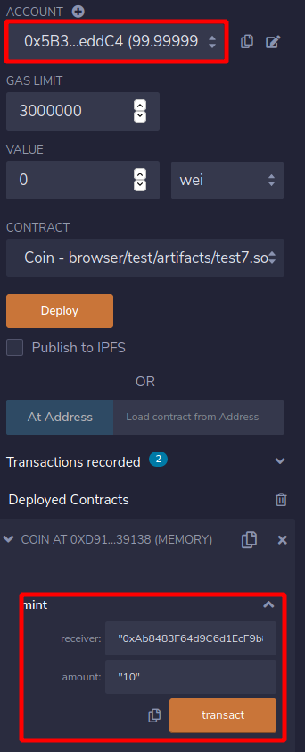
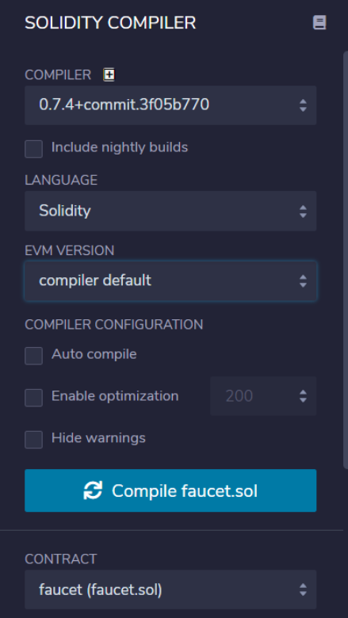
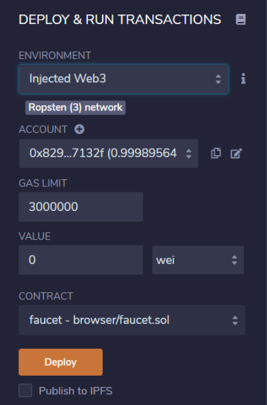
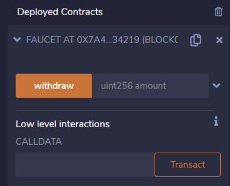
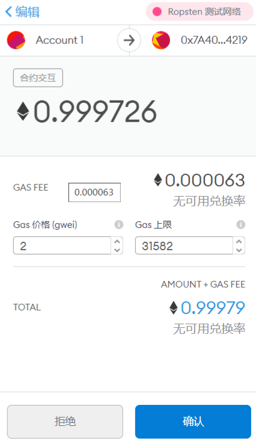
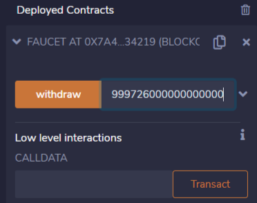
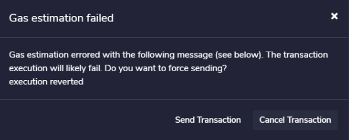
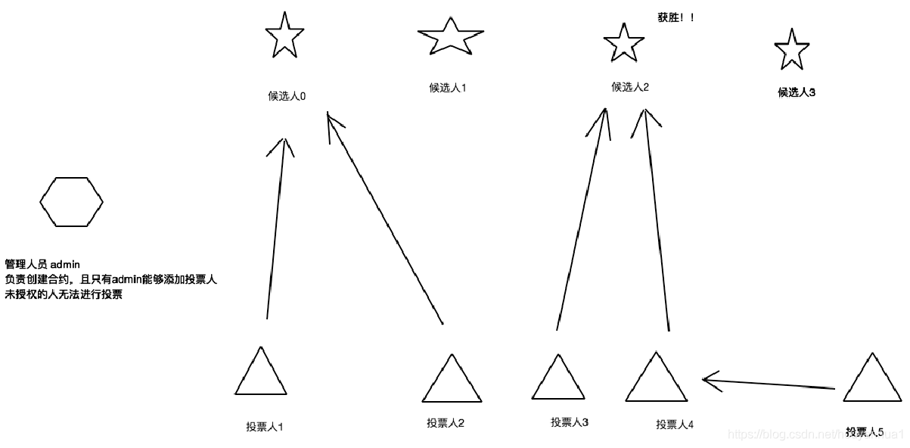

<font color='red'> 注：本教程为技术教程，不谈论且不涉及炒作任何数字货币 </font>

# 合约编写实战实例

## 一、简单代币合约

```javascript
pragma solidity > 0.4.22;

contract Coin{
    //这里我们定义了一个address 作为key, uint做为value的hashTable balances; 我们还定义了一个address的变量minter;
    address public minter;
    mapping(address=>uint) balances;
    event Sent(address from, address to, uint amount);
    constructor(){
        //代表创建这个合约的账户地址，被赋值给变量minter.
        minter = msg.sender;
    }

    //添加一个挖矿合约 
    function mint(address receiver, uint amount) public{
        require(msg.sender == minter);
        balances[receiver] += amount;
        
    }
    function send(address receiver, uint amount) public{
        require(balances[msg.sender] >= amount);
        balances[msg.sender] -= amount;
        balances[receiver] += amount;
        emit Sent(msg.sender,receiver,amount);
    }
    
}
```

解析：
上面实现一个简单的加密货币，币在这里可以无中生有，但只有创建合约的人才能做到，且任何人都可以给他人转币，无需注册名和密码。

`address`类型是一个160位的值，不允许任何算数操作，这种类型适合存储合约地址或外部人员。

`mappings`可看作是一个哈希表，它会执行虚拟初始化，以使得所有可能存在的键都映射到一个字节表示为全零的值。

`event Sent(address from, address to, uint amount)`;声明了一个所谓的事件，它在send函数最后一行被发出。用户界面可以监听区块链上正在发送的事件，且不会花费太多成本，一旦它被发出，监听该事件的listener都将收到通知，而所有的事件都包含了`from`,`t`o和`amoun`t三个参数，可方便追踪事务。

`msg.sender`始终是当前函数或者外部函数调用的来源地址。

最后真正被用户和其他合约所调用的，用于完成本合约功能的方法是`mint`和`send`。若`mint`被合约创建者外的其他调用则说明都不会发生。

`send`函数可被任何人用于向其他人发送代币，前提是发送者拥有这些代币，若使用合约发送代币给一个地址，当在区块链浏览器上查到该地址时时看不到任何相关信息的，因为，实际上发送币和更改余额的信息仅仅存在特定合约的数据存储器中。通过使用事件，可非常简单地为新币创建一个区块链浏览器来追踪交易和余额。

<center>
    
    <br>
    <div style="color:orange; border-bottom: 1px solid #d9d9d9;
    display: inline-block;
    color: #999;
    padding: 2px;"></div>
</center>


## 二、水龙头合约 

在前面我们通过 Ropsten 测试网络的水龙头（Faucet）获取了一些以太币，并提到可以向水龙头账户发送以太币来捐赠以太币。实际上，水龙头账户是一个合约账户，水龙头就是一份合约，而整个网站就是合约+前端组成的DApp。下面我们通过 Remix 来编写一个简单的水龙头合约，借此了解如何创建、部署合约以及一些 Solidity 的基本语法。

首先打开 Remix，并新建一个名为 faucet.sol 的文件，该文件就是 Solidity 的源文件

<center>
    
    <br>
    <div style="color:orange; border-bottom: 1px solid #d9d9d9;
    display: inline-block;
    color: #999;
    padding: 2px;"></div>
</center>

打开 faucet.sol，并写入如下代码

```javascript
pragma solidity ^0.7.0;

contract faucet {
    function withdraw (uint amount) public {
        require (amount <= 1e18);
        msg.sender.transfer (amount);
    }
    
    receive () external payable {}
}
```

通过这几行代码我们就实现了一个非常简单的水龙头合约。首行代码 `pragma solidity ^0.7.0 `是一个**杂注**，指定了我们的源文件使用的编译器版本不能低于 0.7.0，也不能高于 0.8.0。

`contract faucet{...}` 声明了一个合约对象，合约对象类似面向对象语言中的类，对象名必须跟文件名相同。

接下来通过  `function withdraw (uint amount) public {...}` 创建了一个名为  withdraw 的函数，该函数接收一个无符号整数（uint）作为参数，并且被声明为 public 函数，意为可以被其他合约调用。

withdraw 函数体中的 `require` 是 Solidity 的内置函数，用来检测括号中的条件是否满足。条件满足则继续执行合约，条件不满足则合约停止执行，回撤所有执行过的操作，并抛出异常。在这里我们通过 `require (amount <= 1e18)` 来检测输入的以太币值是否小于等于1个以太。

接下来的这一行 `msg.sender.transfer (amount)` 就是实际的提款操作了。`msg` 是 Solidity 中内置的对象，所有合约都可以访问，它代表触发此合约的交易。也就是说当我们调用 `withdraw` 函数的时候实际上触发了一笔交易，并用 `msg` 来表示它。`sender` 是交易 `msg` 的属性，表示了交易的发件人地址。函数 `transfer` 是一个内置函数，它接收一个参数作为以太币的数量，并将该数量的以太币从合约账户发送到调用合约的用户的地址中。

最后一行是一个特殊的函数 `receive` ，这是所谓的 `fallback` 或 `default` 函数。当合约中的其他函数无法处理发送到合约中的交易信息时，就会执行该函数。在这里，我们将该函数声明为 `external` 和 `payable` ，`external` 意味着该函数可以接收来自外部账户的调用，`payable` 意味着该函数可以接收来自外部账户发送的以太币。

这样，当我们调用合约中的 `withdraw` 并提供一个参数时，我们可以从这份合约中提出以太币；当我们向合约发送以太币时，就会调用 `receive` 函数往合约中捐赠以太币。

代码编写完毕后，在 Remix 左侧的功能栏中选择第二项，并点击 *Compile faucet.sol* 来编译我们的 sol 文件。

<center>
    
    <br>
    <div style="color:orange; border-bottom: 1px solid #d9d9d9;
    display: inline-block;
    color: #999;
    padding: 2px;"></div>
</center>


编译完成后会出现一个 Warning，提示我们添加 SPDX license，可以忽略。

随后选择 Remix 左侧工具栏的第三项，进入合约部署界面

<center>
    
    <br>
    <div style="color:orange; border-bottom: 1px solid #d9d9d9;
    display: inline-block;
    color: #999;
    padding: 2px;"></div>
</center>


首先将 ENVIRONMENT 选择为 Injected Web3，这样才能通过 MetaMask 钱包来发送交易。

随后点击 Deploy 部署合约，MetaMask 会弹出部署合约的交易界面

<center>
    
    <br>
    <div style="color:orange; border-bottom: 1px solid #d9d9d9;
    display: inline-block;
    color: #999;
    padding: 2px;"></div>
</center>


因为该笔交易是合约创建交易，因此我们支付的以太币为0，但仍需支付一定的 Gas 费用，可以自己设定 Gas 的价格。

合约部署成功后会收到 Chrome 的消息提示，并在 Remix 的 Deployed Contracts 中也会有显示

<center>
    
    <br>
    <div style="color:orange; border-bottom: 1px solid #d9d9d9;
    display: inline-block;
    color: #999;
    padding: 2px;"></div>
</center>


这样我们就完成了这个水龙头合约的部署。

#### 水龙头测试 ####

我们刚刚创建的水龙头中还没有以太坊，因此我们可以通过 MetaMask 向水龙头合约的地址中发送一些以太坊。水龙头合约的地址会显示在 Remix 中的，见上图 FAUCET AT 0X7A4...34219，可以直接复制。

<center>
    
    <br>
    <div style="color:orange; border-bottom: 1px solid #d9d9d9;
    display: inline-block;
    color: #999;
    padding: 2px;"></div>
</center>


交易被确认后，我们的水龙头中就有了0.999726个以太币，现在我们可以通过 Remix 中合约一栏的 withdraw 按钮来提取以太币了。需要注意，这里输入的以太币个数是以 wei 为单位的。

<center>
    
    <br>
    <div style="color:orange; border-bottom: 1px solid #d9d9d9;
    display: inline-block;
    color: #999;
    padding: 2px;"></div>
</center>


点击 withdraw 后，会弹出警告框

<center>
    
    <br>
    <div style="color:orange; border-bottom: 1px solid #d9d9d9;
    display: inline-block;
    color: #999;
    padding: 2px;"></div>
</center>


这是因为目前我们还没有设置这笔交易的 Gas，不用担心，点击 Send Transaction 后，在弹出的 MetaMask 中设置即可。

交易被确认后，我们得到了刚刚提取的0.999726个以太币

<center>
    
    <br>
    <div style="color:orange; border-bottom: 1px solid #d9d9d9;
    display: inline-block;
    color: #999;
    padding: 2px;"></div>
</center>


若大家没有执行成功可以重新做一次、查找其他资料或者[观看此视频](https://www.bilibili.com/video/BV1sJ411D72u?p=465)

## 三、投票合约的实现



本次教程将以一个较复杂的投票合约作为结束，我们希望实现的功能是为每个（投票）建议建立一份合约,然后作为合约的创造者-主席，主席将赋予每个成员(地址)投票权，而成员的投票权可以选择委托给其他人也可以自己投票，结束时将返回投票最多的提案。听起来很简单一个功能实现起来却较为复杂，下面我们拆分开进行讲解

注：

1. 代码可直接在Remix编辑器的已有solidity文件中找到,在contract/_Ballot.sol文件里
2. 若学习者前面部分掌握较牢固，不妨尝试直接自行阅读代码，无需阅读本节内容


首先我们定义成员类型，我们为每个投票者定义权重、是否已投票、

```javascript
struct Voter {
    uint weight; // weight is accumulated by delegation
    bool voted;  // if true, that person already voted
    address delegate; // person delegated to
    uint vote;   // index of the voted proposal
}
```

然后我们定义提案类型，包含提案名和投票总数：

```javascript
struct Proposal {
    bytes32 name;   // short name (up to 32 bytes)
    uint voteCount; // number of accumulated votes
}
```

定义三个变量，主席是一个公开的地址，建立投票者与地址的映射，然后定义提案动态数组：

```javascript
address public chairperson;
mapping(address => Voter) public voters;
Proposal[] public proposals;
```

- `address public chairperson`：投票发起人，类型为 address。
- `mapping(address => Voter) public voters`：所有投票人，类型为 `address` 到 `Voter` 的映射。
- `Proposal[] public proposals`：所有提案，类型为动态大小的 `Proposal` 数组。

3 个状态变量都使用了 `public` 关键字，使得变量可以被外部访问（即通过消息调用）。事实上，编译器会自动为 `public `的变量创建同名的 `getter` 函数，供外部直接读取。

我们还需要为每个投票赋予初始权值，并将主席的权重设置为1。我们一般使用`constructor`赋初值，这与C++等语言类似：

```javascript
constructor(bytes32[] memory proposalNames) {
    chairperson = msg.sender;
    voters[chairperson].weight = 1;

    for (uint i = 0; i < proposalNames.length; i++) {
        proposals.push(Proposal({
            name: proposalNames[i],
            voteCount: 0
        }));
    }
}
```

所有提案的名称通过参数 `bytes32[] proposalNames` 传入，逐个记录到状态变量 `proposals` 中。同时用 `msg.sender` 获取当前调用消息的发送者的地址，记录为投票发起人 `chairperson`，该发起人投票权重设为 1。

接下来我们需要给每个投票者赋予权重：

```javascript
function giveRightToVote(address voter) public {
    require(
        msg.sender == chairperson,
        "Only chairperson can give right to vote."
    );
    require(
        !voters[voter].voted,
        "The voter already voted."
    );
    require(voters[voter].weight == 0);
    voters[voter].weight = 1;
}
```

该函数给 `address voter` 赋予投票权，即将 `voter` 的投票权重设为 1，存入 `voters` 状态变量。

上面这个函数只有投票发起人 `chairperson` 可以调用。这里用到了 `require((msg.sender == chairperson) && !voters[voter].voted)` 函数。如果` require` 中表达式结果为 `false`，这次调用会中止，且回滚所有状态和以太币余额的改变到调用前。但已消耗的 `Gas` 不会返还。

下面一段是整段代码的重点，其作用是委托其他人代理投票，基本思路是：

1. 使用`require`判断委托人是否已投票（若投过票再委托则重复投票），并判断被委托对象是否是自己
2. 当判断被委托人不是0地址（主席）时，被委托人代理委托人的票，【绕口警告】由于被委托人也可能委托了别人，因此这里需要一直循环直到找到最后没有委托别人的被委托人为止！
3. 委托人找到对应的被委托人，委托人已投票（避免重复投票）
4. 判断被委托人是否已投票，若投了票则将被委托人投的提案票数加上委托人的权重，若未投票则令被委托人的权重加上委托人的权重（以后投票自然相当于投两票）

注：该函数使用了 `while` 循环，这里合约编写者需要十分谨慎，防止调用者消耗过多 `Gas`，甚至出现死循环。

```javascript
function delegate(address to) public {
    Voter storage sender = voters[msg.sender];
    require(!sender.voted, "You already voted.");
    require(to != msg.sender, "Self-delegation is disallowed.");

    while (voters[to].delegate != address(0)) {
    	to = voters[to].delegate;
    	require(to != msg.sender, "Found loop in delegation.");
    }
    sender.voted = true;
    sender.delegate = to;
    Voter storage delegate_ = voters[to];
    if (delegate_.voted) {
    	proposals[delegate_.vote].voteCount += sender.weight;
    } else {
    	delegate_.weight += sender.weight;
    }
}
```

投票部分仅是几个简单的条件判断：

```javascript
function vote(uint proposal) public {
        Voter storage sender = voters[msg.sender];
        require(sender.weight != 0, "Has no right to vote");
        require(!sender.voted, "Already voted.");
        sender.voted = true;
        sender.vote = proposal;
        proposals[proposal].voteCount += sender.weight;
    }
```

用 `voters[msg.sender]` 获取投票人，即此次调用的发起人。接下来检查是否是重复投票，如果不是，进行投票后相关状态变量的更新。

接下来是计算获胜提案:

```javascript
function winningProposal() public view
        returns (uint winningProposal_)
{
    uint winningVoteCount = 0;
    for (uint p = 0; p < proposals.length; p++) {
        if (proposals[p].voteCount > winningVoteCount) {
            winningVoteCount = proposals[p].voteCount;
            winningProposal_ = p;
        }
    }
}
```

`returns (uint winningProposal)` 指定了函数的返回值类型，`constant` 表示该函数不会改变合约状态变量的值。

最后是查询获胜者名称：

```javascript
function winnerName() public view
        returns (bytes32 winnerName_)
{
    winnerName_ = proposals[winningProposal()].name;
}
```

这里采用内部调用 `winningProposal()` 函数的方式获得获胜提案。如果需要采用外部调用，则需要写为 `this.winningProposal()`。


**参考自：**

[尚硅谷区块链全套Go语言→GoWeb→以太坊→项目实战](https://www.bilibili.com/video/BV1sJ411D72u)
[web3.js 1.0中文手册](http://cw.hubwiz.com/card/c/web3.js-1.0/)

