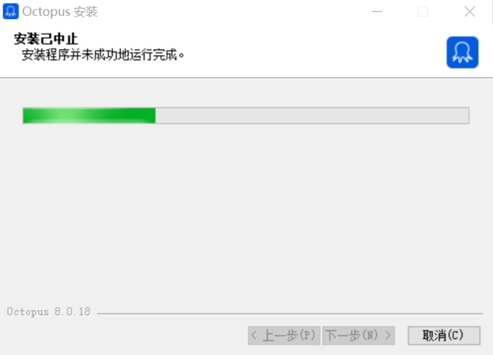
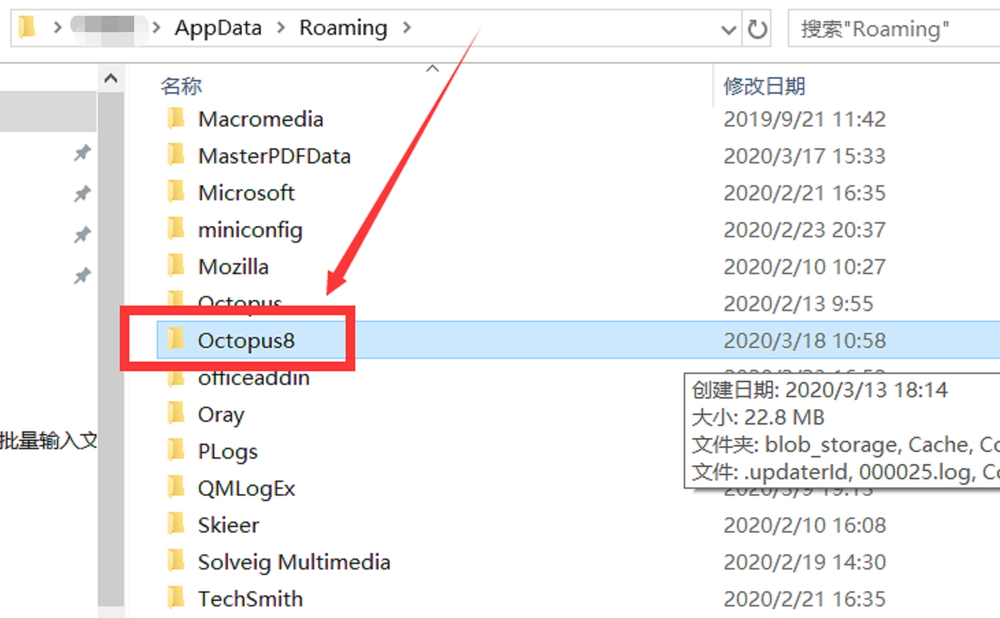
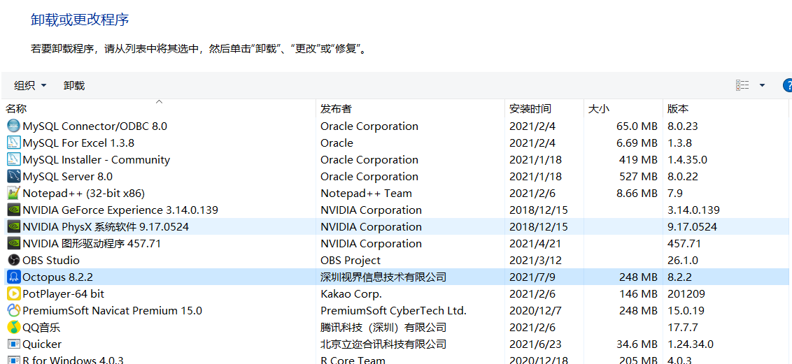

# 0.前言

本文中带*的部分为选学部分，对学有余力的同学进行相关法律风险的讲解
- [0.前言](#0前言)
  - [0.1课程背景](#01课程背景)
  - [0.2八爪鱼数据采集器简介](#02八爪鱼数据采集器简介)
  - [0.3软件安装](#03软件安装)
  - [0.4爬虫的"盗亦有道"*](#04爬虫的盗亦有道)

## 0.1课程背景

随着数字化转型的推动与发展，数据的分析与挖掘在各行各业都变得尤为重要，而包括机器学习工作的进行都离不开相应的数据，因此数据的获取就显得尤为重要。在进行相关的项目时，我们可能需要从互联网上获取相关的数据，人工获取数据工作量大，工作流程复杂，不利于大批量的数据获取。爬虫为数据获取提供了一个较好的解决方案，通过解析网页的信息从而进行数据的获取。

Datawhale组队学习也提供了爬虫的相关课程：

https://github.com/datawhalechina/team-learning-program/tree/master/WebSpider

https://github.com/datawhalechina/team-learning-program/tree/master/OfficeAutomation

对于python而言，虽然有封装的比较好的爬虫库，但是对于小批量数据的获取仍然有较高的门槛，能不能有一种更简单的方法让大家获取数据，最好能够不写代码或者快速迭代。对于市场而言，有需求就有市场，于是市面上真的有一款这样的软件，不用写代码就能够获得互联网上的相关数据。

## 0.2八爪鱼数据采集器简介

八爪鱼数据采集器在客户端中内置了浏览器，通过类似于selenium这样的浏览器驱动来控制浏览器，从而达到数据采集的目的，和python+selenium采集数据的原理比较类似。

八爪鱼数据采集的优势：

- 可视化操作流程，上手门槛低，学习曲线平滑
- 通过驱动浏览器进行数据采集，能适应绝大多数网页的数据采集
- 页面识别相对智能，大幅度减少数据采集开发时间

八爪鱼数据采集的劣势：

- 页面定制化操作（如：验证码识别）相对困难
- 不适合大批量数据采集，当采集数据量超过1万及以上需要增值服务
- 采集速度慢，不适合高并发数据采集

因此针对八爪鱼的特点，本课程适合不会爬虫代码、小批量数据采集的同学进行学习与数据采集训练。

## 0.3软件安装

八爪鱼官网：https://www.bazhuayu.com/

Windows操作系统下载链接：https://www.bazhuayu.com/download/windows

Mac操作系统下载链接：https://www.bazhuayu.com/download/mac

以Windows操作系统安装为例：

选择目标文件夹，点击安装即可完成软件的安装

Q&A

1.**八爪鱼安装的系统要求**：

Win7/Win8/Win8.1/Win10（x64位）选择八爪鱼8版本安装，即上文所提到的链接

XP系统和32位系统，选择八爪鱼7版本安装，安装链接：https://www.bazhuayu.com/blog/7azsm

2.**安装过程中提示【安装已终止，安装程序并未成功地运行完成】**

出现原因：之前安装过老版本，没有卸载干净，有残留

解决方法① ：删除八爪鱼8缓存文件夹。找到\AppData\Roaming\Octopus8 文件夹，将Octopus8 文件夹删除。

解决方法②：打开【控制面板】-【程序】，将之前安装过的版本卸载干净。

点击控制面板-->点击卸载程序-->找到Octopus-->右键点击卸载

## 0.4爬虫的"盗亦有道"*

做网络爬虫的同时我们也要注意到爬虫的法律风险，当然正常的爬虫使用是不会造成相应的法律风险，不过我们仍然要了解相应的法律风险。

**1、如果爬虫程序干扰了被访问的网站或系统正常运营**

在法律责任方面，如果爬虫程序干扰了被访问的网站或系统正常运营，根据《刑法》第二百八十六条的规定，**违反国家规定，对计算机信息系统功能进行删除、修改、增加、干扰，造成计算机信息系统不能正常运行，将构成“破坏计算机信息系统罪”。**

而近日出台的《数据安全管理办法》（征求意见稿）中，则专门针对数据爬取的条款进行了首次规定。根据《管理办法》，网络运营者采取自动化手段访问收集网站数据，不得妨碍网站正常运行；此类行为严重影响网站运行，如自动化访问收集流量超过网站**日均流量三分之一**，网站要求停止自动化访问收集时，应当停止。

**2、** **如果爬虫程序规避网站经营者设置的反爬虫措施或者破解服务器防抓取措施**

在法律责任方面，如果爬虫程序规避网站经营者设置的反爬虫措施或者破解服务器防抓取措施，非法获取相关信息，根据《刑法》二百八十五条的规定， **违反国家规定，侵入除国家事务、国防建设、尖端科学技术领域以外的计算机信息系统或者采用其他技术手段，获取该计算机信息系统中存储、处理或者传输的数据，或者对该计算机信息系统实施非法控制，将构成非法侵入计算机信息系统罪。**

**3、** **如果爬虫程序采集的内容涉及商业机密或公民个人信息**

根据《刑法》第二百八十七条的规定， **利用计算机实施金融诈骗、盗窃、贪污、挪用公款、窃取国家秘密或者其他犯罪的，依照本法有关规定定罪处罚。**

如果爬虫程序采集了商业机密或公民个人信息（包括但不限于公民的姓名、身份证件号码、通信通讯联系方式、住址、账号密码、财产状况、行踪轨迹等），情节严重的，则可能分别构成“侵犯商业秘密罪”和“侵犯公民个人信息罪”

对于爬虫的使用者而言，我们应该要注意爬虫的使用规范

- 要明确自己制作的爬虫程序是否涉及抓取对象的个人信息，如社交信息、财产信息、联系信息等；
- 要明确自己爬取的数据是否涉及国防安全、商业机密以及其它相关敏感信息
- 要明确自己的爬虫程序是否会对对方服务器的的正常运营产生相应的影响

参考链接：

https://www.bazhuayu.com/tutorial8/81azwthz

https://zhuanlan.zhihu.com/p/88872696

**Task0  END.**

--- By: 牧小熊

> 华中农业大学研究生，Datawhale成员, Datawhale优秀原创作者
>
> 知乎：https://www.zhihu.com/people/muxiaoxiong

关于Datawhale： Datawhale是一个专注于数据科学与AI领域的开源组织，汇集了众多领域院校和知名企业的优秀学习者，聚合了一群有开源精神和探索精神的团队成员。Datawhale 以“for the learner，和学习者一起成长”为愿景，鼓励真实地展现自我、开放包容、互信互助、敢于试错和勇于担当。同时 Datawhale 用开源的理念去探索开源内容、开源学习和开源方案，赋能人才培养，助力人才成长，建立起人与人，人与知识，人与企业和人与未来的联结，详情可关注Datawhale：

