# 1.初识八爪鱼

- [1.初识八爪鱼](#1初识八爪鱼)
  - [1.1界面初识](#11界面初识)
  - [1.2快速上手](#12快速上手)
  - [1.3数据导出限制](#13数据导出限制)
  - [1.4练习与思考](#14练习与思考)

## 1.1界面初识

安装好八爪鱼的软件后，我们能在桌面上看到八爪鱼的图标

点击图标后运行相关程序，进入程序后会进入到一个登陆页面

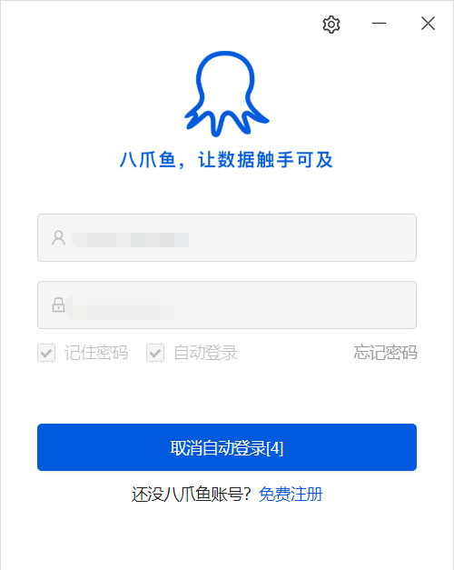

如果没有账号的话，可以按照程序的要求先注册一个，注册完成后登陆到八爪鱼的界面

当你看到这个界面的时候，表示前面的软件安装工作已经全部完成了

## 1.2快速上手

> 本项目以36kr快讯作为案例

八爪鱼程序启动有2个入口，一个是首页的网页地址入口，另一个是软件左上角的+新建

八爪鱼的软件是如何运行的呢？

作为某公众号的运营人员，你需要实时关注互联网方向的动态，于是你想去36kr网站爬取快讯，你去官网上找到了快讯的网站

36kr快讯：https://36kr.com/newsflashes

打开八爪鱼采集器，在主页的搜索框中输入36kr快讯的地址，点击开始采集

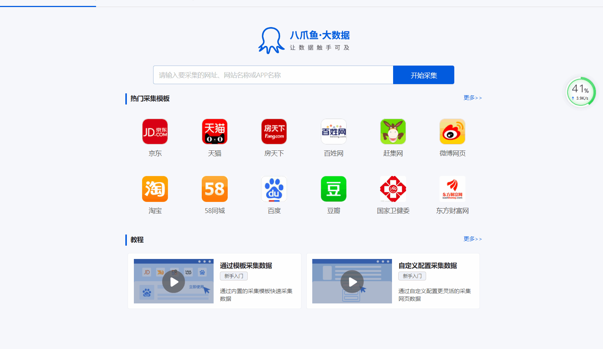

在屏幕右侧的操作提示中，点击自动识别网页，点击后会进入到识别网页的过程

等网页识别完成后我们就看到了八爪鱼自动识别的结果

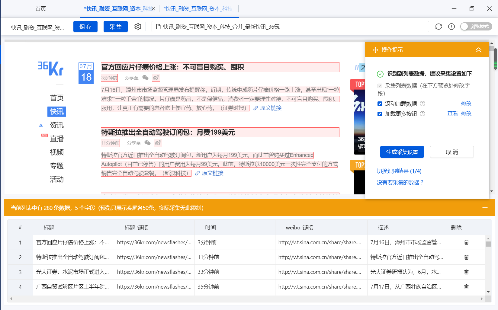

点击生成采集设置按钮

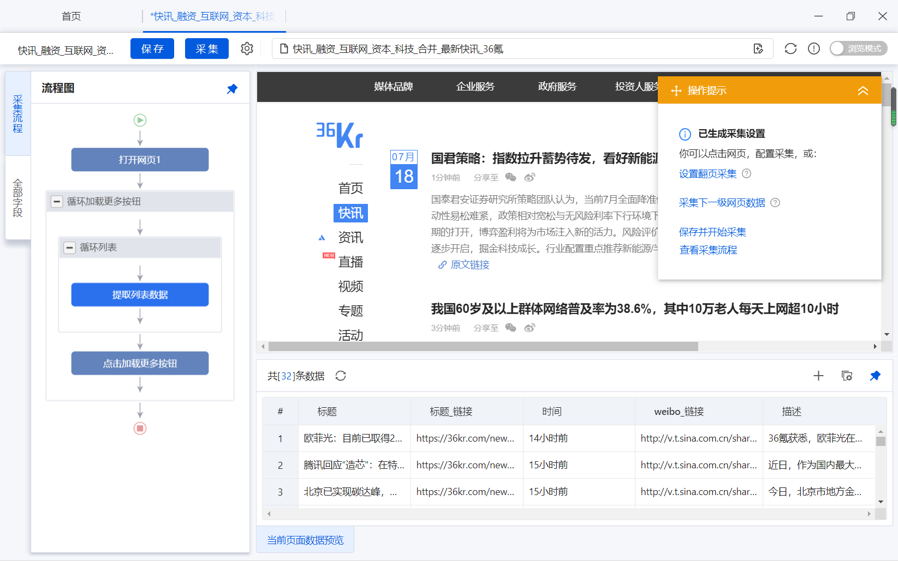

点击保存并开始采集

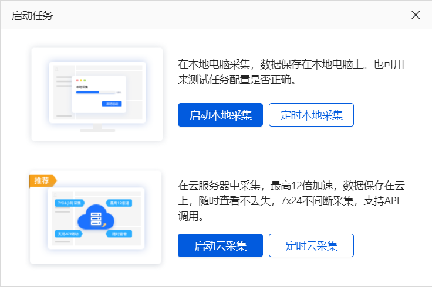

数据采集的方式有2种，一个是本地采集，也就是程序运行在你的电脑上，一个是云采集，也就是用八爪鱼的服务器进行采集，其中云采集为八爪鱼的增值服务，是属于收费项目，因此在本次课程中我们选择本地采集

点击后，我们的数据采集工作就开始了

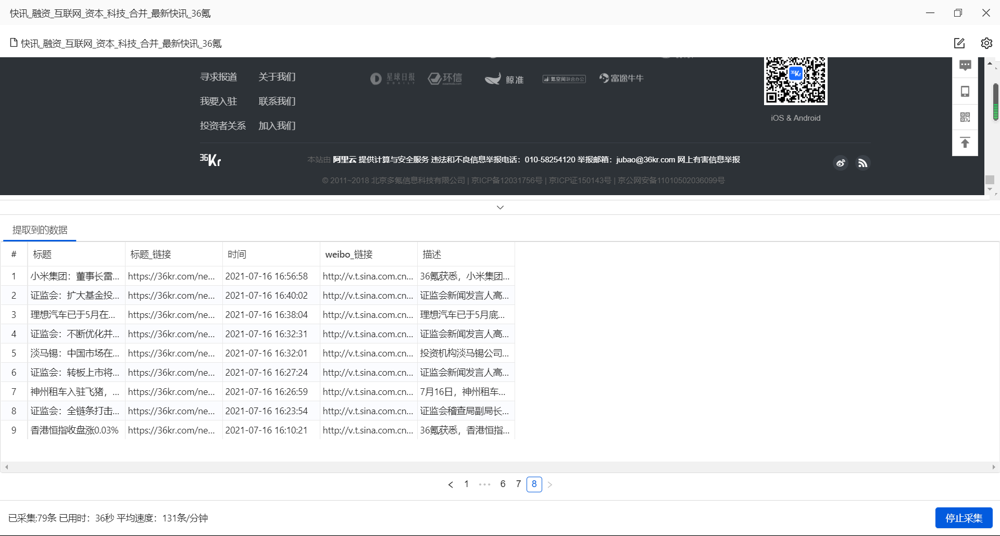

点击停止采集，就可以停止数据采集的工作

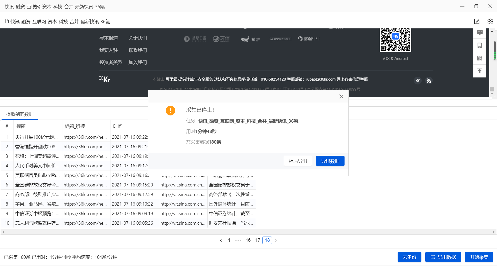

选择导出数据

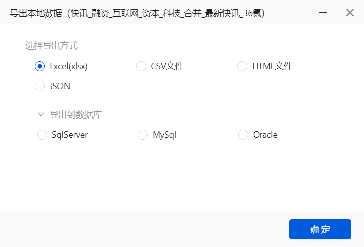

我们可以看到，八爪鱼的数据导出支持很多种形式，比如excel、csv、HTML以及json，甚至可以将数据导入到数据库种中，因此数据的存储形式相当的方便

我们选择导出到excel的形式

导出完成后有相应的提示

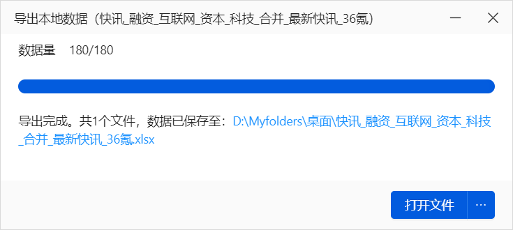

这个时候我们就看到了我们采集的相关数据

打开八爪鱼，在我的任务种就可以看到我们保存的相关任务

点击我的任务

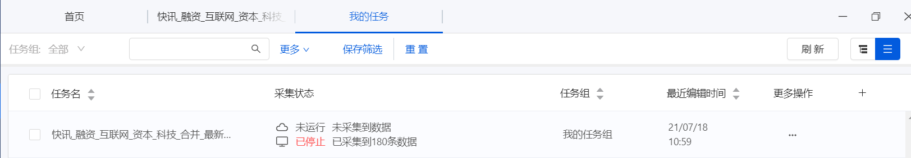

## 1.3数据导出限制

八爪鱼数据采集器对数据的导出有一定的限制，毕竟是个商用软件，增值服务收费也是能理解的，目前八爪鱼提供了几个版本的的选择

具体收费方案可以查看链接：https://www.bazhuayu.com/plan

免费版的数据导出上限是1万条，每次启动任务导出的最大数据量是1万，这个数据量对于小批量数据采集来说也是非常大了，如果我们采集的数据量超过了1万条，可以选择购买增值服务，或者将采集任务分多个批次完成，从这个角度来看八爪鱼对于日常使用体验还是极佳的。

八爪鱼也提供了教育公益版本，进行在校师生认证可以获得专业版12个月的免费使用权限，可以导出10万的数据量，这点还是很棒的。

公益板块链接：https://www.bazhuayu.com/edu

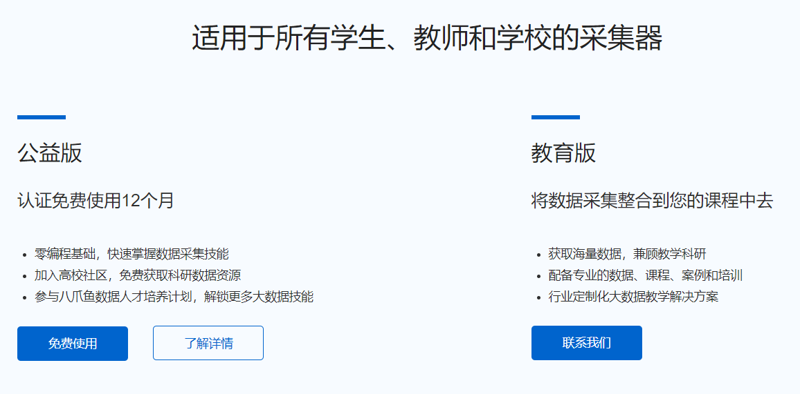

## 1.4练习与思考

前面的操作步骤你学会了吗？

如果还不是很清楚那就上手试一试吧，完成36kr快讯的数据采集，并将数据导出为excel形式

思考部分

1.体验了八爪鱼采集后，你觉得它能够用在学习和工作中的哪些方面？、

2.推测一下，你觉得八爪鱼的工作原理是什么？

3.和python爬虫相比，八爪鱼的优势和劣势是什么？

**Task1  END.**

--- By: 牧小熊

> 华中农业大学研究生，Datawhale成员, Datawhale优秀原创作者
>
> 知乎：https://www.zhihu.com/people/muxiaoxiong

关于Datawhale： Datawhale是一个专注于数据科学与AI领域的开源组织，汇集了众多领域院校和知名企业的优秀学习者，聚合了一群有开源精神和探索精神的团队成员。Datawhale 以“for the learner，和学习者一起成长”为愿景，鼓励真实地展现自我、开放包容、互信互助、敢于试错和勇于担当。同时 Datawhale 用开源的理念去探索开源内容、开源学习和开源方案，赋能人才培养，助力人才成长，建立起人与人，人与知识，人与企业和人与未来的联结，详情可关注Datawhale：

