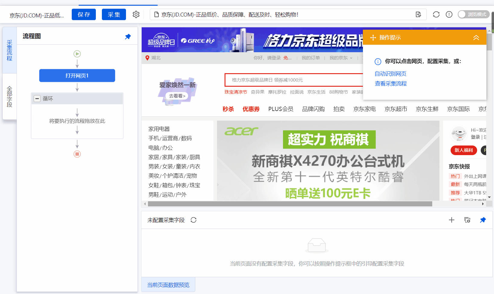
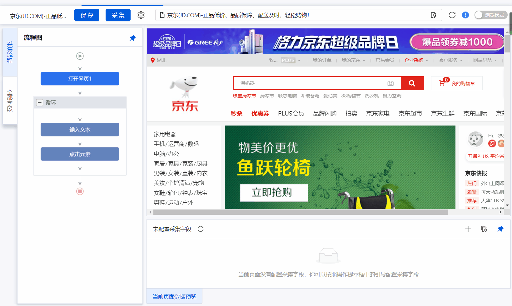
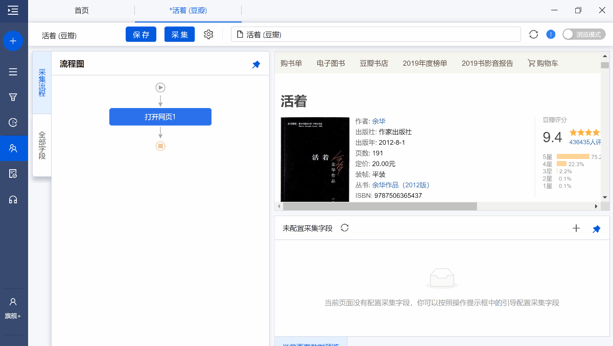
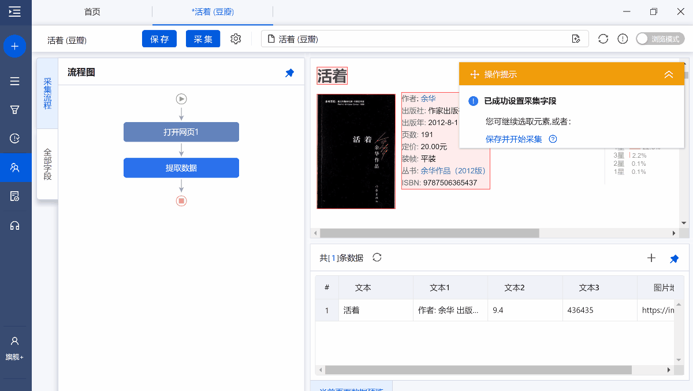
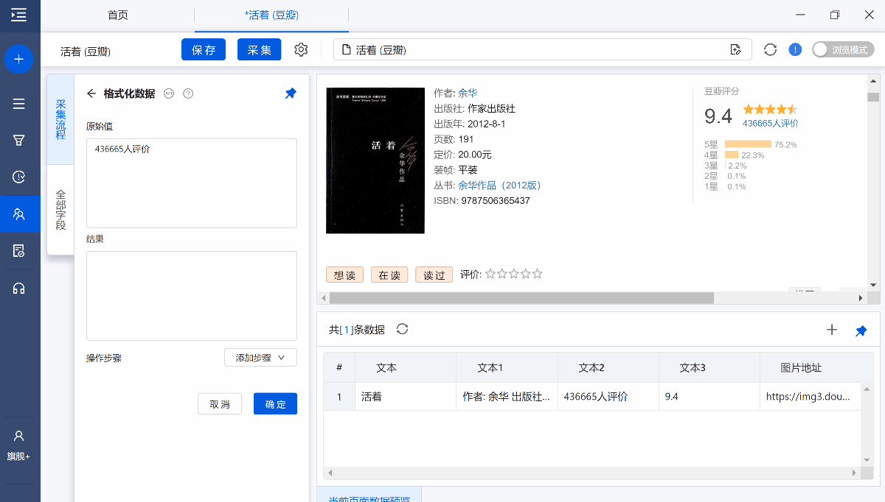
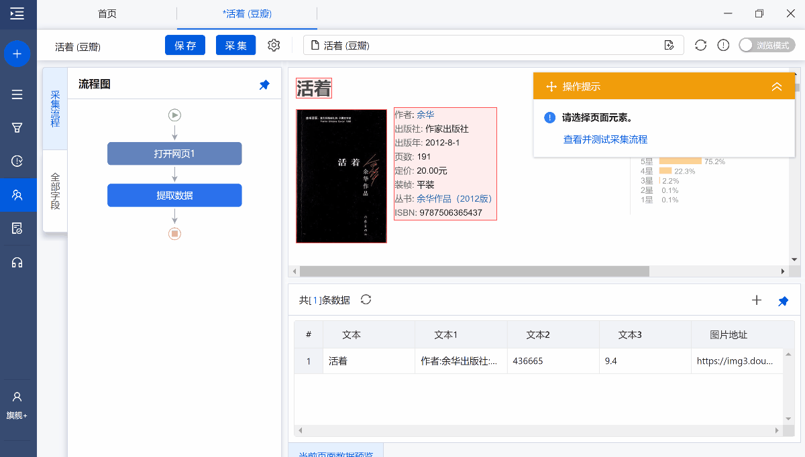
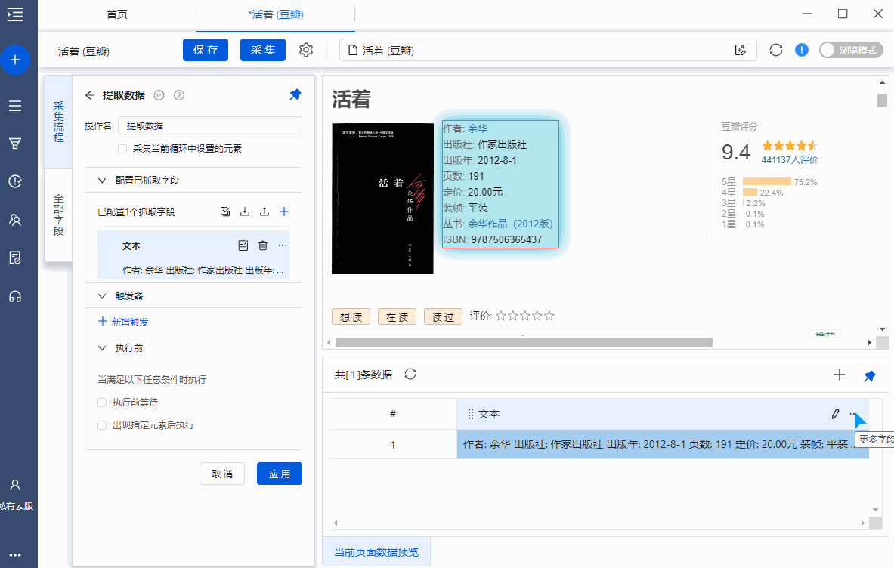
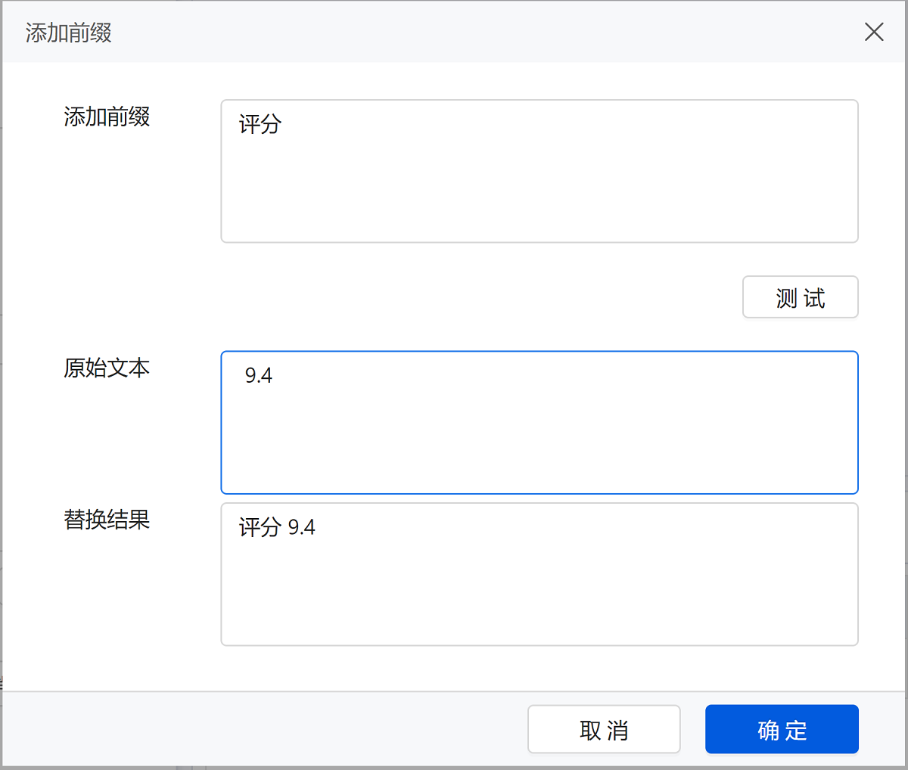
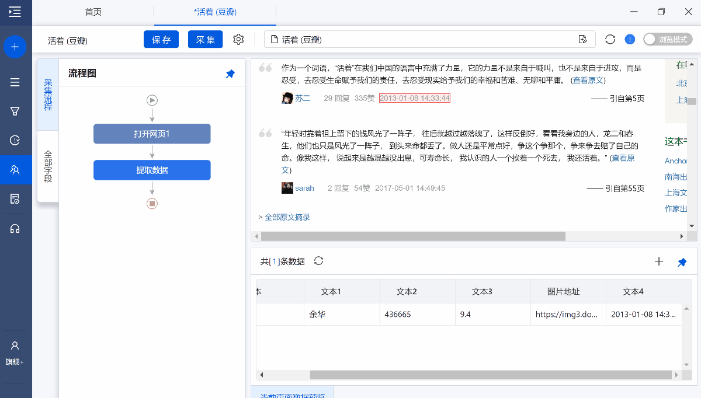

# 3.自定义数据采集

> 本节课程所涉及到的问题均为作者经过思考后将八爪鱼的操作知识点融合在实际问题中，在学习输出成笔记的过程中请附带参考课程链接，感谢你对原创工作的支持！

完成了前面的课程学习，我们已经成功的安装了八爪鱼软件以及体验了简单的数据采集过程，但是在实际的数据采集中我们还是会遇到一些采集难度比较大的数据，因此本节对八爪鱼的特殊数据采集进行介绍。其中带*为选学部分。

- [3.自定义数据采集](#3自定义数据采集)
  - [3.1京东关键词循环与特殊字段](#31京东关键词循环与特殊字段)
  - [3.2豆瓣数据格式化](#32豆瓣数据格式化)
  - [3.3正则表达式*](#33正则表达式)
  - [3.4练习与思考](#34练习与思考)

## 3.1京东关键词循环与特殊字段

你是某电商平台的运营，你需要对京东部分商品的数据进行竞品相关数据分析，分析的商品有多个，前面课程我们完成了对单个关键词数据的采集，但是对于多个关键词循环并未涉及到，那么如何完成多个关键词任务采集呢？

京东链接：https://www.jd.com

进入八爪鱼打开京东的链接，找到流程图在【打开网页的下方】点击+号，增加文本循环，将提取准备好的关键词输入到循环列表中。

设置完循环然后设置网页访问，进行数据采集

当然在设置的过程中我们也遇到了京东要求登陆的情况，按照第二节所学习的Cookie设置完成相应的页面登录设置。

到这里循环搜索关键词就设置成功了，接下来就是采集需要的数据或者使用自动识别网页对网页数据进行采集。

在这里有读者可能就有疑问了，对于商品的数据采集就这样完成了。但是当我们想要采集一些特殊数据，比如页面标题时，应该如何进行采集呢？

八爪鱼也能够很好的满足这一需求

## 3.2豆瓣数据格式化

在实际的采集过程中，采集到的数据可能不满足我们的需求，因此需要对数据进行格式化。本节内容以豆瓣图书为例，讲解如何使用八爪鱼进行数据采集。（本节内容来源于八爪鱼官方教程）

在第2节中我们采集了豆瓣图书的相关信息

采集中我们发现作者和出版社等信息都混到了一起，如果我们只想要其中的一部分怎么办？

字段提取完成以后，鼠标移动到目标字段上，然后点击 【...】按钮，选择【格式化数据】，就会进入【格式化数据】配置页面。

原始值：原始字段

结果：经过格式化步骤后，输出的字段结果

添加步骤：提供8个数据格式化选项：替换、正则表达式替换、正则表达式匹配、去除空格、添加前缀、添加后缀、日期时间格式化、Html。

以下将配合具体案例，详解这8个选项如何使用

**1.替换**

将字段中的部分或全部内容替换为其他内容，支持文字、数字、符号、空格、换行符的替换

例如：如果我们想将字段【436665人评价】中的文本【人评价】去掉，只留下数字【43665】。

具体步骤为：

**2、正则表达式替换**

用正则表达式将字段中的部分或全部内容找出来，然后将其替换为其他内容，支持文字、数字、符号、空格、换行符的替换。相比简单的【替换】，【正则表达式替换】更为强大灵活。

在提取书籍信息时，我们发现采集到的数据中有很多空格，我们想将空格去除掉

【正则表达式】：\s+（这条正则表达式的意思是，找到字段中所有的空格）

**3、正则表达式匹配**

用正则表达式将字段中的部分或全部内容提取出来

实例：在采集数据中，我们只需要作者这一行的信息

首先使用正则表达式替换，将空格全部替换为空

接着使用正则表达式匹配将作者的相关信息提取出来

**4、去除空格**

包括三种，分别是【去除开头空格】、【去除结尾空格】、【去除两头空格】

**5、添加前缀**

增加前缀，就是在采集的字段前增加相关信息，如下图所示

**6、添加后缀**

怎么理解增加前缀，就是在采集的字段后增加相关信息

**7、日期时间格式化**

选中时间字段，选择【日期时间格式化】，将日期转化成需要的格式或者仅提取日期时间中的某一部分。

**8、HTML转码**

html页面中会有html带有相关的特殊标记，需要将这些特殊的标记进行转换，比如gt;转化为>，nbsp;转化为空格等等，当然这种类型也能用替换来解决。

## 3.3正则表达式*

**1、正则表达式简介**

正则表达式是对字符串（包括普通字符（例如，a 到 z 之间的字母）和特殊字符（称为“元字符”））操作的一种逻辑公式，就是用事先定义好的一些特定字符、及这些特定字符的组合，组成一个【规则字符串】，这个【规则字符串】用来表达对字符串的一种过滤逻辑。正则表达式是一种文本模式，该模式描述在搜索文本时要匹配的一个或多个字符串。

**2、正则表达式的用途**

字符串匹配（字符匹配）

字符串查找

字符串替换

**3、常用元字符及描述**

\d 匹配一个数字字符。等价于[0-9]

\D 匹配一个非数字字符。等价于[^0-9]

\s 匹配任何空白字符，包括空格、制表符、换页符等等。等价于 [ \f\n\r\t\v]。

\S 匹配任何非空白字符。

\w 匹配构成单词的字符（字母、数字、下划线）。等价于[A-Za-z0-9_]

\W 匹配非构成单词的字符。等价于[^A-Za-z0-9_]

\p{Lower} 英文的小写字母

.  任意一个字符

X* 任意次数

X+ 一次或多次

X? 最多一次

X{n} 正好n次

X{n,} 最少n次，上不封顶

X{n,m} 最少n次，最多m次

[] 表示一个范围

[a-z]|[A-Z]  [a-zA-Z]  [a-z[A-Z]]  a到z 或A到Z

[A-Z&&[RFG]]  A到Z并且RFG  (交集的意思)

“” 正则 “a?” 零宽度匹配，出现零次

**边界匹配**

^开头和$结尾

^h.*  .*ir$  ^h[a-z]{1,3}\b

\b 一个单词的边界，空格、换行……

^[\s&&[^\n]]*\n$  空白行，开头是空白字符但不是换行符，出现0次或多次，且紧跟着是结束的换行符

 常用的正则表达式：https://www.cnblogs.com/hsinfo/p/13584432.html

当你对你写的正则表达式不确定时，可以使用正则表达在线测试，以确定正则表达式正确

正则表达式测试：https://c.runoob.com/front-end/854

## 3.4练习与思考

前面的操作步骤你学会了吗？

如果还不是很清楚那就上手试一试吧，完成京东与豆瓣图书的数据采集，并将数据导出为excel形式

思考部分

1.在数据采集过程中，数据格式化作用是什么？为什么要进行数据格式化？

2.除了在数据采集中，正则表达式能用在学习和生活中的哪些方面？

参考链接：

https://www.bazhuayu.com/tutorial8/81srgjc

https://www.bazhuayu.com/tutorial8/81gshsj

**Task3  END.**

--- By: 牧小熊

> 华中农业大学研究生，Datawhale成员, Datawhale优秀原创作者
>
> 知乎：https://www.zhihu.com/people/muxiaoxiong

关于Datawhale： Datawhale是一个专注于数据科学与AI领域的开源组织，汇集了众多领域院校和知名企业的优秀学习者，聚合了一群有开源精神和探索精神的团队成员。Datawhale 以“for the learner，和学习者一起成长”为愿景，鼓励真实地展现自我、开放包容、互信互助、敢于试错和勇于担当。同时 Datawhale 用开源的理念去探索开源内容、开源学习和开源方案，赋能人才培养，助力人才成长，建立起人与人，人与知识，人与企业和人与未来的联结，详情可关注Datawhale：

