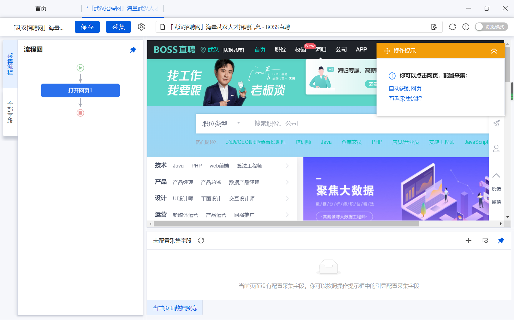
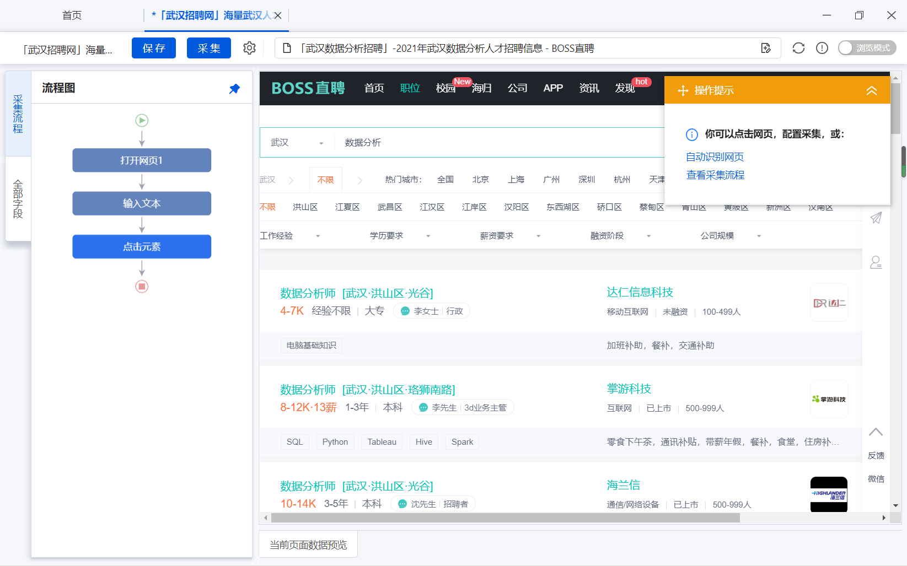
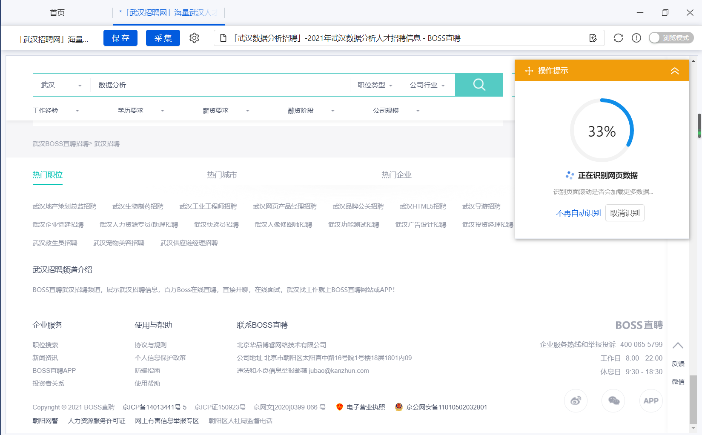
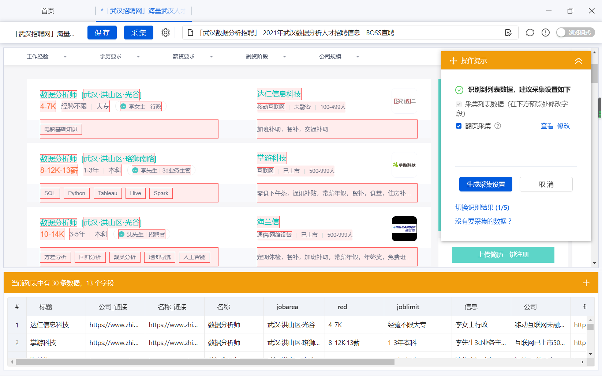
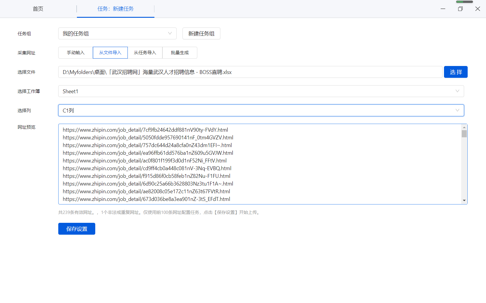
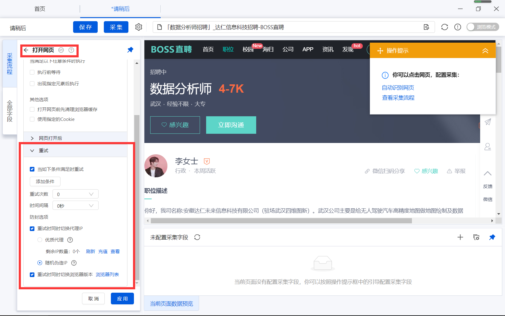

# 4.综合实践

> 本节课程所涉及到的问题均为Datawhale读者所遇到的实际问题，将八爪鱼的操作知识点与实际问题相结合，本节中的方案均为作者整理和思考后的原创方案，在学习输出成笔记的过程中请课程参考链接，感谢你对原创工作的支持！

学习完前面的课程后，已经初步掌握了使用八爪鱼进行数据采集的相关流程，是时候来检验一下学习成果了。

在设计本节课程内容的过程中作者经过漫长的思考与讨论，注意到爬虫技能是低频但是紧急的技能，有需要的时候能顺利完成数据采集即可

我们课程的优点是无代码数据采集，能进行日常的数据采集，提升学习者的自动化工作的能力，从而提升工作效率。

因此课程最后选择了2个容易上手的数据采集的项目，希望学习者能在项目中掌握基本的数据采集能力。

综合实践的项目不做详细的介绍，只提供相关的操作思路，学习者需要自己完成相关的实践过程，如果在学习过程中遇到了相关的问题可以在学习群中与助教进行讨论。

## 4.1综合实践背景

小张是某高校管理学研究生，在毕业课题中需要采集boss直聘武汉地区的相关数据，而小张同学因为是人文科学背景没有接触过爬虫，在网上搜索很多资料后，现在她找到你希望你帮她采集boss直聘网的相关数据，你应该怎么做呢？

boss直聘武汉地区网站：https://www.zhipin.com/wuhan/

## 4.2综合实践操作

首先打开八爪鱼到打开boss直聘武汉的相关页面

在职务关键词中输入【数据分析】关键词进行搜索

首先是对页面进行自动网页识别

这是自动识别完成后的界面，我们可以看到系统抓取的数据比较全面

如果需要获得更加详细的职位页面数据，相关数据采集完成后可以进入到单独的职位页面进行数据采集

采集完成后 将采集的职位的链接导入到八爪鱼后

对后续的职位信息进行相关采集

循环打开采集的网页，对职位的岗位需求进行采集

针对Boss直聘对ip进行验证的情况，可以对打开网页这一步骤中的重试部分进行设置，从而在一定程度上对反爬虫的绕过

## 4.3练习与思考

前面的操作步骤你学会了吗？

如果还不是很清楚那就上手试一试吧，完成boss直聘的数据采集，并将数据导出为excel形式

思考部分

1.在数据采集过程中，频繁访问网页会引发反爬虫机制，如何规避这样的问题？

2.对于boss直聘的数据采集中，你觉得哪些信息字段是比较重要的？

**Task4 END.**

--- By: 牧小熊

> 华中农业大学研究生，Datawhale成员, Datawhale优秀原创作者
>
> 知乎：https://www.zhihu.com/people/muxiaoxiong

关于Datawhale： Datawhale是一个专注于数据科学与AI领域的开源组织，汇集了众多领域院校和知名企业的优秀学习者，聚合了一群有开源精神和探索精神的团队成员。Datawhale 以“for the learner，和学习者一起成长”为愿景，鼓励真实地展现自我、开放包容、互信互助、敢于试错和勇于担当。同时 Datawhale 用开源的理念去探索开源内容、开源学习和开源方案，赋能人才培养，助力人才成长，建立起人与人，人与知识，人与企业和人与未来的联结，详情可关注Datawhale：

