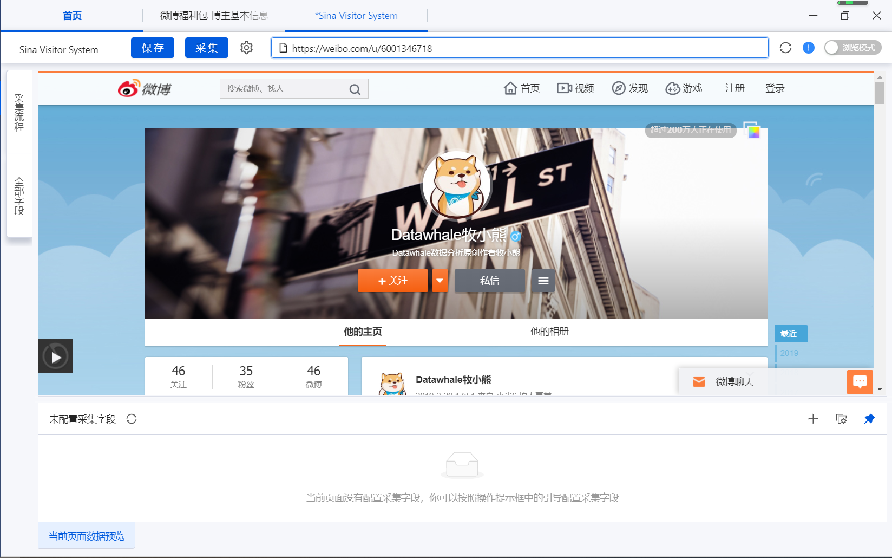
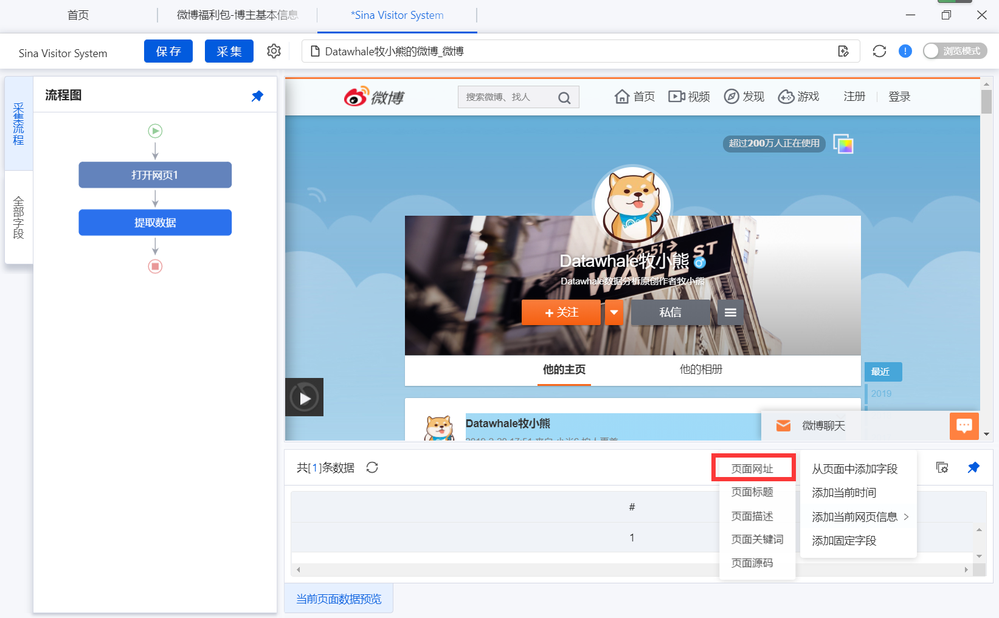
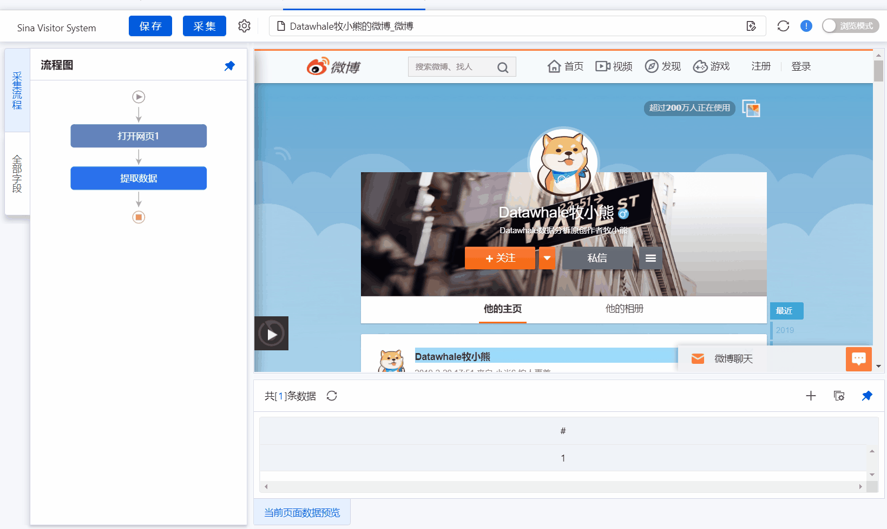
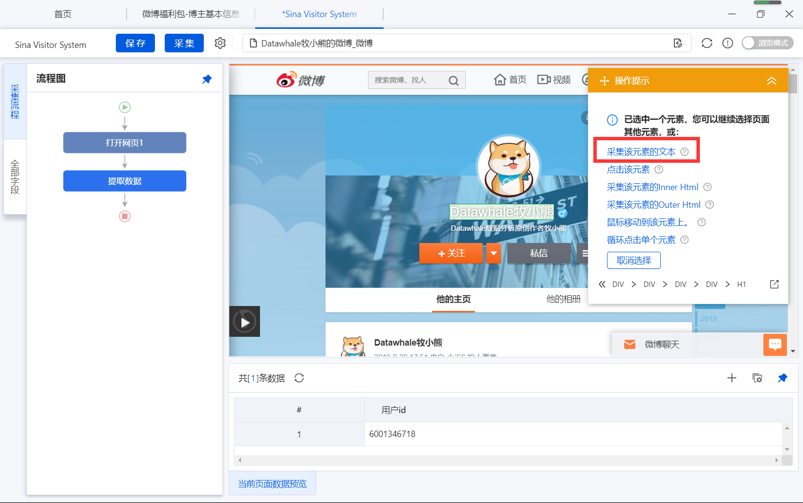
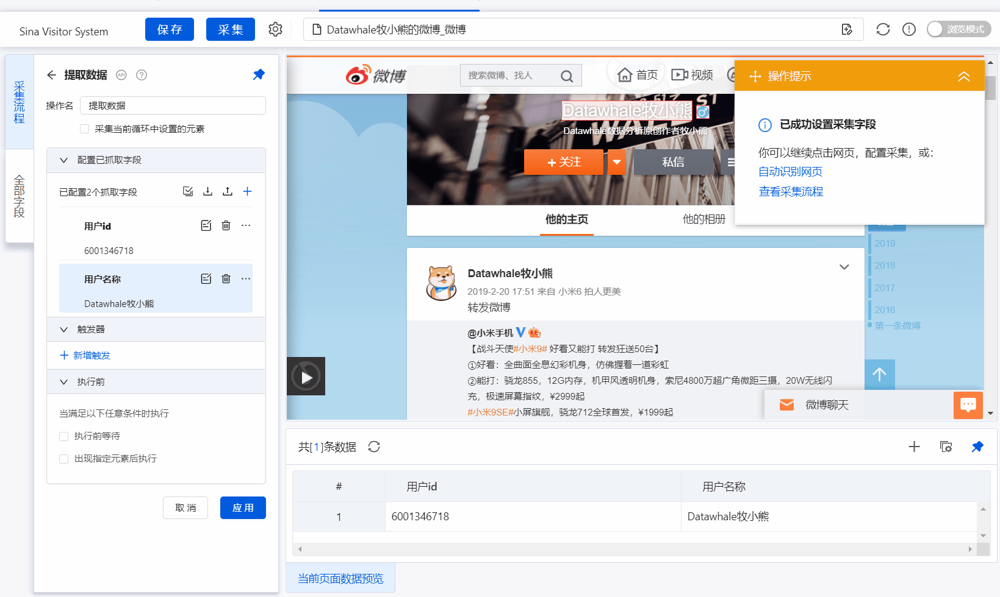
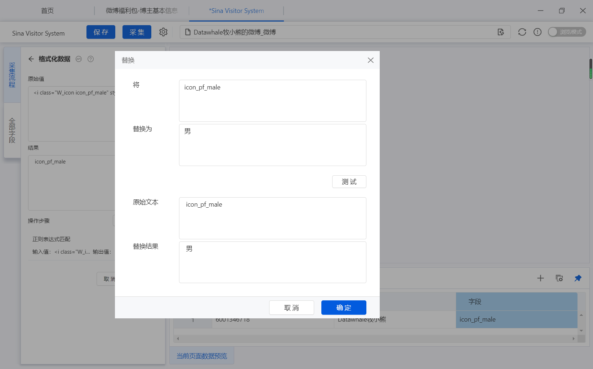
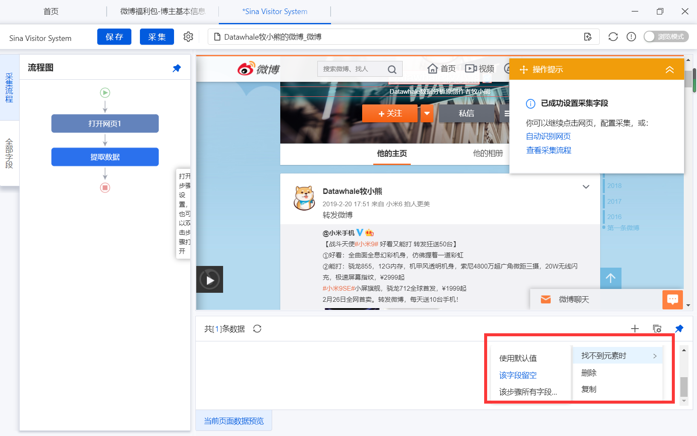
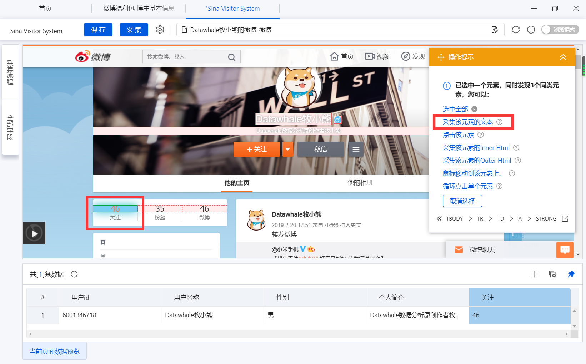
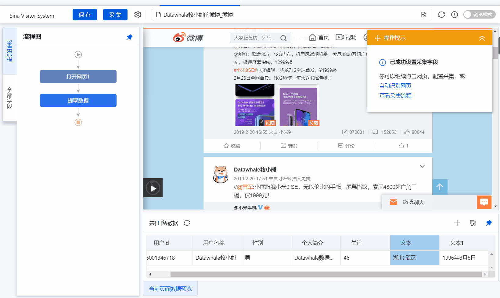

# 5.综合实践

> 本节课程所涉及到的问题均为Datawhale读者所遇到的实际问题，将八爪鱼的操作知识点与实际问题相结合，本节中的方案均为作者整理和思考后的原创方案，在学习输出成笔记的过程中请附带课程参考链接，感谢你对原创工作的支持！

在完成了上一节的boss直聘的数据抓取后，我们根据数据采集中所遇到的实际问题，增加了微博个人信息抓取的相关实践部分，该部分针对Xpath数据提取的情况进行了详细的介绍，以期学习者能够在日常的学习和工作中能够实地使用。

## 5.1综合实践背景

小李是某高校的大二的学生，在学校的课程项目中需要采集微博某个主题广场上相关用户的信息，在Datawhale的公众号上看到了相关文章[《我用“觉醒年代”做数据分析》](https://mp.weixin.qq.com/s/f_euOxrMKEh5Db2ixVhTjw)后想了解如何采集个人用户信息。

基于这个问题，本项目就详细的介绍如何使用八爪鱼进行微博个人信息的采集。

## 5.2综合实践

通过第二节内容的学习，我们已经掌握了如何就微博某一话题下的相关信息采集

首先导入我们需要采集的相关个人链接

这里以我自己的微博账号为例子：https://weibo.com/u/6001346718



### 5.2.1用户id

通过观察我们发现用户的id就是网址中的一串数字，以我的账号为例，我的用户id号是6001346718

那么如何把这个数据采集下来呢？

首先，我们采集当前的网页地址



那么如何提取用户的id数字呢？

我们想到了正则表达式匹配，需要匹配数字的正则表达式为【[0-9]+】因此你完成了如下操作



### 5.2.2用户名称

点击用户名称，八爪鱼会提示相关的操作，选择采集文本



### 5.2.3用户性别

用户性别采集相对比较困难，为什么呢？

因为用户性别是一个图标，因此我们需要读取这个图标是什么东西

因此我们采用了这样的操作



通过上述操作后 我们采集了图标的outer html 

采集后我们发现采集的信息如下

```
<i class="W_icon icon_pf_male" style=""></i>
```

通过观察我们发现

icon_pf_male代表男生，icon_pf_female代表女生

因此我们使用正则表达式匹配这个信息，使用的正则表达式为【(?<=class="W_icon)(.+?)(?=")】

这个正则表达式是什么意思呢？

(?<=class="W_icon) 表示以class="W_icon这个开头

(.+?)表示中间的所有字符串

(?=") 表示以"结尾

匹配完成后我们发现生成的结果是icon_pf_male

因此我们再增加替换，将icon_pf_male替换为男，将icon_pf_female替换为女



### 5.2.4用户个人简介

采集方式与用户名称相似，点击用户个人简历，选择采集该文本

不过需要注意的是，因为有的用户没有写个人简介，因此我们采集不到该元素时，我们可以留空



### 5.2.5用户关注、粉丝、微博数

采集方式与用户名称相似，点击用户个人简历，选择采集该文本



### 5.2.5用户地理位置、毕业学校、生日

采集方式与用户名称相似，点击用户个人简历，选择采集该文本

对于时间信息，八爪鱼也提供了相关的时间格式化方式



## 5.3练习与思考

前面的操作步骤你学会了吗？

如果还不是很清楚那就上手试一试吧，完成微博个人信息数据采集，并将数据导出为excel形式

思考部分

1.对于微博个人信息数据的采集，这部分数据是属于个人隐私数据吗？如果是，在使用中应该做怎样的操作？如果不是，请说明理由。

**Task5 END.**

--- By: 牧小熊

> 华中农业大学研究生，Datawhale成员, Datawhale优秀原创作者
>
> 知乎：https://www.zhihu.com/people/muxiaoxiong

关于Datawhale： Datawhale是一个专注于数据科学与AI领域的开源组织，汇集了众多领域院校和知名企业的优秀学习者，聚合了一群有开源精神和探索精神的团队成员。Datawhale 以“for the learner，和学习者一起成长”为愿景，鼓励真实地展现自我、开放包容、互信互助、敢于试错和勇于担当。同时 Datawhale 用开源的理念去探索开源内容、开源学习和开源方案，赋能人才培养，助力人才成长，建立起人与人，人与知识，人与企业和人与未来的联结，详情可关注Datawhale：

[](https://camo.githubusercontent.com/8578ee173c78b587d5058439bbd0b98fa39c173def229a8c3d957e62aac0b649/68747470733a2f2f696d672d626c6f672e6373646e696d672e636e2f323032303039313330313032323639382e706e67237069635f63656e746572)