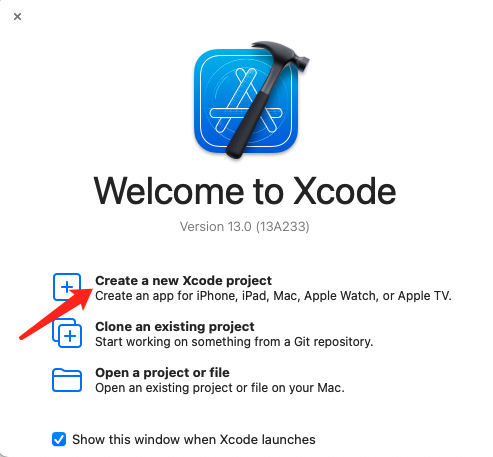
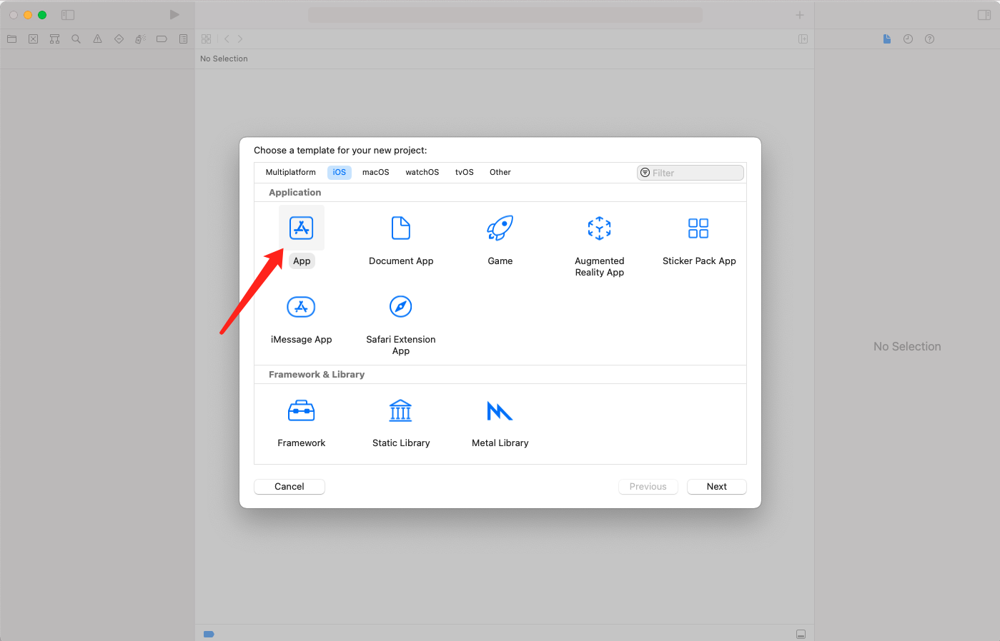
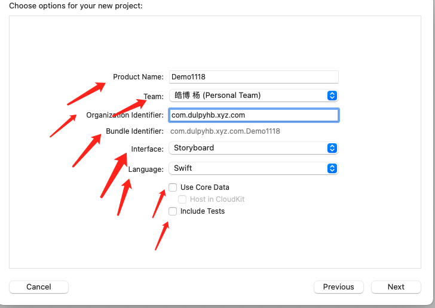
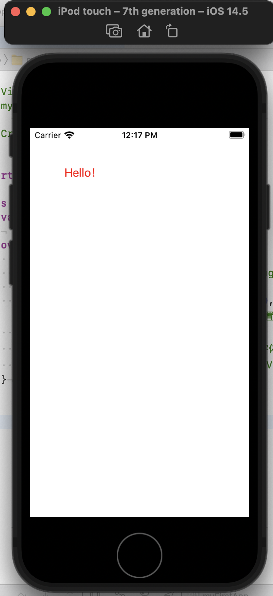
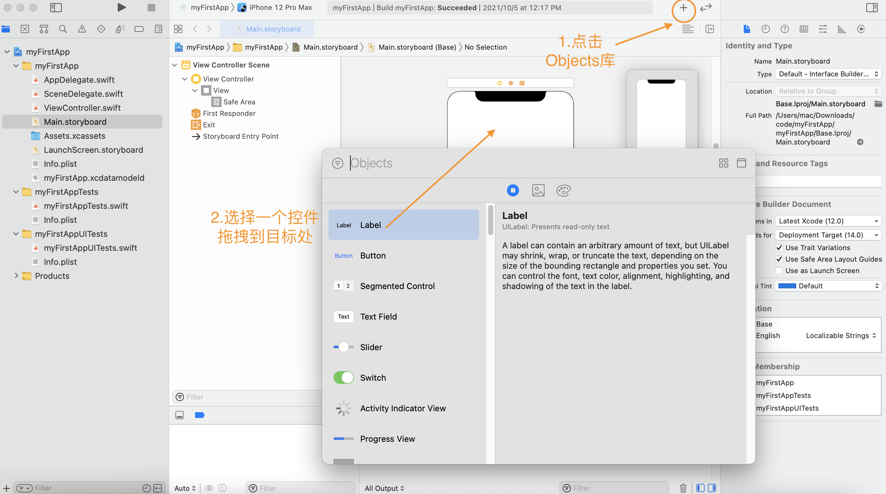
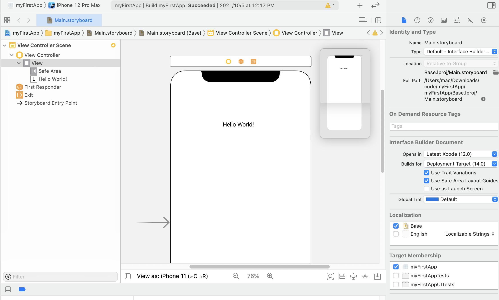

# Swift介绍与环境搭建
[TOC]

## 关于Swift

> **Swift** 是一种非常好的编写软件的编程语言，无论是手机，台式机，服务器，还是其他运行代码的设备。它是一种安全，快速和互动的编程语言，将现代编程语言的精华和苹果工程师文化的智慧，以及来自开源社区的多样化贡献结合了起来。

Swift 是一种支持多编程范式和编译式的开源编程语言，苹果于2014年WWDC（苹果开发者大会）发布，用于开发 iOS，OS X 和 watchOS 应用程序。Swift 结合了 C 和 Objective-C 的优点并且不受 C 兼容性的限制。Swift 在 Mac OS 和 iOS 平台可以和 Objective-C 使用相同的运行环境。2015年6月8日，苹果于WWDC 2015上宣布，Swift将开放源代码，包括编译器和标准库。
### Swift好在哪
- Swift 对于初学者来说也很友好。它是第一个既满足工业标准又像脚本语言一样充满表现力和趣味的系统编程语言。它支持代码预览（playgrounds），这个革命性的特性可以允许程序员在不编译和运行应用程序的前提下运行 Swift 代码并实时查看结果。
- Swift 将强大的类型推理和模式匹配与现代轻巧的语法相结合，使复杂的想法能够以清晰简洁的方式表达。因此，代码不仅更容易编写，而且易于阅读和维护。
- Swift 代码被编译和优化，以充分利用现代硬件。语法和标准库是基于指导原则设计的，编写代码的明显方式也应该是最好的。安全性和速度的结合使得 Swift 成为从 “Hello，world！” 到整个操作系统的绝佳选择。
- 编译器LLVM对Swift性能进行了优化，其性能平均比OC快30%左右；在开发阶段进行了优化，如字符串拼接、方法默认参数、面向协议编程、高阶函数等等很大程度上提高了开发效率。
- Swift 通过采用现代编程模式来避免大量常见编程错误：
	- 变量始终在使用前初始化或解包，保证代码的安全性。
	- 检查数组索引超出范围的错误。
	- 检查整数是否溢出。
	- 可选值确保明确处理 `nil` 值。
	- 内存被自动管理。
	- 错误处理允许从意外故障控制恢复。

## 环境搭建
>  Swift是一门开源的编程语言，该语言用于开发OS X和iOS应用程序。
>  在正式开发应用程序前，我们需要搭建Swift开发环境，以便更好友好的使用各种开发工具和语言进行快速应用开发。由于Swift开发环境需要在OS X系统中运行，因此其环境的搭建将不同于Windows环境，下面就一起来学习一下Swift开发环境的搭建方法。

成功搭建Swift开发环境的前提：
- 一台Mac/iMac 。因为集成开发环境XCode只能运行在OS X系统上。
- 电脑系统必须在OS 10.9.3及以上。
- 电脑必须安装Xcode集成开发环境。

此外，如果您的手上没有Mac/iMac，您仍然可以尝试在iPad的Playgrounds中进行Swift小项目的探索。如果您手上既没有Mac/iMac，也没有iPad相关产品，您可以选择在虚拟机上搭建相关项目，这可能会造成系统性能的下降。如果您对这些都不感兴趣，学习一门面向协议的新型函数式编程语言也不失为一种收获。

## 使用Xcode创建第一个程序

在App Store下载Xcode完毕后(这里以Xcode13为例)，双击运行：

- 点击`Create a new Xcode project`


- 选择`iOS`-`App`并`Next`


> 这里代表你选择开发一个iOS平台的App
> **简单介绍常见项目选择:**App：创建一个标准的App模版也是我们创建新项目一般勾选的模版；
> ducument App:文档App模版
> Game：游戏App模版
> Augmented Reality App: AR项目模板
> Framework：创建一个framework库（类似于封装SDK等）
> Static Library:创建静态库
> Metal library: metal库
> **顶部平台介绍**->Mutiplatfrom是跨平台开发（如一套代码在Mac上运行、pad、iphone）、ios也就是主要在iOS平台上运行的项目、macOS主要是在macOS上运行的项目开发、watchOS运行在apple watch上的项目、tvOS苹果电视项目

- 输入自己的`Product Name`与`Organization Identifier`：


这里我们默认选择Swift语言，Interface选择Storyboard
> **product name**：表示项目名
> **Team** : 当前队伍，如果是团队合作开发或企业开发会有专属的Team
> **Organization Identifier**:组织名
> **Interface** :选择是在故事板开发还是SwiftUI开发，这里建议新手选择Interface，SwiftUI需要Swift基础才能选择
> **Language** : 可以选择Swift与OC两种语言开发
 
- 初始页面如下，在左侧找到`ViewController.swift`，添加如下代码：

  ```swift
  import UIKit
  
  class ViewController: UIViewController {
      var label: UILabel!
    
      override func viewDidLoad() {
          super.viewDidLoad()
          // Do any additional setup after loading the view.
          
          label = UILabel.init(frame: CGRect(x:50,y:50, width:100,height:30))
          //创建标签，并设置位置，宽度、高度
          label.text = "Hello！"
          //设置标签文字
          label.textColor = UIColor.red
          //设置标签字体颜色
          self.view.addSubview(label)
          //将标签添加到View中
      }
  }
  ```


- 点击运行，结果如下：

至此，我们完成了第一个iOS程序的搭建

## Xcode初探

对于初学者而言，Xcode中的storyboard提供了简单易懂的UI界面，我们可以在storyboard上搭建自己想要的界面。
双击编辑，输入Hello World！点击运行即可看到预览结果
除了Storyboard，Xcode还存在另一种启动方式：代码启动。在实际工程文件与开发过程中，Storyboard上堆砌大量空间会导致运行卡顿，因此本部分仅作为演示使用。
