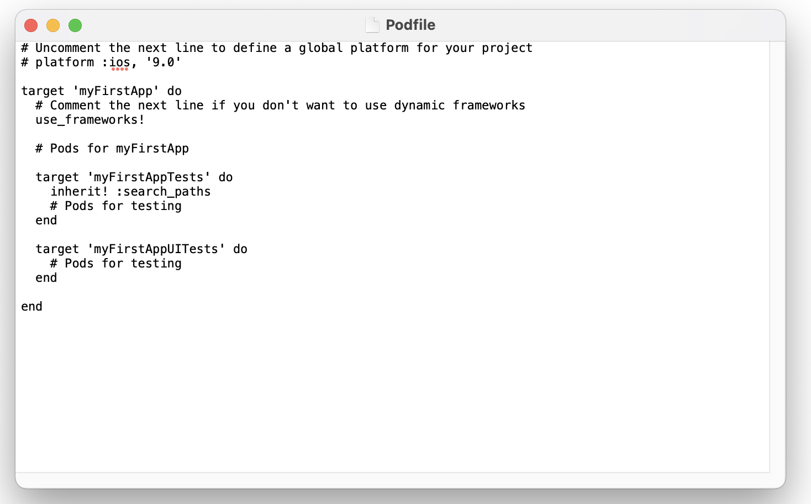
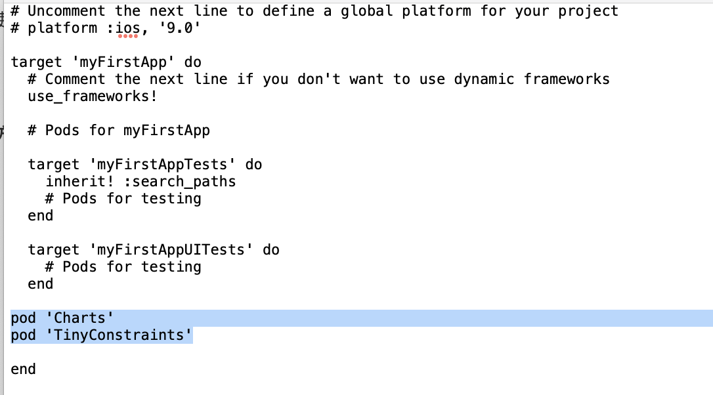
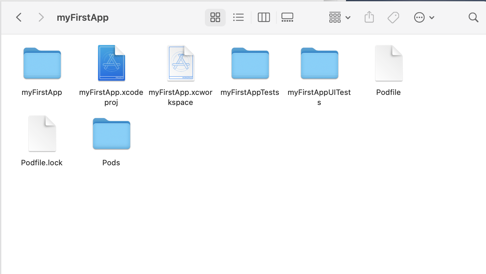
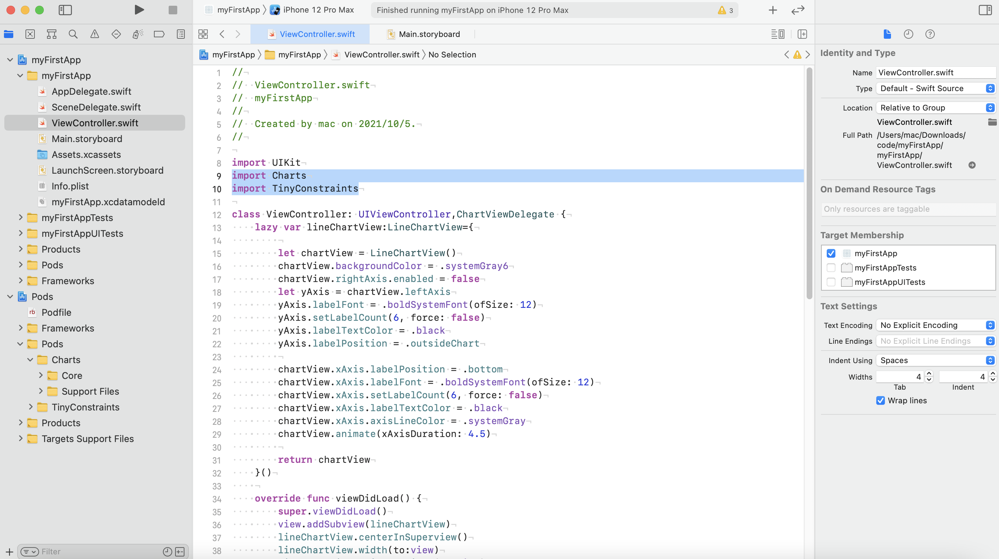
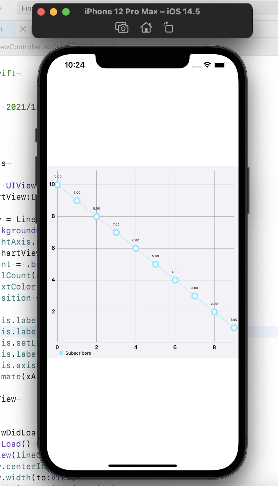

# Cocopods的安装与使用

## Cocopods介绍

CocoaPods是管理iOS项目所依赖的第三方开源库的工具，其项目源码在Github上管理。若项目开发不使用Cocopods，我们引入第三方开源库要做的步骤可能有：

- 把开源库的源代码复制到项目中
- 添加一些依赖框架和动态库(可能还需要引入其他的第三方开源库)
- 设置-ObjC，-fno，-objc，-arc 等参数
- 管理他们的更新

CocoaPods 是管理第三方插件的合集，其出现帮助节省了配置和更新第三方开源库的时间。 CocoaPods 将所有依赖的库都放在一个名为 Pods 的项目下，然后让主项目依赖 Pods 项目。然后， 我们编码工作都从主项目转移到 Pods 项目。Pods 项目最终会编译为一个 libPod-项目名.a 静态库， 主项目依赖于这个静态库。对于资源文件，CocoaPods 提供了一个名为 Pods-resources.sh 的 bash 脚本，该脚本在每次项目编译的时候都会执行，将第三方库的各种资源文件复制到目标目录中。

CocoaPods 通过一个名为 Pods.xcconfig 的文件来在编译时设置所有的依赖和参数。

CocoaPods 是用 Ruby 写的，并由若干个 Ruby 包 (gems) 构成的。在解析整合过程中，最重 要的几个 gems 分别是:CocoaPods/CocoaPods, CocoaPods/Core, 和 CocoaPods/Xcodeproj。


## Cocopods安装

在使用 Cocopods 之前，我们需要在`Terminal`进行安装：

1. 安装需要用到 Ruby，虽然 Mac 自带了 Ruby，但版本需要更新：

   ```bash
   sudo gem update −−system
   ```

2. 输入密码后安装 Cocopods：

   ```bash
   sudo gem install cocoapods
   ```

3. 如果安装过程过慢导致失败，可以更换国内下载源，安装完成后，在 `Terminal` 中：

   - cd 到目标工程文件路径下
   - pod init 会看到 Podfile 文件
   - vim Podfile 即可向其中插入想引用的第三方库
   
   

## 示例：安装第三方库

本部分我们将安装


新建Xcode项目myFirstApp后关闭Xcode（过程可参考Task00中的第一部分教程），打开终端（command+ "空格" ）

1. cd到目标目录下：

   ```bash
   cd Downloads/code/myFirstApp/
   ```

2. 进行Cocopods初始化

   ```bash
   pod init
   ```

3. 打开Podfile文件

   ```bash
   open Podfile
   ```

   

4. 插入如下命令后关闭Podfile

   ```bash
   pod 'Charts'
   pod 'TinyConstraints'
   ```

   

5. 返回`终端`（Terminal），进行Pod更新，等待片刻即可

   ```bash
   pod update
   ```

6. 在目录下双击运行 `myFirstApp.xcworkspace`

   

7. 在`myFirstApp`-`myFirstApp`-`ViewController.swift`导入加载的两个第三方库

   ```swift
   import Charts
   import TinyConstraints
   ```

   

8. 即可完成加载，完整代码如下（暂时无需弄懂代码含义，复制即可）：

```swift
import UIKit
import Charts
import TinyConstraints

class ViewController: UIViewController,ChartViewDelegate {
    lazy var lineChartView:LineChartView={
        
        let chartView = LineChartView()
        chartView.backgroundColor = .systemGray6
        chartView.rightAxis.enabled = false
        let yAxis = chartView.leftAxis
        yAxis.labelFont = .boldSystemFont(ofSize: 12)
        yAxis.setLabelCount(6, force: false)
        yAxis.labelTextColor = .black
        yAxis.labelPosition = .outsideChart
        
        chartView.xAxis.labelPosition = .bottom
        chartView.xAxis.labelFont = .boldSystemFont(ofSize: 12)
        chartView.xAxis.setLabelCount(6, force: false)
        chartView.xAxis.labelTextColor = .black
        chartView.xAxis.axisLineColor = .systemGray
        chartView.animate(xAxisDuration: 4.5)
        
        return chartView
    }()
    
    override func viewDidLoad() {
        super.viewDidLoad()
        view.addSubview(lineChartView)
        lineChartView.centerInSuperview()
        lineChartView.width(to:view)
        lineChartView.heightToWidth(of:view)
        setData()
    }
    
    func chartValueSelected(_ chartView: ChartViewBase, entry: ChartDataEntry, highlight: Highlight) {
        print(entry)
    }
    
    func setData(){
        let set1 = LineChartDataSet(entries: yValues, label: "Subscribers")
        let data = LineChartData(dataSet:set1)
        lineChartView.data = data
        
    }
    
    let yValues:[ChartDataEntry] = [
        ChartDataEntry(x:0.0, y:10.0),
        ChartDataEntry(x:1.0, y:9.0),
        ChartDataEntry(x:2.0, y:8.0),
        ChartDataEntry(x:3.0, y:7.0),
        ChartDataEntry(x:4.0, y:6.0),
        ChartDataEntry(x:5.0, y:5.0),
        ChartDataEntry(x:6.0, y:4.0),
        ChartDataEntry(x:7.0, y:3.0),
        ChartDataEntry(x:8.0, y:2.0),
        ChartDataEntry(x:9.0, y:1.0)
    ]
}
```

9. 点击运行，预览状态如下：

   

## 如何寻找自己心仪的第三方库？

如何找到`Charts`与`TinyConstraints`等优秀的第三方库？如何知晓不同的第三方库的安装命令？你可以访问Github的开源项目：

[awesome-ios](https://github.com/vsouza/awesome-ios)

这里面罗列了iOS开发流程中可能用到的第三方库，以`Charts`为例，我们点击相应label进行跳转


就会得到安装该库的命令：


至此，我们已经学会了基本的第三方库引入，下面我们要学习基本控件的应用，以更好地运用到我们的app上