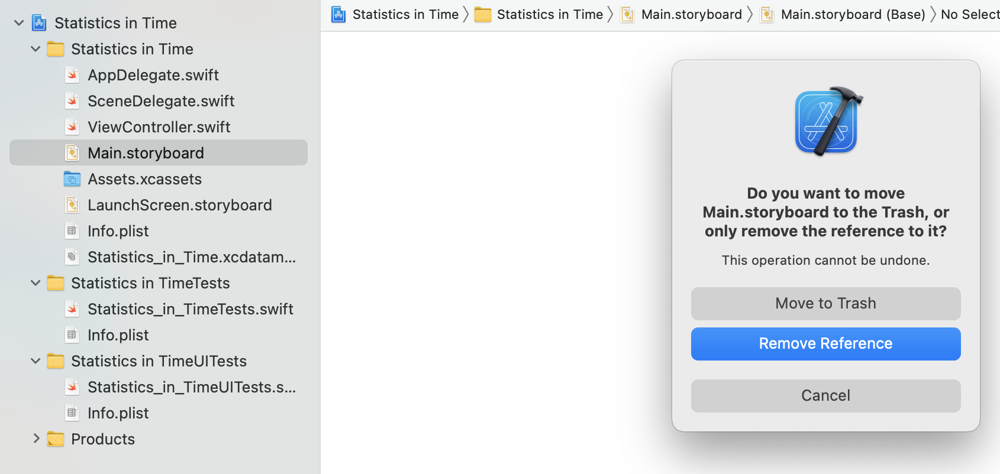
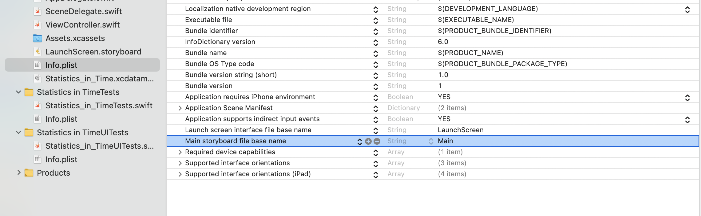
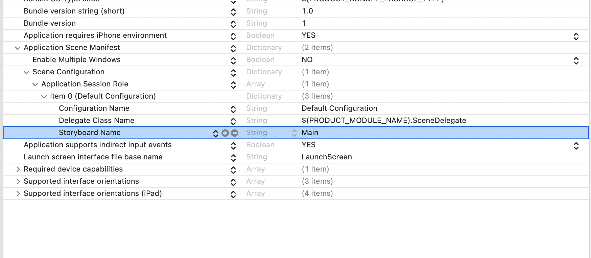
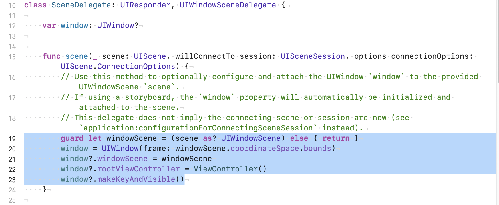
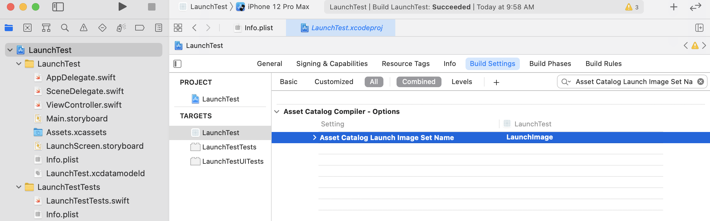
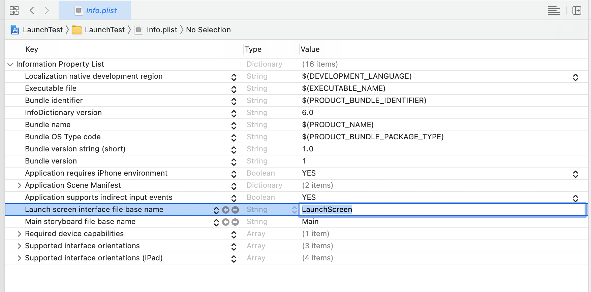
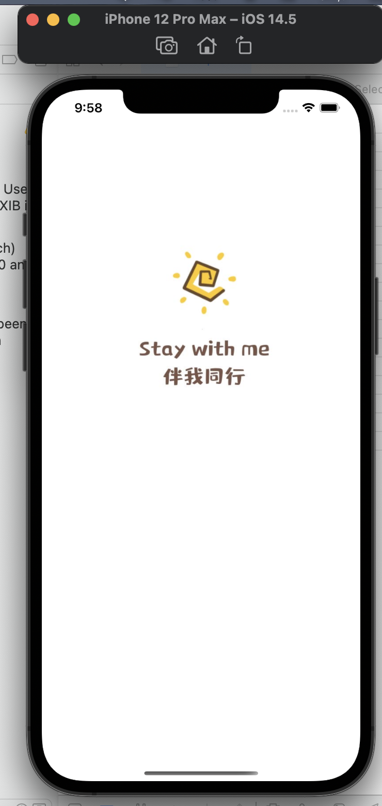

# 代码启动与登录界面

## 代码启动

在大型工程文件中，我们常常要避免使用storyboard，因为大量的storyboard会造成卡顿，内存占用过多。下面我们将介绍如何使用代码启动我们的app。

**Step 1：打开工程文件，在左侧导航栏中删除storyboard**



**Step 2：**在`Info.plist`中删除`Main storyboard file base name`一行



**Step 3：** 在左侧导航栏----`Info.plist`----`Application Scene Manifest`----`Scene Configuration`----`Application Session role`----`Item -(Default Configuration)`----`Storyboard Name`右侧Main中，删除该行



**Step 4：在左侧SceneDelegate.swift中，添加如下代码：**

```swift
        guard let windowScene = (scene as? UIWindowScene) else { return }
        window = UIWindow(frame: windowScene.coordinateSpace.bounds)
        window?.windowScene = windowScene
        window?.rootViewController = ViewController()
        window?.makeKeyAndVisible()
```



即可完成！

## 设置app的Icon

你可以将喜欢的图片用作自己app的Icon，这是一个在线免费转换尺寸的网址：

https://icon.wuruihong.com


Xcode的Assets.xcassets中罗列了该应用可能与用到的所有尺寸的Icon，你可以将上述网站下载得到的文件夹拖拽至Appicon处，系统会自动进行填充。

## 设置启动页面

打开各种app后，映入眼帘的往往不是空白屏幕，而是伴有启动页面的等待加载部分，如何实现用自己的图片进行加载？下面我们就来一起设置！

iOS 中设置启动页有两种方式 Launch Image 和 LaunchScreen，本部分我们以Launch Image为例

**Step 1：**在工程 targets--Build Settings 搜索 Asset Catalog Launch Image Set Name 然后设置创建的启动页名字LaunchImage。



**Step 2：**再在Info.plist中删除 `Launch screen interface file base name`并添加 `Launch image`并设置 `LaunchImage`



**Step 3：**资源文件中添加LaunchImage放入不同尺寸的图片。

**Step 4：**点击运行


