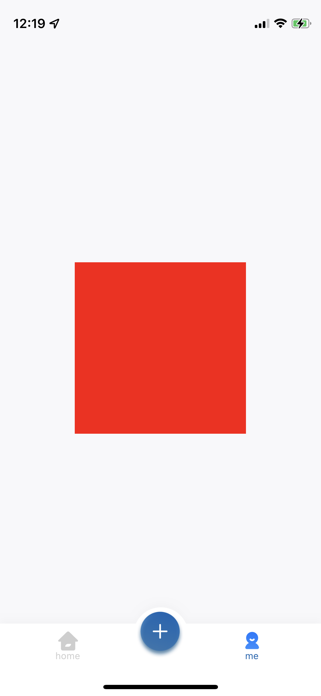
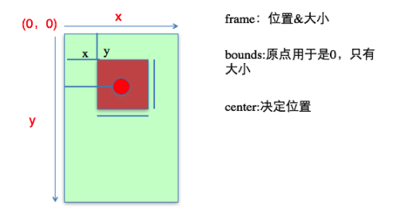
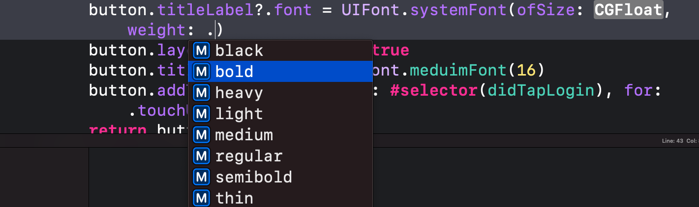
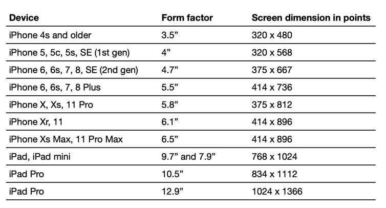
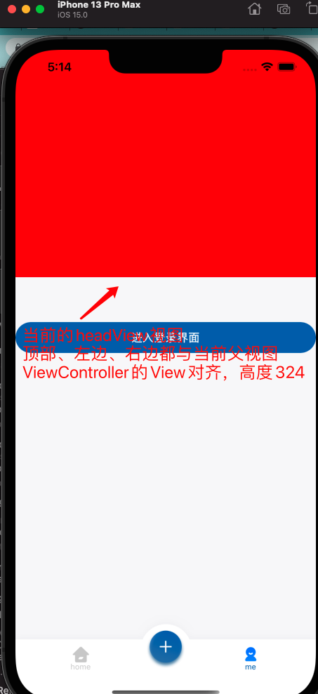
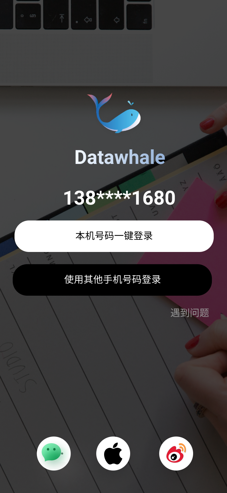
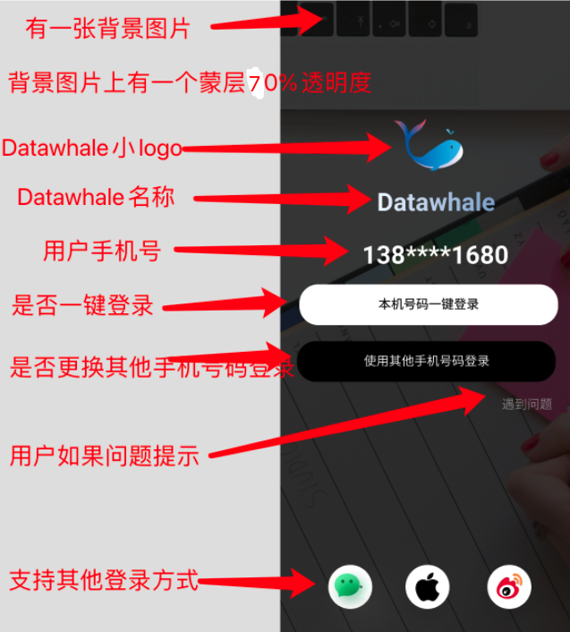
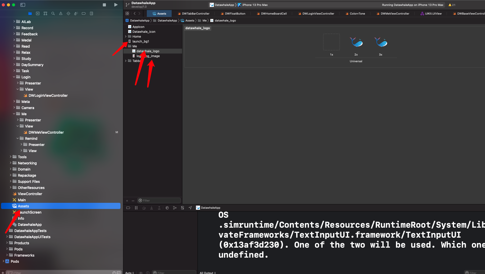
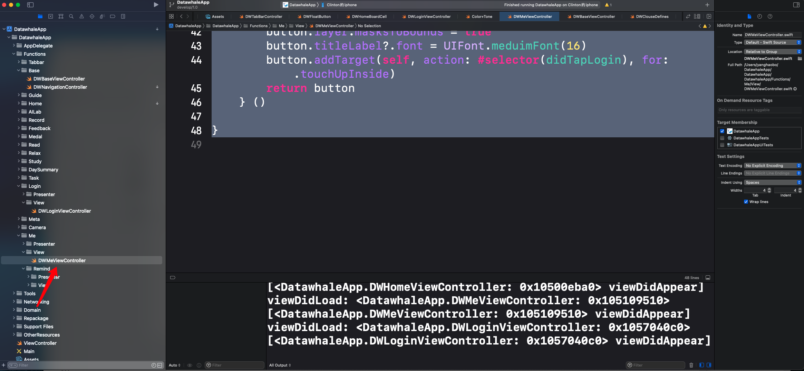
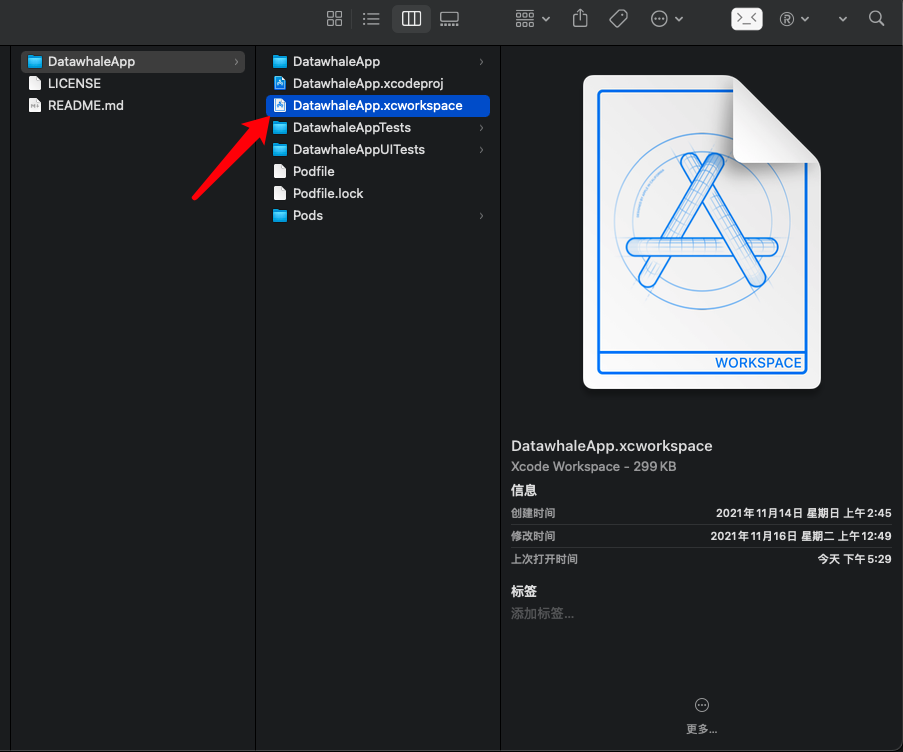

# UIKit框架
> iOS以UIKit框架的形式提供了很多控件用来构建视图展示，这些控件组合成了用户界面工具包也就是UIKit框架，此外UIKit当中还有视图控制器也就是ViewController。在控件当中他们都是以UI开头的一些对象如UIButton、UIView、UILabel、UIImageView、UIProgressView、UISlider、UIImage、UITextFiled、UITextView等等，下面我们简单介绍一下日常使用的基础控件。

## UIView
UIView是一个视图容器，也可以看作一个空白视图
``` swift
    private lazy var headView : UIView = {
        var headView = UIView.init(frame: CGRect.init(x: ()UIScreen.main.bounds.size.width - 200) / 2, y: ()UIScreen.main.bounds.size.height - 200) / 2, width: 200, height: 200)) // 1
        headView.backgroundColor = .red // 2
        return headView // 3
    } ()
```
> **解释一下上面代码关键字的含义**:
>  **private:**当前对象的访问权限，Swift当中权限访问总共有四种，安全性从高到低分别是的是private>fileprivate>Interal>public>open
>  **lazy**lazy表示当前对象懒加载的含义，只有当对象真正被调用时实例才会被加入内存当中
>  **UIView**表示创建一个视图
>  **UIScreen**屏幕对象，UIScreen.main.bounds代表获取主屏幕对象的bounds，bounds与frame类似，区别在于frame是x、y是针对父视图的x、y相对距离，bounds的x、y是针对视图本身的x、y距离，两者的height、width含义相同都是代表当前视图的宽高。由此UIScreen.main.bounds.size.width代表当前屏幕的宽，UIScreen.main.bounds.size.height代表当前屏幕的高。
>  **backgroundColor：**代表背景颜色，上面表示headView这个视图的背景颜色为红色
>  **return headView**当前是声明一个闭包，1.我们在闭包里面创建一个UIView，x,y值表示屏幕中间，展示一个宽200，高200的视图，2.视图背景为红色，3.返回值是headView

接下来我们把声明的视图展示到屏幕上去
编写如下代码到viewDidLoad当中去
``` swift
    override func viewDidLoad() {
        super.viewDidLoad()
        view.addSubview(headView)
    }
```
- 可以看到当前红色的UIView展示到了屏幕中间

- ## UIKit坐标系
在UIKit坐标系当中原点在(0,0)左上角，x值向右正向延伸，y值向下正向延伸

### 如何修改控件的状态
> 每一个UI控件都是一个对象
修改UI控件的状态，其实就是修改控件对象的属性
比如修改UILabel显示的文字，就修改UILabel对象的**text**属性即可
比如修改UIImageView显示的图片，就修改UIImageView对象的**image**属性即可
不难想到，每一个UI控件肯定都有很多属性，比如：
UIProgressView进度条控件有**progress**属性（进度值）
UILabel和UITextField都有**text**属性（显示文字）
……
虽然，每一个UI控件都有自己的独特属性，但是有些属性是每个UI控件都具备的，比如每一个UI控件都有自己的位置和尺寸、都有自己的父控件、子控件。于是，所有的UI控件最终都继承自UIView，UI控件的公共属性都定义在UIView中，比如：
frame ：位置和尺寸 
center ：中心点位置 
### UIView常见属性

```
    open var superview: UIView? { get } \\ 获得自己的父控件对象,只读属性

    open var subviews: [UIView] { get } \\ 获取自己所有的子类对象，get 代表读 set代表写，如果只有get那么代表当前对象时只读属性
    open var isUserInteractionEnabled: Bool \\ isUserInteractionEnabled代表当前视图是否接受点击事件

    open var tag: Int \\控件的ID(标识)，父控件可以通过tag来找到对应的子控件

    open var layer: CALayer { get } \\ 当前视图的Layer层(我们后续会详细介绍Layer与View的关系),目前同学们只需要了解Layer是视图的管理者，如控制View的宽高、x,y值等等
    open var frame: CGRect

    open var bounds: CGRect \\控件所在矩形框的位置和尺寸(以自己左上角为坐标原点，所以bounds的x、y一般为0)
\\ 注意:如果没有设置位置的情况下,把自己的左上角放在控制器的中心点
\\ 可以定义控件的大小W H(size)

    open var center: CGPoint \\控件中点的位置(以父控件的左上角为坐标原点),可以定义控件的位置X Y(center)

    open var transform: CGAffineTransform \\控件的形变属性(可以设置旋转角度、比例缩放、平移等属性)

    @available(iOS 13.0, *)
    open var transform3D: CATransform3D \\控件3D仿射变换的控制属性
```
### UIView常用方法
```
view.addSubview(headView) //给View添加一个子视图headView
view.removeFromSuperview() // 将View从他的父视图上删除
```
### UILabel 
> 1. text  设置label的文字 
> 2. textcolor 设置label的文字颜色 
> 3. textAlignment 对齐方式 
> 4. numberOfLines 换行个数  0 "自动换行" 
> 5. linesBreakMode  缩进方式  ...abc  abc...  a..bc 
> 6. font  字体大小和样式  (系统默认样式, 斜体样式,粗体样式) 
> 我们经常使用的字如下:

## 登录界面实战
> 下面我带大家画一个登录界面，在画的过程当中和大家讲解一下使用到的基础控件
## 重点:AutoLayout自动布局
> **适配**：在移动端开发当中，我们最需要注意的几个问题1.用户体验 2.手机性能消耗 3.包体积。适配是用户体验当中最基础也是最关键的一个问题点，移动端工程师需要针对不同的机型保证UI的还原度，防止不同机型的用户体验出现差异。我们都知道iPhone有很多种不同大小的屏幕，屏幕有不同大小的尺寸，不同的尺寸对应着不同的像素点，不同的像素点代表不同机型的手机宽高不同，有最小3.5寸最大手机目前有6.5寸，如iphone6 屏幕宽高就是375X667，iphone11promax屏宽高就是414 x 896。如果我们使用固定的宽高来进行UI视图布局会有一个问题，固定一个位置如frame = CGRect.init(x : 0 ,y:200,width : 300,height: 400)；在小屏手机这个UI控件展示在中间，而大屏手机展示在左边。所以AutoLayout布局技术可以解决这种问题.
> 

Autolayout是一种“自动布局”技术，专门用来布局UI界面的,苹果官方也推荐开发者尽量使用Autolayout来布局UI界面。我们这里直接最流行的AutoLayout三方框架SnapKit来解决布局问题。
> 详细使用方法会专门出一节课介绍，这里简单说说如何使用
``` swift
top \\ 当前视图的顶部
bottom \\ 当前视图的底部
right \\ 当前视图右边
left \\ 当前视图左边
size \\ 当前视图的大小
edges \\ 当前视图的边缘
centerX \\ 当前视图X轴中心
centerY \\ 当前视图Y轴中心
equalTo \\ 等于
equalToSuperview \\ 等于父视图
offset \\ 偏移量
snp \\ 关键字表示当前视图使用snp框架布局
```
### 如何使用
```
        view.addSubview(headView) // 将顶部视图添加到View当中
        // headView.snp.makeConstrains是使用SnapKit布局的基本格式
        //在闭包内{
        //$0.top.right.left.equalToSuperview().offset(0)
		//}
		// 代表当前headView的顶部、左边、右边距离与父视图对齐，偏移量为0
		// $0.height.equalTo(324)代表当前视图的高度为324
		// 这样我们就可以确定一个视图在父视图的位置信息,
		// 具体代码如下
        headView.snp.makeConstraints{
            $0.top.right.left.equalToSuperview().offset(0)
            $0.height.equalTo(324)
        }
```
### 效果
 

- 用户点击登录按钮时didTapLogin会监听到点击事件，并运行里面的方法运行方法如下,里面的方法会跳转到登录界面去。
```
@objc func didTapLogin() {
        let loginViewController = DWLoginViewController.init()
        /// self.navigationController当前视图的导航栏推入一个登录界面的视图控制器，animated=true表示开启动画
        self.navigationController?.pushViewController(loginViewController, animated: true)
    }
```

我们在DWMeViewController当中写一个按钮，这个按钮的点击事件是跳转到DWLoginViewController，具体代码如下
``` swift
//
//  DWMeViewController.swift
//  DatawhaleApp
//
//  Created by 杨皓博 on 2021/11/14.
//
import UIKit
class DWMeViewController: DWBaseViewController {
    override func viewDidLoad() {
        super.viewDidLoad()
        view.addSubview(headView)
        view.addSubview(loginButton)
        loginButton.snp.makeConstraints{
            $0.top.equalTo(headView.snp.bottom).offset(64)
            $0.left.right.equalTo(headView)
            $0.height.equalTo(44)
        }
    }
    
    // MARK: -
    @objc func didTapLogin() {
        let loginViewController = DWLoginViewController.init()
        /// self.navigationController当前视图的导航栏推入一个登录界面的视图控制器，animated=true表示开启动画
        self.navigationController?.pushViewController(loginViewController, animated: true)
    }
    
    private lazy var headView : UIView = {
        var headView = UIView.init(frame: CGRect.init(x: (UIScreen.main.bounds.size.width - 200) / 2, y: (UIScreen.main.bounds.size.height - 200) / 2, width: 200, height: 200))
        headView.backgroundColor = .red
        return headView
    } ()
    
    private let loginButton : UIButton = {
        let button = UIButton()
        button.setTitle("进入登录界面", for: .normal)
        button.backgroundColor = UIColor.brandBlueColor()
        button.setTitleColor(.white, for: .normal)
        button.layer.cornerRadius = 22
        button.layer.masksToBounds = true
        button.titleLabel?.font = UIFont.meduimFont(16)
        button.addTarget(self, action: #selector(didTapLogin), for: .touchUpInside)
        return button
    } ()
}
```
> 这是我们接下来要做的界面

> 我们首先来分析一下当前界面

> 从上面可以看出我们需要用到如下几个控件UIView、UIImageView、UILabel、UIButton，
## UIImageView
> 图片展示控件
首先在工程的Assets当中,我们创建一个文件夹用来存储我们需要使用到的图片,我们把对应的图片文件拖入创建的Image_set当中，之后将Image_set改名为login_bg_image

在登录界面中我们先添加背景图片
``` 
    // 背景图片
    private lazy var bgImageView: UIImageView = {
        var imageView = UIImageView.init(image: UIImage.init(named: "login_bg_image"))
        imageView.contentMode = .scaleAspectFill //表示当前视图的模式是等比例拉伸至填充
        imageView.clipsToBounds = true
        return imageView
    }()
    之后把背景图片加入到视图控制器的view上去
```

``` 
// 将背景视图加入到视图控制器的view
view.addSubview(bgImageView)
```
> 可以看看效果

> 以此类推我们把视图上面的控件都加到对应的视图控制器上面去
``` 
//
//  DWLoginViewController.swift
//  DatawhaleApp
//
//  Created by 杨皓博 on 2021/11/18.
//

import UIKit

class DWLoginViewController: DWBaseViewController {
    
    override func viewDidLoad() {
        super.viewDidLoad()
        // 将背景视图加入到视图控制器的view
        view.addSubview(bgImageView)
        // 将背景蒙层加入到View
        view.addSubview(bgView)
        // 将logo加入到当前视图控制器当中
        view.addSubview(logoImage)
        // 将当前文本加入视图控制器
        view.addSubview(datawhaleLabel)
        view.addSubview(phoneNumberLabel)
        view.addSubview(loginButton)
        view.addSubview(otherNumberButton)
        view.addSubview(problemLabel)
        self.bgImageView.snp.makeConstraints{(make) in
            make.edges.equalToSuperview().inset(UIEdgeInsets.zero)
        }
        self.bgView.snp.makeConstraints{(make) in
            make.edges.equalToSuperview().inset(UIEdgeInsets.zero)
        }
        self.logoImage.snp.makeConstraints{(make) in
            make.top.equalToSuperview().offset(DWNavgationHeight+56)
            make.centerX.equalToSuperview() // centerX表示相对于父视图的X轴中心
        }
        self.datawhaleLabel.snp.makeConstraints{(make) in
            make.centerX.equalToSuperview()
            make.top.equalTo(self.logoImage.snp.bottom).offset(-8)
        }
        self.phoneNumberLabel.snp.makeConstraints{(make) in
            make.centerX.equalToSuperview()
            make.top.equalTo(self.datawhaleLabel.snp.bottom).offset(24)
        }
        loginButton.snp.makeConstraints{(make) in
            make.top.equalTo(self.phoneNumberLabel.snp.bottom).offset(12)
            make.centerX.equalToSuperview()
            make.size.equalTo(CGSize.init(width: DWScreenWidth - 64, height: 48))
        }
        otherNumberButton.snp.makeConstraints{(make) in
            make.top.equalTo(self.loginButton.snp.bottom).offset(12)
            make.centerX.equalToSuperview()
            make.size.equalTo(CGSize.init(width: DWScreenWidth - 64, height: 48))
        }
        problemLabel.snp.makeConstraints{(make) in
            make.right.equalTo(otherNumberButton)
            make.top.equalTo(otherNumberButton.snp.bottom).offset(14)
        }
    }
    
    
    // MARK: - Life Cycle
    // MARK: - InitView
    // MARK: - Public
    
    // MARK: - Private
    
    // MARK: - Action
    
    // MARK: - privateUI
    // 手机号区域
    private lazy var problemLabel : UILabel = {
        var label = UILabel.init(frame: CGRect.zero)
        label.text = "遇到问题"
        label.textColor = UIColor.blackGray1()
        label.numberOfLines = 1
        label.textAlignment = .center
        label.font = UIFont.meduimFont(16)
        return label
    } ()
    // 使用其他手机登录按钮
    private lazy var otherNumberButton: UIButton = {
        var button = UIButton.init(type: .custom)
        button.setTitle("使用其他手机登录", for: .normal)
        button.backgroundColor = .black
        button.setTitleColor(UIColor.white, for: .normal)
        button.layer.cornerRadius = 24
        button.layer.masksToBounds = true
        button.titleLabel?.font = UIFont.meduimFont(16)
        return button
    }()
    
    // 一键登录按钮
    private lazy var loginButton: UIButton = {
        var button = UIButton.init(type: .custom)
        button.setTitle("本机号码一键登录", for: .normal)
        button.backgroundColor = .white
        button.layer.cornerRadius = 24
        button.layer.masksToBounds = true
        button.setTitleColor(UIColor.black, for: .normal)
        button.titleLabel?.font = UIFont.meduimFont(16)
        return button
    }()
    
    // 手机号区域
    private lazy var phoneNumberLabel : UILabel = {
        var label = UILabel.init(frame: CGRect.zero)
        label.text = "138****1680"
        label.textColor = UIColor.white
        label.numberOfLines = 1
        label.textAlignment = .center
        label.font = UIFont.boldFont(32)
        return label
    } ()
    
    // 当前文字的Label
    private lazy var datawhaleLabel : UILabel = {
        var label = UILabel.init(frame: CGRect.zero)
        label.text = "Datawhale"
        label.textColor = UIColor.white
        label.numberOfLines = 1
        label.textAlignment = .center
        label.font = UIFont.boldFont(32)
        return label
    } ()
    
    // 添加Datawhale的logo
    private lazy var logoImage: UIImageView = {
        var imageView = UIImageView.init(image: UIImage.init(named: "datawhale_logo"))
        imageView.contentMode = .scaleToFill //表示当前视图的模式是
        return imageView
    }()
    
    //添加透明度层
    private lazy var bgView: UIView = {
        var view = UIView.init(frame: CGRect.zero)
        view.backgroundColor = UIColor.black.withAlphaComponent(0.7) // 背景色为黑色透明度为0.7
        return view
    }()
    
    // 背景图片
    private lazy var bgImageView: UIImageView = {
        var imageView = UIImageView.init(image: UIImage.init(named: "login_bg_image"))
        imageView.contentMode = .scaleAspectFill //表示当前视图的模式是
        imageView.clipsToBounds = true
        return imageView
    }()  
}
```
> 最终界面效果


具体项目地址:[github](https://github.com/Dulpyanghaobo/DatawhaleApp)
下载之后点击xcworkspace，之后run跑项目

