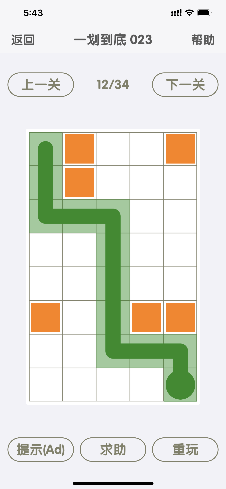
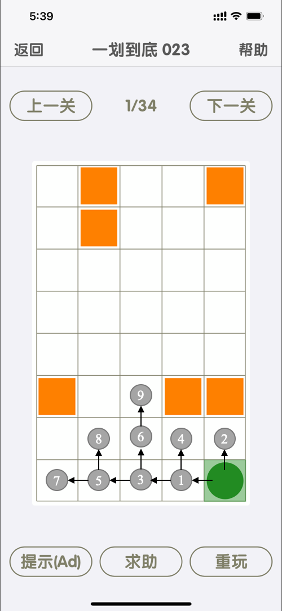

# 搜索问题

## 二分搜索

搜索问题通常有较多的解决方法。一般而言，**线性搜索**按照原始的数据结构顺序，遍历搜索空间中的每一个元素。线性搜索是最简单、最自然、最直观的搜索方法。该算法的时间复杂度最坏情况下为 $O(n)$ ，其中 $n$ 为待搜索结构中的元素总个数。

线性搜索的代码也十分简单：

```swift
func linearContains(_ array: Array, Target: ourTarget ) -> Bool {
    for element in Array where Target == ourTarget {
        return true
    }
    return false
}
```


然而，如果我们已经知道了数据结构的顺序，即每一种元素都是排列好的，并且可以通过索引立即访问数据结构内部的任何项，那么我们就可以执行**二分搜索**（Binary Search）。

假设存在一个按照字母序排列的数组Array，我们的目标是搜索f：

```swift
Array = [a, b, c, d, e, f, g]
```

这7个字母的中间值为 $d$，我们可以确定要搜索的目标位于 $d$ 之后，因此我们再于 $e, f, g$ 中搜索中间元素 $f$，即可完成目标。

二分搜索与线性搜索不同，它不需要遍历结构中的每一个元素。二分搜索能不断将搜索空间减半，因此最坏情况下的时间复杂度为 $O(\text{lg } n)$ 。二分搜索的缺点也显而易见：我们需要对数组进行排序，排序的最佳时间复杂度也需要 $O(n \text{lg }n)$ ，实际上，如果只运行一次，且原始数据为未排序数组，线性搜索的效果要好于二分搜索。

以基因和密码子的二分搜索为例，其中Gene类型为Array，而Codon可以与其他Codon进行比较，代码如下

```swift
func binaryContains(_ array: Gene, item: Codon) -> Bool {
    var low = 0
    var high = array.count - 1
    while low <= high {
        let mid = (low + high) / 2
        if array[mid] < item {
            low = mid + 1
        } else if array[mid] > item {
            high = mid - 1
        } else {
            return true
        }
    }
    return false
}
```

## 深度优先搜索（DFS）

**深度优先搜索**（Depth-First Search, DFS）为首先尽可能深入地搜索，如果到达终点，则回溯到最后一个决策点。此处我们以一款小游戏为例，假设右下角的绿色顶点为起始点，橙色方块为障碍物，最左上角的白色方块为终点，DFS的算法过程如下：


深度优先搜索给出的答案：




深度优搜索依赖于**栈**（Stack）这种数据结构，前文的递归中我们已经提到过：栈有两种最基本的操作

1. push() 压栈，将元素送入栈顶
2. pop() 移除栈顶元素并返回该元素

在Swift中栈的实现也十分简单：

```swift
public class Stack<T> {
    private var container: [T] = [T]()
    public var isEmpty: Bool { return container.isEmpty }
    public func push(_ thing: T) { container.append(thing) }
    public func pop() -> T { return container.removeLast() }
}
```

DFS的精髓在于可以回溯，要实现这个功能，我们需要添加一个类Node，用于记录当前搜索的状态（或从一个状态到另一个状态的方式）。Node可以看成包围状态的包装器。我们将状态来源的Node称为parent。此外，我们还需定义Node的类拥有cost和heuristic属性，并且能够比较Comparable和散列化Hashable

```swift
class Node<T>: Comparable, Hashable {
    let state: T
    let parent: Node?
    let cost: Float
    let heuristic: Float
    init(state: T, parent: Node?, cost: Float = 0.0, heuristic: Float = 0.0) {
        self.state = state
        self.parent = parent
        self.cost = cost
        self.heuristic = heuristic
    }
    
    var hashValue: Int { return Int(cost + heuristic) }
}

func < <T>(lhs: Node<T>, rhs: Node<T>) -> Bool {
    return (lhs.cost + lhs.heuristic) < (rhs.cost + rhs.heuristic)
}

func == <T>(lhs: Node<T>, rhs: Node<T>) -> Bool {
    return lhs === rhs
}
```

深度优先搜索中需要记录两种结构：正准备搜索的状态和已经搜索的状态，分别用frontier和explored表示。只要frontier中还有更多的状态要访问，DFS就会继续检查他们是否为目标值，并且将这些状态的后者加入frontier中。DFS还会把搜索过的点标记为explored，从而避免DFS陷入死循环，到达那些作为后继者先前已经访问过的状态。如果frontier是空的，则意味着没有地方可以继续搜索。

```swift
func dfs<StateType: Hashable>(initialState: StateType, goalTestFn: (StateType) -> Bool, successorFn: (StateType) -> [StateType]) -> Node<StateType>? {
    // frontier is where we've yet to go
    let frontier: Stack<Node<StateType>> = Stack<Node<StateType>>()
    frontier.push(Node(state: initialState, parent: nil))
    // explored is where we've been
    var explored: Set<StateType> = Set<StateType>()
    explored.insert(initialState)
    
    // keep going while there is more to explore
    while !frontier.isEmpty {
        let currentNode = frontier.pop()
        let currentState = currentNode.state
        // if we found the goal, we're done
        if goalTestFn(currentState) { return currentNode }
        // check where we can go next and haven't explored
        for child in successorFn(currentState) where !explored.contains(child) {
            explored.insert(child)
            frontier.push(Node(state: child, parent: currentNode))
        }
    }
    return nil // never found the goal
}
```

## 广度优先搜索（BFS）

深度优先搜索尽管提出了一种较为可靠的搜索方式，但是时间复杂度较大。通过深度优先遍历的路径通常不是最短路径。与之对应的**广度优先算法**（Breadth-First Search，BFS）总是查找到最短的路径，因为广度优先搜索的策略为优先遍历距离当前节点较近的点，找到的路径一定是最短的。但是，广度优先搜索并不总是比深度优先搜索性能优异，有些情况下深度优先搜索可能在广度优先搜索之前找到解决办法。运用DFS还是BFS，取决于我们在快速找到解决方法的可能性与查找到目标的最短路径的确定性之间的权衡。



值得注意的是，BFS给出的路径是最短的，但并不一定唯一。

与深度优先搜索不同，广度优先搜索依赖于**队列**（queue）结构，栈与队列的区别在于：

- 栈为后进先出（LIFO）
- 队列为先进先出（FIFO，First-In-First-Out）

队列也对应着至少两种操作：

1. push() 将元素添加到队列中
2. pop() 将先添加的元素从队列中删除

实际上，在Swift中Array的队列实现与栈的实现几乎完全相同，区别就是从Array的左侧而不是右侧移除元素。Array最左侧元素是Array中存在最久的一个元素。队列的参考实现如下：

```swift
public class Queue<T> {
    private var container: [T] = [T]()
    public var isEmpty: Bool { return container.isEmpty }
    public func push(_ thing: T) { container.append(thing) }
    public func pop() -> T { return container.removeFirst() }
}
```

BFS的实现很大程度上与DFS类似甚至相同，只是frontier从栈变成了队列。将frontier从栈更改为队列就会更改状态被搜索的顺序，确保首先搜索最长接近初始状态的状态。

```swift
func bfs<StateType: Hashable>(initialState: StateType, goalTestFn: (StateType) -> Bool, successorFn: (StateType) -> [StateType]) -> Node<StateType>? {
    // frontier is where we've yet to go
    let frontier: Queue<Node<StateType>> = Queue<Node<StateType>>()
    frontier.push(Node(state: initialState, parent: nil))
    // explored is where we've been
    var explored: Set<StateType> = Set<StateType>()
    explored.insert(initialState)
    // keep going while there is more to explore
    while !frontier.isEmpty {
        let currentNode = frontier.pop()
        let currentState = currentNode.state
        // if we found the goal, we're done
        if goalTestFn(currentState) { return currentNode }
        // check where we can go next and haven't explored
        for child in successorFn(currentState) where !explored.contains(child) {
            explored.insert(child)
            frontier.push(Node(state: child, parent: currentNode))
        }
    }
    return nil // never found the goal
}
```

## 练习

1. 如果二分搜索过程中数组长度为偶数该怎么办？代码如何实现？
2. 为dfs()、bfs()函数各添加一个计数器，以查看每个函数在搜索相同迷宫时所遍历的状态数量。并在上图中画出dfs和bfs的实现过程。
3. 运用dfs与bfs实现“八皇后”问题。

*参考代码开源版权说明：

```swift
// Copyright 2017 David Kopec
//
// Licensed under the Apache License, Version 2.0 (the "License");
// you may not use this file except in compliance with the License.
// You may obtain a copy of the License at
//
// http://www.apache.org/licenses/LICENSE-2.0
//
// Unless required by applicable law or agreed to in writing, software
// distributed under the License is distributed on an "AS IS" BASIS,
// WITHOUT WARRANTIES OR CONDITIONS OF ANY KIND, either express or implied.
// See the License for the specific language governing permissions and
// limitations under the License.
```

