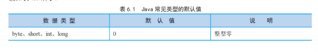
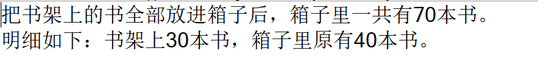
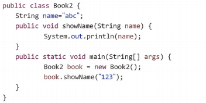

# 5. 类与方法

## 5.1 面向对象概述

- 面向机器语言 
	计算机处理信息的早期语言是所谓的机器语言，使用机器语言进行程序设计需要面向机器来编写代码，即需要针对不同的机器编写诸如0101 1100这样的指令序列。 
- 面向过程语言 
	随着计算机硬件功能的提高,在20世纪60年代出现了面向过程设计语言，如C语言等。用这些语言编程也称为面向过程编程。语言把代码组成叫做过程或函数的块。每个块的目标是完成某个任务。使用这些语言编写代码指令时，不必再去考虑机器指令的细节，只要按着具体语言的语法要求去编写“源文件”。
- 面向对象语言
	基于对象的编程更加符合人的思维模式，使得编程人员更容易编写出易维护、易扩展和易复用的程序代码，更重要的是，面向对象编程鼓励创造性的程序设计。     
	

**面向对象编程主要体现下列三个特性：封装性 ；继承；多态**

## 5.2 类与对象


- Java语言是面向对象语言，它的源程序是由若干个类组成，源文件是扩展名为 **.java** 的文本文件。
- 类是Java语言中最重要的“数据类型”，类声明的变量被称作对象，即类是用来创建对象的模板。 
- 类的实现包括两部分：类声明和类体。基本格式为：

```java
class 类名 {
   //类的成员变量
   //类的成员方法
   //类体的内容等
}
```

   其中：**class**是关键字，用来**定义类**。“class  类名”是类的声明部分，类名必须是合法的Java标识符。两个大括号以及之间的内容是类体。

### 5.2.1 成员变量

在 Java 中对象的属性也称为成员变量，成员变量的定义与普通变量的定义一样，语法如下:

> 数据类型 变量名称[=值]


其中，[=值]表示可选内容，定义变量时可以为其赋值，也可以不为其赋值。
为了了解成员变量，首先定义一个鸟类——Bird类，成员变量对应于类对象的属性，在Bird类中设置4个成员变量，分别为wing、claw、beak和feather，分别对应于鸟类的翅膀、爪子、喙和羽毛。

例如，在项目中创建鸟类Bird，在该类中定义成员变量。代码如下∶



```java
public class Bird{
	String wing;  //翅膀
	String claw;  //爪子
	String beal;  //喙
	String feather;  //羽毛
}
```
从以上代码可以看到在Java中使用class 关键字来定义类，Bird是类的名称。同时在Bird类中定义了4个成员变量，成员变量的类型可以设置为Java中合法的数据类型，其实成员变量就是普通的变量，可以设置初始值，也可以不设置初始值。如果不设置初始值，则会有默认值。



### 5.2.2 成员方法

 1. 成员方法的定义定义成员方法的语法格式如下:

```java
 [权限修饰符] [返回值类型]方法名([参数类型 参数名])[throws 异常类型]{
	//方法体
	return 返回值;
}
```
其中，权限修饰符可以是 private、public，protected中的任意一个，也可以不写，主要用来控制方法的访问权限。返回值类型用来指定方法返回数据的类型，可以是任何类型，如果方法不需要返回值，则使用void关键字；一个成员方法既可以有参数，也可以没有参数，参数可以是对象，也可以是基本数据类型的变量。
例如，定义一个 showGoods()方法，用来输出库存商品信息，代码如下∶

```java
public void showGoods(){
	System.out.println("库存商品信息:");

}
```
	说明∶方法的定义必须在某个类中，定义方法时如果没有指定权限修饰符，方法的默认访问权限为缺省（即只能在本类及同一个包中的类中进行访问）。


如果定义的方法有返回值，则必须使用return关键字返回一个指定类型的数据，并且返回值类型要与方法返回值的类型一致。例如，定义一个返回值类型为int的方法，就必须使用return返回一个int类型的值，代码如下∶

```java
public int showGoods(){
	System.out.println("库存商品信息:");
	returun 1;
}
```
上面代码中，如果将 **return 1;** 删除，将会出现错误提示。

 2. 成员方法的参数

调用方法时可以给该方法传递一个或多个值，传给方法的值叫作实参，在方法内部，接收实参的变量叫作形参，形参的声明语法与变量的声明语法一样。形参息在方法内部有效。Java中方法的参数主要有3 种，分别为值参数、引用参数和不定长参数，下面分别进行讲解。

- **值参数**
值参数表明实参与形参之间按值传递，当使用值参数的方法被调用时，编译器为形参分配存储单元，然后将对应的实参的值复制到形参中，由于是值类型的传递方式，所以，在方法中对值类型的形参的修改并不会影响实参。


**实例1：计算箱子里图书的总数** 
书架上有30本书，箱子里有40本书，把书架上的书全部放进箱子后，使用带参数的成员方法计算箱子里书的总数。代码如下∶

```java
public class Book { // 创建书类
	public static void main(String[] args) {
		Book book = new Book(); // 创建书类对象
		int shelf = 30; // 初始化书架上书的本数（实参）
		int box = 40; // 初始化箱子里书的本数（实参）
		// 把书架上的书全部放进箱子后，输出箱子里书的总数
		System.out.println("把书架上的书全部放进箱子后，箱子里一共有"
				+ book.add(shelf, box) + "本书。\n明细如下：书架上"
				+ shelf + "本书，箱子里原有" + box + "本书。");
	}
	private int add(int shelf, int box) { // 把书架上、箱子里的书相加求和（形参）
		box = box + shelf; // 对box进行加shelf操作
		return box; // 返回box
	}
}
```

运行结果如下图所示：


我们从结果可以看出，在成员方法中修改形参box值之后，并没有改变实参box的值。

- **引用参数**
如果在给方法传递参数时，参数的类型是数组或者其他引用类型，那么，在方法中对参数的修改会反映到原有的数组或者其他引用类型上，这种类型的方法参数被称之为引用参数。

实例2：将美元转换为人民币
现有1美元、10美元和100美元三种面值的美钞，将这三种面值的美钞存储在double类型的数组中，如果当前1美元可兑换6.903元人民币，那么使用参数为double类型的数组的成员方法，将三种面值的美钞转换为等值的人民币。代码如不∶

```java
public class ExchangeRate { // 创建汇率类
	public static void main(String[] args) {
		ExchangeRate rate = new ExchangeRate(); // 创建RefTest对象
		double[] denomination = { 1, 10, 100 }; // 定义一维数组，用来存储纸币面额（实参）
		// 输出数组中三种面值的美钞
		System.out.print("美元：");
		for (int i = 0; i < denomination.length; i++) { // 使用for循环遍历数组
			System.out.print(denomination[i] + "美元　");
		}
		rate.change(denomination); // 调用方法改变数组中元素的值
		// 输出与三种面值的美钞等值的人民币
		System.out.print("\n人民币：");
		for (int j = 0; j < denomination.length; j++) { // 使用for循环遍历数组
			System.out.print(denomination[j] + "元　");
		}
	}
	// 定义一个方法，方法的参数为一维数组（形参）
	public void change(double[] i) {
		for (int j = 0; j < i.length; j++) { // 使用for循环遍历数组
			i[j] = i[j] * 6.903; // 将数组中的元素乘以当前汇率
		}
	}
}
```

- **不定长参数**
声明方法时，如果有若干个相同类型的参数，可以定义为不定长参数，该类型的参数声明如下∶
权限修饰符 返回值类型 方法名（参数类型... 参数名）
==注意∶== 参数类型和参数名之间是三个点，而不是其他数量或省略号。
### 5.2.3 构造方法

在类中除了成员方法之外，还存在一种特殊类型的方法，那就是构造方法。构造方法是一个与类同名的方法，对象的创建就是通过构造方法完成的。每当类实例化一个对象时，类都会自动调用构造方法。
构造方法的特点如下∶

- 构造方法没有返回类型，也不能定义为void。
- 构造方法的名称要与本类的名称相同。
- 构造方法的主要作用是完成对象的初始化工作，它能把定义对象的参数传给对象成员。

==注意：== 在定义构造方法时，构造方法没有返回值，但这与普通没有返回值的方法不同，普通没有返回值的方法使用public void Text()这种形式进行定义，但构造方法并不需要使用void关键字进行修饰。

构造方法的定义语句代码如下：
```java
class Book{
	public Book(){  //（无参）构造方法
	}
}
```
- ==public== 构造方法的修饰符
- ==Book== 构造方法的名称

在构造方法中可以为成员变量赋值，这样当实例化一个本类的对象时，相应的成员变量也将被初始化。如果类中没有明确定义构造方法，则编译器会自动创建一个不带参数的默认构造方法。



除此之外，在类中定义构造方法时，还可以为其添加一个或者多个参数，即有参构造方法，语法如下：
```java
class Book {
	public Book(int args){  //有参构造方法
		//对成员变量进行初始化
	}
}
```
==注意：== 如果在类中定义的构造方法都是有参构造方法，则编译器不会为类自动生成一个默认的无参构造方法，当试图调用无参构造方法实例化一个对象时，编译器会报错。所以只有在类中没有定义任何构造方法时，编译器才会在该类中自动创建一个不带参数的构造方法。

**实例3 借阅《战争与和平》**
创建一个借书类 BorrowABook，借书类中有默认构造方法和参数为书名的借书方法 borrow()。编写一个程序，使用默认构造方法借阅《战争与和平》这本书。代码如下∶

```java
public class BorrowABook { // 创建借书类
	public BorrowABook() { // 无参构造方法
	}
	public void borrow(String name) { // 参数为书名的借书方法
		System.out.println("请前往借阅登记处领取" + name + "。"); // 输出借出的书名
	}
	public static void main(String[] args) {
		BorrowABook book = new BorrowABook(); // 创建借书类对象，
		book.borrow("《战争与和平》"); // 调用借书方法，并将“《战争与和平》”赋给参数name
	}
}
```

### 5.2.4 this关键字

当类中的成员变量与成员方法中的参数重名时，方法中如何使用成员变量呢?首先来看一下重名的情况下会发生什么问题。

例如，创建Book2类，定义一个成员变量name并赋初值，再定义一个成员方法showName(String name)，输出方法中name的值。 

从这个结果可以看出，输出的值不是成员变量的值，也就是说，如果方法中出现了与局部变量同名的参数，会导致方法无法直接使用成员变量。

在上述代码中可以看到，成员变量与在 showtName()方法中的形式参数的名称相同，都为name，那么如何在类中区分使用的是哪一个变量呢？在Java语言中规定使用this关键字来代表本类对象的引用，this关键字被隐式地用于引用对象的成员变量和方法。


**实例4 调用书名属性**
创建一个借书类 BorowABook，借书类中有书名属性 name，参数为 name 的构造方法和借书方法 borrow()。编写一个程序，使用this关键字调用书名属性后，借阅《战争与和平》这本书。代码如下∶

```java
public class BorrowABook2 { // 创建借书类
	String name; // 属性：书名
	public BorrowABook2(String name) { // 参数为name的构造方法
		this.name = name; // 将参数name的值付给属性name
	}
	public void borrow() { // 借书方法
		System.out.println("请前往借阅登记处领取" + name + "。"); // 输出借出的书名
	}
	public static void main(String[] args) {
		// 创建参数为“《战争与和平》”的借书类对象，
		BorrowABook2 book = new BorrowABook2("《战争与和平》");
		book.borrow(); // 调用借书方法
	}
}

```
- this关键字虽然可以调用成员变量和成员方法，但Java语言中最常规的调用方式是使用"**对象.成员变量**"或"**对象.成员方法**"进行调用(关于使用对象调用成员变量和方法的问题，将在后续学习中进行讲述)。
- 
既然 this关键字和对象都可以调用成员变量和成员方法，那么this关键字与对象之间具有怎样的关系呢?

- 事实上，this关键字引用的就是本类的一个对象，在局部变量或方法参数覆盖了成员变量时，如上面代码的情况，就要添加this关键字明确引用的是类成员还是局部变量或方法参数。

- 如果省略this关键字直接写成name = name，那只是把参数name赋值给参数变量本身而已，成员变量name的值没有改变，因为参数name在方法的作用域中覆盖了成员变量name。

- 其实，this关键字除了可以调用成员变量或成员方法之外，还可以作为方法的返回值。
例如，在项目中创建一个类文件，在该类中定义Book类型的方法，并通过过this关键字进行返回。

```java
public class Book{
	public getBook(){
		return this;  //返回Book类引用
		}
}
```
在 getBook()方法中，方法的返回值为*Book*类，所以方法体中使用*return this* 这种形式将Book类的对象进行返回。
通过介绍知道this关键字可以调用类的成员变量和成员方法。此外，它还可以调用类中的构造方法。

### 5.2.5 static 关键字

由static修饰的变量、常量和方法分别被称作静态变量、静态常量和静态方法，也被称作类的静态成员。

### 5.2.6 静态变量

很多时候，不同的类之间需要对同一个变量进行操作，比如一个水池，同时打开入水口和出水口，进水和出水这两个动作会同时影响到水池中的水量，此时水池中的水量就可以认为是一个共享的变量。在Java程序中，如果把共享的变量用static修饰，那么该变量就是静态变量。
调用静态变量的语法如下∶ 

> 类名.静态类成员

### 5.2.7 静态方法

如果想要使用类中的成员方法，需要先将这个类进行实例化，但有些时候不想或者无法创建类的对象时，还要调用类中的方法才能够完成业务逻辑，这种情况下就可以使用静态方法。
调用类的静态方法语法如下∶

> 类名.静态方法();

**实例6 使用静态方法表示水池中的水量及其变化**
创建一个水池类，使用静态变量表示水池中的水量，并初始化水池中的水量为0，通过注水方法（一次注入3个单位）和放水方法（一次放出2个单位），控制水池中的水量。代码如下∶

```java


public class Pool { // 创建水池类
	public static int water = 0; // 初始化静态变量之水池中的水量为0
	public static void outlet() { // 放水，一次放出2个单位
		if (water >= 2) { // 如果水池中的水量大于等于2个单位
			water = water - 2; // 放出2个单位的水
		} else { // 如果水池中的水量小于2个单位
			water = 0; // 水池中的水量为0
		}
	}
	public static void inlet() { // 注水，一次注入3个单位
		water = water + 3; // 注入3个单位的水
	}
	public static void main(String[] args) {
		System.out.println("水池的水量：" + Pool.water); // 输出水池当前水量
		System.out.println("水池注水两次。");
		Pool2.inlet(); // 调用静态的注水方法
		Pool2.inlet(); // 调用静态的注水方法
		System.out.println("水池的水量：" + Pool.water); // 输出水池当前水量
		System.out.println("水池放水一次。");
		Pool2.outlet(); // 调用静态的放水方法
		System.out.println("水池的水量：" + Pool.water); // 输出水池当前水量
	}
}


```
### 5.2.8 静态代码块

在类的成员方法之外，用static修饰代码区域可以称之为静态代码块。定义一块静态代码块，可以完成类的初始化操作，在类声明时就会运行。
语法如下∶

```java
public class StaticTest { 
	static {// 此处编辑执行语句
	}
}
```
**实例7 代码块的执行顺序**
创建静态代码块、非静态代码块、构造方法、成员方法，查看这几处代码的调用顺序。代码如下：

```java
public class StaticTest {
	static String name;
	// 静态代码块
	static {
		System.out.println(name + "静态代码块");
	}
	// 非静态代码块
	{
		System.out.println(name + "非静态代码块");
	}
	public StaticTest(String a) {
		name = a;
		System.out.println(name + "构造方法");
	}
	public void method() {
		System.out.println(name + "成员方法");
	}
	public static void main(String[] args) {
		StaticTest s1;// 声明的时候就已经运行静态代码块了
		StaticTest s2 = new StaticTest("s2");// new的时候才会运行构造方法
		StaticTest s3 = new StaticTest("s3");
		s3.method();// 只有调用的时候才会运行
	}
}
```
### 5.2.9 类的主方法

主方法是类的入口点，它指定了程序从何处开始，提供对程序流向的控制。Java编译器通过主方法来执行程序。

主方法的语法如下∶
```java
public static void main(String[] args){
		// 方法体
}
```
在主方法的定义中可以看到主方法具有以下特性∶

- 主方法是静态的，所以如要直接在主方法中调用其他方法，则该方法必须也是静态的。
- 主方法没有返回值。
- 主方法的形参为数组。其中 *args[0]～args[n]* 分别代表程序的第一个参数到第n+1个参数，可以使用 *args.length* 获取参数的个数。

#  三、小结
万事万物皆对象，数据也一样。任何数据都有一些独特的特性，可以将这些特性设置成类的属性。例如，时间包含年、月、日、时、分、秒，通信信息包括电话号和姓名等。数据可以被拆分，拆分出的特征就是类的属性。

本章学习了面向对象的概念、类的定义、成员方法、类的构造方法、主方法以及对象的应用等。通过对本章的学习，读者应该掌握面向对象的编程思想，这对Java的学习十分有帮助，同时在此基础上读者可以编写类、定义类成员、构造方法、主方法，以解决一些实际问题。由于在Java中通过对象来处理问题，所以对象的创建、比较、销毁的应用就显得非常重要。初学者应该反复揣摩这些基本概念和面向对象的编程思想，为Java语言的学习打下坚实的基础。

