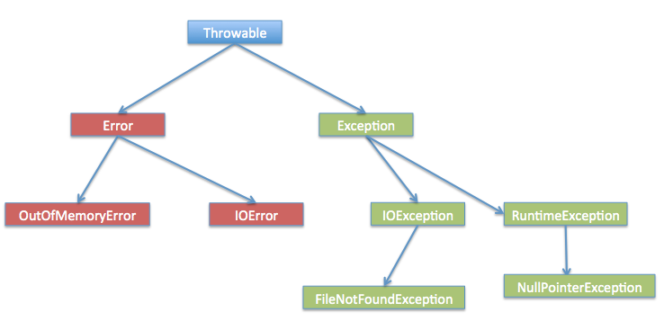

# 8. 异常处理

## 8.1 什么是异常？

异常是程序中的一些错误使得程序没有按照预期正常执行。Java提供了异常处理机制处理异常问题。

异常处理机制可以让程序在发生异常时，按照预先设计的逻辑处理异常。

产生异常的原因有很多，通常是：

- 用户输入了非法数据。
- 要打开的文件不存在。
- 网络通信时连接中断，或者JVM内存溢出。

异常的类型有以下三种：

- **检查性异常：**最具代表的检查性异常是用户错误或问题引起的异常，这是程序员无法预见的。例如要打开一个不存在文件时，一个异常就发生了，这些异常在编译时不能被简单地忽略。
- **运行时异常：** 运行时异常是可能被程序员避免的异常。与检查性异常相反，运行时异常可以在编译时被忽略。
- **错误：** 错误不是异常，而是脱离程序员控制的问题。错误在代码中通常被忽略。例如，当栈溢出时，一个错误就发生了，它们在编译也检查不到的。


## 8.2 异常的分类

异常处理的根接口是Throwable，有两个子接口，分别是Error和Exception。

Error：用来指示运行时环境发生的错误，这是系统错误类，一般开发人员无法处理，只能关闭程序。

Exception：指的是程序运行中产生的异常。



Exception下的异常分为两大类，分别是Runtime异常和非Runtime异常

Runtime异常：程序运行时产生的异常，jvm会自动处理。典型的运行时异常有：数组下标越界异常（IndexOutOfBoundsException）、空指针异常（NullPointerException）、对象类型强制转换异常（ClassCastException）以及数组存储异常（ArrayStoreException，即数组存储类型不一致）等。

非Runtime异常：也叫检查异常，即编译器要求必须进行处理的异常，例如IOException、SqlException。

## 8.3 异常处理流程

Java异常机制用到的几个关键字：try、catch、finally、throw、throws。

**try**: 用于监听。将要被监听的代码(可能抛出异常的代码)放在try语句块之内，当try语句块内发生异常时，异常就被抛出。
**catch**：用于捕获异常。catch用来捕获try语句块中发生的异常。
**finally**：finally语句块总是会被执行。它主要用于回收在try块里打开的物力资源(如数据库连接、网络连接和磁盘文件)。只有finally块，执行完成之后，才会回来执行try或者catch块中的return或者throw语句，如果finally中使用了return或者throw等终止方法的语句，则就不会跳回执行，直接停止。
**throw**：用于抛出异常。
**throws**：用在方法签名中，用于声明该方法可能抛出的异常。主方法上也可以使用throws抛出。如果在主方法上使用了throws抛出，就表示在主方法里面可以不用强制性进行异常处理，如果出现了异常，就交给JVM进行默认处理，则此时会导致程序中断执行。
产生异常的原因：


## 8.4 try-catch

```java
try
{
   // 程序代码
}catch(异常类型1 异常的变量名1)
{
   //Catch 块
}
```

关键词try后的括号里面的区域为监控区域，java如果发生了异常，则创建异常对象，并将异常抛出监控区域之外，catch子句则用来捕获异常


举个例子：

```java
import java.io.*;
public class Test{
 
   public static void main(String args[]){
      try{
         int a[] = new int[2];
         System.out.println("访问索引下标3:" + a[3]);
      }catch(ArrayIndexOutOfBoundsException e){
         System.out.println("抛出异常  :" + e);
      }
      System.out.println("超出索引范围");
   }
}
```


## 8.4 try-catch-finally

finally 关键字用来创建在 try 代码块后面执行的代码块。

无论是否发生异常，finally 代码块中的代码总会被执行。

在 finally 代码块中，可以运行清理类型等收尾善后性质的语句。

finally 代码块出现在 catch 代码块最后，语法如下：

```java

try{
  // 程序代码
}catch(异常类型1 异常的变量名1){
  // 程序代码
}catch(异常类型2 异常的变量名2){
  // 程序代码
}finally{
  // 程序代码
}
```


## 8.5 throws/throw

如果一个方法没有捕获到一个检查性异常，那么该方法必须使用 throws 关键字来声明。throws 关键字放在方法签名的尾部。

也可以使用 throw 关键字抛出一个异常，无论它是新实例化的还是刚捕获到的。


throws通用格式如下:

```java
访问权限 返回值类型 方法名称（参数列表） throws 异常类
{
    // 方法体;
}
```

以上方法的异常类对象都是由JVM自动实例化的，如果需要手动实例化，则需要用到throw关键字

```java
public class Test {
	public static void main(String[] args) {
		try {
			throw new ArrayIndexOutOfBoundsException("数组越界");
		} 
		catch(ArrayIndexOutOfBoundsException e) {
			System.out.println("数组越界le!");
			System.out.println("异常:" + e);
		}
	}
}
```

throw语句用在方法体内，抛出的是一个异常实例，与try-catch语句或者throws配合使用，不可单独使用。

## 自定义异常

在 Java 中你可以自定义异常。编写自己的异常类时需要记住下面的几点。

- 所有异常都必须是 Throwable 的子类。
- 如果希望写一个检查性异常类，则需要继承 Exception 类。
- 如果你想写一个运行时异常类，那么需要继承 RuntimeException 类。

可以像下面这样定义自己的异常类：

class MyException extends Exception{ }

只继承Exception 类来创建的异常类是检查性异常类。


```java
class WrongInputException extends Exception {  // 自定义的类
    WrongInputException(String s) {
        super(s);
    }
}
class Input {
    void method() throws WrongInputException {
        throw new WrongInputException("Wrong input"); // 抛出自定义的类
    }
}
class TestInput {
    public static void main(String[] args){
        try {
            new Input().method();
        }
        catch(WrongInputException wie) {
            System.out.println(wie.getMessage());
        }
    } 
}
```

