# Linux的安装

# 一、相关工具、版本简介

1. 虚拟机：Oracle VM VirtualBox
2. Ubuntu版本：20.04


# 二、创建虚拟机

成功安装Oracle VM VirtualBox后，打开的页面如下：

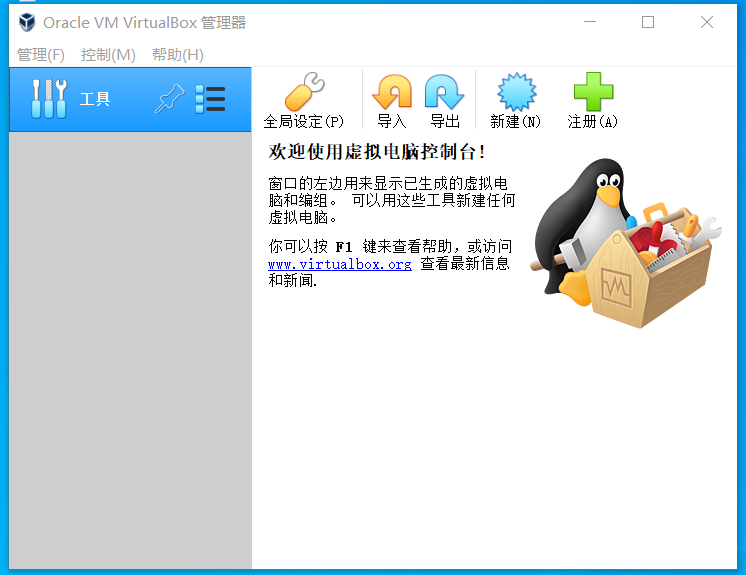

在开始之前，我们首先要准备好Ubuntu ISO镜像文件，以便在虚拟机上安装Ubuntu操作系统。在这里我们选取的是`ubuntu-20.04.2.0-desktop-amd64.ios`。那么，具体的安装步骤，可以按照如下指引进行：

1. 新建一个虚拟机

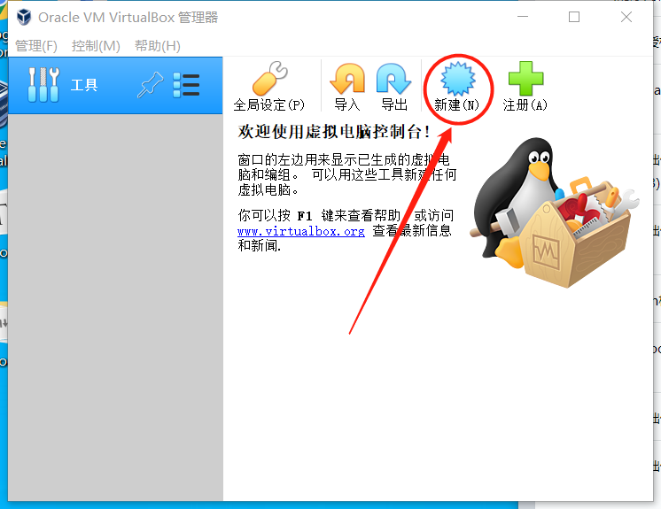

2. 虚拟机名称和系统类型

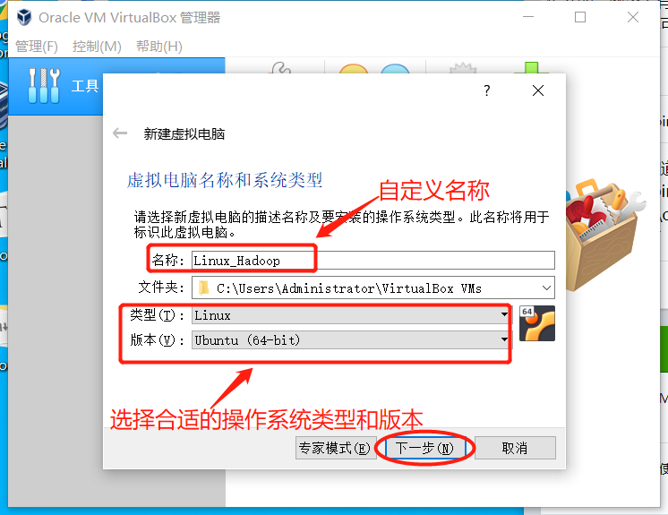

3. 为虚拟机分配内存大小

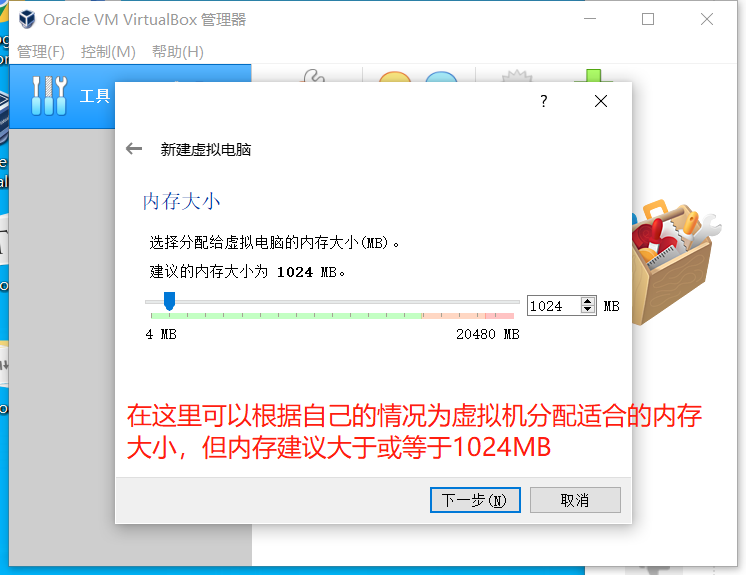

4. 虚拟硬盘的选择

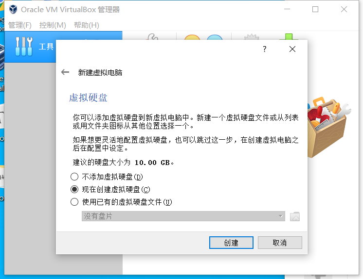

5. 虚拟硬盘文件的选择

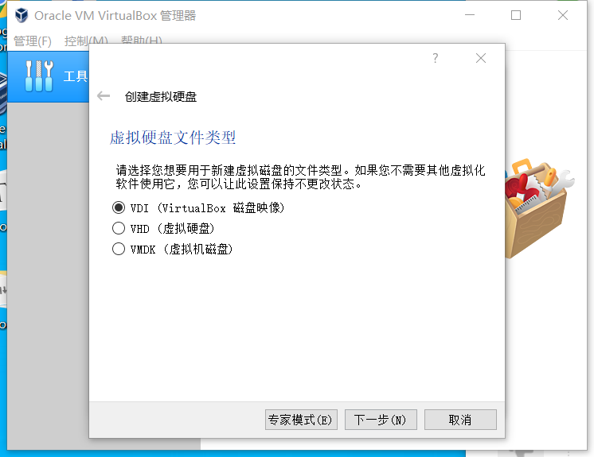

6. 存储物理硬盘的选择

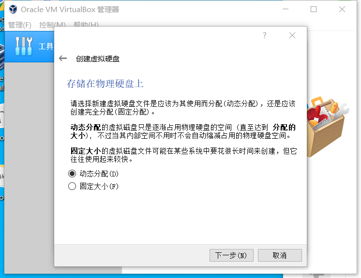

7. 虚拟机存放的位置以及虚拟硬盘的大小

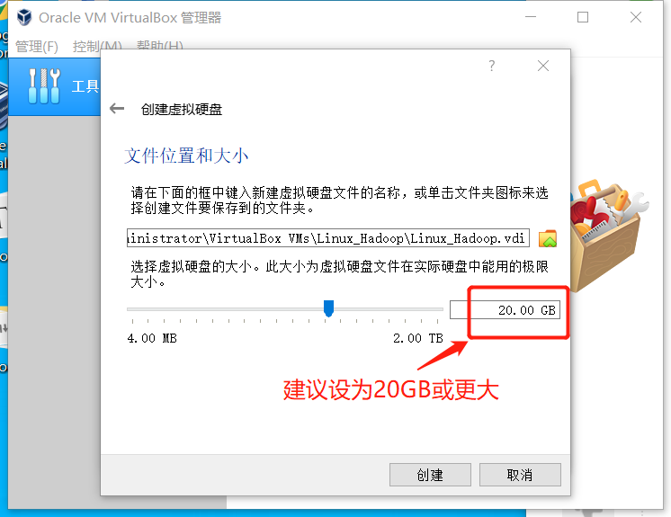

8. 设置完成后的界面

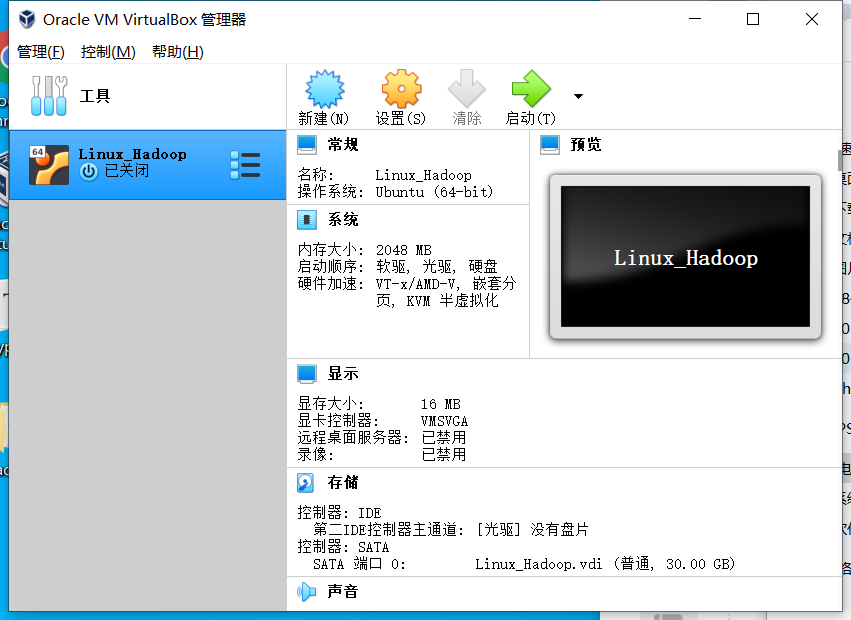

# 三、Ubuntu系统的安装

1. 点击设置

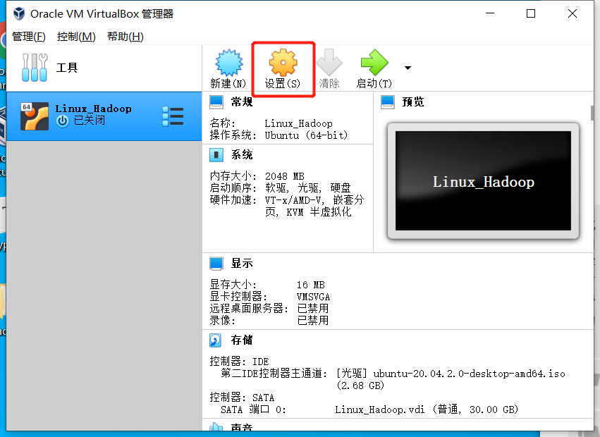

2. 设置我们准备好的镜像文件

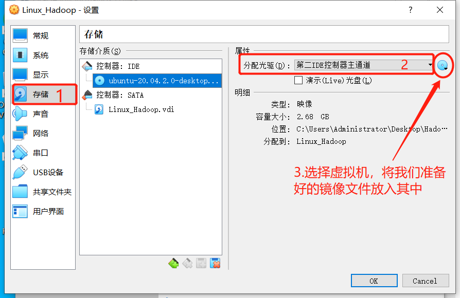

3. 上面步骤设置完成后，返回第一步的在刚刚的【设置】旁边有个【启动】。单击【启动】按钮，启动虚拟机。启动后就如下图所示，我们可以在左边看到语言选择，可以根据喜好选择系统的语言，然后单击如图所示的【安装Ubuntu】

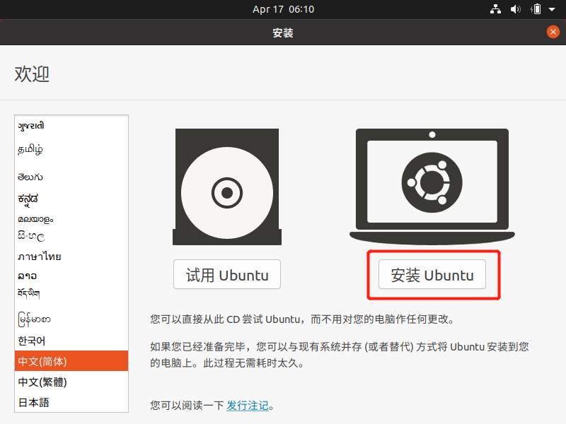

4. Ubuntu的安装和更新，我们不建议选择如图所示的选项，这会为你自动更新系统

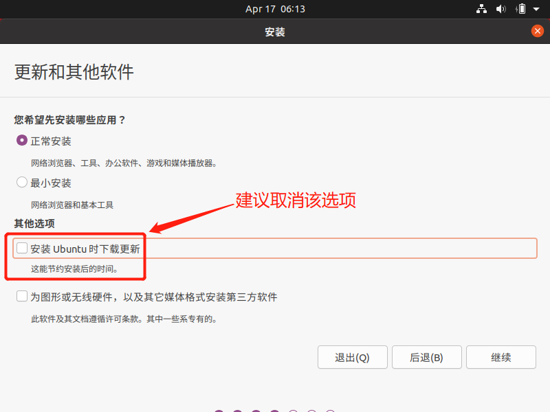

5. 安装类型

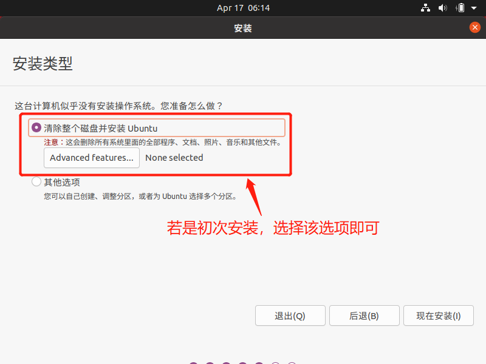

6. 系统分区

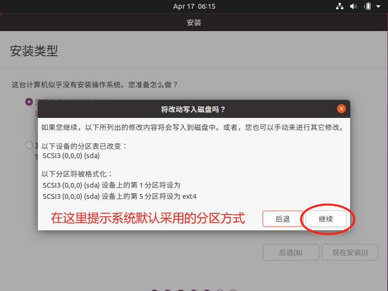

7. 时区选择


8. 用户名和密码的设置

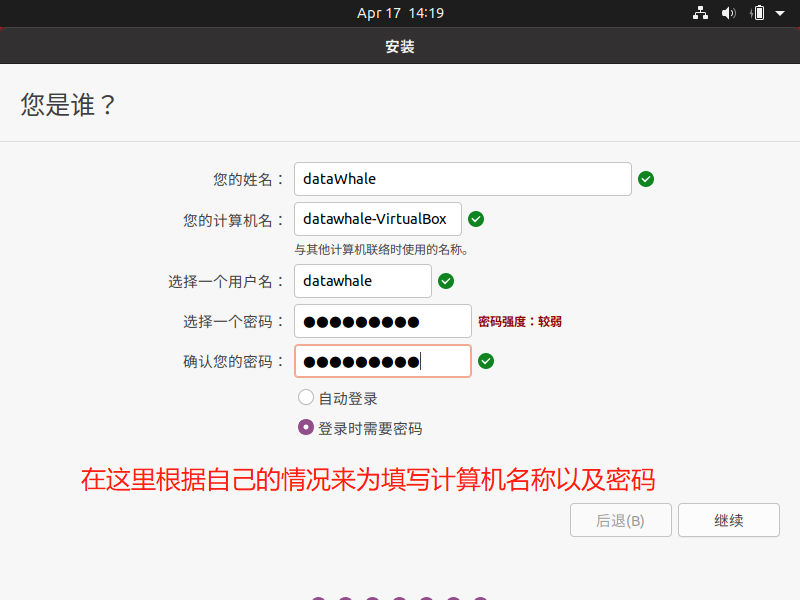

9. 设置完成后，就会进入自动安装的界面

   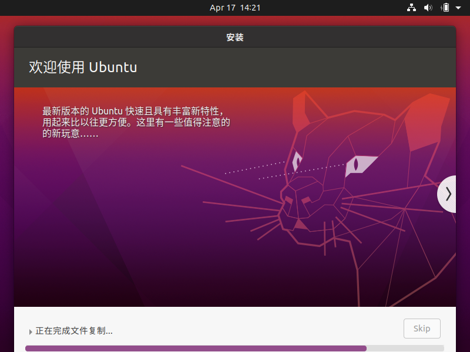

安装完成之后，会提示要重启虚拟机，以及需要输入一个`ENTER`进入。等以上步骤都顺利的完成之后，就会显示一个登录界面，那Ubuntu的安装就大功告成啦！

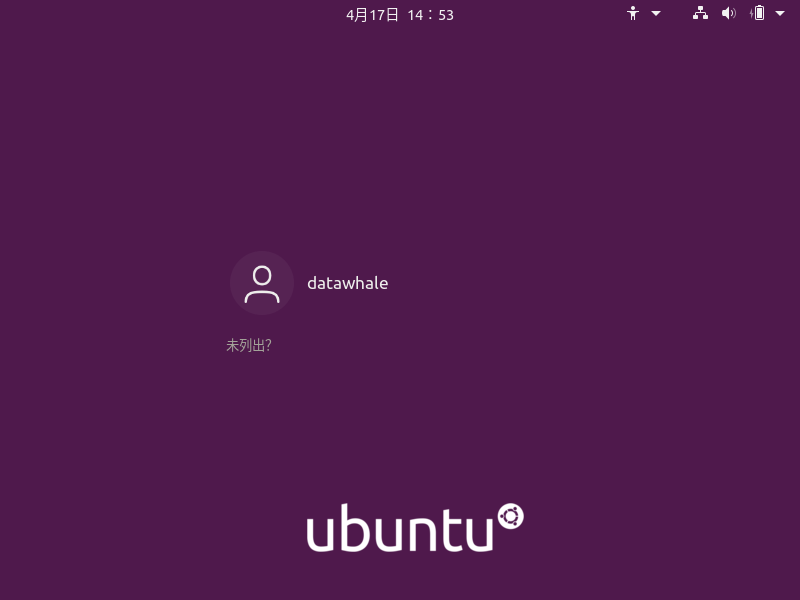


# 四、软件安装

Linux下常见的两种软件安装方式，分别是软件包安装和源码编译安装。

## 4.1、安装包安装

Linux下配置开发环境较便利，其中一个原因是Linux有很好的包管理工具。包管理工具可以在操作系统中提供安装、升级，卸载软件的方法。在Linux下，DPT和RPM是最为常见的两种包管理工具，分别应用于基于deb软件包的Linux发行版和基于rpm软件包的Linux发行版。另外还有arch linux系列的Pacman包管理工具。

### 4.1.1、deb

基于 Debian 操作系统 (UBUNTU) 的 DEB 软件包管理工具－ Dpkg，全称为 Debian Package，是一个可以安装、构建、删除及管理 Debian 软件包的命令行工具，用来制作 Debian 包的工具，同时也可以查看、解压 Debian 包。


下面是一些dpkg的普通用法：

```
dpkg -i <package.deb>
```

安装一个Debian安装包，就像是你手动下载的文件（其中`-i`等价于`--install`）


```
dpkg -c <package.deb>
```

列出`<package.deb>`的内容中包含的文件结果（其中`-c`等价于`--contents`）


```
dpkg -l <package.deb>
```

从`<package.deb>`中提取包裹信息的详细信息，包括软件名称、版本以及大小等（其中`-l`等价于`--info`）


```
dpkg -r <package>
```

移除一个已安装的包裹（软件名称可通过`dpkg -I`命令查看，其中`-r`等价于`--remove`）


```
dpkg -P <package>
```

完全清除一个已安装的包裹。和 remove 不同的是，remove 只是删掉数据和可执行文件，purge 另外还删除所有的配制文件。


```
dpkg -L <package>
```

列出`<package>`安装的软件包安装的所有文件（软件名称可通过`dpkg -I`命令查看，其中`-L`等价于`--listfiles`）


```
dpkg -l <package>
```

查看`<package>`软件包的信息（软件名称可通过`dpkg -I`命令查看，其中`-l`等价于`--list`）


```
dpkg -s <package>
```

显示已安装包裹的详细信息。同时请看 `apt-cache` 显示 Debian 存档中的包裹信息，以及 `dpkg -I` 来显示从一个 `.deb` 文件中提取的包裹信息。（软件名称可通过`dpkg -I`命令查看，其中`-s`等价于`--status`）


```
dpkg -reconfigure <package>
```

重新配制一个已经安装的包裹，如果它使用的是 `debconf` (`debconf` 为包裹安装提供了一个统一的配制界面)。

### 4.1.2、rpm格式

​	**rpm**是 `redhat` 、`fedora`、`suse` 的格式。全称为`Redhat PackageManager` ，是由`Redhat`公司提出的，用于管理`Linux`下软件包的软件。`Linux`安装时，除了几个核心模块以外，其余几乎所有的模块均通过`RPM`完成安装。

下面是一些rmp的使用指令：

```
rpm -i <package.rpm>
```

安装需要的包文件，`-iv` 在安装过程中显示正在安装的文件信息，`-ivh` 在安装过程中显示正在安装的文件信息及安装进度。

> 使用举例：
>
> - `rpm -i example.rpm `安装 `example.rpm` 包；
>
> - `rpm -iv example.rpm` 安装 `example.rpm` 包并在安装过程中显示正在安装的文件信息；
>
> - `rpm -ivh example.rpm` 安装 `example.rpm` 包并在安装过程中显示正在安装的文件信息及安装进度；
>


```
rpm -q …
```

查询指令：

- `a` 查询所有已经安装的包以下两个附加命令用于查询安装包的信息；
- `i` 显示安装包的信息；
- `l` 显示安装包中的所有文件被安装到哪些目录下；
- `s` 显示安装版中的所有文件状态及被安装到哪些目录下；

以下两个附加命令用于指定需要查询的是安装包还是已安装后的文件：

- `p` 查询的是安装包的信息；
- `f` 查询的是已安装的某文件信息；

> 使用举例：
>
> - `rpm -qa | grep tomcat4` 查看 `tomcat4` 是否被安装；
> - `rpm -qip example.rpm` 查看 `example.rpm` 安装包的信息；
> - `rpm -qif /bin/df` 查看`/bin/df` 文件所在安装包的信息；
> - `rpm -qlf /bin/df` 查看`/bin/df` 文件所在安装包中的各个文件分别被安装到哪个目录下；
>


 ```
rpm -U 需要升级的包
 ```

> 举例：`rpm -Uvh example.rpm` 升级 `example.rpm` 软件包


```
rpm -V 需要验证的包
```

> 举例：`rpm -Vf /etc/tomcat4/tomcat4.conf`

> 输出：`S.5....T c /etc/tomcat4/tomcat4.conf`

> 其中，S 表示文件大小修改过，T 表示文件日期修改过。更多的验证信息请参考rpm 帮助文件：man rpm


## 4.2、编译源码安装

首先说一下使用源代码安装软件的优点：

-   可以获得最新的软件，及时修复bug；
-   根据用户的需求，灵活定制软件功能

0. tar -xzvf soft.tar.gz  #解压一般会生成一个soft目录
1. ./configure  #检查环境变量及配置编译选项
2. make  #源代码编译成二进制文件
3. make install #将make编译出来的文件安装到指定位置(或默认位置)
   卸载：make uninstall 或 手动删除，由于软件可能将文件分散地安装在系统的多个目录中，往往很难把它删除干净， 最好在编译前进行配置，指定软件将要安装到目标路径：./configure --prefix=目录名，这样可以使用“rm -rf 软件目录名”命令来进行干净彻底的卸载。


## 4.3、在线安装

### 4.3.1、apt包管理

由于操作系统中软件包存在复杂的依赖关系，为了解决软件包的依赖性问题和获取问题，APT顺势出现了。
APT 是 Ubuntu Linux 中的命令行软件包管理工具，用于获取、安装、编译、卸载和查询 Deb 软件包，以及检查软件包的依赖关系。

apt常用命令：

```shell
sudo apt-get update                       
# 更新本地索引，即更新/var/lib/apt/lists 里边的内容
sudo apt-get upgrade                      
# 更新所有软件包
sudo apt-get install xx                 
# 安装软件
sudo apt-get remove xx
# 卸载包
sudo apt-get remove --purge name          
# 卸载并彻底清除
sudo apt-get clean                        
# 清理下载文件的存档
```

### 4.3.2、换源

在线安装，如apt包管理的软件仓库地址可能在国外，国内连接速度较慢。所以可以将软件仓库地址改为国内源码库。

Ubuntu 的软件源配置文件是 `/etc/apt/sources.list`。将系统自带的该文件做个备份，将该文件替换为下面内容，即可使用 TUNA 的软件源镜像。

用gedit命令打开sources.list文件

```shell
sudo gedit /etc/apt/sources.list
```

将内容改为下面：

```shell
# 默认注释了源码镜像以提高 apt update 速度，如有需要可自行取消注释
deb https://mirrors.tuna.tsinghua.edu.cn/ubuntu/ focal main restricted universe multiverse
# deb-src https://mirrors.tuna.tsinghua.edu.cn/ubuntu/ focal main restricted universe multiverse
deb https://mirrors.tuna.tsinghua.edu.cn/ubuntu/ focal-updates main restricted universe multiverse
# deb-src https://mirrors.tuna.tsinghua.edu.cn/ubuntu/ focal-updates main restricted universe multiverse
deb https://mirrors.tuna.tsinghua.edu.cn/ubuntu/ focal-backports main restricted universe multiverse
# deb-src https://mirrors.tuna.tsinghua.edu.cn/ubuntu/ focal-backports main restricted universe multiverse
deb https://mirrors.tuna.tsinghua.edu.cn/ubuntu/ focal-security main restricted universe multiverse
# deb-src https://mirrors.tuna.tsinghua.edu.cn/ubuntu/ focal-security main restricted universe multiverse

# 预发布软件源，不建议启用
# deb https://mirrors.tuna.tsinghua.edu.cn/ubuntu/ focal-proposed main restricted universe multiverse
# deb-src https://mirrors.tuna.tsinghua.edu.cn/ubuntu/ focal-proposed main restricted universe multiverse
```

以上为ubuntu20.04更换清华源码的一个例子。另外还有中科大等众多优秀软件仓库，大家可以自行尝试

清华源：https://mirrors.tuna.tsinghua.edu.cn/help/ubuntu/

中科大源：https://mirrors.ustc.edu.cn/help/

# 五、开源软件

## 5.1、效率工具

### 5.1.1、搜狗输入法

**1.首先安装fcitx**

在终端输入

```shell
sudo apt-get install fcitx
```


**2.进入搜狗输入法官网，选择linux版下载deb文件(ubuntu系统)**


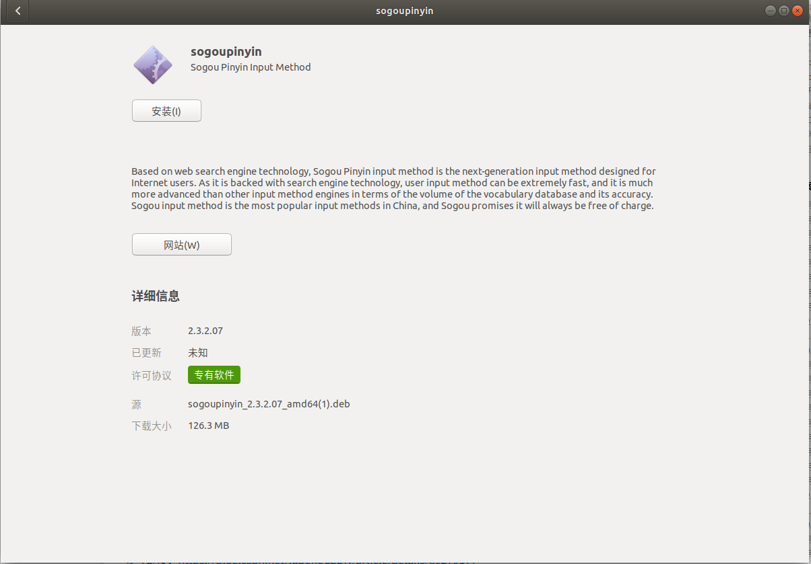


**3.打开设置，选择区域与语言，选择管理已安装的语言，在“键盘输入法系统”选择fcitx**


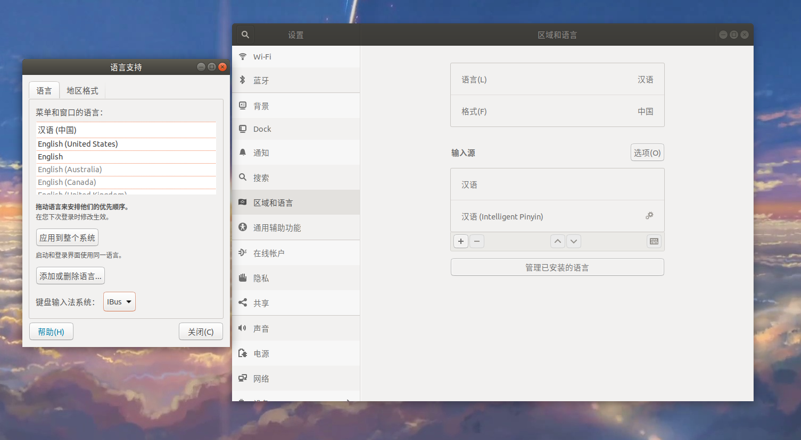


**4.可能需要重启，再屏幕右上角选择搜狗输入法即可**


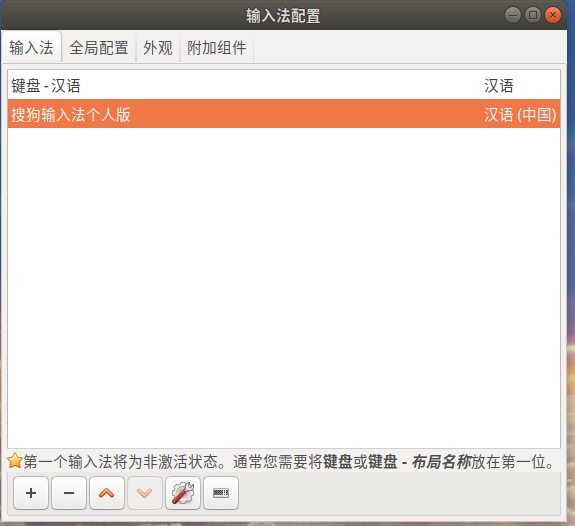

### 5.1.2、Terminator

terminator可以在同一个窗口分割出多个终端，每个终端都是独立的，适合大屏使用

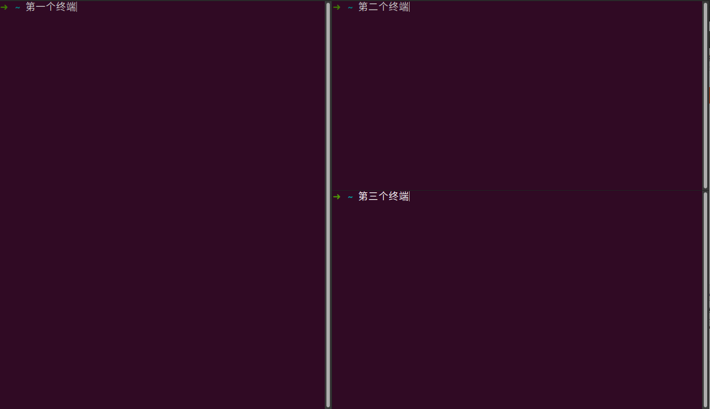


命令行安装：

```shell
sudo apt-get install terminator
```


## 5.2、开发工具

### 5.2.1、git

> Git 是一个开源的分布式版本控制系统，用于敏捷高效地处理任何或小或大的项目。


命令行安装：

```shell
sudo apt-get install git
```


### 5.2.2、vim

> Vim是从 vi 发展出来的一个文本编辑器。代码补完、编译及错误跳转等方便编程的功能特别丰富，在程序员中被广泛使用。和Emacs并列成为类Unix系统用户最喜欢的编辑器。


安装方法：

**1.首先将vim的源码克隆下来，这里因为github可能很慢，使用码云的镜像**

```shell
git clone https://gitee.com/mirrors/vim.git
```

**2.安装gcc（有则不必安装）和各依赖库**

```shell
sudo apt-get install gcc
```

```powershell
sudo apt-get install libncurses5-dev python-dev python3-dev libatk1.0-dev libbonoboui2-dev libcairo2-dev libx11-dev libxpm-dev libxt-dev
```

**3.配置与安装**

```shell
sudo ./configure --with-features=huge --enable-multibyte --enable-rubyinterp --enable-pythoninterp --enable-python3interp --enable-luainterp --enable-cscope --enable-gui=gtk3 --enable-perlinterp --with-python-config-dir=/usr/lib/python2.7/config-x86_64-linux-gnu/ --with-python3-config-dir=/usr/lib/python3.6/config-3.6m-x86_64-linux-gnu/ --prefix=/usr/local/vim8
```

--with-features=huge：支持最大特性
--enable-rubyinterp：打开对 ruby 编写的插件的支持
--enable-pythoninterp：打开对 python 编写的插件的支持
--enable-python3interp：打开对 python3 编写的插件的支持
--enable-luainterp：打开对 lua 编写的插件的支持
--enable-perlinterp：打开对 perl 编写的插件的支持
--enable-multibyte：打开多字节支持，可以在 Vim 中输入中文
--enable-cscope：打开对cscope的支持
--enable-gui=gtk3 表示生成采用 GNOME3 风格的 gvim
--with-python-config-dir=/usr/lib/python2.7/config-x86_64-linux-gnu/ 指定 python 路径
--with-python3-config-dir=/usr/lib/python3.6/config-3.6m-x86_64-linux-gnu/ 指定 python3路径(这里可以根据自己的版本做更改)
--prefix=/usr/local/vim8：指定将要安装到的路径


# 六、常用终端快捷键

以下命令仅在ubuntu系统测试，其他发行版Linux未测试

Ctrl+Alt+T 打开终端

| 快捷键           | 功能                                     |
| ---------------- | ---------------------------------------- |
| Ctrl+a           | 光标移动到开始位置                       |
| Ctrl+e           | 光标移动到最末尾                         |
| Ctrl+k           | 删除此处至末尾的所有内容                 |
| Ctrl+u           | 删除此处至开始的所有内容                 |
| Ctrl+d           | 删除当前字符                             |
| Ctrl+h           | 删除当前字符前一个字符                   |
| Ctrl+w           | 删除此处到左边的单词                     |
| Ctrl+y           | 粘贴由Ctrl+u， Ctrl+d， Ctrl+w删除的单词 |
| Ctrl+l           | 相当于clear，即清屏                      |
| Ctrl+r           | 查找历史命令                             |
| Ctrl+b           | 向回移动光标                             |
| Ctrl+f           | 向前移动光标                             |
| Ctrl+Left-Arrow  | 光标移动到上一个单词的词首               |
| Ctrl+Right-Arrow | 光标移动到下一个单词的词尾               |
| Ctrl+d           | 退出终端                                 |

