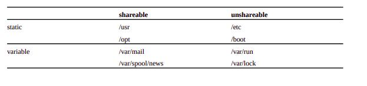
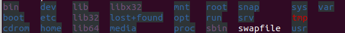

# 文件和目录管理

了解并掌握Linux文件和目录，是学好Linux重要的一部分。

对于Linux初学者，常常会对众多的目录感到困惑，如home、usr、etc、bin ...... 这些目录下又会包含许多文件。

本章将带大家深入了解Linux的文件和目录。


## 4.1、Linux目录

​		在Linux中，目录为树状结构。树状目录以 / 为起始，也称为根目录，是Linux文件系统的入口，每一个文件和目录都从这里开始。

​		因为目录繁多，各类软件安装，配置都可能存在混乱的情况。所以产生了FHS（Filesystem Hierarchy Standard）组织。FHS制定了目录规范，什么文件应该放在什么目录。根据FHS标准，Linux目录一般可分为以下四种交互状态：



static:不可变的

variable:可变的

shareable:可分享的

unshareable:不可分享的


“可共享”文件是指可以存储在一台主机上并在其他主机上使用的文件。“不可共享”文件是指那些不可共享的文件。例如，用户主目录中的文件是可共享的，而设备锁文件不是。

“静态”文件包括二进制文件、库、文档文件和其他未经系统管理员干预不会更改的文件。不可变“文件是非静态的文件。


### 4.1.1 目录详解

在Linux中，常使用 ls 命令来查看目录结构。在当前命令窗口输入

```
ls /
```

则可查看根目录下的目录0结构



以下是对这些目录的理解：

* / - 根目录

  Linux文件系统的入口，每一个文件和目录都从这里开始。

* /bin - 基本用户命令二进制文件目录

  包含系统管理员和用户都可以使用的命令

* /etc - 配置文件目录 

  本目录包含所有程序所需的配置文件。“配置文件”是用于控制程序操作的本地文件；它必须是静态的，不能是可执行的二进制文件。

* /boot - 引导文件

  目录包含系统启动过程所需的所有内容，但不包括启动时不需要的配置文件和映射安装程序。

* /dev - 设备文件

  dev 是 Device(设备) 的缩写, 该目录下存放的是 Linux 的外部设备，包括终端设备、USB或连接到系统的任何设备。在 Linux 中访问设备的方式和访问文件的方式是相同的。

* /lib - 库文件

  此目录包含引导系统和运行根文件系统中的命令所需的共享库映像，即位于/bin和/sbin中的二进制文件。这些文件可以被很多程序共享。

* /sbin - 系统二进制文件

  /sbin包含由系统管理员使用的二进制可执行文件。

* /proc - 进程信息文件

  包含系统进程的相关信息。是系统内存的映射

* /opt - 可选择文件

  opitional的意思。用于安装附加应用程序软件包。

* /lost+found

  此目录通常为空，当系统非法关机后，这里就存放了一些文件。

* /srv - 服务器数据文件

  srv代表服务。包含服务器特定服务相关的数据。

* /var - 变量文件

  这个目录下可以找到内容可能增长的文件。

  这包括 - 系统日志文件（/var/log）;包和数据库文件（/var/lib）;电子邮件（/var/mail）;打印队列（/var/spool）;锁文件（/var/lock）;多次重新启动需要的临时文件（/var/tmp）;

* /tmp - 临时文件

  包含系统和用户创建的临时文件。当系统重新启动时，这个目录下的文件都将被删除。

* /home - 用户目录

  所有用户都用home来存储个人文件
  
* /usr - 用户程序目录

  包含二进制文件、库文件、文档和二级程序的源代码。

* /mnt - 挂载目录

  此目录主要是作为挂载点使用。通常包括系统引导后被挂载的文件系统的挂载点

* /media - 可移动媒体设备

  用于挂载可移动设备的临时目录。

  

## 4.2、Linux文件

### 4.2.1、Linux文件类型

Linux中有六种文件类型，分别是普通文件，目录文件，链接文件，设备文件，套接字文件，管道文件。下面详细介绍各类文件。

* 普通文件：包括纯文本文件(ASCII)；二进制文件(binary)；数据格式的文件(data)

* 目录文件：Linux 中的目录也是文件，

* 链接文件：符号链接是指向系统上其他文件的引用，类似windows下的快捷方式。

* 设备文件：Linux 中的硬件设备如硬盘、鼠标等也都被表示为文件，即为设备文件。设备文件一般存放在 /dev/ 目录下
  * 块设备文件：存储数据以供系统存取的接口设备，如硬盘或软盘。
  * 字符设备文件：即串行端口的接口设备，例如键盘、鼠标

* 管道文件：管道是一种最基本的IPC机制，作用于有血缘关系的进程之间。一般的管道都是单向通信的，无法实现双向通信的功能。
* 套接字文件：提供进程间通信方法的文件，套接字可以实现两端通信。


占用存储空间的类型：文件、目录、符号链接。套接字、设备文件和管道是伪文件，不占用磁盘空间。


### 4.2.2、文件权限

以普通文件为例，使用 ls -l 命令，可以看到结果的第一列是 **-rwxrwxrwx** 的形式，其中第一个字符 "-" 表示这个文件为普通文件，它也可以是其他的字符，不同的字符代表不同类型的文件。其后的一串字符表明了该文件的权限。

```shell
-rwxrwxrwx  1 datawhale datawhale   3533567 5月  20 13:14  文件名.pdf

```

1）r 表明该文件具有可读权限，若该位置为 "-" ，则表明文件不可读；

2）w 表明该文件具有写权限，若该位置为 "-" ，则表明文件不可写；

3）x 表明该文件具有可执行权限，若该位置为 "-" ，则表明文件不具有可执行权限；

4）第一个 rwx 表示该文件的所有者对该文件的权限；第二个 rwx 表示该文件所属组对该文件的权限；第三个 rwx 表示其他用户对该文件的权限。


对于目录来说，rwx的意思又不太一样了

​	 r：查看目录下的文件列表

 	w：删除和创建目录下的文件

 	x：可以cd进入目录，能查看目录中文件的详细属性，能访问目录下文件内容


## 4.3、命令集合

### ls 

```shell
ls 选项 地址
```

选项与参数：

| 选项 | 描述                                                        |
| ---- | ----------------------------------------------------------- |
| -a   | 全部的文件，连同隐藏文件( 开头为 . 的文件) 一起列出来(常用) |
| -d   | 仅列出目录本身，而不是列出目录内的文件数据(常用)            |
| -l   | 长数据串列出，包含文件的属性与权限等等数据；(常用)          |


### cd 

```
cd 相对地址/绝对地址
```


### pwd 

```shell
pwd
```

选项与参数：

- **-P** ：显示出确实的路径，而非使用连结 (link) 路径。


### mkdir 

```
mkdir 选项 目录名称
```


选项与参数：

| 选项 | 描述                                                         |
| ---- | ------------------------------------------------------------ |
| -m   | 配置文件的权限喔！直接配置，不需要看默认权限 (umask) 的脸色～ |
| -p   | 帮助你直接将所需要的目录(包含上一级目录)递归创建起来！       |


### rmdir

```
 rmdir 选项 目录名称
```

选项与参数：

- **-p ：**连同上一级『空的』目录也一起删除


### cp 

```
cp 选项  源文件 目标地址/文件
```

选项与参数：

| 选项 | 描述                                                         |
| ---- | ------------------------------------------------------------ |
| -a   | 相当於 -pdr 的意思，至於 pdr 请参考下列说明；(常用)          |
| -d   | 若来源档为连结档的属性(link file)，则复制连结档属性而非文件本身； |
| -f   | 为强制(force)的意思，若目标文件已经存在且无法开启，则移除后再尝试一次； |
| -i   | 若目标档(destination)已经存在时，在覆盖时会先询问动作的进行(常用) |
| -l   | 进行硬式连结(hard link)的连结档创建，而非复制文件本身；      |
| -p   | 连同文件的属性一起复制过去，而非使用默认属性(备份常用)；     |
| -r   | 递归持续复制，用於目录的复制行为；(常用)                     |
| -s   | 复制成为符号连结档 (symbolic link)，亦即『捷径』文件；       |
| -u   | 若 destination 比 source 旧才升级 destination                |

### rm 

```
 rm 选项 文件或目录
```

选项与参数：

| 选项 | 描述                                                  |
| ---- | ----------------------------------------------------- |
| -f   | 就是 force 的意思，忽略不存在的文件，不会出现警告信息 |
| -i   | 互动模式，在删除前会询问使用者是否动作                |
| -r   | 递归删除                                              |


### mv 

```
mv 源地址/文件 目标地址/文件
```


选项与参数：

| 选项 | 描述                                                       |
| ---- | ---------------------------------------------------------- |
| -f   | force 强制的意思，如果目标文件已经存在，不会询问而直接覆盖 |
| -i   | 若目标文件 (destination) 已经存在时，就会询问是否覆盖      |
| -u   | 若目标文件已经存在，且 source 比较新，才会升级 (update)    |


### cat

由第一行开始显示文件内容

语法：

```
cat 选项 目标文件地址
```

选项与参数：

| 选项 | 描述                                                       |
| ---- | ---------------------------------------------------------- |
| -A   | 相当於 -vET 的整合选项，可列出一些特殊字符而不是空白而已； |
| -b   | 列出行号，仅针对非空白行做行号显示，空白行不标行号！       |
| -E   | 将结尾的断行字节 $ 显示出来；                              |
| -n   | 列印出行号，连同空白行也会有行号，与 -b 的选项不同；       |
| -T   | 将 [tab] 按键以 ^I 显示出来；                              |
| -v   | 列出一些看不出来的特殊字符                                 |


### ln

**1）软链接**

　　软链接（又称符号链接），可以理解为快捷方式，如果删除原文件，则对应的软链接文件也会消失。

```
ln -s test.txt test_softlink
```

　　软链接相当于给原文件创建了一个快捷方式，如果删除原文件，则对应的软链接文件也会消失。

**2）硬链接**

　　硬链接，相当于给原文件取了个别名，其实两者是同一个文件，删除二者中任何一个，另一个不会消失；对其中任何一个进行更改，另一个的内容也会随之改变，因为这两个本质上是同一个文件，只是名字不同。

```
ln test.txt test_hardlink
```

## 

## 参考资料

[1] http://www.pathname.com/fhs/


