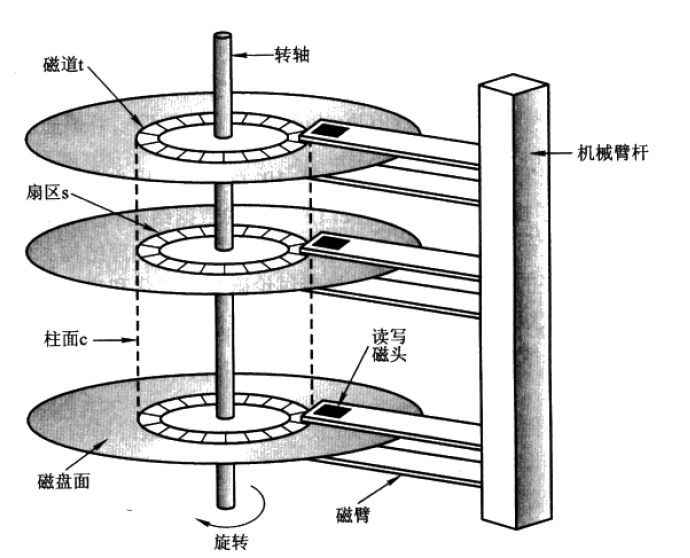
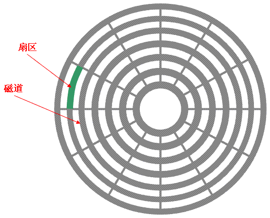
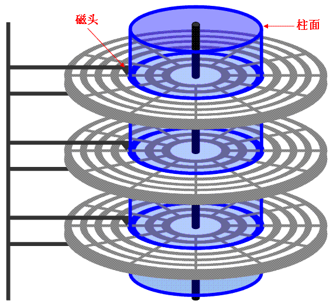

# 5、Linux磁盘管理

## 5.1、什么是磁盘

> 磁盘（disk）是指利用磁记录技术存储数据的存储器。
>
> 磁盘是计算机主要的存储介质，可以存储大量的二进制数据，并且断电后也能保持数据不丢失。早期计算机使用的磁盘是软磁盘（Floppy Disk，简称软盘），如今常用的磁盘是硬磁盘（Hard disk，简称硬盘）。
>
>  
>
> ——百度百科


**磁盘运行原理：**

简单来说就是多个盘片之间靠主轴连接，电机带动主轴做旋转运动，通过多个磁头臂的摇摆和磁盘的旋转，磁头就可以在磁盘旋转的过程中就读取到磁盘中存储的各种数据



​															()

**磁盘的扇区、磁道、柱面：**
（1）磁道：磁盘的每个盘片被划分为许多同心圆，划分园的线条叫做磁道。

（2）扇区：硬盘的盘片被磁道划分成多个扇区。硬盘的读写以扇区为基本单位



（3）柱面：每一个盘片同一大小的同心圆可以看成连在一起的柱面，磁盘在分区的时候最小单位是柱面，每一个盘片的上下面都可以读取数据，每一个磁头，不可以跨盘面读取数据。




## 5.2、磁盘管理

Linux磁盘管理通常分成五个步骤，首先是添加硬盘，做RAID或逻辑卷LVM，然后进行分区，对分区进行格式化，最后挂载到文件系统中。

### 5.2.1、添加硬盘

当给计算机添加了一个新硬盘，我们可以怎么利用它呢？

首先简单介绍一下RAID和LVM的概念


**RAID**

磁盘阵列（Redundant Arrays of Independent Disks，RAID）。磁盘阵列是由很多块独立的磁盘，组合成一个容量巨大的磁盘组，利用个别磁盘提供数据所产生加成效果提升整个磁盘系统效能。利用这项技术，将数据切割成许多区段，分别存放在各个硬盘上。

以下是几种RAID模式：

* RAID0

  RAID0将数据分散在n个磁盘中，以独立的方式并行读取n个磁盘的数据，理论上，一个由n块磁盘组成的RAID0是单个磁盘性能的n倍。

* RAID1

  将数据分别写到两组磁盘中，分别为工作磁盘和镜像磁盘，相当于做了一次冗余，安全性高，但是成本也高。

* RAID10

  RAID10兼备了RAID1和RAID0的有优点。首先基于RAID1模式将磁盘分为2份，当要写入数据的时候，将所有的数据在两份磁盘上同时写入，相当于写了双份数据，起到了数据保障的作用。且在每一份磁盘上又会基于RAID0技术讲数据分为N份并发的读写，这样也保障了数据的效率。


**LVM**

LVM是 Logical Volume Manager（逻辑卷管理）的简写，它是Linux环境下对磁盘分区进行管理的一种机制。

LVM将一个或多个硬盘的分区在逻辑上集合，相当于一个大硬盘来使用，当硬盘的空间不够使用的时候，可以继续将其它的硬盘的分区加入其中，这样可以实现磁盘空间的动态管理，相对于普通的磁盘分区有很大的灵活性。

与传统的磁盘与分区相比，LVM为计算机提供了更高层次的磁盘存储。它使系统管理员可以更方便的为应用与用户分配存储空间。在LVM管理下的存储卷可以按需要随时改变大小与移除(可能需对文件系统工具进行升级)。LVM也允许按用户组对存储卷进行管理，允许管理员用更直观的名称(如"sales'、 'development')代替物理磁盘名(如'sda'、'sdb')来标识存储卷。

### 5.2.2、分区

当硬盘添加成功后，便可以对硬盘进行分区了。


#### 5.2.2.1、为什么要分区

（1）方便管理，文件种类繁多的时候不易造成混乱。

（2）有利于数据的安全：
通过分区可以降低数据损失的风险。出现硬盘坏道、错误操作、重装系统都有可能造成数据损失，如果分区了，那么我们就可以将损失最小化。


#### 5.2.2.2、Linux分区原理

**磁盘分区类型**

1、主分区

1)系统中必须要存在的分区,系统盘选择主分区安装

2)数字编号只能是1-4.sda1、sda2、sda3、sda4

3)主分区最多四个,最少一个。

2、扩展分区

1)相当于一个独立的小磁盘。独立的分区表,不能独立存在。

2)有独立的分区表。

3)不能独立存在,即不能直接存放数据

4)必须在扩展分区上建立逻辑分区才能存放数据

5)占用主分区的编号(主分区+扩展分区)之和最多4个

3、逻辑分区

1)数字编号只能是从5开始

2)存放于扩展分区之上

3)存放任意普通数据

**磁盘分区方式**

①1~4个主分区

②扩展分区至多能有一个，且 2 ≤ 扩展分区+主分区≤ 4

磁盘是按柱面分区的。（提升读写速率）

磁盘分区登记的地点：磁盘分区表。（存放分区结果信息，位置：0磁道0磁头1扇区）

1扇区的前446字节（系统引导信息），随后64字节（分区表），最后两个字节（分区结束标志）。

一个分区信息固定占16字节，所以只能有64/16=4个分区。

#### 5.2.2.3、分区常用命令

fdisk是一个创建和维护分区表的程序，它兼容DOS类型的分区表、BSD或者SUN类型的磁盘列表。

```
fdisk [必要参数][选择参数]
```

**必要参数：**

- -l 列出素所有分区表
- -u 与"-l"搭配使用，显示分区数目

**选择参数：**

- -s<分区编号> 指定分区
- -v 版本信息

**菜单操作说明**

- m ：显示菜单和帮助信息
- a ：活动分区标记/引导分区
- d ：删除分区
- l ：显示分区类型
- n ：新建分区
- p ：显示分区信息
- q ：退出不保存
- t ：设置分区号
- v ：进行分区检查
- w ：保存修改
- x ：扩展应用，高级功能


### 5.2.3、格式化

#### 5.2.3.1、为什么要格式化

1、认识格式化：
格式化：指将分区格式化成不同的文件系统。
那什么是文件系统呢？
文件系统：指操作系统用于明确存储设备或分区上的文件的方法和数据结构：即在存储设备上组织文件的方法。就好比一个教室，同学们的坐的位置总是与桌子凳子排列的方式有关系。桌子，凳子怎么摆放，就导致了同学坐的位置在哪里。文件系统存放数据也是这么个道理。

2、Linux系统下的文件类型：
Linux下的文件类型有ext2、ext3、ext4、xfs等等，我们可以使用命令：mkfs．　然后用按TAB、TAB来查看都有哪些文件类型。


#### 5.2.3.2、格式化常用命令

mkfs（make filesystem）


```
mkfs [-t 文件系统格式] 装置文件名
```


### 5.2.4、挂载

#### 5.2.4.1、什么是挂载

在Linux 系统中一切皆文件，所有文件都放置在以根目录为树根的树形目录结构中。在 Linux 看来，任何硬件设备也都是文件，它们各有自己的一套文件系统（文件目录结构）。挂载，指的就是将设备文件中的顶级目录连接到 Linux 根目录下的某一目录，访问此目录就等同于访问设备文件。

Linux 的磁盘挂载使用 `mount` 命令，卸载使用 `umount` 命令。


#### 5.2.4.2 挂载常用命令

```
mount [-t 文件系统] [-L Label名] [-o 额外选项] [-n]  装置文件名  挂载点
```


**挂接光盘镜像文件**

**1、从光盘制作光盘镜像文件。将光盘放入光驱，执行下面的命令。**

```
#cp /dev/cdrom /home/sunky/mydisk.iso 或 
#dd if=/dev/cdrom of=/home/sunky/mydisk.iso
```

注：执行上面的任何一条命令都可将当前光驱里的光盘制作成光盘镜像文件/home/sunky/mydisk.iso

**2、将文件和目录制作成光盘镜像文件，执行下面的命令。**

```
#mkisofs -r -J -V mydisk -o /home/sunky/mydisk.iso /home/sunky/ mydir
```

注：这条命令将/home/sunky/mydir目录下所有的目录和文件制作成光盘镜像文件/home/sunky/mydisk.iso，光盘卷标为：mydisk

**3、光盘镜像文件的挂接(mount)**

```
#mkdir /mnt/vcdrom
```

注：建立一个目录用来作挂接点(mount point)

```
#mount -o loop -t iso9660 /home/sunky/mydisk.iso /mnt/vcdrom
```

注：使用/mnt/vcdrom就可以访问光盘镜像文件mydisk.iso里的所有文件了。

**挂接移动硬盘**

对[linux系统](https://www.linuxprobe.com/)而言，USB接口的移动硬盘是当作SCSI设备对待的。插入移动硬盘之前，应先用fdisk –l或more /proc/partitions查看系统的硬盘和硬盘分区情况。

```
[root at pldyrouter /]# fdisk -l
```

接好移动硬盘后，再用fdisk –l或more。
/proc/partitions查看系统的硬盘和硬盘分区情况，应该可以发现多了一个SCSI硬盘/dev/sdc和它的两个磁盘分区/dev
/sdc1、/dev/sdc2，其中/dev/sdc5是/dev/sdc2分区的逻辑分区，我们可以使用下面的命令挂接/dev/sdc1和
/dev/sdc5。

```
#mkdir -p /mnt/usbhd1 
#mkdir -p /mnt/usbhd2
```

注：建立目录用来作挂接点(mount point)

```
#mount -t ntfs /dev/sdc1 /mnt/usbhd1 
#mount -t vfat /dev/sdc5 /mnt/usbhd2
```

注：对ntfs格式的磁盘分区应使用-t ntfs参数，对fat32格式的磁盘分区应使用-t vfat参数。若汉字文件名显示为乱码或不显示，可以使用下面的命令格式。

```
#mount -t ntfs -o iocharset=cp936 /dev/sdc1 /mnt/usbhd1 
#mount -t vfat -o iocharset=cp936 /dev/sdc5 /mnt/usbhd2
```

linux系统下使用fdisk分区命令和mkfs文件系统创建命令可以将移动硬盘的分区制作成linux系统所特有的ext2、ext3格式。这样，在linux下使用就更方便了。使用下面的命令直接挂接即可。

```
#mount /dev/sdc1 /mnt/usbhd1
```

**挂接U盘**

和USB接口的移动硬盘一样对linux系统而言U盘也是当作SCSI设备对待的。使用方法和移动硬盘完全一样。插入U盘之前，应先用fdisk –l 或more /proc/partitions查看系统的硬盘和硬盘分区情况。

```
[root at pldyrouter root]# fdisk -l
```

插入U盘后，再用fdisk –l 或 more /proc/partitions查看系统的硬盘和硬盘分区情况。

```
[root at pldyrouter root]# fdisk -l
```

系统多了一个SCSI硬盘/dev/sdd和一个磁盘分区/dev/sdd1,/dev/sdd1就是我们要挂接的U盘。

```
#mkdir -p /mnt/usb
```

注：建立一个目录用来作挂接点(mount point)

```
#mount -t vfat /dev/sdd1 /mnt/usb
```

注：现在可以通过/mnt/usb来访问U盘了, 若汉字文件名显示为乱码或不显示，可以使用下面的命令。

```
#mount -t vfat -o iocharset=cp936 /dev/sdd1 /mnt/usb
```

## 参考资料

[1] 《大学计算机基础》编写组编写．大学计算机基础：中国铁道出版社，2015.09

