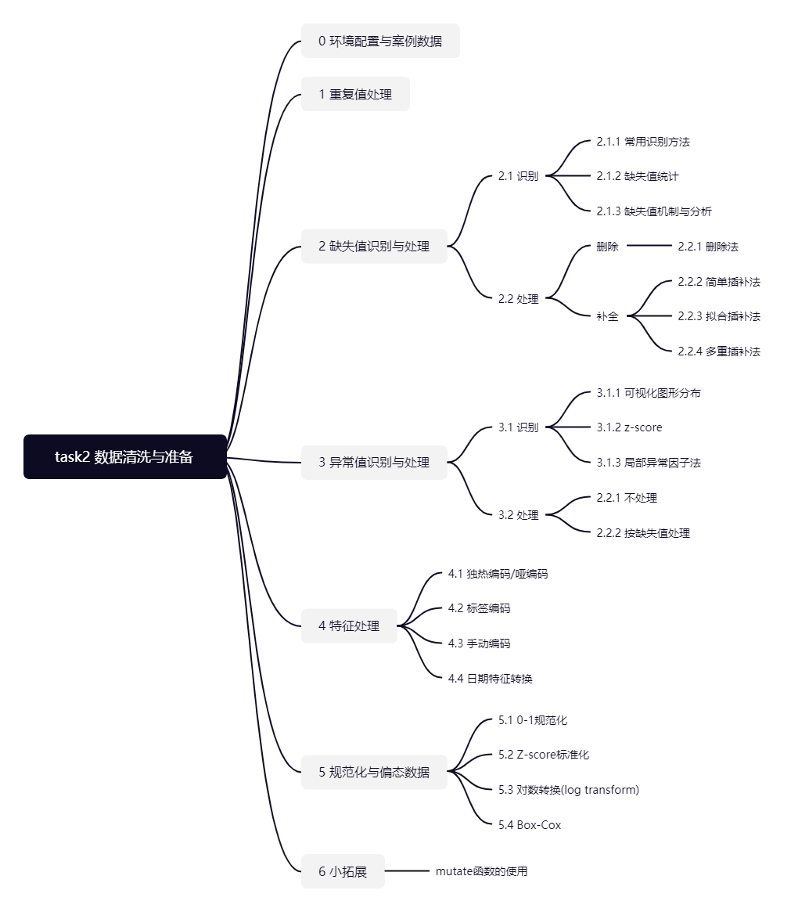
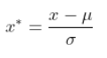
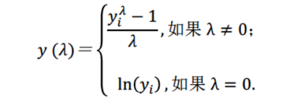

# 数据清洗与准备 {#task-02}

{width=100%}

Task 02共计6个知识点，预计需学习5~8小时，请安排好学习任务。

## 环境配置 {-}
```{r, message=FALSE}
library(mlbench) # 将会使用到包中的BostonHousing数据集
library(funModeling) # 探索性数据分析工具包，本节内容中将会使用到它的status()函数，打印整体数据质量
library(tidyverse) # 数据转化工具包，本节内容中将会使用它包含的dplyr中的管道函数 %>%
library(VIM) # 缺失值可视化工具包，本节内容中将会使用到它的aggr()函数
library(mice) # 缺失值处理工具包，本节内容会使用它来进行多重插补
library(Rlof) # 用于LOF异常值检测方法，本节内容将会使用到它的lof()函数
library(fastDummies) # 用于生成dummy的包，本节内容将会使用到它的dummy_cols()函数
library(sjmisc) # 用于生成dummy的包，本节内容将会使用到它的to_dummy()函数
library(MASS) # 基于此包进行box-cox转换
library(dlookr) # 本节内容将会使用到它的transform()函数
```

## 案例数据 {-}

本节内容将会使用到两个数据集。

### 数据集1 h1n1流感问卷数据集 {-}

#### 数据说明 {-}

目前提供的数据集来自关于h1n1流感调查问卷的部分内容，可以从这个网站上看到具体字段的详细说明：https://www.drivendata.org/competitions/66/flu-shot-learning/page/211/

数据集包含26,707个受访者数据，共有32个特征+1个标签（是否接种h1n1疫苗）。
 
#### 加载并查看部分数据 {-}

首先加载数据，了解数据集大小。

```{r}
h1n1_data <- read.csv("./datasets/h1n1_flu.csv", header = TRUE)
dim(h1n1_data)
```

注：为了简化本章的示例，我们在这32个特征中，筛选出了10个特征，作为一个子集，来学习如何使用R做数据清洗与准备。如有兴趣，可以把下面这块筛选去掉，自己用完整数据集做一次探索。

```{r }
h1n1_data <- h1n1_data[, c(1, 3, 11, 12, 15, 16, 19, 20, 22, 23, 33)]
head(h1n1_data)
```

### 数据集2 波士顿房价数据集 {-}

#### 数据说明 {-}
数据集来自`mlbench`包，请提前装好。数据字段说明可从网址查看：https://blog.csdn.net/weixin_46027193/article/details/112238597

数据集包含506条房价信息，共有13个特征+1个预测字段（房屋价格）。

#### 加载并查看部分数据 {-}
```{r }
data(BostonHousing)
dim(BostonHousing)
head(BostonHousing)
```

## 重复值处理

在某些情况下，我们需要对数据进行去重处理。`unique()`函数可以对数据进行整体去重，`distinct()`函数可以针对某些列去重。

```{r }
# 整体去重
h1n1_data_de_dup1 <- unique(h1n1_data)

# 指定根据列respondent_id,h1n1_knowledge去重，并保留所有列
h1n1_data_de_dup2 <- distinct(h1n1_data, respondent_id, h1n1_knowledge, .keep_all = T)
```


## 缺失值识别与处理

现实环境中，由于数据来源及搜集过程，可能有各种不规范，导致数据往往会存在缺失。缺失值识别与处理，无论是在统计还是数据管理中，往往是数据清洗的第一步。

### 缺失值识别

#### 常用识别方法

在R语言中，惯用会把缺失值表示为NA，一般可使用`is.na(a)`，`!complete.cases(a)`来识别`a`是否为缺失值。
```{r }
# 假设定义的一个变量中存在缺失值
y <- c(1, 2, 3, NA)

# 用is.na在识别是否为缺失值
is.na(y)

# 用!complete.cases()在识别是否为缺失值
!complete.cases(y)
```

#### 缺失值统计

统计缺失值总数。
```{r }
# 数据集中总缺失数据量
sum(is.na(h1n1_data))

# 数据集中某一列缺失数据量
sum(is.na(h1n1_data["h1n1_knowledge"]))
```

如果想按行或按列统计，可以写函数。

```{r }
pMiss <- function(x) {
  sum(is.na(x)) / length(x) * 100
}
apply(h1n1_data, 2, pMiss) # 按列统计缺失比率%
# apply(h1n1_data,1,pMiss) #按行统计缺失比率%
```

或调用一些现成的包。比如，我们可以使用`funModeling`包中的`status()`函数，直接观测案例数据中包含的0值，缺失值（NA），在每个特征中的分布情况。以h1n1 flu数据集为例：

```{r }
data_quality <- status(h1n1_data)
data_quality %>% mutate(across(where(is.numeric), ~ round(., 3))) # 保留4位小数
```

结合案例数据h1n1 flu来看，存在缺失值的有5个特征字段。

```{r}
missing_Value <- data_quality[which(data_quality$p_na > 0), ]
missing_Value$variable
```
#### 缺失值机制与分析

统计学家通常将缺失数据分为3类，为了更好的处理缺失值，我们可以基于缺失值机制来识别以下3种缺失模式：

* MCAR（完全随机缺失）：如果数据的缺失与任何值（观察或缺失）之间没有关系，则为MCAR。
* MAR（随机缺失）：考虑MAR与MCAR有何不同，如果缺失和观测值之间存在系统关系，则为MAR。例如-男性比女性更容易告诉自己的体重，因此体重就是MAR。“ Weight”变量的缺失取决于变量"Sex"的观测值。
* MNAR（非随机缺失）：若缺失数据不属于MCAR和MAR，数据的缺失依赖于不完全变量本身，则数据为非随机缺失。例如，抑郁程度高的人更不容易填写抑郁调查问卷。

MNAR是最复杂的情况，处理 MNAR的策略是找到更多有关缺失原因的数据，或者执行假设分析，查看结果在各种情况下的敏感程度。大部分处理缺失数据的方法都假定数据是MCAR或MAR，此时，可以忽略缺失数据的生成机制，在替换或删除缺失数据后，直接对感兴趣的关系进行建模。

以下介绍几种可视化分析缺失数据关联的方法：

我们用`VIM`包里的`aggr()`函数，直观看一下具体的缺失情况。
```{r }
aggr(h1n1_data, cex.axis = .6, oma = c(9, 5, 5, 1)) # cex.axis调整轴字体大小，oma调整外边框大小
```

通过用`VIM`包里的矩阵图`matrixplot()`函数，可以检查某些变量的缺失值模式是否与其他变量的真实值有关联。矩阵图中，观测数据以黑白色阶显示（颜色越深，数值越高），缺失值会被标记为红色。我们对某一个存在缺失值的变量进行排序，来找寻含缺失值变量与其他变量的关系。

在此案例中，我们按照`health_insurance`进行分组排序。可以看到是否有慢性病`chronic_med_condition`的缺失，与`opinion_h1n1_vacc_effective`的缺失相对较集中。除此之外，也可以看到有慢性病的人年龄普遍较大。

```{r }
# 先简单处理一下一些类别变量的顺序
h1n1_data_matplt <- h1n1_data
h1n1_data_matplt$age_group <- factor(h1n1_data_matplt$age_group)
h1n1_data_matplt$education <- factor(h1n1_data_matplt$education, levels = c("", "< 12 Years", "12 Years", "Some College", "College Graduate"))
h1n1_data_matplt$sex <- factor(h1n1_data_matplt$sex)
h1n1_data_matplt$income_poverty <- factor(h1n1_data_matplt$income_poverty, levels = c("18 - 34 Years", "<= $75,000, Above Poverty", "> $75,000"))
# levels(h1n1_data_matplt$age_group) # 查看顺序

# 矩阵图可视化
par(mar = c(9, 4.1, 2.1, 2.1)) # x轴标签太长，调用par()函数调整外边框的大小
matrixplot(h1n1_data_matplt, sortby = "chronic_med_condition", cex.axis = 0.7) # cex.axis为调整坐标轴字体大小
```

用相关性探索缺失值。首先生成一个影子矩阵，用指示变量替代数据集中的数据（1表示缺失，0表示存在）。

```{r }
shadow_mat <- as.data.frame(abs(is.na(h1n1_data[, -1])))
head(shadow_mat)
```

```{r }
# 可提取含缺失值的变量
shadow_mat <- shadow_mat[which(apply(shadow_mat, 2, sum) > 0)]

# 计算相关系数
cor(shadow_mat)

# 相关系数热力图
heatmap(cor(shadow_mat))
```

根据缺失相关性矩阵，`opinion_h1n1_vacc_effective ` 与 `chronic_med_condition` 缺失相关性较大。

综上，在案例中，变量之间的存在部分相关性，考虑为MAR。

其他数据缺失关系分析，可参考附录`数据的预处理基础`。

### 缺失值处理

缺失值一般有三种方式：

* 将缺失值作为变量值使用。比如在民意调查中，当选民不投票时，可以将缺失值处理为"无法确定"。
* 删除数据。主要有删除样本值和删除特征值。但可能会损失掉一些有用信息。
* 插补法。如均值/中位数/同类均值插补（数值变量），众数插补（类别变量），手动插补(根据主观理解)，多重插补等。

以下我们主要介绍删除法和插补法：

#### 删除法

行删除，可以直接用`complete.cases()`或`na.omit()`来过滤掉数据集中所有缺失行。
```{r }
h1n1_data_row_del1 <- h1n1_data[!complete.cases(h1n1_data), ]
h1n1_data_row_del2 <- na.omit(h1n1_data)
```

列删除，一般对于缺失率极高又没有太大作用的特征值，我们直接删除，如可以用`dataset[,-5]`去掉第五列，或` subset(dataset, select = -c(col1, col2))`去掉列col1和列col2。

比如，我们把`health_insurance`变量删除。

```{r }
h1n1_data_col_del1 <- subset(h1n1_data, select = -c(health_insurance))
```

#### 简单插补法

注意在空值插补的时候，要区分类别变量与数值变量，均值插补不适用于类别变量。我们这里随机选择了一个变量演示`impute()`函数用法，在实际插补的时候，请大家根据情况进行选择。

```{r }
h1n1_data_sim_imp <- h1n1_data
h1n1_data_sim_imp$h1n1_knowledge <- impute(h1n1_data_sim_imp$h1n1_knowledge, 1) # 填充特定值
h1n1_data_sim_imp$h1n1_knowledge <- impute(h1n1_data_sim_imp$h1n1_knowledge, median) # 插补中位数
h1n1_data_sim_imp$h1n1_knowledge <- impute(h1n1_data_sim_imp$h1n1_knowledge, mean) # 插补均值
```

#### 拟合插补法

利用有监督的机器学习方法，比如回归、最邻近、随机森林、支持向量机等模型，对缺失值作预测。


#### 多重插补法

多重插补（MI）是一种基于重复模拟的处理缺失值的方法。其思想来源于贝叶斯估计，认为待插补的值是随机的，它的值来自于已观测到的值。具体实践上通常是估计出待插补的值，然后再加上不同的噪声，形成多组可选插补值（通常是3到10个）。根据某种选择依据，选取最合适的插补值。与单个插补（例如均值）相比，创建多个插补可解决缺失值的不确定性。 R中可利用`Amelia`、`mice`和`mi`包来执行这些操作。

本节中，我们将用案例介绍mice包（通过链式方程进行的多元插补）提供的方法。使用mice生成m个完整的插补数据集。然后利用`with-pool`的方法来评估选择哪一个数据集。首先使用`with()`函数依次对每个完整数据集应用统计模型如lm，glm等，用`summary()`输出数据集检验，看某数据集是否合格。接下来`pool()`函数把5个回归模型汇总，用`summary()`输出汇总数据集检验，查看整体插补方法是否合格。检验结果分析可参考附录`mice检验结果解释`

{width=60%}

```{r }
# 先处理下数据，把数据集中一些类别变量转换回来

# imp是一个包含m个插补数据集的列表对象，同时还含有完成插补过程的信息。
# 参数m的默认值为5，这里我们将m设为4，生成4个无缺失数据集
# 参数method, 对于每个变量的拟合，可以指定所用的拟合方法,method传入的参数可以是一个具体方法，也可以为不同列指定具体方法，具体方法选择可参考附录mice使用文档。这里我们使用默认值。
imp <- mice(h1n1_data, m = 4, seed = 122, printFlag = FALSE)

# 查看变量h1n1_knowledge在几个插补数据集中的插补结果
# imp$imp$h1n1_knowledge

# 查看每个变量所用的插补方法
# imp$method

# 设定应用于m个插补数据集的统计分析方法。方法包括做线性回归模型的lm()函数、做广义线性模型的glm()函数、做广义可加模型的gam()，做负二项模型的nbrm()函数
fit <- with(imp, lm(h1n1_vaccine ~ h1n1_knowledge + doctor_recc_h1n1 + chronic_med_condition + health_insurance + opinion_h1n1_vacc_effective))

# 输出每个数据集检验
print.data.frame(summary(fit), digits = 4)

# 包含m个统计分析平均结果的列表对象
pooled <- pool(fit)

# 这是一个总体评估结果
pooled

# 这里修改action的参数（范围1-m），选择一个数据集作为我们已填充完成的数据集
h1n1_data_complete <- complete(imp, action = 2)
```


## 异常值识别与处理

### 异常值识别

本节的异常值指离群点。为了让数据统计或数据建模更加准确，我们通常会识别并对处理一些离群点。有些模型会对异常值较敏感，参考附录`什么样的模型对缺失值更敏感?`。
总的来说，有几种常用方法，包括可视化图形分布识别（箱线图）、z-score识别、局部异常因子法（LOF法）、聚类法等。

我们这里用波士顿房价数据集来演示一下异常值识别的处理过程。

### 可视化图形分布

首先是可视化图形分布识别，将数值型变量筛选出来，用boxlpot看看分布。

```{r }
# 提取数值字段
nums <- unlist(lapply(BostonHousing, is.numeric))
nums_data <- BostonHousing[, nums]

# 数据变形
nums_data.new <- nums_data %>%
  as.data.frame() %>%
  mutate(Cell = rownames(.)) %>%
  gather(., key = colname, value = "value", -Cell)

# 用ggplot画出箱线图
ggplot(data = nums_data.new, aes(x = colname, y = value)) +
  geom_boxplot(aes(1)) +
  facet_wrap(~colname, scales = "free") +
  theme_grey() +
  labs(title = "Outlier Detection On Numeric Data By Boxplot", x = "Numeric Columns", y = "") +
  theme(legend.position = "top") +
  theme_bw()
```

通过可视化分布，可以选择剔除一些不合理的离群值，比如在数据集中将dis>10.0的数据剔除。

### z-score

z-score是一种一维或低维特征空间中参数异常检测方法。它假定数据是高斯分布，异常值是分布尾部的数据点，因此远离数据的平均值。一般将z-score低于-3或高于3的数据看成是异常值。

```{r }
# 定义一个识别异常点的函数，x是输入数据（matrix或df）,zs是异常临界值，z-score超过zs的被识别为异常点
outliers <- function(x, zs) {
  temp <- abs(apply(x, 1, scale))
  return(x[temp > zs])
}
# 打印出z-score<3的值
outliers(nums_data, 3)
```

### 局部异常因子法

局部异常因子法(LOF)，是一种无监督的离群检测方法，是基于密度的离群点检测方法中一个比较有代表性的算法。适用于在中等高维数据集上执行异常值检测。

```{r }
# k是计算局部异常因子所需要判断异常点周围的点的个数
outlier_score <- lof(data = nums_data, k = 5)

# 绘制异常值得分的直方分布图
hist(outlier_score, col = "#8ac6d1")

# 排序，挑出得分排前五的数据（找到索引）作为异常值
names(outlier_score) <- 1:nrow(nums_data)
sort(outlier_score, decreasing = TRUE)[1:5]
```

### 异常值处理

首先需要确定是否是真的异常值，有些值虽然离群，但其实并不是异常值，处理掉反而会影响后续任务的准确性。 如果确定需要处理，可以参考缺失值的处理方式进行处理。

## 特征编码

为什么要进行特征编码？我们拿到的原始数据中，一般会有一些类别变量，但是在统计或机器学习中，我们通常需要把类别变量转化为数值型变量，才能应用于一些方法中。

### 独热编码/哑编码

One-hot encoding 和 dummy,是将类别变量扩充为多个只显示1，0的变量，每个变量代表原类别变量中的一个类。 注意他们之间的区别：https://www.cnblogs.com/lianyingteng/p/7792693.html

* 优点：解决了分类器不好处理分类数据的问题，在一定程度上也起到了扩充特征的作用。它的值只有0和1，不同的类型存储在垂直的空间。   
* 缺点：当类别的数量很多时，特征空间会变得非常大，容易造成维度灾难。（为避免维度灾难，后续可以考虑降维处理）

R里面有很多现成的转化编码的包，我们这里使用了`dummy_cols()`函数做演示，可以看到原来的类别类型字段，已经扩充为多个0，1编码的字段。

```{r }
h1n1_data_dummy <- dummy_cols(subset(h1n1_data_complete, select = c(age_group)), select_columns = c("age_group"))
head(h1n1_data_dummy)
```

### 标签编码

标签编码(Label Encoder)是将类别变量转换成连续的数值型变量，通常对有序的变量进行标签编码，既保留了顺序信息，也节约了空间（不会扩充变量）

R里有一个特殊的结构factor（factor是有序的分类变量），我们这里可以利用factor来做标签编码。首先根据实际情况设置factor的类别顺序，然后直接用`as.numeric()`转化为数字。

```{r }
h1n1_data_complete_lab_encoder <- h1n1_data_complete
h1n1_data_complete_lab_encoder$income_poverty_lab_encoder <- as.numeric(factor(h1n1_data_complete_lab_encoder$income_poverty, levels = c("Below Poverty", "<= $75,000, Above Poverty", "> $75,000")))
head(subset(h1n1_data_complete_lab_encoder, select = c(income_poverty, income_poverty_lab_encoder)))
```

### 手动编码

比如，当某一个特征中有很多类别，我们认为某些类别可以合为一类，可以用`case_when()`函数手动处理。

```{r }
h1n1_data_manual <- subset(h1n1_data_complete, select = c(age_group))
h1n1_data_manual$age_group_manual <- case_when(
  h1n1_data_manual$age_group %in% c("18 - 34 Years") ~ 1,
  h1n1_data_manual$age_group %in% c("35 - 44 Years", "45 - 54 Years", "55 - 64 Years") ~ 2,
  h1n1_data_manual$age_group %in% c("65+ Years") ~ 3
)
head(h1n1_data_manual)
```

### 日期特征转换

参考附录`R语言日期时间处理`


## 规范化与偏态数据

为什么要数据规范化？简单来说是为了去除数据量纲和数据大小的差异，确保数据是在同一量纲或者同一数量级下进行比较，一般用在机器学习算法之前。数据规范化又可以使用0-1规范化，Z-score等方法。
为什么要处理偏态数据？。很多模型会假设数据或参数服从正态分布。例如线性回归(linear regression)，它假设误差服从正态分布。

提示：注意在测试数据与训练数据分布差别很大的情况下，对测试数据运用一些规范化方法时，可能因为数据分布不匹配而带来误差。

这里我们使用波士顿房价数据集来做演示。可以看到图中数据的偏态分布及量纲差别。

```{r }
BostonHousing %>%
  keep(is.numeric) %>%
  gather() %>%
  ggplot(aes(value)) +
  facet_wrap(~key, scales = "free") +
  geom_density(color = "#348498", fill = "#8ac6d1") +
  theme_bw()
```

### 0-1规范化

0-1规范化是将原始数据缩放到[0,1]区间内，一般方法是最小最大规范的方法，公式如下：

{width=20%}

这里用循环计算出每一列的最大最小值，再根据公式求出缩放后的数据。

```{r }
nums_data_norm1 <- nums_data
for (col in names(nums_data_norm1))
{
  xmin <- min(nums_data_norm1[col])
  xmax <- max(nums_data_norm1[col])
  nums_data_norm1[col] <- (nums_data_norm1[col] - xmin) / (xmax - xmin)
}

head(nums_data_norm1)
```

转换完再看一下分布，已经缩放到0-1之间了。

```{r }
nums_data_norm1 %>%
  keep(is.numeric) %>%
  gather() %>%
  ggplot(aes(value)) +
  facet_wrap(~key, scales = "free") +
  geom_density(color = "#348498", fill = "#8ac6d1") +
  theme_bw()
```


此外可以用dlookr包里的`transform()`函数。
```{r }
nums_data_norm2 <- nums_data
nums_data_norm2$crim <- dlookr::transform(nums_data$crim, method = "minmax")
```

### Z-score标准化

Z-score标准化是原数据减去期望再除以标准差，将数据按比例缩放，使其落入到一个小的区间内，标准化后的数据可正可负，但是一般绝对值不会太大。

{width=15%}

R里面可以用`scale()`函数来计算z-score。也可以dlookr包里的中`transform()`函数。

```{r }
nums_data_zscore <- nums_data
nums_data_zscore <- scale(nums_data_zscore)
head(nums_data_zscore)
```

转换完再看一下分布，数据缩放后在0周围的一个小区间了。

```{r }
data.frame(nums_data_zscore) %>%
  keep(is.numeric) %>%
  gather() %>%
  ggplot(aes(value)) +
  facet_wrap(~key, scales = "free") +
  geom_density(color = "#348498", fill = "#8ac6d1") +
  theme_bw()
```

### 对数转换(log transform)

使用对数转换也是一种常见的处理偏斜特征的方法，但要注意原数据中不能含有负值。此外为了避免0值，我们通常使用log1p，公式为`lg(x+1)`。可以直接用dlookr包里的`transform()`函数，一般结合mutate函数一起使用。

```{r }
# 直接公式转换
nums_data_log1p1 <- log(nums_data + 1)

# 用transform()函数
nums_data_log1p2 <- nums_data
nums_data_log1p2$b <- dlookr::transform(nums_data_log1p2$b, method = "log+1")
```

转换完再看一下分布，大多变量转换后接近正态分布了。但是这里要特别注意离散数据。

```{r }
nums_data_log1p1 %>%
  keep(is.numeric) %>%
  gather() %>%
  ggplot(aes(value)) +
  facet_wrap(~key, scales = "free") +
  geom_density(color = "#348498", fill = "#8ac6d1") +
  theme_bw()
```

### Box-Cox

Box-Cox变换是Box和Cox在1964年提出的一种广义幂变换方法，在变换后可以一定程度上减小不可观测的误差和预测变量的相关性，在机器学习中经常用来处理偏态分布。其一个显著优点是通过求变换参数来确定变换形式，而这个过程完全基于数据本身而无须任何先验信息，这无疑比凭经验或通过尝试而选用对数、平方根等变换方式要客观和精确。计算公式如下：

{width=40%}

示例参考附录`基于R语言进行Box-Cox变换`


## 小拓展

R语言中，mutate 类似于SQL中，根据表的现有变量，生成新变量。使用mutate集中处理变量转换，代码显示较整洁。

```{r }
h1n1_data_de <- h1n1_data_complete %>%
  to_dummy(education, suffix = "label") %>%
  bind_cols(h1n1_data_complete) %>%
  mutate(
    # 标签编码(label encoder)
    sex = as.factor(as.numeric(factor(sex))),
    income_poverty = (as.numeric(factor(
      income_poverty,
      levels = c(
        "Below Poverty",
        "<= $75,000, Above Poverty",
        "> $75,000"
      )
    ))),
    # 手动编码
    age_group = as.factor(
      case_when(
        age_group %in% c("18 - 34 Years") ~ 1,
        age_group %in% c("35 - 44 Years", "45 - 54 Years", "55 - 64 Years") ~ 2,
        age_group %in% c("65+ Years") ~ 3
      )
    ),
    # 标准化
    across(
      c(
        "h1n1_knowledge",
        "doctor_recc_h1n1",
        "chronic_med_condition",
        "opinion_h1n1_vacc_effective",
        "age_group",
        "income_poverty"
      ),
      ~ scale(as.numeric(.x))
    )
  ) %>%
  dplyr::select(-one_of("education", "education_"))

head(h1n1_data_de)
```

注意在机器学习中，尽量在数据集划分后，分别在训练集与验证集、测试集上进行数据清洗，避免数据泄露。R中的数据集划分方法参考附录`R中数据集分割`。

## 思考与练习

看完了本节数据清洗与准备，尝试着选取一个完整的数据集（从本节中选取或使用自己的数据集），来做一次清洗吧！


## 附录：参考资料 {-}

### 理论资料 {-}

**数据的预处理基础：** 如何处理缺失值 https://cloud.tencent.com/developer/article/1626004

**多重插补法：** 处理缺失值之多重插补（Multiple Imputation）https://zhuanlan.zhihu.com/p/36436260

**异常值检测：** R语言--异常值检测 https://blog.csdn.net/kicilove/article/details/76260350

**异常值检测之LOF：** 异常检测算法之局部异常因子算法-Local Outlier Factor(LOF) https://blog.csdn.net/BigData_Mining/article/details/102914342

**规范化：** 规范化、标准化、归一化、正则化 https://blog.csdn.net/u014381464/article/details/81101551

**什么样的模型对缺失值更敏感？：** https://blog.csdn.net/zhang15953709913/article/details/88717220


### R语言函数用法示例 {-}

`funModeling`用法示例：https://cran.r-project.org/web/packages/funModeling/vignettes/funModeling_quickstart.html

`tidyverse`官方文档：https://www.tidyverse.org/

`VIM`教学网页：https://www.datacamp.com/community/tutorials/visualize-data-vim-package

`mice`使用文档(Multivariate Imputation by Chained Equations)：https://cran.r-project.org/web/packages/mice/mice.pdf

`mice`使用中文解释：https://blog.csdn.net/sinat_26917383/article/details/51265213

`mice`检验结果解释：http://blog.fens.me/r-na-mice/

`caret`包数据预处理：https://www.cnblogs.com/Hyacinth-Yuan/p/8284612.html

R语言日期时间处理：https://zhuanlan.zhihu.com/p/83984803

基于R语言进行Box-Cox变换：https://ask.hellobi.com/blog/R_shequ/18371

R中数据集分割：https://zhuanlan.zhihu.com/p/45163182


## 本章作者 {-}


__June__

> 悉尼大学研究生，Datawhale成员  
> https://blog.csdn.net/Yao_June


## 关于Datawhale {-}

Datawhale 是一个专注于数据科学与AI领域的开源组织，汇集了众多领域院校和知名企业的优秀学习者，聚合了一群有开源精神和探索精神的团队成员。Datawhale 以“for the learner，和学习者一起成长”为愿景，鼓励真实地展现自我、开放包容、互信互助、敢于试错和勇于担当。同时 Datawhale 用开源的理念去探索开源内容、开源学习和开源方案，赋能人才培养，助力人才成长，建立起人与人，人与知识，人与企业和人与未来的联结。 本次数据挖掘路径学习，专题知识将在天池分享，详情可关注 Datawhale：

```{r, echo = FALSE}
insert_logo()
```
