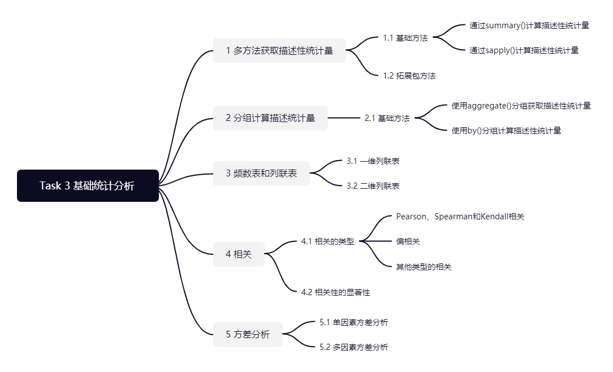

```{r setup, include=FALSE}
knitr::opts_chunk$set(echo = TRUE,warning=FALSE, message=FALSE,tidy=TRUE,collapse=FALSE)
```

{width=100%}

# 基础统计分析

## 准备工作

如果没有相关的包，则使用`install.packages('package_name')`进行安装以下包。
```{r}
library(pastecs)
library(psych)
library(ggm)
```

读取数据，使用H1N1流感数据集和波士顿房价数据集。
```{r}
flu = read.table('./datasets/h1n1_flu.csv', header=TRUE, sep=',')
housing = read.csv('./datasets/BostonHousing.csv', header=TRUE)
```

## 1 多种方法获取描述性统计量

### 1.1 基础方法

通过summary计算数值型变量的最大值、最小值、分位数以及均值，类别变量计算频数统计。
```{r}
summary(flu[c("household_children","sex")])
```
```{r}
summary(flu[c("h1n1_concern", "h1n1_knowledge")])
```


通过 sapply() 计算描述性统计量，先定义统计函数，在进行聚合计算。
```{r}
mystats <- function(x, na.omit=FALSE){
if (na.omit)
x <- x[!is.na(x)]
m <- mean(x)
n <- length(x)
s <- sd(x)
skew <- sum((x-m)^3/s^3)/n
kurt <- sum((x-m)^4/s^4)/n - 3
return(c(n=n, mean=m, stdev=s, skew=skew, kurtosis=kurt))
}

sapply(flu[c("h1n1_concern", "h1n1_knowledge")], mystats)
```
### 1.2 拓展包方法

通过pastecs包中的 stat.desc()函数计算描述性统计量，可以得到中位数、平均数、平均数的标准误、平均数置信度为95%的置信区间、方差、标准差以及变异系数。
```{r}
stat.desc(flu[c("household_children","sex")])
```
通过psych包中的describe()计算描述性统计量。
```{r}
describe(flu[c("household_children","sex")])
```

## 2 分组计算描述性统计

### 2.1 基础方法

#### 使用aggregate()分组获取描述性统计

1. 分组计算不同性别收入贫困计数。
2. 是否属于查尔斯河的房价中位数平均值。
```{r}
aggregate(flu[c("income_poverty")], by=list(sex=flu$sex), length)
aggregate(housing$medv, by=list(medv=housing$chas), FUN=mean)
```
#### 使用 by() 分组计算描述性统计量
```{r}
by(flu[c("income_poverty", "sex")], flu$sex, length)
```
## 3 频数表和列联表
```{r}
table(flu$sex)
```

## 4 相关
### 4.1 相关的类型
#### Pearson、Spearman和Kendall相关

R可以计算多种相关系数，包括Pearson相关系数、Spearman相关系数、Kendall相关系数、偏相关系数、多分格（polychoric）相关系数和多系列（polyserial）相关系数。
1. 计算房价数据的相关系数，默认是Pearson相关系数。
```{r}
cor(housing)
```

2. 指定计算Spearman相关系数
```{r}
cor(housing, method="spearman")
```

3. 城镇人均犯罪率与房价的相关系数
```{r}
x <- housing
y <- housing[c("medv")]
cor(x, y)
```

#### 偏相关

偏相关是指在控制一个或多个定量变量时，另外两个定量变量之间的相互关系。使用ggm 包中的 pcor() 函数计算偏相关系数。

### 4.2 相关性的显著性检验

```{r}
cor.test(housing[,c("crim")], housing[,c("medv")])
```

## 5 方差分析
方差分析（ANOVA）又称“变异数分析”或“F检验”，用于两个及两个以上样本均数差别的显著性检验。

### 5.1 单因素方差分析
从输出结果的F检验值来看，p<0.05比较显著，说明是否在查尔斯河对房价有影响。
```{r}
fit <- aov(housing$medv ~ housing$chas)
summary(fit)
```

### 5.2 多因素方差分析
构建多因素方差分析，查看因子对房价的影响是否显著。
```{r}
fit <- aov(housing$medv ~ housing$crim*housing$b)
summary(fit)
```
