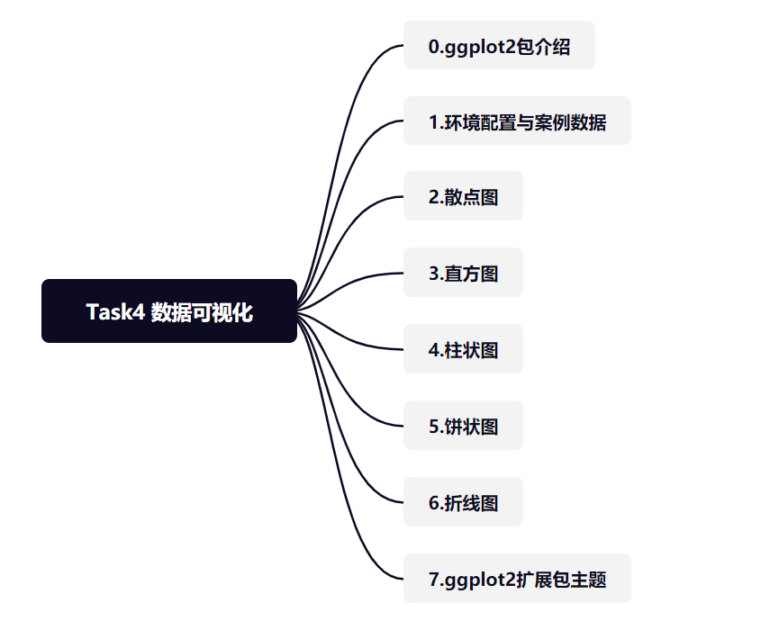
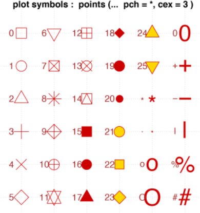

```{r setup, include=FALSE}
knitr::opts_chunk$set(echo = TRUE,warning=FALSE, message=FALSE,tidy=TRUE,collapse=TRUE)
```
{width=60%}

## 0.ggplot2包介绍

ggplot2包由Hadley Wickham编写，提供了一种基于Wilkinson所述图形语法的图形系统。ggplot2包的目标是提供一个全面的、基于语法的、连贯一致的图形生成系统，允许用户创建新颖的、有创新性的数据可视化图形。

总的来说有以下几点：

- ggplot2的核心理念是将绘图与数据分离，数据相关的绘图与数据无关的绘图分离
- ggplot2保有命令式作图的调整函数，使其更具灵活性
- ggplot2将常见的统计变换融入到了绘图中。
- ggplot2是按图层作图

ggplot2图像的三个基本构成：数据、图形属性映射、几何对象

按照ggplot2的绘图理念，Plot(图)= data(数据集)+ Aesthetics(美学映射)+ Geometry(几何对象)。

例如：

```{r example}
#ggplot(data,aes(x=x,y=y))+geom_point()
```

- 数据：用于绘制图形的数据
- 映射：aes()函数是ggplot2中的映射函数, 所谓的映射即为数据集中的数据关联到相应的图形属性过程中一种对应关系, 图形的颜色，形状，分组等都可以通过通过数据集中的变量映射。
- 几何对象：我们在图中实际看到的图形元素，如点、线、多边形等。

ggplot2绘图代码如同数据公式一般，只需要套相应的公式即可绘制出丰富的图形，后续的讲解也会按照此方法。

ggplot2参考链接：

- https://ggplot2.tidyverse.org/reference/
- https://ggplot2-book.org/

ggplot2的安装方法

```{r cars}
#install.packages("ggplot2")
```

## 1.环境配置
``` {r}
library(ggplot2) #画图工具ggplot2
library(ggpubr) #将多个图形拼接
library(plyr) #数据处理包
```

在本讲中会用到ggpubr中的ggrrange这个多图拼接工具，详细使用方法参见：
http://www.sthda.com/english/articles/24-ggpubr-publication-ready-plots/81-ggplot2-easy-way-to-mix-multiple-graphs-on-the-same-page/

## 案例数据
本节内容将会使用到两个数据集

**1.1h1n1流感问卷数据集**

h1n1流感问卷数据集是关于h1n1流感问卷调查的一个数据，属于外部数据
数据集包含26,707个受访者数据，共有32个特征+1个标签（是否接种h1n1疫苗）

读取相关的数据集
```{r h1n1}
h1n1_data <- read.csv("./datasets/h1n1_flu.csv", header = TRUE)
```

**1.2波士顿房价数据集**

波士顿房价数据集属于R语言自带数据集，也可以通过外部读取

读取相关的数据集
```{r boston}
boston_data <- read.csv("./datasets/BostonHousing.csv", header = TRUE)
```


## 2.散点图

散点图是指在数理统计回归分析中，数据点在直角坐标系平面上的分布图，散点图表示因变量随自变量而变化的大致趋势，由此趋势可以选择合适的函数进行经验分布的拟合，进而找到变量之间的函数关系。

散点图的优势：

- 数据用图表来展示，显然比较直观，在工作汇报等场合能起到事半功倍的效果，让听者更容易接受，理解你所处理的数据。
- 散点图更偏向于研究型图表，能让我们发现变量之间隐藏的关系为我们决策作出重要的引导作用。
- 散点图核心的价值在于发现变量之间的关系，包括线性与非线性之间的关系。


```{r plot1}
#读取数据
boston_data <- read.csv("./datasets/BostonHousing.csv", header = TRUE)
#绘制简单的散点图 x轴选择的是lstat ,y轴选择的是medv 
ggplot(data=boston_data, aes(x=lstat, y=medv)) + geom_point()
```

上图选择的是lstat为x轴，medv为y轴绘制的散点图，x轴表示弱势群体人口所占比例，y轴表示房屋的平均价格，通过图上的数据可以看到，弱势人群的比例增加会影响房价，这2个变量呈现一定的负相关。

ggplot2可以修改散点图的性状和大小,R语言中存储了一些相关的形状
{width=50%}

size参数修改点的大小，color参数修改点的颜色
```{r plot2}
#使用第17号形状
p1<-ggplot(data=boston_data, aes(x=lstat, y=medv)) + geom_point(shape=17)
#size参数修改点的大小，color参数修改点的颜色
p2<-ggplot(data=boston_data, aes(x=lstat, y=medv)) + geom_point(size=3,color="red")
ggarrange(p1,p2,nrow = 1)
```


可将数据集的其它属性映射到散点图的颜色属性中
```{r plot4}
p3<-ggplot(data=boston_data, aes(x=lstat, y=medv,colour=factor(rad))) + geom_point()
p4<-ggplot(data=boston_data, aes(x=lstat, y=medv,colour=rad)) + geom_point()
ggarrange(p3,p4,nrow = 1)
```

ggplot2关于散点图的相关做法有很详细的介绍，相关参考链接：https://ggplot2.tidyverse.org/reference/geom_point.html

## 3.直方图

直方图是一种统计报告图，由一系列高度不等的纵向条纹或线段表示数据分布的情况。 一般用横轴表示数据类型，纵轴表示分布情况。
直方图可以很好的查看数据的分布情况，是常用的数据可视化展示图形。

我们对rad变量进行直方图分析
```{r plot6}
ggplot(data=boston_data, aes(x=rad)) + geom_histogram()
```

可以看到ggplot2可以自动对数据进行直方图的统计

我们给直方图填充颜色，同时改变直方图类型color表示直方图的边框，fill表示直方图中的填充颜色，ggplot2支持RGB颜色表的配色方案，linetype表示直方图线的类型

RGB颜色表可以参考：http://www.mgzxzs.com/sytool/se.htm

```{r plot7}
p5<-ggplot(data=boston_data, aes(x=rad)) + geom_histogram(color="black",fill="#69b3a2")
p6<-ggplot(data=boston_data, aes(x=rad)) + geom_histogram(color="black",fill="#69b3a2",linetype="dashed")
ggarrange(p5,p6,nrow = 1)
```

ggplot2也支持在直方图上添加平均线和密度图

```{r plot8}
p7<-p5+geom_vline(aes(xintercept=mean(rad)),color="blue", linetype="dashed", size=1)
p8<-ggplot(data=boston_data, aes(x=rad)) + geom_histogram(color="black",fill="#69b3a2",aes(y=..density..))+
  geom_density(alpha=.2, fill="#FF6666")
ggarrange(p7,p8,nrow = 1)
```

ggplot2关于直方图的相关做法有很详细的介绍，相关参考链接：https://ggplot2.tidyverse.org/reference/geom_histogram.html

## 4.柱状图
柱状图是一种常用的数据可视化图形，根据翻译的不同，柱状图又叫长条图、柱状统计图、条状图、棒形图
柱状图图用来比较两个或以上的价值（不同时间或者不同条件），只有一个变量，通常利用于较小的数据集分析。长条图亦可横向排列，或用多维方式表达。需要注意的是柱状图与直方图是不同的数据可视化方法，不要弄混淆了。

对h1n1数据集中填写人的受教育情况进行可视化展示,使用pylr包中的count对edcation进行计数统计

```{r plot9}
data<-count(h1n1_data['race'])
p<-ggplot(data,aes(x=race,y=freq))+geom_bar(stat="identity")
#也可以进行水平放置
p1 <- p + coord_flip()
ggarrange(p,p1)
```

可以看到左边的柱状图文字有点挡住了，我们把文字旋转45°

```{r plot9a}
data<-count(h1n1_data['race'])
ggplot(data,aes(x=race,y=freq))+geom_bar(stat="identity")+theme(axis.text.x = element_text(angle = 45,hjust=1))

```

对柱状图的样式进行修改

```{r plot10}
# 更改条的宽度和颜色：
# 更改条的宽度
p2 <- ggplot(data, aes(x=race,y=freq)) +
  geom_bar(stat="identity", width=0.5)+theme(axis.text.x = element_text(angle = 45,hjust=1))
# 改变颜色
p3 <- ggplot(data, aes(x=race,y=freq)) +
  geom_bar(stat="identity", color="blue", fill="white")+theme(axis.text.x = element_text(angle = 45,hjust=1))
# 最小主题+蓝色填充颜色
p4 <- ggplot(data, aes(x=race,y=freq)) +
  geom_bar(stat="identity", fill="steelblue")+
  theme_minimal()+theme(axis.text.x = element_text(angle = 45,hjust=1))
# 选择要显示的项目
p5 <- p + scale_x_discrete(limits=c("White", "Black"))+theme(axis.text.x = element_text(angle = 45,hjust=1))
ggarrange(p2,p3,p4,p5)
```

对柱状图进行标签显示
```{r plot11}
p6 <- ggplot(data=data, aes(x=race,y=freq)) +
  geom_bar(stat="identity", fill="steelblue")+
  geom_text(aes(label=freq), vjust=-0.3, size=3.5)+
  theme_minimal()+theme(axis.text.x = element_text(angle = 45,hjust=1))
# 条形内部标签
p7 <- ggplot(data=data, aes(x=race,y=freq)) +
  geom_bar(stat="identity", fill="steelblue")+
  geom_text(aes(label=freq), vjust=1.6, color="white", size=3.5)+
  theme_minimal()+theme(axis.text.x = element_text(angle = 45,hjust=1))
ggarrange(p6,p7,nrow = 1)
```

如果觉得柱状图的顺序不是你想要的，可以对柱状图的顺序进行修改
```{r plot12}
data<-within(data,{
  race<-factor(race,levels=c("White","Black","Hispanic","Other or Multiple"))
})
ggplot(data,aes(x=race,y=freq))+geom_bar(stat="identity", fill="steelblue")+theme(axis.text.x = element_text(angle = 45,hjust=1))
```

ggplot2关于柱状图的相关做法有很详细的介绍，相关参考链接：
https://ggplot2.tidyverse.org/reference/geom_bar.html

## 5.饼状图

饼状图作为常用的数据可视化图形之一，广泛的使用在各个领域，能够很清楚展示数据的所占的百分比。
ggplot2并没有类似于geom_pie()这样的函数实现饼图的绘制，但ggplot2有一个理念，就是通过极坐标变换绘制饼图

饼图在ggplot2中就是通过极坐标变换获得，在绘制饼图之前需要绘制堆叠的条形图，通过将条形图进行极坐标变换后，就能实现饼图绘制了。

对h1n1问卷表中race数据进行数据展示
```{r plot13}
data<-count(h1n1_data['race'])
ggplot(data = data, aes(x ='', y = freq, fill = race)) + geom_bar(stat = 'identity')
```

堆叠的条形图绘制完后，接下来就需要进行极坐标变换了，ggplot2中coord_polar()函数可以非常方便的实现极坐标变换。
```{r plot14}
ggplot(data = data, aes(x ='', y = freq, fill = race)) + geom_bar(stat = 'identity')+coord_polar(theta = 'y')
```

看起来像饼图了，但是饼图周围还有多余的数字，如何清除呢？
这里的标签其实就是坐标轴的标签，可以通过labs()函数将其清除。

```{r plot15}
ggplot(data = data, aes(x ='', y = freq, fill = race)) + geom_bar(stat = 'identity')+coord_polar(theta = 'y')+labs(x = '', y = '', title = '') + theme(axis.text = element_blank())
```

接下来就是显示各个所占的比例
第一种方法，将百分比直接显示在图例中，这种方式适合分类较多的情况。

```{r }
label_value <- paste('(', round(data$freq/sum(data$freq) * 100, 1), '%)', sep = '')
label_value
```
将计算的百分比和race匹配

```{r }
label <- paste(data$race, label_value, sep = '')
label
```

接下来就是将这些百分比标签放到图例中
```{r }
ggplot(data = data, aes(x ='', y = freq, fill = race)) + geom_bar(stat = 'identity')+coord_polar(theta = 'y')+labs(x = '', y = '', title = '') + theme(axis.text = element_blank())+scale_fill_discrete(labels = label)
```

看起来就很不错~

第二种方法，直接将百分比放到各自的饼区中。

首先是去掉饼图中的图例
```{r }
ggplot(data = data, aes(x ='', y = freq, fill = race)) + geom_bar(stat = 'identity')+coord_polar(theta = 'y')+labs(x = '', y = '', title = '') + theme(axis.text = element_blank())+theme(legend.position = "none") 
```

将标签放置在饼图中
```{r }
ggplot(data = data, aes(x ='', y = freq, fill = race)) + 
  geom_bar(stat = 'identity',width = 1)+
  coord_polar(theta = 'y')+labs(x = '', y = '', title = '') + 
  theme(axis.text = element_blank(),legend.position = "none") +
  geom_text(aes(label = label), size=3, position = position_stack(vjust = 0.5))  
```

## 6.折线图
折线图作为反映数据变化的趋势是常用的数据可视化图形之一，在ggplot2中通过geom_line()这个函数进行绘制。

对波士顿房价中rad进行可视化展示，使用pylr包中的count对edcation进行计数统计

```{r }
data<-count(boston_data["rad"])
data
```

把rad为24的数据去除掉
```{r }
data<-data[1:8,]
ggplot(data,aes(x=rad,y=freq))+geom_line()
```

有时候我们需要在折线图上显示对应x轴的点数据，从而可以更加清晰的辨别原始数据,这特别适合数据比较稀疏的情况
```{r }
ggplot(data,aes(x=rad,y=freq))+geom_line()+geom_point(size=4)
```


我们调整横坐标的显示刻度
```{r }
ggplot(data,aes(x=rad,y=freq))+geom_line()+geom_point(size=4)+scale_x_continuous(breaks =c(1:8))
```

也可以修改线的类型和颜色
```{r }
ggplot(data,aes(x=rad,y=freq))+geom_line(linetype = "dashed",color="red")+geom_point(size=4)+scale_x_continuous(breaks =c(1:8))
```

ggplt2关于折线图的相关做法的参考链接：
https://ggplot2.tidyverse.org/reference/geom_abline.html


## 7.ggplot2扩展包主题
R语言中的ggplot2包里面的风格固定，在需要特殊的图形时，需要更改甚至自定义设置主题。
ggplot2内置了8种风格的主题

|主题函数|效果|
|---|---|
|theme_bw()|网格白色主题|
|theme_classic()|经典主题|
|theme_dark()|	暗色主题，可用于对比|
|theme_gray()|默认主题|
|theme_light()|浅色坐标带网格|
|theme_linedraw()|黑色网格线|
|theme_minimal()|极简主题|
|theme_void()|空白主题|


我们来试一试不同的主题

```{r}
p<-ggplot(data=boston_data, aes(x=lstat, y=medv,colour=rad)) + geom_point()
p1<-p + theme_bw() + labs(title = "网格白色主题")+  theme(legend.position = "none")
p2<-p + theme_classic() + labs(title = "经典主题")+  theme(legend.position = "none")
p3<-p + theme_dark() + labs(title = "暗色主题")+  theme(legend.position = "none")
p4<-p + theme_gray() + labs(title = "默认主题")+  theme(legend.position = "none")
p5<-p + theme_light() + labs(title = "浅色坐标带网格")+  theme(legend.position = "none")
p6<-p + theme_linedraw() + labs(title = "黑色网格线")+  theme(legend.position = "none")
p7<-p + theme_minimal() + labs(title = "极简主题")+  theme(legend.position = "none")
p8<-p + theme_void()  + labs(title = "空白主题")+  theme(legend.position = "none")

ggarrange(p1,p2,p3,p4,p5,p6,p7,p8,ncol= 4,nrow = 2,heights = 1.2)
```

除了ggplot2自带的主题外，还有许多拓展主题包，比如：ggthemes、ggthemr
ggthemes在cran上发布，因此推荐使用这个
ggthemr 色彩很好看，因此推荐这个

ggthemes相关链接：https://github.com/jrnold/ggthemes

ggthemr相关链接：https://github.com/Mikata-Project/ggthemr

因为ggthemr没有上cran，因此需要通过github安装
```{r}
#devtools::install_github('Mikata-Project/ggthemr')
```

使用方法也是非常简单，这里用我比较喜欢的greyscale主题方案
```{r}
library(ggthemr)
ggthemr('greyscale')
p3<-ggplot(data=boston_data, aes(x=lstat, y=medv,colour=factor(rad))) + geom_point()
p4<-ggplot(data=boston_data, aes(x=lstat, y=medv,colour=rad)) + geom_point()
ggarrange(p3,p4,nrow = 1)
```

试一试light这个主题，配色非常的温柔
```{r}
library(ggthemr)
ggthemr('light')
p3<-ggplot(data=boston_data, aes(x=lstat, y=medv,colour=factor(rad))) + geom_point()
p4<-ggplot(data=boston_data, aes(x=lstat, y=medv,colour=rad)) + geom_point()
ggarrange(p3,p4,nrow = 1)
```

实战部分：
对提供的数据集我们可以试一试ggthemr中的不同主题，同时对波士顿房价进行其它的数据可视化的探索。

ggplot2是一个非常经典的数据可视化R包，内容非常丰富，由于篇幅的原因没办法将ggplot2中的各种方法全部讲述，因此选择了几个常见的图形进行相关的讲解，以期达到抛砖引玉的效果。如果对ggplot2感兴趣的同学，可以去官网进行更加详细的学习，也非常期待大家的数据可视化作品~

**Task4  END.**

--- By: 牧小熊

> 华中农业大学研究生，Datawhale成员, Datawhale优秀原创作者
>
> 知乎：https://www.zhihu.com/people/muxiaoxiong

关于Datawhale： Datawhale是一个专注于数据科学与AI领域的开源组织，汇集了众多领域院校和知名企业的优秀学习者，聚合了一群有开源精神和探索精神的团队成员。Datawhale 以“for the learner，和学习者一起成长”为愿景，鼓励真实地展现自我、开放包容、互信互助、敢于试错和勇于担当。同时 Datawhale 用开源的理念去探索开源内容、开源学习和开源方案，赋能人才培养，助力人才成长，建立起人与人，人与知识，人与企业和人与未来的联结。 本次数据挖掘路径学习，专题知识将在天池分享，详情可关注Datawhale：

[](https://camo.githubusercontent.com/8578ee173c78b587d5058439bbd0b98fa39c173def229a8c3d957e62aac0b649/68747470733a2f2f696d672d626c6f672e6373646e696d672e636e2f323032303039313330313032323639382e706e67237069635f63656e746572)